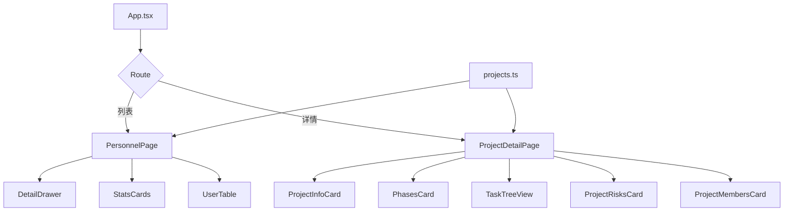
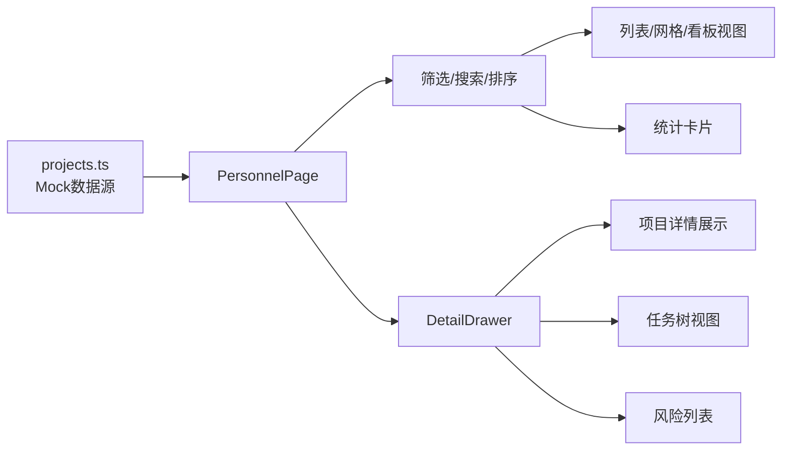

## 产品概览

基于已完成的项目列表页（列表/网格/看板视图、搜索筛选、统计卡片、基础抽屉），本次计划重点完善项目详情页的核心功能，包括统一数据源、修复路由问题、实现任务树视图、完善里程碑管理和风险列表等。

## 核心功能

- 统一数据源：合并现有两套项目数据，建立完整的项目数据模型
- 修复路由问题：解决 PersonnelPage 与 App.tsx 的路由不一致问题
- 完善项目详情抽屉：增加里程碑、任务、风险等详细信息展示
- 实现任务树视图：支持4层任务树展示（项目→阶段→工作包→执行任务）
- 数据驱动的里程碑管理：将硬编码的里程碑改为基于数据渲染
- 项目风险列表：展示项目相关风险及预警信息
- 项目成员管理：展示项目团队成员和角色信息

## Tech Stack Selection

- **前端框架**：React 19.2.4 + TypeScript 5.9 + Vite 8
- **样式方案**：Tailwind CSS + 现有 pm-\* 全局类（深色玻璃态风格）
- **路由方案**：现有 hash 路由（#/projects 和 #/projects/{code}）
- **状态管理**：React 内置状态（useState/useMemo/useCallback）
- **数据来源**：本地 mock 数据（/src/data/projects.ts）

## Implementation Approach

### 方法与策略

采用"统一数据源 + 组件数据化"方案：

1. 以 `/src/data/projects.ts` 为唯一数据源，扩展数据模型
2. 将硬编码的组件（PhasesCard）改为数据驱动
3. PersonnelPage 使用抽屉显示详情，同时保留独立详情页入口
4. 任务树作为独立视图组件，支持展开/折叠

### 高层工作方式

- 数据流：`projects.ts → PersonnelPage → DetailDrawer / ProjectDetailPage → 各子组件`
- 组件复用：详情抽屉和详情页共享相同的子组件（里程碑、风险、成员等）
- 渐进增强：先实现核心功能（数据驱动、任务树），后续迭代优化交互细节

### 关键技术决策

- **数据模型扩展**：在 ProjectItem 基础上增加 phases、milestones、tasks、risks、members 字段
- **任务树层级**：限制在4层以内（项目→阶段→工作包→执行任务），避免过度复杂
- **抽屉 vs 详情页**：抽屉用于快速查看，详情页用于深度操作，两者共存
- **里程碑状态**：未开始/进行中/已达成/已延期/已取消
- **任务状态**：待处理/进行中/已完成/已暂停/已取消

### Performance & Reliability

- 任务树使用虚拟滚动优化大数据量渲染（V1 暂不需要，预留扩展点）
- 使用 `useMemo` 缓存任务树展开状态和筛选结果
- 组件按需加载，减少初始渲染负担

## Implementation Notes

### 数据模型扩展要点

- 扩展 ProjectItem 接口，增加 phases、milestones、taskTree、risks、members 字段
- 为每个项目补充完整的数据（至少为前3个重点项目）
- 保持向后兼容，现有字段不变

### 组件拆分策略

- 复用现有组件：ProjectInfoCard、PhasesCard、SummaryCard、ActivitiesCard
- 新建核心组件：TaskTreeView、ProjectRisksCard、ProjectMembersCard
- 改造现有组件：PhasesCard 改为数据驱动

### 路由修复方案

- PersonnelPage 移除 onProjectOpen prop，使用内部抽屉状态
- App.tsx 不再传递 onProjectOpen 给 PersonnelPage
- 抽屉中增加"查看完整详情"按钮，跳转到独立详情页

## Architecture Design

### 系统架构



### 数据流架构



## Directory Structure

### 文件修改清单

- [MODIFY] `/Users/dylan/CodeBuddy/20260402092847/src/data/projects.ts`  
  扩展项目数据模型，增加 phases、milestones、taskTree、risks、members 字段。为每个项目补充完整的阶段、里程碑、任务树、风险、成员数据。

- [MODIFY] `/Users/dylan/CodeBuddy/20260402092847/src/components/personnel/PersonnelPage.tsx`  
  移除 onProjectOpen prop，使用内部状态管理抽屉。抽屉中增加"查看完整详情"按钮，跳转到独立详情页。使用统一的 projects.ts 数据源。

- [MODIFY] `/Users/dylan/CodeBuddy/20260402092847/src/App.tsx`  
  修复 PersonnelPage 的路由调用，不再传递 onProjectOpen。保持现有的 hash 路由逻辑。

- [MODIFY] `/Users/dylan/CodeBuddy/20260402092847/src/components/project/PhasesCard.tsx`  
  将硬编码的 phases 和 milestones 改为从 props 接收。使用真实的阶段和里程碑数据。

- [MODIFY] `/Users/dylan/CodeBuddy/20260402092847/src/components/project/ProjectDetailPage.tsx`  
  增加任务树视图、风险列表、成员列表等新组件。使用扩展后的项目数据。

- [MODIFY] `/Users/dylan/CodeBuddy/20260402092847/src/components/personnel/ProjectDetailDrawer.tsx`  
  使用扩展后的项目数据（phases、milestones、tasks、risks、members）。增加任务树视图、风险列表。增加"查看完整详情"按钮。

- [NEW] `/Users/dylan/CodeBuddy/20260402092847/src/components/project/TaskTreeView.tsx`  
  支持4层任务树展示（项目→阶段→工作包→执行任务）。支持展开/折叠功能。显示任务状态、进度、负责人、截止日期。支持任务筛选（按状态、按负责人）。

- [NEW] `/Users/dylan/CodeBuddy/20260402092847/src/components/project/ProjectRisksCard.tsx`  
  展示项目相关风险列表。按风险等级排序（严重>高>中>低）。显示风险描述、影响范围、处理状态。

- [NEW] `/Users/dylan/CodeBuddy/20260402092847/src/components/project/ProjectMembersCard.tsx`  
  展示项目团队成员。显示成员角色、职责、联系方式。

- [MODIFY] `/Users/dylan/CodeBuddy/20260402092847/src/index.css`  
  增加任务树样式（展开/折叠图标、缩进、状态色）。增加风险列表样式（风险等级色、预警提示）。增加成员卡片样式。

## Key Code Structures

```typescript
export type TaskStatus = 'pending' | 'in-progress' | 'completed' | 'paused' | 'cancelled'
export type MilestoneStatus = 'not-started' | 'in-progress' | 'achieved' | 'delayed' | 'cancelled'

export interface ProjectPhase {
  id: string
  name: string
  startDate: string
  endDate: string
  progress: number
  status: TaskStatus
}

export interface ProjectMilestone {
  id: string
  name: string
  dueDate: string
  status: MilestoneStatus
  assignee: string
  completedDate?: string
}

export interface ProjectTask {
  id: string
  name: string
  level: 0 | 1 | 2 | 3
  status: TaskStatus
  progress: number
  assignee?: string
  dueDate?: string
  startDate?: string
  endDate?: string
  children?: ProjectTask[]
}

export interface ProjectRisk {
  id: string
  level: 'low' | 'medium' | 'high' | 'critical'
  description: string
  impact: string
  status: 'active' | 'mitigated' | 'closed'
  assignee: string
  dueDate?: string
}

export interface ProjectMember {
  id: string
  name: string
  role: string
  department: string
  phone: string
  email: string
  avatar?: string
}
```

```typescript
type TaskTreeViewProps = {
  tasks: ProjectTask[]
  onTaskClick?: (task: ProjectTask) => void
  onTaskToggle?: (taskId: string) => void
  expandedTaskIds?: Set<string>
  filterByStatus?: TaskStatus
  filterByAssignee?: string
}
```

### SubAgent

- **code-explorer**
- Purpose: 探索现有组件结构和依赖关系，确保新组件与现有架构一致
- Expected outcome: 确认组件拆分策略、样式复用方案、避免重复实现

### MCP

- **Figma**
- Purpose: 对照设计稿确认任务树、风险列表、成员卡片的视觉设计
- Expected outcome: 确保新增组件符合 Liquid Glass 设计风格，保持视觉一致性
