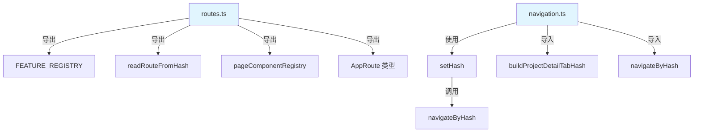

# 应用核心与路由 — 配置

# 应用核心与路由 — 配置模块

## 概述

`src/config` 模块作为应用的核心路由与导航枢纽。它为所有路由定义、基于哈希的 URL 导航以及页面组件注册提供单一数据源。该模块将所有导航逻辑整合为一组带类型的可复用函数，消除了组件中分散的 `window.location.hash` 操作。

## 架构

该模块由三个协同工作的文件组成：

- **`feature-registry.ts`** — 功能配置的类型定义
- **`routes.ts`** — 路由定义、组件注册表及哈希解析
- **`navigation.ts`** — 所有应用路由的导航辅助函数



## 功能注册表（`feature-registry.ts`）

定义功能配置的核心类型：

```typescript
type FeatureConfig = {
  page: string // 唯一页面标识符
  path: string // 哈希路由模式
  component?: AnyComponent // 懒加载的 React 组件
  label?: string // 导航显示标签
  category?: 'simple' | 'param' | 'callback' | 'data'
}

type FeatureRegistry = FeatureConfig[]
```

`category` 字段对路由进行分类：

- **`simple`** — 无参数的静态路由（例如 `#/projects`）
- **`param`** — 带 URL 参数的路由（例如 `#/personnel/users/:userId`）
- **`callback`** — 可能触发回调的路由
- **`data`** — 进入时加载数据的路由

## 路由配置（`routes.ts`）

### 懒加载组件

所有页面组件均使用 React 的 `lazy()` 函数进行懒加载，实现代码分割：

```typescript
export const ProjectDetailPage = lazy(() => import('../components/project/ProjectDetailPage'))
export const TaskManagementPage = lazy(() => import('../components/task/TaskManagementPage'))
// ... 另外 16 个懒加载组件
```

### 功能注册表

`FEATURE_REGISTRY` 数组定义了所有应用路由及其元数据：

```typescript
export const FEATURE_REGISTRY: FeatureConfig[] = [
  {
    page: 'projects',
    path: '#/projects',
    component: ProjectManagementPage,
    label: '项目管理',
    category: 'simple',
  },
  {
    page: 'personnel-detail',
    path: '#/personnel/users',
    component: PersonnelUserDetailPage,
    category: 'param',
  },
  // ... 另外 14 个路由条目
]
```

### 路由路径常量

`ROUTE_PATHS` 对象提供不可变的路由字符串常量：

```typescript
export const ROUTE_PATHS = {
  projects: '#/projects',
  personnelDetailPrefix: '#/personnel/users',
  procurementSupplierPrefix: '#/procurement/suppliers/',
  // ... 所有路由路径
} as const
```

### AppRoute 可辨识联合类型

`AppRoute` 类型提供类型安全的路由表示：

```typescript
export type AppRoute =
  | { page: 'projects' }
  | { page: 'personnel-detail'; userId: string }
  | { page: 'detail'; code: string; tab: ProjectDetailTab }
  | { page: 'new-detail'; mode: 'blank' | 'template'; draftId?: string; templateId?: string }
// ... 另外 16 个路由变体
```

### 页面组件注册表

将页面名称映射到其懒加载组件：

```typescript
export const pageComponentRegistry: PageComponentEntry[] = [
  { page: 'projects', component: ProjectManagementPage },
  { page: 'detail', component: ProjectDetailPage },
  // ... 所有页面映射
]
```

### 哈希解析

`readRouteFromHash()` 函数是核心路由解析器。它解析 `window.location.hash` 并返回一个带类型的 `AppRoute` 对象：

```typescript
export const readRouteFromHash = (): AppRoute => {
  const hash = window.location.hash
  // 按特异性顺序解析哈希模式：
  // 1. 精确匹配（例如 '#/projects'）
  // 2. 参数化路由（例如 '#/tasks/:taskCode'）
  // 3. 前缀匹配（例如 '#/personnel/users/:userId'）
  // 4. 回退到 'projects' 页面
}
```

解析顺序确保更具体的路由在通用路由之前被匹配。它处理：

- 精确哈希匹配
- 从 URL 段中提取参数
- 查询字符串解析（例如 `?q=...`、`?createMode=...`）
- 旧版标签别名映射
- 哈希规范化（尾部斜杠、编码）

### 旧版标签别名

将旧标签名称映射到新的 PMBOK 对齐名称：

```typescript
export const LEGACY_PROJECT_TAB_ALIAS: Record<string, ProjectDetailTab> = {
  dashboard: 'overview',
  gantt: 'schedule',
  wbs: 'scope',
  // ... 其他映射
}
```

## 导航辅助函数（`navigation.ts`）

为每个应用路由提供带类型的导航函数。所有函数都使用一个集中的 `setHash()` 辅助函数，该函数委托给 `navigateByHash()`。

### 项目路由

```typescript
goToProjectList()                    // #/projects
goToProjectDetail(code, tab?)        // #/projects/:code/:tab
goToNewProject(mode, options?)       // #/projects/new?createMode=...
```

### 任务路由

```typescript
goToTaskList() // #/tasks
goToTaskDetail(taskCode) // #/tasks/:taskCode
goToTaskListWithCode(taskCode) // #/tasks?taskCode=...
```

### 人员路由

```typescript
goToPersonnelList() // #/personnel
goToPersonnelUser(userId) // #/personnel/users/:userId
```

### 采购路由

```typescript
goToProcurementList()                // #/procurement
goToSupplierDetail(id, returnQuery?) // #/procurement/suppliers/:id?q=...
```

### 标准路由

```typescript
goToStandardList() // #/standards
goToStandardTemplate(templateId) // #/standards/templates/:templateId
```

### 简单顶层路由

```typescript
goToCustomers() // #/customers
goToContracts() // #/contracts
goToOrders() // #/orders
goToFacility() // #/facility
goToResources() // #/resources
goToSettings() // #/settings
```

### 旧版重定向辅助函数

```typescript
goToProjectSettlementReview(code, diffId) // #/projects/:code?panel=settlement-review&diff=...
```

## 关键设计决策

1. **单一数据源** — 所有路由定义都位于 `routes.ts` 中，防止跨组件重复
2. **类型安全** — `AppRoute` 可辨识联合类型确保对所有路由变体的穷尽处理
3. **懒加载** — 所有页面组件均使用 `React.lazy()` 实现代码分割
4. **集中式导航** — 所有哈希变更都通过 `setHash()` → `navigateByHash()` 进行，确保行为一致并便于未来增强（例如分析）
5. **哈希规范化** — `normalizeHashPath()` 函数处理尾部斜杠、编码问题和缺少 `#/` 前缀等边界情况
6. **向后兼容** — 旧版标签别名确保迁移期间旧 URL 继续可用

## 使用示例

```typescript
import { readRouteFromHash, getPageComponent } from '../config/routes'
import { goToProjectDetail } from '../config/navigation'

// 导航到项目详情页面
goToProjectDetail('PRJ-001', 'overview')

// 解析当前路由
const route = readRouteFromHash()
if (route.page === 'detail') {
  const component = getPageComponent('detail')
  // 使用 route.code 和 route.tab 渲染组件
}
```
