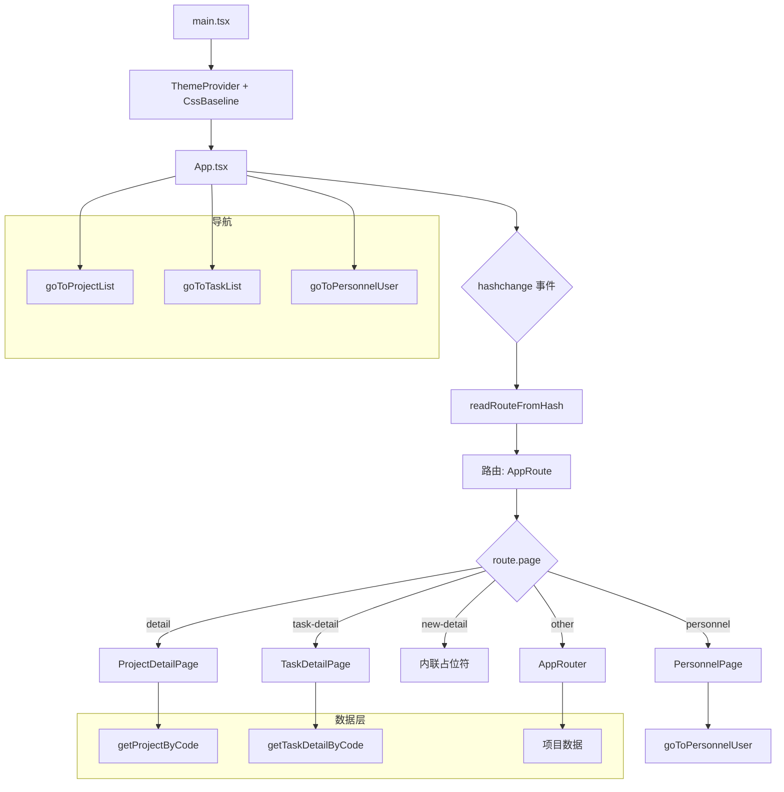

# 应用核心与路由 — `src/`

## 概述

`src/` 目录作为应用入口点和路由中枢。它使用 MUI 主题初始化 React 应用，管理基于哈希的客户端路由，并根据当前路由协调页面级组件的渲染。该模块作为一个轻量级编排层，将任务委托给特定功能组件（`PersonnelPage`、`ProjectDetailPage`、`TaskDetailPage` 和通用 `AppRouter`）。

## 入口点：`main.tsx`

```tsx
createRoot(document.getElementById('root')!).render(
  <StrictMode>
    <ThemeProvider theme={theme}>
      <CssBaseline />
      <App />
    </ThemeProvider>
  </StrictMode>
)
```

- 将应用包裹在 React `StrictMode` 中，用于开发警告。
- 使用自定义深色主题（参见 `theme.ts`）应用 MUI `ThemeProvider`。
- 注入 `CssBaseline` 以实现一致的 CSS 重置和基础样式。
- 渲染根组件 `App`。

## 主题配置：`theme.ts`

主题使用 MUI 的 `createTheme` 构建，包含全面的设计令牌系统。主要特点：

- **深色模式**，采用深海军蓝背景（`#051338`）。
- **玻璃态效果**，通过 `glassEffect` 混入应用于卡片、对话框、菜单和抽屉（半透明背景、背景模糊、细微边框）。
- **自定义组件覆盖**，针对 30 多个 MUI 组件（Paper、Button、Chip、Table、Dialog、Menu 等）进行样式定制，以匹配像素级完美的设计系统。
- **排版比例**，使用 Inter 字体，为 h5、h6、subtitle1/2、body1/2、caption 和 button 指定明确的字号和字重。
- **功能颜色**，包括信息（蓝色）、成功（绿色）、警告（橙色）、错误（红色）和自定义紫色强调色。

主题作为默认导出，由 `main.tsx` 中的 `ThemeProvider` 使用。

## 应用路由器：`App.tsx`

### 路由解析

路由基于**哈希**。在挂载时以及每次 `hashchange` 事件发生时，使用 `config/routes` 中的 `readRouteFromHash()` 从 `window.location.hash` 解析路由。解析后的路由对象（`AppRoute`）驱动所有渲染决策。

```tsx
const [route, setRoute] = useState<AppRoute>(() => readRouteFromHash())

useEffect(() => {
  if (!window.location.hash || window.location.hash === '#') {
    goToProjectList()
  }
  const handleHashChange = () => setRoute(readRouteFromHash())
  window.addEventListener('hashchange', handleHashChange)
  return () => window.removeEventListener('hashchange', handleHashChange)
}, [])
```

### 页面路由逻辑

`App` 组件使用一系列 `if` 块匹配当前 `route.page`，并渲染相应的页面组件。这不是传统的路由器——而是一种**手动分发**机制，显式处理每种页面类型。

| `route.page`                | 渲染的组件                    | 数据注入                                                                                |
| --------------------------- | ----------------------------- | --------------------------------------------------------------------------------------- |
| `'detail'`                  | `ProjectDetailPage`（懒加载） | 来自 `getProjectByCode(route.code)` 的 `activeProject`，来自 `route.tab` 的 `activeTab` |
| `'task-detail'`             | `TaskDetailPage`              | 来自 `getTaskDetailByCode(route.taskCode)` 的 `activeTaskDetail`                        |
| `'new-detail'`              | 内联占位符                    | 显示 `route.mode`                                                                       |
| `'personnel'`               | `PersonnelPage`（懒加载）     | `onUserOpen` 回调设置为 `goToPersonnelUser`                                             |
| 其他所有由 `AppRouter` 处理 | `AppRouter`                   | `route` 和 `projects`（所有项目）                                                       |

**回退**：如果没有匹配的路由，默认渲染 `PersonnelPage`。

### 懒加载

两个页面组件通过 `React.lazy` 进行懒加载：

- `PersonnelPage`
- `ProjectDetailPage`

所有懒加载页面都包裹在 `<Suspense fallback={<PageLoader />}>` 中，显示一个居中的旋转加载指示器。

### 数据注入模式

需要外部数据的页面（项目详情、任务详情）通过 props 接收数据，而不是内部获取。`App` 组件使用 `useMemo` 基于当前路由计算 `activeProject` 和 `activeTaskDetail`，然后直接传递给页面组件。这使数据获取集中化，避免了重复查找。

## 导航辅助函数

该模块从 `config/navigation` 导入导航函数：

- `goToProjectList()` — 导航到项目列表视图
- `goToTaskList()` — 导航到任务列表视图
- `goToPersonnelUser()` — 导航到特定人员用户

这些函数既用于初始重定向（当没有哈希时），也用于页面组件中的"返回"按钮。

## CSS 架构

两个 CSS 文件提供样式：

- **`index.css`** — 包含设计系统的主体部分，分为三个主要部分：
  - 人员管理（`--pm-*` 变量和类）
  - 项目管理（`--pm-*` 延续，包含项目特定样式）
  - 任务管理（`--tm-*` 变量和类）

  包含响应式断点：1600px、1440px、1280px、1024px、768px 和 560px。

- **`App.css`** — 默认 Vite 欢迎页面的最小样式（计数器、英雄区域、下一步操作）。这些样式基本是遗留的，随着应用的发展可能会被替换。

## 架构图



## 关键设计决策

1. **基于哈希的路由** — 不使用外部路由器库。简单、可预测，且无需服务器端回退即可工作。
2. **手动路由分发** — 每种页面类型都显式处理，而不是通过通用路由匹配系统。这提供了对数据注入和懒加载的细粒度控制。
3. **集中式数据注入** — `App` 组件在渲染页面组件之前解析所有外部数据依赖，使页面组件保持纯净和可测试。
4. **按页面类型懒加载** — 仅对人员和项目详情页面进行懒加载。任务详情和通用 `AppRouter` 是立即加载的。
5. **全面的 MUI 主题** — 应用中使用的每个 MUI 组件都通过主题进行一致样式化，无需每个组件单独覆盖样式。
