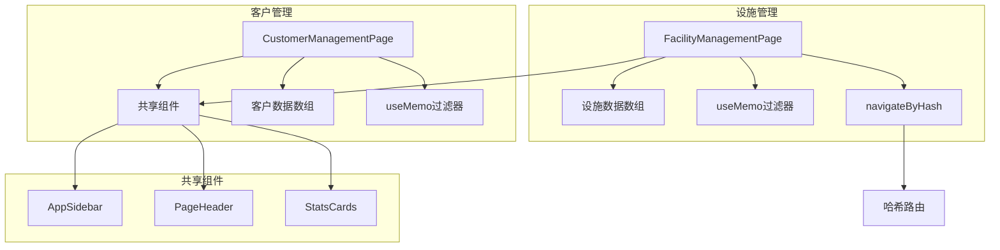

# 客户与设施管理

# 客户与设施管理模块

## 概述

客户与设施管理模块在应用程序中提供两个主要管理界面：用于跟踪零售品牌客户的客户管理页面，以及用于监控各门店实物资产的设施管理页面。两个页面均采用一致的设计模式，使用共享UI组件，同时保持各自独特的数据模型和交互模式。

## 模块结构

```
src/components/
├── customer/
│   ├── CustomerManagementPage.tsx
│   └── customer-management-page.css
└── facility/
    ├── FacilityManagementPage.tsx
    └── facility-management.css
```

## 客户管理页面

### 用途

`CustomerManagementPage`组件用于显示和管理零售品牌客户记录。它提供可搜索、可筛选的客户数据表格视图，包含状态跟踪、合同金额和项目数量等信息。

### 数据模型

```typescript
type CustomerStatus = '合作中' | '洽谈中' | '暂停'
type CustomerLevel = 'S级' | 'A级' | 'B级'

type CustomerItem = {
  shortName: string // 单字符头像显示
  name: string // 完整品牌名称
  contact: string // 联系人及电话
  industry: string // 行业类别
  region: string // 地理区域
  stores: number // 门店数量
  activeProjects: number // 当前活跃项目数
  contractAmount: string // 格式化后的合同金额
  level: CustomerLevel // 客户等级
  status: CustomerStatus // 当前关系状态
}
```

### 主要功能

- **双视图模式**：通过视图模式按钮在卡片视图和列表视图之间切换
- **客户端筛选**：使用`useMemo`按名称、联系人、行业和区域筛选客户
- **统计概览**：通过共享的`StatsCards`组件显示汇总指标（客户总数、活跃客户、新增客户、风险客户）
- **状态与等级徽章**：使用颜色编码样式直观显示客户等级和关系状态

### 状态管理

该组件使用两个本地状态：

```typescript
const [searchQuery, setSearchQuery] = useState('')
const [viewMode, setViewMode] = useState<CustomerViewMode>('list')
```

`searchQuery`驱动`useMemo`过滤器，对拼接后的客户字段执行不区分大小写的匹配。`viewMode`控制显示的渲染模板（当前模板仅实现了列表视图）。

## 设施管理页面

### 用途

`FacilityManagementPage`组件用于管理各门店的实物设施资产。它提供可搜索的表格视图，包含状态跟踪、责任人分配和健康评分。

### 数据模型

```typescript
type FacilityStatus = '运行正常' | '维护中' | '故障' | '离线'

type FacilityItem = {
  id: string // 唯一设施标识符
  name: string // 设施显示名称
  code: string // 系统编码（等宽字体显示）
  category: string // 设备类别
  location: string // 门店位置
  status: FacilityStatus
  owner: string // 责任人
  score: string // 健康评分（1-5分制）
}
```

### 主要功能

- **顶部导航标签**：三标签导航栏，用于在设施设备、服务工单和巡检记录之间切换（使用`navigateByHash`进行路由）
- **双搜索输入框**：页眉和表格工具栏中分别设有搜索字段——页眉搜索当前未用于筛选，表格搜索驱动筛选列表
- **状态徽章**：四种不同的状态样式（正常、维护中、故障、离线），配有相应的配色方案
- **健康评分**：数字评分，带图标前缀显示

### 状态管理

```typescript
const [headerSearchQuery, setHeaderSearchQuery] = useState('')
const [tableSearchQuery, setTableSearchQuery] = useState('')
```

`tableSearchQuery`驱动对设施名称、编码、类别、位置和责任人字段的筛选。`headerSearchQuery`虽被维护，但当前未连接到筛选逻辑。

## 共享组件

两个页面均依赖以下来自`../shared`的共享组件：

| 组件         | 用途                         |
| ------------ | ---------------------------- |
| `AppSidebar` | 导航侧边栏，高亮显示当前路由 |
| `PageHeader` | 页面标题、副标题和搜索输入框 |
| `StatsCards` | 带图标和色调的指标展示卡片   |

`StatsCards`组件接受`classNamePrefix`属性，用于限定其CSS类的作用域（客户管理用`pm`，设施管理用`fm`），使每个页面可以独立覆盖样式。

## 视觉设计模式

两个页面共享相同的视觉语言：

- **发光效果**：固定位置的模糊圆形（`cm-glow`、`fm-glow`）营造环境背景光照
- **渐变统计卡片**：每个指标卡片根据其`tone`属性使用渐变背景
- **一致的表格结构**：两个表格均具有固定表头、分页页脚和操作列
- **响应式布局**：CSS媒体查询在1200px/1024px和768px断点处折叠网格并堆叠工具栏元素

## 架构图



## 集成点

- **路由**：两个页面均读取`window.location.hash`以确定当前激活的侧边栏项。设施页面额外使用`navigateByHash`进行标签导航，跳转到`#/orders`和`#/tasks`
- **资源基础路径**：两个页面均定义`ASSET_BASE`常量，指向`/assets/CodeBubbyAssets/`，并带有图标资源的唯一子路径
- **CSS变量**：所有样式均依赖以`--pm-`为前缀的CSS自定义属性（例如`--pm-bg`、`--pm-primary`、`--pm-border`），确保主题一致性

## 当前限制

- 客户页面的卡片视图模式可选，但渲染内容与表格相同
- 设施页面的页眉搜索输入框不影响显示数据
- 分页仅为视觉展示——所有数据均渲染在单页上
- 筛选按钮（区域、行业、更多筛选）存在但无实际功能
