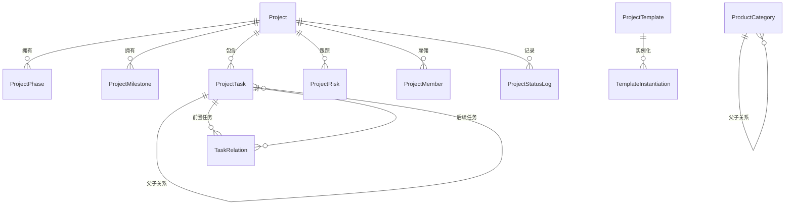

# 数据库与 Prisma 模式

# 数据库与 Prisma 模式模块

## 概述

数据库与 Prisma 模式模块定义了多智能体门店建设管理平台的持久化数据层。它使用 SQLite 作为数据库引擎，Prisma 作为 ORM 和迁移工具。该模式已从基于快照的架构（V1）演变为完全规范化的实体模型（V2），消除了通用的 JSON 状态表，转而采用结构化的关系表。

## 模式架构

数据库由 15 个模型组成，按逻辑组组织：

### 核心项目管理

| 模型               | 用途                 | 关键字段                                                                                                |
| ------------------ | -------------------- | ------------------------------------------------------------------------------------------------------- |
| `Project`          | 门店建设项目         | `code`（唯一）、`name`、`brand`、`parent_status`、`sub_status_json`、`status_tone`、`planned_open_date` |
| `ProjectPhase`     | 项目生命周期阶段     | `project_id`、`name`、`start_date`、`end_date`、`progress`、`status`                                    |
| `ProjectMilestone` | 关键里程碑跟踪       | `project_id`、`name`、`due_date`、`status`、`assignee`、`completed_date`                                |
| `ProjectTask`      | 任务层级（树形结构） | `project_id`、`code`（唯一）、`parent_id`、`node_level_type`、`priority`、`sla_status`                  |
| `TaskRelation`     | 任务依赖关系图       | `from_task_id`、`to_task_id`、`relation_type`（完成-开始、开始-开始等）                                 |
| `ProjectRisk`      | 风险登记册           | `project_id`、`description`、`level`、`probability`、`impact`、`mitigation`                             |
| `ProjectMember`    | 团队成员             | `project_id`、`user_id`、`name`、`role`、`department`、`phone`、`email`                                 |
| `ProjectStatusLog` | 状态转换审计跟踪     | `project_id`、`type`（转换/钩子）、`from_status`、`to_status`、`reason`                                 |

### 模板系统

| 模型                    | 用途             | 关键字段                                                                                                 |
| ----------------------- | ---------------- | -------------------------------------------------------------------------------------------------------- |
| `ProjectTemplate`       | 可复用的项目蓝图 | `template_id`（唯一）、`template_code`（唯一）、`phaseBlueprint`（JSON）、`milestoneBlueprint`（JSON）   |
| `TaskTemplate`          | 可复用的任务定义 | `task_template_id`（唯一）、`template_level`、`dependencyBlueprint`（JSON）、`childTemplateRefs`（JSON） |
| `TemplateInstantiation` | 模板使用审计跟踪 | `project_id`、`template_id`、`template_version`、`matchInput`（JSON）、`outputSnapshot`（JSON）          |

### 采购与供应商管理

| 模型              | 用途           | 关键字段                                                                                                    |
| ----------------- | -------------- | ----------------------------------------------------------------------------------------------------------- |
| `Supplier`        | 供应商管理     | `code`（唯一）、`category`、`rating`、`availability_status`、`qualification_status`、`serviceAreas`（JSON） |
| `ProductCategory` | 层级化产品目录 | `code`（唯一）、`parent_id`（自引用）、`supplierIds`（JSON）                                                |

### 基础设施

| 模型             | 用途           | 关键字段                                                                          |
| ---------------- | -------------- | --------------------------------------------------------------------------------- |
| `AuditLog`       | 系统级审计跟踪 | `env_id`、`scene`、`detail`、`project_code`、`at`                                 |
| `IdempotencyKey` | 幂等请求跟踪   | `key`（主键）、`scope`、`env_id`、`request_hash`、`response_status`、`expired_at` |

## 关键设计决策

### 1. 从快照模型迁移到实体模型

最初的 V1 模式使用了通用的快照表（`project_state`、`task_state`、`acceptance_state`、`settlement_state`），存储完整的 JSON 数据块。这些表在迁移 `20260428000746` 中被移除，转而采用结构化字段。`Project` 模型现在有专门的列用于 `dispatch_status`、`execution_status`、`acceptance_status`、`settlement_status` 及其待处理计数。

### 2. 双状态系统

项目同时维护一个传统的单一 `status` 字段（向后兼容）和一个新的 `parent_status` + `sub_status_json` 组合。`parent_status` 代表高级生命周期阶段（例如，"启动"、"执行"），而 `sub_status_json` 以符合 `SubStatusProgress` 的 JSON 对象形式存储细粒度进度。

### 3. 任务树结构

任务通过 `parent_id` 自引用和 `node_level_type`（项目根节点、阶段、工作包、任务）支持层级组织。`ProjectTask` 模型包含 58 个字段，符合 PRD 要求，其中 P0 字段（id、code、name、projectId、status、assigneeId、plannedStartAt、plannedEndAt、createdBy、createdAt）是必填的。

### 4. 任务依赖关系图

`TaskRelation` 模型使用 `from_task_id` → `to_task_id` 实现了一个有向图，用于任务依赖关系，`relation_type` 支持四种标准依赖类型：

- `finish_start`（FS）
- `start_start`（SS）
- `finish_finish`（FF）
- `start_finish`（SF）

`[from_task_id, to_task_id, relation_type]` 上的唯一约束防止了重复的依赖定义。

### 5. 模板系统

模板是版本化的实体（`template_version`），具有生命周期状态（草稿、审核中、就绪、活跃、非活跃、已弃用）。复杂的配置存储为 JSON 列：

- `scopes`：品牌、门店类型、区域、项目类型和服务范围过滤器
- `phaseBlueprint` / `milestoneBlueprint`：结构化的阶段和里程碑定义
- `taskTemplateBinding`：对任务模板的引用
- `dependencyBlueprint`：模板代码之间的任务依赖规则
- `standardBinding`：与执行/验收标准和检查清单模板的链接

### 6. 幂等性

`IdempotencyKey` 模型支持 API 请求的安全重试。每个键都限定在一个环境（`env_id`）内，并具有过期时间（`expired_at`）。`request_hash` 允许检测具有相同负载的重复请求。

## 实体关系

## 种子数据

`seed.ts` 脚本使用真实的测试数据填充数据库：

- **4 个项目**：上海（PRJ-001）、杭州（PRJ-002）、北京（PRJ-003）、深圳（PRJ-004）
- **12 个工作包**：涵盖施工准备、电气、消防安全、质量检查、外部工程、机电、家具、品牌、许可证和培训
- **12 个任务**：嵌套在工作包下，具有不同的状态（草稿、待处理、进行中、已完成、已阻塞、已拒绝）

种子脚本通过首先插入所有 `parent_id = NULL` 的任务来处理树形结构，然后在第二遍中使用从前端 ID 到数据库 ID 的内存映射更新 `parent_id`。

## 迁移历史

| 迁移                                              | 日期       | 变更                                                                         |
| ------------------------------------------------- | ---------- | ---------------------------------------------------------------------------- |
| `20260424041405_init`                             | 2026-04-24 | 包含快照表的初始模式                                                         |
| `20260428000746_extend_task_fields`               | 2026-04-28 | 移除快照表，添加任务关系，扩展任务字段（58 个字段），为项目添加品牌/状态色调 |
| `20260429020816_extend_wave1_templates_suppliers` | 2026-04-29 | 添加                                                                         |
