# 数字员工与设置

# 数字员工与设置模块

## 概述

数字员工与设置模块提供用于管理AI驱动的数字员工（智能体）、系统配置和标准模板的用户界面。它由三个主要子模块组成：

- **数字员工中心** — AI智能体的仪表盘和管理界面
- **系统设置** — 包含发布工作流和审计追踪的配置管理
- **标准管理** — 项目和任务模板的模板库，包含实例化逻辑

## 架构

```mermaid
graph TD
    subgraph "数字员工"
        DE[DigitalEmployeePage] --> Stats[统计卡片]
        DE --> AgentCards[智能体卡片网格]
        DE --> AgentList[智能体列表视图]
        DE --> DesignPanel[设计功能面板]
        EA[EngineerAssistantPage] --> Placeholder[占位页面]
    end

    subgraph "系统设置"
        SS[SystemSettingsPage] --> Stats2[统计卡片]
        SS --> ListView[列表视图]
        SS --> KanbanView[看板视图]
        SS --> AuditView[审计视图]
    end

    subgraph "标准管理"
        SMP[StandardManagementPage] --> Stats3[统计卡片]
        SMP --> Table[模板表格]
        STDP[StandardTemplateDetailPage] --> Stats4[统计卡片]
        STDP --> PhaseList[阶段列表]
        STDP --> MilestoneGrid[里程碑网格]
        STDP --> InfoPanel[信息面板]
        TI[template-instantiation.ts] --> Data[standard-template.data.ts]
        Data --> Types[template-contract.types.ts]
    end

    subgraph "共享组件"
        AppSidebar
        PageHeader
        StatsCards
        ListToolbar
        Pagination
        EmptyState
    end

    DE --> AppSidebar
    DE --> PageHeader
    DE --> StatsCards
    SS --> AppSidebar
    SS --> PageHeader
    SS --> StatsCards
    SS --> ListToolbar
    SS --> EmptyState
    SMP --> AppSidebar
    SMP --> PageHeader
    SMP --> StatsCards
    SMP --> ListToolbar
    SMP --> Pagination
    STDP --> AppSidebar
    STDP --> PageHeader
    STDP --> StatsCards
```



## 数字员工中心

### DigitalEmployeePage

AI智能体管理的主仪表盘。显示六个专业智能体，包含实时指标和双视图（卡片/列表）支持。

**主要功能：**

- **统计卡片** — 四个KPI卡片，显示活跃智能体、已处理任务、响应时间和准确率
- **智能体卡片** — 六个预配置智能体，带有颜色编码主题：
  - 工程师助手（蓝色）— 施工监控
  - 客户经理（青色）— 客户洞察
  - 采购专员（橙色）— 供应链
  - 合同财务（绿色）— 合同风险
  - 质量审计（紫色）— 质量监控
  - 数据分析师（玫瑰色）— 分析
- **搜索与筛选** — 按名称、副标题、描述和标签进行客户端筛选
- **视图切换** — 卡片网格（3列）和列表表格视图
- **设计功能面板** — 快速访问模板库、样式预设和字段配置的面板

**状态管理：**

```typescript
const [searchQuery, setSearchQuery] = useState('')
const [viewMode, setViewMode] = useState<'card' | 'list'>('card')
const [showDesignPanel, setShowDesignPanel] = useState(false)
```

**计算值：**

- `filteredCards` — 记忆化的搜索结果
- `onlineCount` — 活跃智能体数量
- `avgAccuracy` — 筛选后智能体的平均准确率

### EngineerAssistantPage

工程师助手智能体详情视图的占位页面。使用相同的布局外壳（`AppSidebar` + `PageHeader`），内容区域显示"即将推出"。

## 系统设置

### SystemSettingsPage

配置管理界面，包含三种视图模式和发布工作流。

**视图模式：**

1. **列表视图** — 基于卡片的配置模块列表，包含状态标签、风险指示器和操作按钮（差异对比、发布、回滚）
2. **看板视图** — 按发布状态（草稿、待发布、已发布、已回滚）分组的列式布局
3. **审计视图** — 配置变更的时间顺序审计追踪

**配置模块属性：**

- `id` — 唯一模块标识符（例如 `SET-ORG-001`）
- `name` — 模块名称
- `scope` — 组织范围
- `owner` — 负责人
- `updatedAt` — 最后更新时间戳
- `status` — 发布状态：`草稿 | 待发布 | 已发布 | 已回滚`
- `risk` — 风险等级：`低 | 中 | 高`
- `impact` — 影响描述

**筛选：**

- 按名称或模块ID搜索
- 按统计卡片选择筛选（全部、草稿、待发布、高风险）

**操作处理：**

- `handlePublish` — 确认时显示影响分析警告，然后提交审批
- `handleDiff` — 显示JSON差异以比较变更
- `handleDangerAction` — 确认回滚时显示危险警告

## 标准管理

### StandardManagementPage

项目和任务模板的模板库，支持标签页导航。

**顶部标签：**

- 标准文件（占位）
- 项目模板
- 任务模板

**模板数据模型：**

```typescript
interface StandardTemplateCatalogItem {
  id: string
  kind: 'project' | 'task'
  name: string
  version: TemplateVersion // 例如 "1.0.0"
  status: TemplateStatus // draft | reviewing | ready | active | inactive | deprecated
  listMeta: {
    icon: string
    iconTone: 'green' | 'purple' | 'blue' | 'cyan' | 'orange'
    usageCount: number
    updatedAt: string
    owner: string
    builtin?: boolean
    category: string
    description: string
  }
  projectTemplate?: ProjectTemplate
  taskTemplate?: TaskTemplate
}
```

**表格列：**

- 模板名称（带内置徽章）
- 分类
- 使用次数
- 最后更新（含负责人）
- 操作（查看详情、查看任务）

### StandardTemplateDetailPage

单个模板的详细视图，展示结构、关联关系和元数据。

**章节：**

1. **头部** — 模板名称、描述、元数据（更新日期、创建者、状态、版本）
2. **统计卡片** — 基于模板类型的动态统计：
   - 项目：阶段数量、里程碑、任务绑定、标准包、使用情况
   - 任务：子模板、依赖关系、执行/验收标准、使用情况
3. **标签导航** — 概览、结构、关联关系、角色、标准
4. **结构概览** — 阶段列表（项目）或任务信息（任务），包含有序项目
5. **关联关系** — 里程碑（项目）或依赖关系（任务）
6. **信息面板** — 分类、来源、创建者、更新时间、使用统计
7. **默认角色** — 从阶段蓝图或任务元数据中提取的角色列表
8. **相关模板** — 关联的任务模板或子模板引用

**数据流：**

```typescript
const templateItem = getStandardTemplateById(effectiveTemplateId)
const taskTemplateCatalog = getStandardTemplatesByKind('task')
const taskCodeNameMap = new Map(
  taskTemplateCatalog.map(item => [
    item.taskTemplate!.taskTemplateCode,
    item.taskTemplate!.taskTemplateName,
  ])
)
```

### 模板实例化逻辑

该模块位于 `template-instantiation.ts`，提供将模板定义转换为可执行任务
