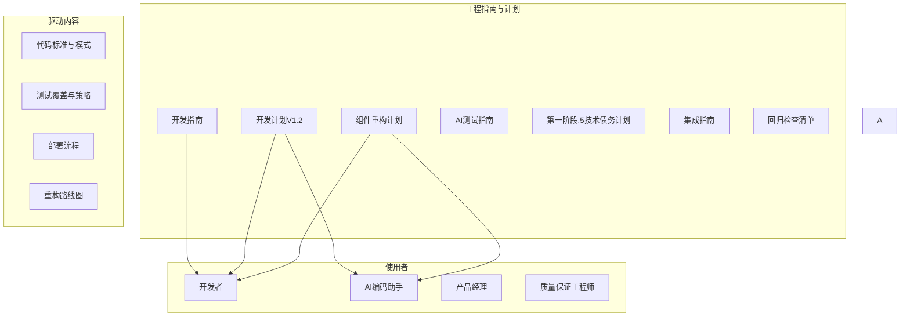

# 工程指南与计划

# 工程指南与计划模块

## 概述

工程指南与计划模块提供了管理连锁门店施工管理系统开发流程的操作手册、技术计划和质量保证框架。它充当产品需求与工程执行之间的桥梁，定义了代码编写、测试、部署和维护的方式。

该模块并非单一的代码组件，而是一套编码工程标准、开发工作流和技术债务管理策略的动态文档集合。它确保了代码库的一致性，并支持单人加AI的开发模式。

## 模块结构

```
docs/03-engineering/
├── ai-testing-guide.md              # AI辅助测试生成工作流
├── component-refactoring-plan.md    # 组件整合路线图
├── development-guide.md             # 主要开发手册
├── development-plan-v1.2.md         # 多阶段工程路线图
├── integration-guide.md             # 本地集成测试指南
├── phase1-handoff.md                # 第一阶段冷启动交接文档
├── phase1.5/
│   └── phase1.5-tech-debt-plan.md   # 技术债务清理计划
├── regression-checklist.md          # 回归测试检查清单
└── release/
    ├── feishu-publish-runbook.md    # 飞书发布操作手册
    └── launch-checklist.md          # 第三阶段上线检查清单
```

## 核心文档

### 1. 开发指南 (`development-guide.md`)

开发者的主要入口文档。涵盖内容：

- **快速开始**：环境搭建、项目初始化及可用脚本
- **后端开发**：Express + Prisma + SQLite 技术栈、API创建模式
- **数据库开发**：Prisma模式设计、迁移及CRUD操作
- **前端开发**：组件模式、API客户端集成
- **设计合规**：色彩系统、毛玻璃效果、动画标准
- **部署**：构建流程及生产环境启动

**此处定义的关键模式：**

- 带错误处理的API客户端创建
- 使用Tailwind CSS的组件开发
- 路由配置与导航一致性
- 测试框架搭建（Vitest + React Testing Library）

### 2. 开发计划V1.2 (`development-plan-v1.2.md`)

涵盖6个阶段的全面工程路线图。定义了：

- **第一阶段**：基础建设 — 共享组件、CSS变量、路由集中化、数据库模式、API适配层、状态机集成、PMBOK 8标签框架
- **第一阶段.5**：技术债务清理 — 页面外壳统一、CSS令牌治理、统计卡片整合、渐变令牌化、卡片提取、MUI组件化
- **第二阶段**：标准与项目 — 甘特图完善、标准库CRUD、条款结构化、模板中心、项目启动流程、8标签内容填充、地理信息、日历视图、地图视图
- **第三阶段**：任务中心 — 看板拖拽、任务模型重构、树形视图、标准联动、依赖管理、守卫条件、整改任务派生
- **第四阶段**：采购、资源与资产 — 采购生命周期、验收工作流、工作组管理、资产归档、结算建议
- **第五阶段**：智能体与工作台 — 智能体框架、品牌需求智能体、项目经理智能体、验收智能体、工作台首页
- **第六阶段**：集成与验证 — 端到端状态机测试、结果对象验证、演示准备、数据初始化

每个阶段包含任务依赖关系、验收标准和技术考量。

### 3. 组件重构计划 (`component-refactoring-plan.md`)

旨在消除UI层代码重复的专项计划。识别出：

- **5个独立的侧边栏实现** → 统一为 `AppSidebar` 组件
- **7个以上的统计卡片实现** → 统一为 `StatCard` 组件
- **3个页头实现** → 统一为 `PageHeader` 组件
- **200多个硬编码CSS值** → CSS变量系统
- **分散的路由配置** → 集中化的 `routes.ts`

该计划定义了新的组件架构、属性接口以及分阶段替换策略。

### 4. AI测试指南 (`ai-testing-guide.md`)

面向非开发者的工作流文档，用于驱动AI生成测试覆盖。定义了：

- **三步流程**：生成覆盖率报告 → 确认场景 → 生成测试代码
- **针对不同场景的提示模板**（新模块、现有模块、代码变更、非核心模块）
- **面向产品经理的验收检查清单**（无需阅读代码）
- **覆盖率报告格式**，包含函数清单、合法/非法路径矩阵及边界条件

### 5. 第一阶段.5技术债务计划 (`phase1.5/phase1.5-tech-debt-plan.md`)

针对第一阶段后遗留技术债务的专项清理计划。涉及：

- **App.tsx路由渲染硬编码**：17个if/else语句 → `AppRouter` 组件
- **双重持久化**：Zustand `persist` 中间件 + 手动 `projectRepository.saveState` → 单一数据源
- **仓库层职责模糊**：API适配器与状态管理之间的清晰分离

### 6. 集成指南 (`integration-guide.md`)

本地开发与测试的操作指南。涵盖内容：

- 环境搭建与验证
- 纯前端模式 vs. 全栈开发模式
- API端点验证与幂等性测试
- 错误模拟（网络故障、幂等性冲突）
- 性能验证（FCP、LCP、打包体积）
- 调试技巧（日志过滤、断点、React DevTools）

### 7. 回归检查清单 (`regression-checklist.md`)

用于验证变更后系统稳定性的全面检查清单。涵盖：

- **功能回归**：所有模块（项目、任务、人员、采购等）
- **性能回归**：加载时间、运行时性能、内存使用
- **测试回归**：单元测试、集成测试、构建测试
- **错误处理回归**：网络错误、验证错误、业务错误、幂等性冲突
- **兼容性回归**：浏览器、设备
- **安全回归**：数据安全、API安全

## 架构与数据流


