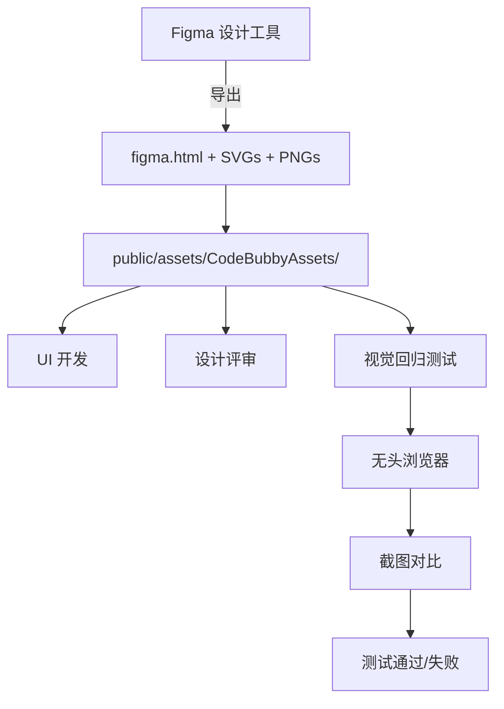

# Figma 资源

# Figma 资源模块

## 概述

Figma 资源模块用于存储和提供从 Figma 设计文件中导出的 UI 界面的静态 HTML 表示。这些资源作为 UI 开发、设计评审和自动化截图对比测试的视觉参考。每个资源都是一个独立的 HTML 文件，重现了 Figma 设计工具中渲染的特定界面或组件状态。

## 资源结构

每个 Figma 资源都存储在 `public/assets/CodeBubbyAssets/` 目录下，使用唯一的数字标识符（例如 `358_3`、`3923_1272`、`3923_861`）。该目录包含：

- `figma.html` — 包含完整界面布局的导出 HTML 文件
- 引用的 SVG 和 PNG 文件（例如 `1.svg`、`53.png`），用作 HTML 中的内联图标和图像

## 文件格式

`figma.html` 文件使用绝对定位和内联 CSS 来重现 Figma 中的精确像素布局。主要特点：

- **固定尺寸**：每个文件声明了固定的视口大小（例如 `2119px × 1235px`）
- **绝对定位**：所有元素使用 `position: absolute`，并带有明确的 `left`、`top`、`width` 和 `height` 值
- **内联样式**：无外部 CSS 依赖——所有样式都嵌入在 `style` 属性中
- **嵌入资源**：SVG 图标通过引用本地 SVG 文件的 `` 标签嵌入；光栅图像引用本地 PNG 文件
- **文本渲染**：文本内容使用 `background-clip: text` 和透明颜色实现渐变文本效果，实际文本仅通过背景裁剪可见

## 可用资源

| 资源 ID     | 界面描述                                                            |
| ----------- | ------------------------------------------------------------------- |
| `358_3`     | 人员管理界面 — 包含搜索、筛选、分页和角色标签的用户列表             |
| `3923_1272` | 带模糊效果的背景叠加层（仅装饰用途）                                |
| `3923_861`  | 项目详情界面 — 项目概览、里程碑、甘特图风格阶段、关键指标和活动动态 |
| `3929_1619` | 界面截图（待识别）                                                  |
| `3947_2`    | 界面截图（待识别）                                                  |
| `3997_751`  | 界面截图（待识别）                                                  |
| `3998_1544` | 界面截图（待识别）                                                  |
| `4048_3`    | 界面截图（待识别）                                                  |
| `4048_588`  | 界面截图（待识别）                                                  |
| `4094_832`  | 界面截图（待识别）                                                  |
| `4102_1613` | 界面截图（待识别）                                                  |
| `4106_2422` | 界面截图（待识别）                                                  |
| `4106_3082` | 界面截图（待识别）                                                  |
| `4106_3892` | 界面截图（待识别）                                                  |
| `4106_5251` | 界面截图（待识别）                                                  |
| `4203_756`  | 界面截图（待识别）                                                  |
| `4287_2`    | 界面截图（待识别）                                                  |

## 组件分解

### 人员管理界面（`358_3`）

该资源代表一个用户管理界面，包含：

- **侧边栏导航**：11 个菜单项，包括工作台、数据中心、项目管理、任务管理、合同结算、采购、订单管理、设施管理、标准管理、人员管理（当前选中）和系统设置
- **顶部导航标签**：用户列表（当前选中）、角色与权限、审计日志
- **统计卡片**：总用户数（186）、活跃用户数（142）、项目角色数（4）、外部协作者数（12）
- **视图切换**：网格/列表视图切换器
- **搜索与操作**：搜索输入框、添加用户按钮、分组、排序和操作下拉菜单
- **数据表格**：8 行示例用户数据，列包括用户（姓名 + 邮箱）、角色、部门、项目、状态（活跃/非活跃指示器）、最后登录时间和操作
- **分页**：共 75 条记录，第 1 页，共 8 页，带编号页码按钮

### 项目详情界面（`3923_861`）

该资源代表一个项目管理仪表板，包含：

- **面包屑导航**：项目列表 > 上海南京路旗舰店
- **项目头部**：项目名称、代码（SH-NJL-2024）、搜索栏、通知铃铛和管理员下拉菜单
- **项目摘要卡片**：状态（进行中）、负责人（张伟）、日期范围、团队规模（24 人）、总体进度条（65%）
- **标签导航**：概览（当前选中）、甘特图、任务（7）、风险/问题（2）、成本控制、采购（5）、文档（4）、成员（8）、变更管理（3）、AI 工程师
- **阶段与里程碑面板**：6 个项目阶段，带进度条（100%、100%、72%、35%、0%、0%）和 5 个关键里程碑，带日期和负责人
- **项目摘要侧边栏**：预算（1250 万）、团队（24 人）、任务完成情况（78/120）、未解决风险（2）
- **最近活动动态**：4 条活动记录，带时间戳（2 小时前、5 小时前、1 天前、3 天前）

## 使用方式

这些资源被以下场景使用：

1. **UI 开发**：开发人员在实现过程中参考 HTML 以匹配像素级完美的布局
2. **设计评审**：这些资源作为已实现组件与设计规范之间视觉对比的基准
3. **自动化测试**：截图对比工具使用这些文件作为基线图像进行视觉回归测试

## 集成点

Figma 资源模块没有运行时代码依赖——它纯粹是一个静态资源目录。集成通过以下方式实现：

- **文件路径引用**：组件通过 `public/assets/CodeBubbyAssets/{id}/figma.html` 的目录路径引用这些资源
- **构建流水线**：这些资源作为静态文件包含在构建输出中，并由 Web 服务器提供
- **测试框架**：视觉回归测试在无头浏览器中加载这些 HTML 文件以进行截图对比

## 架构

该模块是依赖图中的叶子节点——它没有内部或外部调用，运行时也不接收来自应用程序代码的调用。
