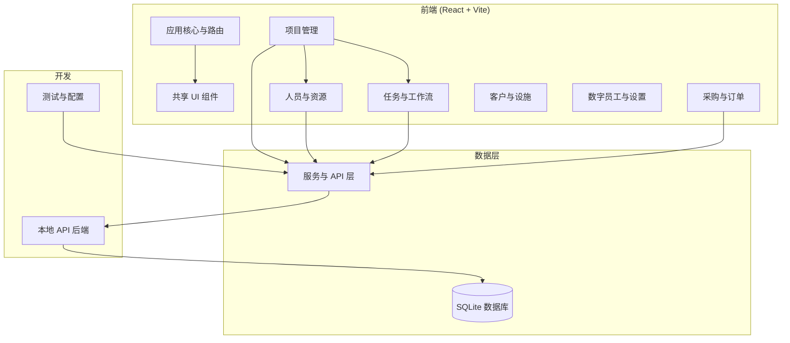

# 敏捷施工 — Wiki

# 敏捷施工平台

**敏捷施工平台**是一个基于 React、TypeScript 和 Vite 构建的多智能体门店施工管理系统。它为零售连锁门店施工提供完整的项目生命周期管理解决方案，涵盖从规划、采购到执行和验收的全过程。

## 功能概述

该平台使施工项目经理能够：

- **规划和跟踪项目**，使用甘特图、WBS 树和里程碑跟踪
- **管理人员和资源**，跨多个施工现场
- **处理采购**，通过供应商管理、采购订单和合同结算
- **监督任务工作流**，支持基于角色的授权和状态转换
- **管理客户和设施**，面向零售品牌客户和实体门店位置
- **配置数字员工**（AI 智能体）和系统设置

## 架构概览

系统采用模块化架构，关注点分离清晰：



### 关键模块

**[应用核心与路由](application-core-routing.md)** 模块使用 MUI 主题初始化 React 应用，并通过基于哈希的路由管理所有客户端导航。它提供了一个配置驱动的系统，用于根据当前路由渲染页面组件。

**[共享 UI 组件](shared-ui-components.md)** 模块提供了一个可复用、可主题化的组件库，使用 CSS 自定义属性实现一致的数据展示、筛选、分页和反馈模式。

领域特定模块处理不同的业务领域：

- **[项目管理](project-management-module.md)** — 完整的项目生命周期，包含甘特图、WBS 树和验收工作流
- **[人员与资源管理](personnel-resource-management.md)** — 劳动力组织和资源分配
- **[任务与工作流管理](task-workflow-management.md)** — 任务生命周期，支持基于角色的授权
- **[采购、订单与合同](procurement-orders-contracts.md)** — 供应商管理和采购订单跟踪
- **[客户与设施管理](customer-facility-management.md)** — 零售客户和实物资产管理
- **[数字员工与设置](digital-employee-settings.md)** — AI 智能体管理和系统配置

**[服务与 API 层](services-api-layer.md)** 提供了 UI 组件与数据源之间的结构化通信桥梁，实现了包含 API 客户端、服务器适配器和仓库的三层架构。

## 关键端到端流程

**项目验收流程**：`ProjectAcceptanceView` 组件通过解析进度对、创建里程碑和管理验收状态转换来编排验收工作流。

**任务管理流程**：任务的增删改查操作从 UI 层通过服务与 API 层流向本地 API 后端，后端通过 Prisma 将数据持久化到 SQLite。

**资源分配流程**：人员管理组件与服务与 API 层交互，跨项目分配资源，数据通过相同的后端管道流动。

## 开发环境设置

```bash
# 安装依赖
npm install

# 启动包含本地 API 的开发服务器
npm run dev

# 仅启动本地 API
npm run local-api

# 运行测试
npm test

# 构建生产版本
npm run build
```

项目使用 **[本地 API 后端](local-api-backend.md)**（Express + SQLite）进行开发，无需外部服务。**[数据库与 Prisma 模式](database-prisma-schema.md)** 定义了 15 个模型，按逻辑分组组织，用于项目管理、任务跟踪和资源管理。

## 项目治理

该平台由全面的文档模块指导，这些模块定义了开发标准、架构决策和产品需求：

- **[项目治理与标准](project-governance-standards.md)** — 代码规范和质量流程
- **[架构与技术设计](architecture-technical-design.md)** — 系统架构和设计模式
- **[工程指南与计划](engineering-guides-plans.md)** — 开发工作流和技术计划
- **[产品需求与路线图](product-requirements-roadmaps.md)** — 产品策略和功能规格
