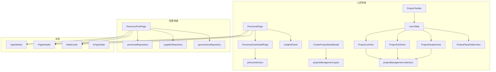

# 人员与资源管理 — 组件

# 人员与资源管理 — 组件模块

## 概述

本模块提供用于在施工项目管理系统中管理人员、项目和资源池的UI组件。它处理用户列表、项目创建、项目可视化（列表/网格/看板/日历/地图）、资源分配以及详细的用户档案。

该模块分为两个主要领域：

- **人员组件** (`src/components/personnel/`) — 用户管理、项目管理视图和项目创建
- **资源组件** (`src/components/resource/`) — 人员和供应商的资源池管理

## 架构

## 关键组件

### PersonnelPage

主要的人员管理页面。显示所有人员用户的可搜索、可过滤表格，包含状态指示器（在岗、休假、离职、禁用）、可用性和风险等级。

**属性：**

- `onUserOpen?: (userId: string) => void` — 点击用户行时的回调函数

**状态管理：**

- `searchQuery` — 按姓名、人员编码、手机号、角色、组织、团队或工作城市过滤用户
- `isInsightsOpen` — 切换InsightsPanel侧边栏

**数据流：**

1. 加载`personnelUsers`数组（模拟数据）
2. 使用`useMemo`根据`searchQuery`过滤用户
3. 通过`useMemo`计算统计数据（总数、在岗数、可分配数、高风险数）
4. 渲染`StatsCards`，然后是包含用户行的表格
5. 点击"查看详情"导航至`PersonnelUserDetailPage`

### PersonnelUserDetailPage

单个人员用户的详细档案视图。显示概览、项目、任务、活动和权限等标签页。

**属性：**

- `userId: string` — 要显示的用户
- `onBack?: () => void` — 导航回调函数

**主要功能：**

- 包含头像、状态标签、联系信息和KPI摘要的个人资料卡片
- 包含5个标签页的标签界面：概览、项目、任务、活动、权限
- 概览标签页显示两列布局：
  - 左列：技能/证书、项目列表、任务列表
  - 右列：风险警告、工作统计、状态变更时间线、近期活动
- 项目列表支持按"全部"、"当前"或"历史"过滤
- 风险警告根据用户的风险等级、关键任务数量和证书状态计算

**数据检索：**

- `getPersonnelUserById(userId)` — 返回用户数据
- `getPersonnelUserDetailDataById(userId)` — 返回详细数据（项目、任务、活动、状态变更、统计）

### CreateProjectModeModal

用于创建新项目的模态表单。收集最少的必要信息并在提交前进行验证。

**属性：**

- `isOpen: boolean`
- `submitting: boolean`
- `errorMessage: string | null`
- `onClose: () => void`
- `onSubmit: (formData: CreateProjectFormData) => CreateProjectSubmitResult`

**验证规则：**

- 必填字段：项目名称、门店名称、门店类型、城市、项目类型、项目负责人、计划开始日期、计划结束日期
- 日期验证：计划结束日期不能早于计划开始日期；计划开业日期不能早于计划开始日期
- 编辑相应字段时清除错误信息

**行为：**

- ESC键关闭模态框（提交中除外）
- 模态框打开时锁定页面滚动
- 成功提交后，表单重置并关闭模态框

### ProjectToolbar

项目管理视图的工具栏。提供视图模式切换、搜索、分组、过滤、排序和项目创建功能。

**视图模式：** 列表、网格、看板、日历、地图

**下拉菜单：**

- 分组依据：无、阶段、负责人、品牌
- 过滤：项目阶段、项目状态、仅高风险切换
- 排序：默认、名称A-Z、进度降序、计划开业日期、风险优先级

**点击外部行为：** 所有下拉菜单在点击其容器外部时关闭。

### UserTable（项目管理编排器）

项目管理的主要内容编排器。根据当前的`viewMode`渲染工具栏和相应的视图组件。

**属性：**

- 所有工具栏属性（viewMode、searchQuery、过滤器等）
- `projects: ProjectItem[]` — 过滤/排序后的项目列表
- `pagination: PaginationState`
- `kanbanGroups: Map<ProjectStage, ProjectItem[]>` — 为看板视图预分组的项目
- `onProjectClick`、`onPageChange`、`onPageSizeChange`、`onNewProject`

**视图路由：**

- `list` → `ProjectListView`
- `grid` → `ProjectGridView`
- `kanban` → `ProjectKanbanView`
- `calendar` 或 `map` → `ProjectPlaceholderView`

### ProjectListView / ProjectGridView / ProjectKanbanView

用于显示项目的三个视图组件：

| 组件                | 布局     | 功能                                                                                   |
| ------------------- | -------- | -------------------------------------------------------------------------------------- |
| `ProjectListView`   | 表格     | 列：名称、品牌、阶段、进度条、里程碑、任务、风险、计划开业日期、负责人                 |
| `ProjectGridView`   | 卡片网格 | 卡片包含：名称、编码、状态、品牌、阶段、进度条、里程碑/任务数量、风险指示器            |
| `ProjectKanbanView` | 看板列   | 按项目阶段（启动、准备、执行、收尾）分列，卡片包含：名称、状态、编码、品牌、进度、统计 |

三者均支持：

- 带有上下文消息的空状态（无数据 vs. 无搜索结果）
- 点击项目触发`onProjectClick`
- 键盘导航（Enter/Space键选择）

### ProjectPlaceholderView

用于未实现视图（日历和地图）的占位组件。显示功能开发中的消息以及项目数据的基本统计信息。

### ProjectDetailDrawer

用于查看项目详情或创建新项目的滑出式抽屉。

**属性：**

- `project: ProjectItem | null`
- `isOpen: boolean`
- `onClose: () => void`
- `isNewProject?: boolean`

**模式：**

- **详情模式** (`isNewProject = false`)：显示项目信息、里程碑、任务和风险
- **创建模式** (`isNewProject = true`)：显示包含项目名称、编码、品牌、阶段、日期、负责人和备注的表单

**数据生成：** 使用`g
