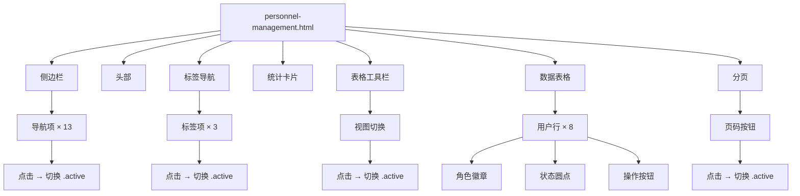

# 人员与资源管理 — `personnel-management.html`

## 概述

人员管理模块提供了一个集中式界面，用于查看和管理组织内的所有用户。它以表格形式展示用户档案、角色、部门分配、项目参与和登录活动，并配有筛选、排序和分页控件。

这是一个**静态的 HTML/CSS/JS 前端模块**——仅渲染 UI 层。所有显示的数据均为硬编码的示例数据；真实数据将由后端 API 提供。

## 关键组件

### 1. 侧边栏导航

侧边栏包含 13 个导航项。默认情况下，"人员管理"项被标记为 `active`。每个导航项都有一个 SVG 图标和中文标签。点击任何导航项都会切换 `active` 类——这由内联脚本中的一个简单事件监听器处理。

### 2. 头部

头部显示：

- **标题**："人员管理"及副标题 "Personnel && Permissions"
- **搜索框**：占位符 "搜索..."
- **操作按钮**：添加 (+)、主要操作 (+) 以及显示"管理员"的用户菜单下拉框

### 3. 标签导航

三个标签允许在视图间切换：

- **用户列表** — 默认激活
- **角色与权限**
- **操作审计**

标签切换由一个点击事件监听器处理，该监听器会移除所有标签的 `active` 类，并将其添加到被点击的标签上。

### 4. 统计卡片

四张统计卡片显示汇总指标：

| 卡片 | 指标     | 数值 |
| ---- | -------- | ---- |
| 蓝色 | 总用户数 | 186  |
| 绿色 | 活跃用户 | 142  |
| 紫色 | 项目角色 | 4    |
| 橙色 | 外部协作 | 12   |

### 5. 数据表格

主表格显示用户记录，包含以下列：

| 列       | 内容                       |
| -------- | -------------------------- |
| 用户     | 头像首字母 + 姓名 + 邮箱   |
| 角色     | 带角色类型徽章（颜色编码） |
| 部门     | 部门名称                   |
| 项目     | 项目数量（居中）           |
| 状态     | 绿色/橙色/灰色圆点指示器   |
| 最近登录 | 日期字符串                 |
| 操作     | 三点菜单按钮               |

**角色徽章**采用颜色编码：

- `pm`（项目经理）— 蓝色
- `lead`（专业负责人）— 紫色
- `engineer`（工程师）— 灰色
- `observer`（只读观察者）— 绿色
- `external`（外部协作方）— 橙色

**状态指示器**：

- 绿色圆点 — 活跃用户
- 橙色圆点 — 外部协作方
- 灰色圆点 — 非活跃用户

### 6. 表格工具栏

表格上方，工具栏提供：

- **视图切换**：网格视图 / 列表视图（默认激活列表视图）
- **搜索**：按姓名、邮箱或部门筛选
- **分组按钮**：带下拉指示器
- **排序按钮**：带下拉指示器
- **添加用户按钮**：主要操作按钮
- **操作菜单**：带下拉菜单的三点菜单

### 7. 分页

显示"共 75 条记录，当前第 1 / 8 页"。显示第 1-4 页按钮，带省略号和第 8 页。导航箭头在第一页时禁用。

## 交互流程

```
用户点击标签 → 标签事件监听器切换 .active 类
用户点击视图选项 → 视图切换事件监听器切换 .active 类
用户点击页码 → 分页事件监听器切换 .active 类
用户点击导航项 → 导航事件监听器切换 .active 类
```

所有交互均为纯视觉效果——无数据获取、无状态管理、无路由。该模块是一个静态原型。

## 架构图



## 依赖项

- **Google 字体**：从 `fonts.googleapis.com` 加载的 `Inter` 字体族
- **无 JavaScript 框架**——所有逻辑均为 `<script>` 标签内的原生 JS
- **无后端 API 调用**——所有数据均在 HTML 中硬编码

## 集成点

该模块设计为更大应用程序的一部分，包含其他 12 个导航部分（工作台、数据中心、项目管理等）。要将其连接到真实后端：

1. 将硬编码的表格行替换为从 API 端点获取的数据（例如 `GET /api/users`）
2. 将硬编码的统计值替换为 API 响应（例如 `GET /api/users/stats`）
3. 实现实际的搜索、筛选、排序和分页逻辑
4. 将"添加用户"按钮连接到打开模态框或导航到创建表单
5. 将操作按钮（三点菜单）连接到特定用户操作（编辑、停用、删除）

## 样式说明

- **深色主题**，深蓝色背景（`#051338`）
- **CSS 自定义属性**用于一致的主题化（颜色、间距、边框样式）
- **响应式布局**，使用 CSS Grid 实现统计卡片和固定侧边栏宽度
- **发光效果**，通过两个定位的 `div.bg-glow` 元素并应用模糊滤镜实现
- **交互元素悬停状态**（导航项、按钮、表格行）
