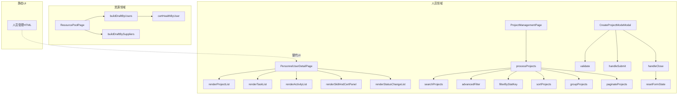

# 人员与资源管理

# 人员与资源管理

## 目的

人员与资源管理模块为建筑项目管理平台提供了一套完整的组织人员、项目和资源池管理系统。它弥合了人员管理（谁做什么工作）与资源分配（可用技能和供应商）之间的差距。

## 模块结构

该模块分为两个互补领域：

- **[组件](personnel-resource-management-components.md)** — 渲染所有人员与资源管理界面的UI层，包括用户档案、项目视图（列表、网格、看板、日历、地图）以及资源池管理。
- **[人员管理HTML](personnel-resource-management-personnel-management-html.md)** — 用户管理界面的静态前端实现，提供包含筛选、排序和分页功能的表格化用户视图。

## 子模块协同方式

**组件**子模块为整个模块提供基于React的交互式UI，而**人员管理HTML**子模块则提供专注于用户列表和管理的轻量级静态替代方案。两者共同覆盖：

- **人员领域**（`components/personnel/`）— 用户详情页面、项目创建和项目管理视图
- **资源领域**（`components/resource/`）— 人员和供应商的资源池管理

## 关键工作流

### 1. 项目管理流水线

`ProjectManagementPage`通过选择器层的`processProjects`触发多步骤处理流水线：

1. `searchProjects` — 按搜索条件筛选项目
2. `advancedFilter` — 应用高级筛选规则
3. `filterByStatKey` — 按项目状态筛选
4. `sortProjects` — 对筛选结果排序
5. `groupProjects` — 为看板/日历视图分组项目
6. `paginateProjects` — 对最终结果集分页

### 2. 资源池分配

`ResourcePoolPage`从两个来源构建资源草稿：

- **人员**：`buildDraftByUsers` → `certHealthByUser`（检查认证健康状态）
- **供应商**：`buildDraftBySuppliers`（直接供应商数据）

### 3. 用户详情探索

`PersonnelUserDetailPage`聚合单个用户的多个数据视图：

- `renderProjectList` — 用户参与的项目
- `renderTaskList` — 分配的任务
- `renderActivityList` — 近期活动
- `renderSkillAndCertPanel` — 技能与认证
- `renderStatusChangeList` — 状态变更历史

### 4. 项目创建流程

`CreateProjectModeModal`处理项目创建，包含：

- `validate` — 表单验证
- `handleSubmit` — 提交逻辑
- `handleClose` → `resetFormState` — 关闭时清理

## 架构图

有关详细的组件API和选择器逻辑，请参阅[组件](personnel-resource-management-components.md)子模块。有关静态用户管理界面，请参阅[人员管理HTML](personnel-resource-management-personnel-management-html.md)。
