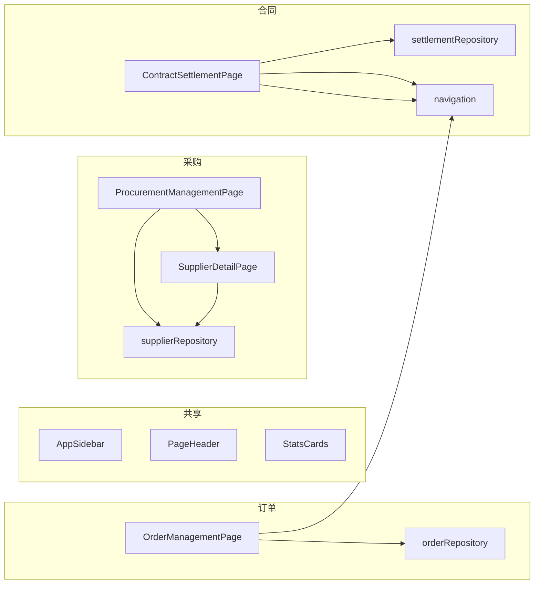
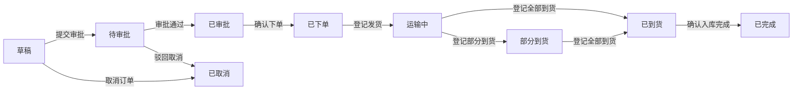

# 采购、订单与合同

# 采购、订单与合同模块

## 概述

本模块为建筑/装修项目管理系统的采购生命周期管理提供支持。它涵盖三个相互关联的领域：供应商管理、采购订单跟踪和合同结算。该模块由三个独立的页面组件实现，它们共享通用的UI基础设施（侧边栏、页面标题、统计卡片）和数据仓库。

## 架构

该模块遵循**页面组件**模式，每个主要功能都是一个自包含的页面，管理自己的状态、数据加载和副作用。数据通过React钩子（`useMemo`、`useState`、`useEffect`）从仓库流入组件，页面间的导航通过基于哈希的路由和显式回调属性处理。

## 组件分解

### 1. ProcurementManagementPage（`src/components/procurement/ProcurementManagementPage.tsx`）

**用途：** 主要供应商目录，支持搜索、筛选和导航至供应商详情。

**关键行为：**

- 挂载时从 `supplierRepository.loadSuppliers()` 加载所有供应商
- 通过名称、编码、类别、联系人、城市和服务区域的组合搜索筛选供应商
- 从供应商列表计算四个统计数据（总数、活跃、待定、暂停）
- 渲染一个表格，行可点击，通过 `onOpenSupplier` 回调导航至 `SupplierDetailPage`
- 支持可选的 `initialSearchQuery` 属性，用于预填充搜索字段

**属性：**

- `initialSearchQuery?: string` — 预填充搜索输入框
- `onOpenSupplier?: (supplierId: string, searchQuery?: string) => void` — 导航回调

**状态：**

- `searchQuery` — 当前搜索文本
- `suppliers` — 从仓库记忆化（从不重新获取）
- `filteredSuppliers` — 通过 `useMemo` 从搜索查询派生
- `stats` — 通过 `useMemo` 从供应商列表派生

### 2. SupplierDetailPage（`src/components/procurement/SupplierDetailPage.tsx`）

**用途：** 单个供应商的详细视图，包括企业信息、合同、资质和绩效指标。

**关键行为：**

- 根据 `supplierId` 从仓库查找供应商
- 显示企业详情、合同和资质的静态模拟数据
- 显示综合评估分数的雷达图占位符
- 提供面包屑导航，带有调用 `onBack` 的返回按钮
- 渲染标签页界面（概览、合同、评价、证书）——仅概览标签页处于活动状态

**属性：**

- `supplierId: string` — 要显示的供应商
- `onBack: () => void` — 导航回调

**数据流：**

- 企业信息由 `enterpriseRows(supplier)` 生成——这是一个纯函数，将供应商字段映射为显示行
- 合同和资质是模块内的硬编码数组

### 3. OrderManagementPage（`src/components/orders/OrderManagementPage.tsx`）

**用途：** 采购订单生命周期管理，支持状态转换和流程日志记录。

**关键行为：**

- 从 `orderRepository.readOrders()` 初始化订单，或回退到 `seedOrders`
- 通过 `useEffect` 在每次状态变更时将订单和流程日志持久化到仓库
- 按名称、编码或供应商筛选订单
- 计算统计数据（总数、待处理、执行中、已完成）
- 通过 `flowActionsMap` 实现订单状态转换的**状态机**：
  - `草稿 → 待审批 → 已审批 → 已下单 → 运输中 → 部分到货 → 已到货 → 已完成`
  - 任何状态均可转换为 `已取消`
- 每次转换记录一条 `OrderFlowLog` 条目，包含时间戳、操作人、操作和详情
- 显示所选订单的流程日志面板

**状态机：**

**关键函数：**

- `advanceOrderStatus(orderCode, action)` — 更新订单状态，重新计算进度，并追加流程日志
- `formatFlowTime(date?)` — 返回 `YYYY-MM-DD HH:mm` 格式的时间戳

**属性：** 无（自包含页面）

### 4. ContractSettlementPage（`src/components/contracts/ContractSettlementPage.tsx`）

**用途：** 合同管理与结算仪表板，将项目数据与合同生命周期集成。

**关键行为：**

- 接收 `projects` 数组，并从中派生合同、统计数据和结算差异
- 通过 `mapProjectToContractStatus` 将项目状态映射为合同状态：
  - `已确认` 结算 → `已归档`
  - `草案待确认` 结算 → `审核中`
  - 活跃项目状态 → `履约中`
  - 其他情况 → `草稿`
- 计算预算统计数据（年度总额、已结算金额、风险敞口）
- 识别状态为 `草案待确认` 的项目的结算差异（`settlementDiffs`）
- 从 `settlementRepository.loadSuggestions(projects)` 异步加载结算建议
- 通过 `goToProjectDetail` 和 `goToProjectSettlementReview` 提供项目详情和结算审核的导航

**属性：**

- `projects: ProjectItem[]` — 用于派生所有显示信息的项目数据数组

**关键辅助函数：**

- `parseBudgetToWan(value)` — 从预算字符串中提取数值（例如，`"¥ 500万"` → `500`）
- `buildContractsByProjects(projects)` — 从项目数据生成合同条目
- `buildStatsByProjects(projects)` — 计算汇总统计数据
- `buildSettlementDiffs(projects)` — 识别需要关注结算的项目

## 数据仓库

| 仓库                   | 使用的方法                                                         | 用途                     |
| ---------------------- | ------------------------------------------------------------------ | ------------------------ |
| `supplierRepository`   | `loadSuppliers()`                                                  | 返回 `SupplierItem` 数组 |
| `orderRepository`      | `readOrders()`、`saveOrders()`、`readFlowLogs()`、`saveFlowLogs()` | 持久化订单状态和流程日志 |
| `settlementRepository` | `loadSuggestions(projects)`                                        | 异步加载结算建议         |

## 导航集成

该模块使用两种导航模式：

1. **基于哈希的路由** — 读取 `window.location.hash` 以确定当前活动的侧边栏项。使用 `config/navigation` 中的 `navigateByHash()` 函数进行程序化导航。

2. **基于回调的导航** — `ProcurementManagementPage` 接收 `onOpenSupplier` 以导航至供应商详情。
