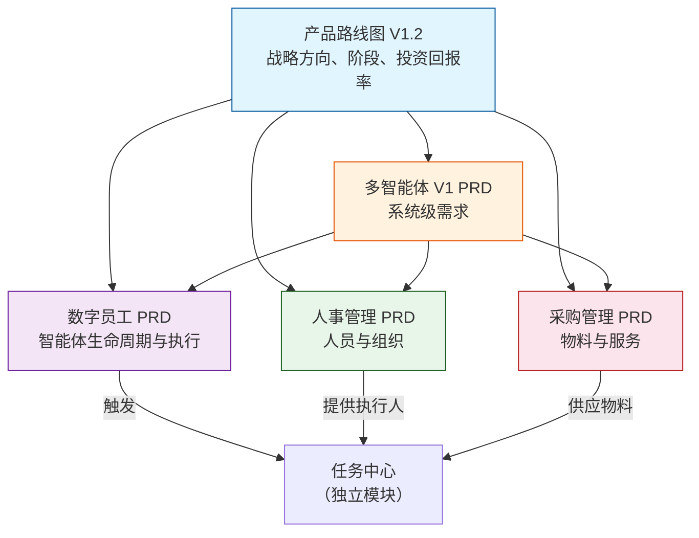

# 产品需求与路线图

# 产品需求与路线图模块

## 概述

产品需求与路线图模块作为多智能体门店建设管理平台的产品策略与需求中心。它定义了系统应做什么、为谁服务以及如何随时间演进。该模块并非可执行代码——而是一系列结构化产品文档的集合，用于驱动开发决策、范围管理和利益相关者协调。

## 模块目的

该模块回答三个基本问题：

1. **我们在构建什么？** — 每个子系统的详细产品需求文档（PRD）
2. **我们为什么构建它？** — 业务背景、痛点和成功标准
3. **我们何时构建它？** — 分阶段路线图，包含里程碑、依赖关系和风险评估

## 文档清单

该模块包含六份文档，每份都有其独特用途：

| 文档                    | 编号                                      | 状态   | 范围                                             |
| ----------------------- | ----------------------------------------- | ------ | ------------------------------------------------ |
| 产品路线图 V1.2         | DOC-01-PRODUCT-PRODUCT-ROADMAP-V1-2       | 草稿   | 整体产品策略、分阶段路线图、技术决策、投资回报率 |
| 多智能体 V1 PRD         | DOC-01-PRODUCT-MULTI-AGENT-V1-PRD         | 活跃   | 涵盖7个智能体、业务流程、数据模型的完整系统PRD   |
| 数字员工 PRD            | DOC-01-PRODUCT-DIGITAL-EMPLOYEE-PRD       | 活跃   | 智能体管理子系统：创建、配置、执行、审批         |
| 人事管理 PRD            | DOC-01-PRODUCT-PERSONNEL-MANAGEMENT-PRD   | 活跃   | 组织、角色、技能、可用性、团队管理               |
| 采购管理 PRD            | DOC-01-PRODUCT-PROCUREMENT-MANAGEMENT-PRD | 活跃   | 采购请求、订单、交付跟踪、供应商协作             |
| 产品路线图 V2（已归档） | DOC-01-PRODUCT-PRODUCT-ROADMAP-V2         | 已归档 | 已被V1.2取代；保留作为历史参考                   |

## 架构与关系



## 关键设计决策

### 两阶段演进策略

路线图定义了清晰的两阶段模型：

- **V1（第1-12个月）：内部标准化系统**，面向品牌方建设部门。验证标准驱动任务、任务驱动项目、结果对象持久化成果的流程。
- **V2（第12-24个月+）：平台生态系统**，连接品牌方（需求侧）与施工公司及资源提供商（供给侧）。

### 智能体实施优先级

多智能体PRD定义了七个智能体的分阶段发布计划：

| 优先级 | 智能体         | 阶段 |
| ------ | -------------- | ---- |
| P0     | 品牌需求智能体 | V1.0 |
| P0     | 项目经理智能体 | V1.0 |
| P0     | 质检智能体     | V1.0 |
| P1     | 资源调度智能体 | V1.5 |
| P1     | 资源执行智能体 | V1.5 |
| P2     | 客服智能体     | V2.0 |
| P2     | 结算智能体     | V2.0 |

### 核心数据模型

多智能体PRD定义了包含四个领域的完整实体关系模型：

1. **组织与权限**：`ORGANIZATION`、`BRAND`、`TEAM`、`PERSON`、`ROLE`、`PERSON_ROLE_REL`、`PROJECT_MEMBER`
2. **项目与任务链**：`STORE`、`PROJECT`、`PROJECT_STAGE`、`COST_ACCOUNT`、`WORK_PACKAGE`、`TASK`、`TASK_RELATION`
3. **履约与结算**：`RESOURCE_PROVIDER`、`CONTRACT`、`SERVICE`、`DISPATCH_ORDER`、`SCHEDULE`、`ACCEPTANCE_ORDER`、`RECTIFICATION_ORDER`、`SETTLEMENT_SUGGESTION`
4. **横向审计**：`PROGRESS_LOG`、`TICKET`、`ATTACHMENT`、`AGENT_EXECUTION_LOG`、`MANUAL_INTERVENTION_LOG`

### 状态机设计

每份文档为其领域定义了状态机：

- **项目状态**：待确认 → 已确认 → 分解中 → 执行中 → 待验收 → 整改中 → 待结算 → 已归档
- **任务状态**：待分配 → 待验收 → 执行中 → 待提交 → 待验收 → 失败 → 已完成
- **智能体运行状态**：待处理 → 运行中 → 待审批 → 成功 → 失败 → 已取消
- **人员状态**：在职 → 休假中 → 已离职 → 已禁用

## 集成点

该模块定义了与其他系统组件的清晰边界：

| 模块     | 读取自                               | 写入至                |
| -------- | ------------------------------------ | --------------------- |
| 项目管理 | 智能体建议、人员可用性               | 项目里程碑、风险备注  |
| 任务中心 | 任务状态、依赖关系、服务等级协议数据 | 调度建议、提醒        |
| 人事管理 | 技能、可用性、工作量                 | 候选人推荐            |
| 采购管理 | 采购请求、交付状态                   | 任务阻塞/解除阻塞信号 |

## 风险管理

路线图文档从四个维度识别并分类风险：

| 风险类别     | 关键风险                              | 缓解措施                                     |
| ------------ | ------------------------------------- | -------------------------------------------- |
| 技术         | AI代码质量、MUI主题兼容性、SQLite并发 | 代码审查关卡、视觉验证、早期迁移至PostgreSQL |
| 业务         | 标准库复杂性、试点品牌合作            | 聚焦2-3个高频领域、模拟数据回退              |
| 智能体有效性 | 准确率低、用户不信任                  | 分阶段发布、强制人工确认、有效性指标         |
| 组织         | 决策权模糊、AI依赖                    | 明确角色定义、核心模块强制人工编写           |

## 开发方法

该模块规定了"产品经理 + AI编码"的开发模式，并设有特定护栏：

- **100%代码审查**，针对所有AI生成的代码
- **TypeScript严格模式**（`tsc --noEmit`零错误）
- **核心模块**（状态机、权限、数据模型）必须由人工设计
- **每周文档同步**，防止上下文漂移
- **20-30%缓冲**，用于AI生成代码的返工估算

## 字段级数据字典

每份PRD包含完整的表定义，包括：

- 列名、类型、可空性、默认值
- 主键、唯一约束、索引
- 枚举值及数值映射
- 针对查询模式的推荐复合索引

来自数字员工PRD的示例：

```sql
-- de_agent表
id              BIGINT UNSIGNED AUTO_INCREMENT PRIMARY KEY
agent_code      VARCHAR(32) UN
```
