# 项目管理模块 — 组件

## 概述

项目管理模块提供用于查看、管理和与建设项目交互的UI组件。它涵盖了从列表和创建到详细执行跟踪、验收工作流和团队管理的完整项目生命周期。

该模块位于 `src/components/project/` 目录下，作为项目数据的表示层。它从仓库（`acceptanceRepository`、`taskRepository`、`personnelRepository`）和领域逻辑（`projectParentStatus`、`projectStatusMachine`）消费数据，并与共享UI组件（`AppSidebar`、`PageHeader`、`StatsCards`）协调工作。

## 架构

```mermaid
graph TD
    subgraph "入口点"
        PMP[ProjectManagementPage]
        PDP[ProjectDetailPage]
    end

    subgraph "详情视图"
        PDP --> Overview[概览标签页]
        PDP --> Schedule[进度标签页]
        PDP --> Scope[范围标签页]
        PDP --> Cost[成本标签页]
        PDP --> Quality[质量标签页]
        PDP --> Resources[资源标签页]
        PDP --> Risk[风险标签页]
        PDP --> Settings[设置标签页]
    end

    subgraph "概览组件"
        Overview --> PhasesCard
        Overview --> SummaryCard
        Overview --> ActivitiesCard
        Overview --> ProjectInfoCard
    end

    subgraph "进度组件"
        Schedule --> ProjectGanttView
        ProjectGanttView --> GanttChart
        ProjectGanttView --> GanttTaskPanel
    end

    subgraph "验收工作流"
        Schedule --> ProjectAcceptanceView
        ProjectAcceptanceView --> acceptanceRepository
        ProjectAcceptanceView --> taskRepository
    end

    subgraph "WBS组件"
        Schedule --> ProjectWbsView
        ProjectWbsView --> WbsTreeTable
        ProjectWbsView --> WbsNodePanel
    end

    subgraph "团队与成员"
        Resources --> ProjectMembersView
        Resources --> ProjectMembersCard
        Resources --> ProjectTeamView
    end

    subgraph "共享组件"
        PMP --> ProjectToolbar
        PMP --> ProjectListView
        PMP --> ProjectGridView
        PMP --> ProjectKanbanView
        PMP --> InsightsPanel
        PMP --> CreateProjectModeModal
    end

    subgraph "数据源"
        acceptanceRepository
        taskRepository
        personnelRepository
        projectGantt[(projectGantt 数据)]
        projectWbs[(projectWbs 数据)]
        projects[(项目数据)]
    end

    ProjectGanttView --> projectGantt
    ProjectWbsView --> projectWbs
    PMP --> projects
```

## 关键组件

### ProjectManagementPage

项目列表视图的主要入口点。管理视图模式（列表/网格/看板/日历/地图）、筛选、分页和项目创建。

**状态管理：**

- `viewMode`：控制显示模式（`'list' | 'grid' | 'kanban' | 'calendar' | 'map'`）
- `filters`：包含 `statKey`、`searchQuery`、`groupBy`、`sortBy`、`riskOnly` 的对象
- `currentPage` / `pageSize`：分页状态
- `feedback`：用于成功/错误消息的Toast通知状态

**关键函数：**

- `handleSearchChange(query)`：更新搜索查询，必要时重置页面
- `handleResetFilters()`：将所有筛选器重置为默认值
- `handleProjectOpen(project)`：导航到项目详情或调用 `onProjectOpen` 回调
- `handleProjectCreate(formData)`：委托给 `onProjectCreate` 并管理反馈
- `handleStatusUpdate(projectCode, toStatus, reason)`：委托给 `onProjectStatusUpdate`

**数据流：**

1. 接收 `projects` 数组作为属性（或使用空数组）
2. 通过 `calculateProjectStats()` 计算 `stats`
3. 通过 `processProjects()` 选择器进行筛选/分页
4. 对于看板模式，通过 `kanbanGroupByStage()` 计算分组

### ProjectDetailPage

使用基于标签页的导航渲染完整的项目详情视图。根据 `activeTab` 属性决定渲染哪个标签页内容。

**标签页路由：**

- `overview`：`PhasesCard` + `SummaryCard` + `ActivitiesCard` + `ProjectInfoCard`
- `schedule`：`ProjectGanttView`
- `scope`：`ProjectScopeTab`
- `cost`：`ProjectCostTab`
- `quality`：`ProjectQualityTab`
- `resources`：`ProjectResourcesTab`
- `risk`：`ProjectRiskTab`
- `settings`：`ProjectSettingsTab`

**布局：**

- 使用 `AppSidebar` 进行导航
- `PageHeader` 用于标题/副标题
- `ProjectBreadcrumb` 用于面包屑导航
- `ProjectTabs` 用于标签页切换（通过 `buildProjectDetailTabHash` 使用基于哈希的路由）
- `ProjectInfoCard` 始终显示在标签页内容上方

### ProjectAcceptanceView

一个管理项目验收工作流的复杂组件。同时处理验收节点和里程碑。

**状态：**

- `nodes`：`AcceptanceNode` 数组 — 单个验收检查点
- `milestones`：`AcceptanceMilestone` 数组 — 高级项目里程碑
- `searchQuery`、`statusFilter`、`riskFilter`：筛选状态
- `selectedNode`：当前选中的节点，用于详情抽屉
- `editingMilestone`：正在编辑日期变更的里程碑

**关键函数：**

- `updateNodeStatus(id, nextStatus)`：更新节点状态，如果状态为 `'整改中'` 或 `'验收不通过'`，则触发整改任务创建
- `updateMilestoneStatus(id, nextStatus)`：更新里程碑状态
- `submitMilestoneDateEdit()`：验证并保存里程碑日期变更
- `buildMilestoneSyncPayload(milestones, nodes)`：计算用于父级同步的汇总统计信息

**数据持久化：**

1. 挂载时，从 `acceptanceRepository.load()` 加载状态
2. 回退到通过 `readLocalState()` 的本地状态
3. 状态变更时，通过 `acceptanceRepository.save()` 保存
4. 使用计算出的负载调用 `onMilestoneSync` 回调

**整改任务创建：**
当节点变为 `'整改中'` 或 `'验收不通过'` 时，组件调用 `taskRepository.createRectificationTaskFromAcceptance()` 并通过 `onAppendActivityLog` 记录结果。

### GanttChart

渲染一个带有时间线标题、分组行和任务条/里程碑的水平甘特图。

**属性：**

- `timeline`：包含 `id`、`year`、`label` 的月份对象数组
- `groups`：包含 `items`（任务）的分组对象数组
- `selectedTaskId`：当前选中的任务
- `onTaskSelect`：选择回调

**布局计算：**

- `META_WIDTH = 338px`：元数据列（任务名称、负责人、状态）的宽度
- `MONTH_WIDTH = 76px`：每月列的宽度
- `buildYearSegments(timeline)`：按年份对连续月份进行分组，用于年份行标题
- `getBarStyle(task)`：根据 `task.start` 和 `task.span` 计算任务条的 `left` 和 `width`
- `getMilestoneStyle(task)`：将里程碑菱形居中于开始月份
- `getProgressStyle(progress)`：确保进度条在10%到100%之间

**任务类型：**

- 常规任务：渲染为带有进度填充的水平条
- 里程碑（`task.kind === 'milestone'`）：渲染为菱形形状
- 关键任务：显示"关键路径"标签徽章

### GanttTaskPanel

显示所选甘特任务详细信息的侧面板。

**在以下情况下渲染：**
