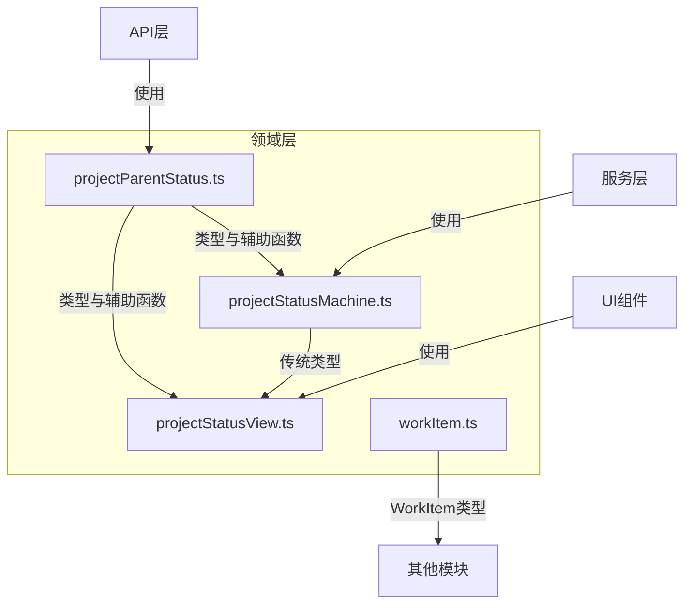

# 项目管理模块 — 领域层

## 概述

领域模块为项目管理系统提供核心数据类型、状态机逻辑和状态映射。它定义了两个并行的状态系统——**传统扁平状态**模型和**新的分层父/子状态**模型——以及转换守卫、钩子和视图辅助函数。

## 关键组件

### 1. 父状态与子状态进度（`projectParentStatus.ts`）

将项目的生命周期定义为五个父状态的序列：

```typescript
export type ParentStatus = '启动' | '计划' | '执行' | '收尾' | '归档'
```

每个父状态包含一个子状态项列表，用于跟踪细粒度进度：

```typescript
export type SubStatusProgressItem = {
  subStatusId: string
  name: string
  sortOrder: number
  isMilestone: boolean
  completed: boolean
  completedAt?: string
  linkedTaskCode?: string
}
```

**关键函数：**

- `getNextParentStatus(current)` — 返回流程中的下一个状态，如果已到末尾则返回 `null`。
- `getParentStatusLabel(status)` — 返回显示标签（例如，`'执行'` → `'执行（含监控）'`）。
- `getParentStatusTone(status)` — 返回UI色调（`'blue'`、`'yellow'`、`'green'`、`'red'`）。
- `allMilestonesCompleted(progress)` — 检查子状态进度中的所有里程碑项是否已完成。
- `getCurrentSubStatus(progress)` — 返回第一个未完成的子状态项，如果没有则返回 `null`。
- `getSubStatusProgressPercent(progress)` — 计算所有子状态项的完成百分比。

### 2. 状态状态机（`projectStatusMachine.ts`）

包含传统扁平状态机和基于父状态的新转换逻辑。

#### 传统状态模型

```typescript
export type ProjectStatus =
  | '待立项'
  | '待确认'
  | '待拆解'
  | '执行中'
  | '待验收'
  | '整改中'
  | '待结算'
  | '已归档'
  | '已中止'
```

传统模型使用 `allowedTransitions` 定义状态之间的有效转换：

```typescript
export const allowedTransitions: Record<ProjectStatus, ProjectStatus[]> = {
  待立项: ['待确认', '已中止'],
  待确认: ['待拆解', '已中止'],
  // ... 等等
}
```

#### 新的父状态转换

```typescript
export const parentStatusTransitions: Record<ParentStatus, ParentStatus[]> = {
  启动: ['计划'],
  计划: ['执行'],
  执行: ['收尾'],
  收尾: ['归档'],
  归档: [],
}
```

`canTransitionParentStatus` 函数强制执行：

1. 转换必须在允许的列表中。
2. 当前子状态进度中的所有里程碑必须已完成。

#### 守卫上下文

`GuardContext` 类型定义了在转换过程中检查的条件：

```typescript
export type GuardContext = {
  hasContainer: boolean
  hasApproval: boolean
  hasMilestones: boolean
  hasTaskTree: boolean
  hasStandardBinding: boolean
  keyTasksCompleted: boolean
  acceptancePassed: boolean
  hasAcceptanceFeedback: boolean
  rectificationClosed: boolean
  settlementCompleted: boolean
}
```

传统的 `canTransition` 函数为每个特定转换检查这些守卫（例如，`'待拆解' → '执行中'` 需要 `hasContainer`、`hasMilestones`、`hasTaskTree` 和 `hasStandardBinding`）。

#### 钩子

钩子是在进入状态时执行的异步操作：

```typescript
export type HookAction = (context: HookActionContext) => Promise<HookActionResult>
```

- `getEnterStatusHooks(status)` — 返回传统状态的钩子（例如，进入 `'待拆解'` 时初始化任务树）。
- `getParentEnterStatusHooks(status)` — 返回父状态的钩子（例如，进入 `'执行'` 时启动风险监控）。
- `executeEnterStatusHooks(status, context)` — 执行给定状态的所有钩子，捕获错误。

#### 状态映射

- `legacyStatusMap` — 将每个 `ParentStatus` 映射到 `ProjectStatus`（例如，`'启动'` → `'待立项'`）。
- `parentStatusFromLegacy(status)` — 从传统状态到父状态的反向映射。

### 3. 状态视图辅助函数（`projectStatusView.ts`）

提供面向UI的函数，从状态值派生显示属性。

**传统辅助函数：**

- `getProjectStageByStatus(status)` — 将传统状态映射到 `ProjectStage`（`'启动'`、`'计划'`、`'执行'`、`'监控'`、`'收尾'`）。
- `getProjectStatusTone(status)` — 返回传统状态的UI色调。
- `getProgressFloorByStatus(status)` — 返回每个传统状态的进度百分比下限（例如，`'执行中'` → 40）。
- `normalizeProjectStatus(rawStatus)` — 将各种原始字符串值映射到规范的 `ProjectStatus` 值。

**父状态辅助函数：**

- `getParentStatusStage(parent)` — 将父状态映射到 `ProjectStage`。
- `getParentProgressFloor(parent)` — 返回进度下限（例如，`'计划'` → 20，`'归档'` → 100）。
- `getParentStatusTone(parent)` — 从 `projectParentStatus` 重新导出。

### 4. 工作项类型（`workItem.ts`）

定义 `WorkItem` 接口和用于表示项目中任务的相关类型：

```typescript
export interface WorkItem {
  id: string
  sourceType: WorkItemSourceType
  projectCode?: string
  taskCode?: string
  parentId: string | null
  kind: WorkItemKind
  wbsCode: string
  name: string
  owner: string
  status: WorkItemStatus
  progress: number
  planStart: string
  planEnd: string
  dependencies: string[]
  isCritical: boolean
  // ... 可选字段
}
```

关键工具函数：

- `toWorkItemStatus(status, blocked?)` — 将各种状态字符串规范化为 `WorkItemStatus`（`'completed'`、`'in-progress'`、`'delayed'`、`'planned'`）。

## 架构



## 使用模式

### 转换项目（新模型）

```typescript
import { canTransitionParentStatus } from './projectStatusMachine'
import { getNextParentStatus } from './projectParentStatus'

const currentParent = '计划'
const nextParent = getNextParentStatus(currentParent) // '执行'

const result = canTransitionParentStatus(currentParent, nextParent, subStatusProgress, guardContext)

if (result.ok) {
  // 执行钩子
  const hooks = getParentEnterStatusHooks(nextParent)
  for (const hook of hooks) {
    await hook({ projectCode, projectName, operator })
  }
  // 更新项目状态
}
```

### 规范化外部状态值

```typescript
import { normalizeProjectStatus } from './projectStatusView'

const rawStatus = '进行中'
const normalized = normalizeProjectStatus(rawStatus) // '执行中'
```

### 计算进度显示

```typescript
import { getParentProgressFloor, getSubStatusProgressPercent } from './domain'

const floor = getParentProgressFloor('执行') // 40
const percent = getSubStatusProgressPercent(progress) // 例如 60
// 显示：40% + (剩余60%的60%) = 76%
```

## 依赖关系

此模块**没有内部依赖**于代码库中的其他模块。它仅依赖于标准TypeScript类型和内置的JavaScript功能。
