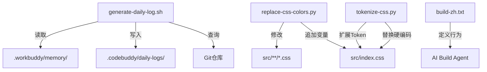

# 脚本与提示

# 脚本与提示模块

## 概述

脚本与提示模块包含项目自动化脚本和AI助手系统提示。脚本负责日常日志生成和CSS颜色治理，提示文件定义AI助手的行为规范。该模块是项目基础设施的一部分，不直接参与运行时逻辑，但维护代码质量和开发工作流。

## 脚本

### 1. `generate-daily-log.sh` — 每日项目日志生成

**用途**：自动生成包含代码活动、工作区状态和项目指标的结构化日志文件。

**工作流程**：

1. 创建日志目录 `.codebuddy/daily-logs/`
2. 收集Git数据：昨日提交记录、变更统计、当前分支、最近提交
3. 扫描源文件数量（TypeScript/TSX、CSS）
4. 读取 `.workbuddy/memory/` 中的当日工作记忆
5. 生成Markdown日志文件，包含以下章节：
   - 代码活动（昨日提交、变更统计）
   - 工作区状态（`git status` 输出）
   - 项目指标（文件数、分支、最近提交）
   - 今日工作要点（来自工作记忆文件）
   - 明日建议（基于工作区是否干净）

**依赖**：Git仓库、`.workbuddy/memory/` 目录（可选）

### 2. `replace-css-colors.py` — CSS硬编码色值批量替换

**用途**：将CSS文件中的硬编码颜色值替换为CSS变量引用，实现主题化。

**核心组件**：

- `COLOR_MAP`：颜色值到CSS变量的映射字典，按匹配优先级排序（长值优先）
- `add_variables_to_index_css()`：将新变量定义追加到 `index.css` 的 `:root` 中
- `replace_in_file()`：对单个CSS文件执行替换，跳过 `index.css` 和 `App.css`

**执行流程**：

```
main()
  ├── add_variables_to_index_css()  // 先更新变量定义
  └── for each CSS file:
       └── replace_in_file()        // 替换硬编码色值
```

**替换策略**：

- 按颜色字符串长度降序匹配，避免短模式提前替换导致长模式无法匹配
- 大小写不敏感替换（对十六进制颜色）
- 跳过 `index.css` 和 `App.css`（避免自引用）

### 3. `tokenize-css.py` — CSS Token治理脚本

**用途**：扩展 `:root` Token体系，批量替换 `index.css` 中的高频硬编码颜色。

**与 `replace-css-colors.py` 的区别**：

- 专门处理 `index.css` 文件
- 在 `:root` 块内插入新变量定义
- 跳过 `:root` 块内的替换（避免自引用）
- 使用正则模式匹配（支持多种空格格式）

**核心组件**：

- `NEW_TOKENS`：新增变量定义字符串
- `REPLACEMENTS`：正则模式到CSS变量的替换列表
- `process_css()`：解析 `:root` 块范围，插入新变量，执行替换

**执行流程**：

```
main()
  └── process_css(content)
       ├── 定位 :root 块
       ├── 插入新变量定义
       └── 对 :root 块外内容执行替换
```

## 提示文件

### `build-zh.txt` — AI助手系统提示

**用途**：定义AI助手（Build agent）的行为规范，强制中文推理。

**关键指令**：

1. **中文推理优先**：所有意图声明、思考链、分析步骤必须使用中文
2. **工具访问**：拥有完整的文件读写、命令执行、搜索等工具权限
3. **行为规范**：简洁直接、必要时提问、任务完成后报告

**架构位置**：作为系统提示附加到AI助手的上下文开头，项目级指令文件会追加在其后。

## 模块关系图



## 使用方式

### 每日日志生成

```bash
# 手动运行（通常由cron或CI触发）
bash scripts/generate-daily-log.sh
```

### CSS颜色治理

```bash
# 批量替换所有模块CSS
python3 scripts/replace-css-colors.py

# 治理index.css Token
python3 scripts/tokenize-css.py
```

### 提示文件

提示文件由AI助手框架自动加载，无需手动操作。`build-zh.txt` 作为系统提示的一部分，确保所有推理过程使用中文。

## 注意事项

1. **替换顺序**：`replace-css-colors.py` 和 `tokenize-css.py` 都按颜色字符串长度降序匹配，避免短模式提前替换导致长模式无法匹配
2. **自引用保护**：`tokenize-css.py` 跳过 `:root` 块内的替换，防止变量定义被自身替换
3. **文件排除**：`replace-css-colors.py` 跳过 `index.css` 和 `App.css`，避免破坏全局样式定义
4. **工作记忆**：`generate-daily-log.sh` 依赖 `.workbuddy/memory/` 目录，该目录由其他工具维护
