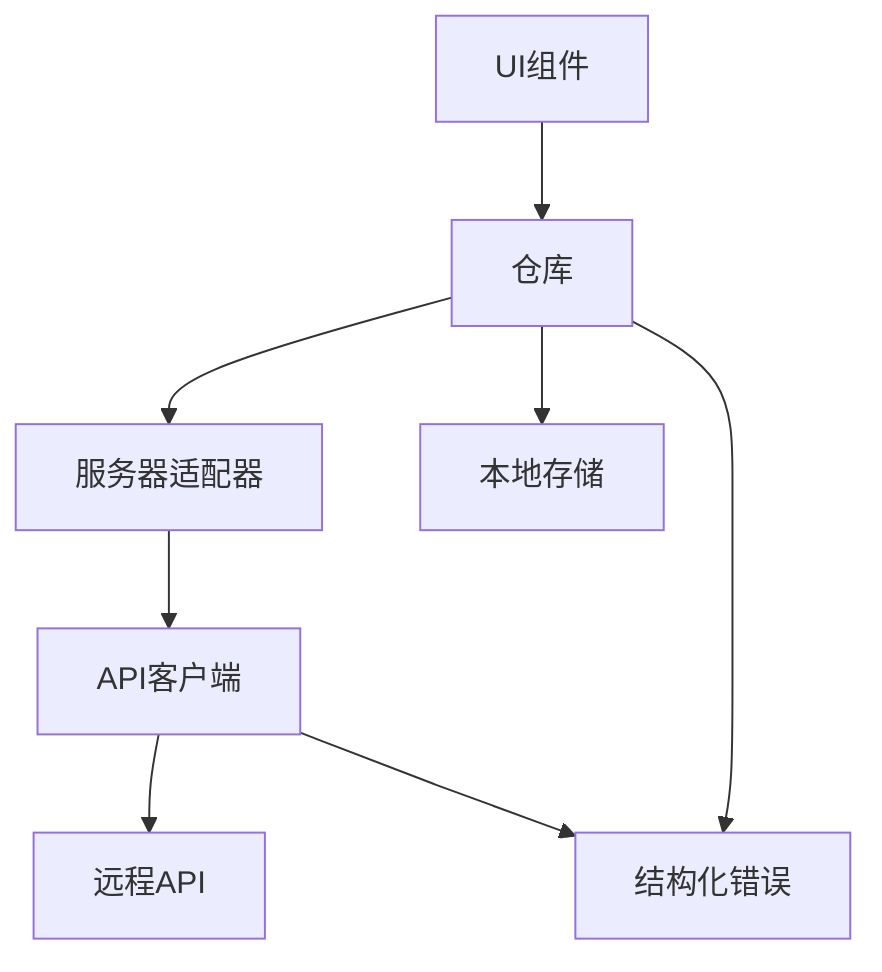

# 服务与API层

# 服务与API层

## 概述

服务与API层在应用程序的UI组件与远程API及本地存储之间提供了结构化、弹性的通信桥梁。它实现了三层架构：

1. **API客户端** — 具备重试、幂等性和回退机制的低层HTTP通信
2. **服务器适配器** — 映射到领域操作的类型化API端点
3. **仓库** — 采用远程优先、本地回退策略的数据持久化

该层还包含一个统一的错误模型（`StructuredError`），用于标准化所有层级的错误处理。

## 架构



## 关键组件

### 1. API客户端（`client.ts`）

处理所有网络通信的核心HTTP客户端。

**`apiRequest<T>(path, options)`** — 通用请求函数，具备以下特性：

- 自动添加`Content-Type: application/json`请求头
- 通过`X-Idempotency-Key`请求头支持幂等性键
- 针对状态码408、425、429、500、502、503、504的可配置重试逻辑（默认：1次重试）
- 指数退避策略：`(attempt + 1) * 300ms`
- 网络错误检测与回退事件触发
- 对未设置环境ID的特殊处理（抛出`REMOTE_DISABLED`）

**`ApiError`** — 结构化错误类，包含状态码和可选错误码，提供`toLogString()`方法用于可追溯的日志记录。

**回退机制**：当API不可达或返回错误时，`emitRemoteFallback()`会分发一个`pm:remote-fallback`自定义事件，包含完整上下文（范围、原因、状态、场景、幂等性键）。

### 2. 服务器适配器（`serverAdapter.ts`）

将领域操作映射到HTTP请求的类型化API端点定义。

**关键模式：**

- 所有端点通过`withEnv()`包含`envId`查询参数
- 幂等性键通过`createIdempotencyKey(scope, target?)`生成，使用时间戳加随机后缀
- 支持项目、任务和审计日志的CRUD操作

**端点：**
| 操作 | 方法 | 路径 |
|-----------|--------|------|
| 获取项目 | GET | `/projects` |
| 按代码获取项目 | GET | `/projects/:code` |
| 创建项目 | POST | `/projects` |
| 更新项目 | PUT | `/projects/:code` |
| 删除项目 | DELETE | `/projects/:code` |
| 获取所有任务 | GET | `/tasks/all` |
| 获取项目任务 | GET | `/projects/:code/tasks` |
| 创建任务 | POST | `/projects/:code/tasks` |
| 更新任务 | PUT | `/projects/:code/tasks/:taskCode` |
| 删除任务 | DELETE | `/projects/:code/tasks/:taskCode` |
| 获取任务树 | GET | `/projects/:code/tasks/tree` |
| 获取审计日志 | GET | `/audit/logs` |
| 追加审计日志 | POST | `/audit/logs` |

### 3. 仓库

每个仓库遵循一致的模式：**远程优先、本地回退**，并采用双写方式写入localStorage以实现离线弹性。

#### `projectRepository.ts`

- **`loadState()`** — 从远程API加载项目，回退到localStorage。包含自动迁移：如果远程为空但本地有数据，则将本地数据推送到服务器。
- **`getProjects()`**、**`getProjectByCode()`** — 远程优先，本地回退
- **`createProject()`**、**`updateProject()`**、**`deleteProject()`** — 远程操作，双写至localStorage
- 使用`StructuredError`在持久化失败时记录错误日志

#### `taskRepository.ts`

- **`loadTasks(contextKey)`** — 加载项目上下文的任务。对`__all`上下文（跨项目API）有特殊处理。包含类似项目的自动迁移。
- **`updateTask()`**、**`deleteTask()`** — 远程优先，本地回退。失败时在本地应用更改。
- **`createRectificationTaskFromAcceptance()`** — 复杂领域逻辑：从验收失败创建整改任务，继承参考任务的属性，包含去重和审计日志记录。
- **`appendOperationLog()`** — 本地写入操作日志并同步到审计API
- **`appendAuditEvents()`** — 批量审计事件持久化，localStorage上限为200条

#### `personnelRepository.ts` 和 `supplierRepository.ts`

- 仅本地仓库，初始状态来自静态数据文件
- `loadUsers()` / `loadSuppliers()` — 从localStorage读取，回退到初始数据
- `saveUsers()` / `saveSuppliers()` — 持久化到localStorage
- `getNextUserId()` / `getNextSupplierId()` — 基于现有最大值生成ID

#### `acceptanceRepository.ts`

- 仅本地持久化，用于验收状态快照
- `load()` / `save()` — 读写结构化的验收数据，包含验证

#### `auditRepository.ts`

- 对`serverAdapter.appendAuditLog()`的轻量封装
- 非阻塞：记录错误但从不抛出异常

#### `governanceRepository.ts` 和 `orderRepository.ts`

- 简单的localStorage仓库，用于设置和订单状态
- 读取时提供默认值和验证

#### `settlementRepository.ts`

- 纯计算：从项目数据构建结算建议
- 无持久化 — 将项目状态转换为结算候选对象

### 4. 错误模型（`StructuredError.ts`）

跨所有层的统一错误处理。

**`StructuredError`** — 扩展`Error`，包含：

- `code` — 类型化错误码（`NETWORK_ERROR`、`VALIDATION_ERROR`、`BUSINESS_ERROR`等）
- `scope` — 来源层（`api`、`repository`、`domain`、`ui`）
- `scenario` — 用于追踪的上下文标识符
- `status` — HTTP状态码（适用时）
- `idempotencyKey` — 用于去重调试
- `at` — 错误创建的ISO时间戳

**辅助函数：**

- `createNetworkError()`、`createValidationError()`、`createBusinessError()`、`createIdempotencyConflictError()`
- `StructuredError.fromRaw()` — 将未知错误包装为结构化格式
- `errorLogger.log()` / `errorLogger.report()` — 控制台日志记录，支持未来远程报告

**实用方法：**

- `isNetworkError()` — 检查是否与网络相关
- `isIdempotencyConflict()` — 检查重复请求检测
- `isRetryable()` — 检查错误是否可重试（NETWORK_ERROR、RATE_LIMIT_EXCEEDED、SERVER_ERROR、RETRY_EXHAUSTED）

### 5. Zustand存储（`projectStore.ts`）

虽然严格来说不属于服务层，但该存储通过ADR-001与仓库集成：

- 使用`persist`中间件实现自动localStorage同步
- 提供选择器（`selectProjectByCode`、`selectProjectLogs`）
- 操作包括状态转换、里程碑同步和父状态更新
- 关键操作（创建、状态变更）应额外调用`projectRepository.saveState()`进行远程同步

## 数据流

```
UI组件
    ↓
仓库（远程优先）
    ├── 服务器适配器 → API客户端 → 远程API
    └── localStorage（回退/双写）
        ↓
结构化错误（失败时）
    └── errorLogger.log() / errorLogger.report()
```

## 错误处理策略

1. **网络错误** — 自动重试（最多1次），然后回退到本地数据
2. **幂等性冲突** — 检测并返回现有结果，而非重新执行操作
3. **验证错误** — 立即失败，不重试，向UI返回结构化错误
4. **服务器错误** — 重试，然后回退到本地状态
5. **速率限制** — 使用指数退避重试
6. **所有错误** — 通过`StructuredError`记录，包含完整上下文用于调试
