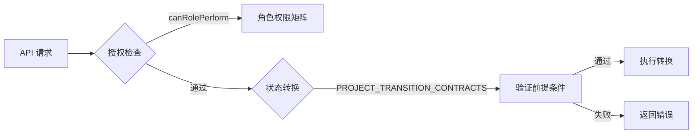

# 任务与工作流管理 — 服务模块

## 概述

`services/contracts/workflowContract.ts` 模块定义了管理项目和任务工作流的授权与状态转换规则。它作为一个声明式策略层，确保每个基于角色的操作和项目状态变更在执行前都经过预定义合约的验证。

## 核心组件

### 1. 角色与权限系统

#### `SystemRole`

表示系统中五种用户角色的联合类型：

- `admin` — 完全访问权限
- `pm` — 项目经理
- `executor` — 任务执行者
- `finance` — 结算与审计
- `auditor` — 只读监督

#### `WorkflowAction`

角色可执行的所有可能操作的联合类型，按领域分组：

- **项目**：`project.read`、`project.write`、`project.transition`
- **任务**：`task.read`、`task.write`
- **验收**：`acceptance.read`、`acceptance.write`
- **结算**：`settlement.read`、`settlement.write`
- **审计**：`audit.read`、`audit.write`

#### `ROLE_PERMISSION_MATRIX`

一个静态的 `Record<SystemRole, WorkflowAction[]>`，将每个角色映射到其允许的操作。该矩阵是授权检查的单一真实来源。

#### `canRolePerform(role, action)`

一个纯函数，用于检查给定角色是否允许执行特定操作。它只需在矩阵中查找角色并测试是否包含该操作。

### 2. 项目状态转换合约

#### `TransitionContract`

描述有效状态转换的接口：

- `from` — 当前 `ProjectStatus`
- `to` — 目标 `ProjectStatus`
- `requiredChecks` — 必须通过的前提条件标识符数组
- `requiresReason` — 是否需要人工可读的原因说明

#### `PROJECT_TRANSITION_CONTRACTS`

所有允许转换的静态数组。每个条目定义了将项目从一个状态移动到另一个状态的前提条件和元数据。状态遵循线性生命周期，但有一个例外（整改反馈循环）：

```
待立项 → 待确认 → 待拆解 → 执行中 → 待验收 → 待结算 → 已归档
                                    ↓
                                 整改中
```

`整改中` → `待验收` 转换允许在整改关闭后重新进入验收阶段。

## 代码库中的使用

该模块由执行工作流规则的服务层逻辑使用：

- **授权中间件** 在允许任何写入或转换操作之前调用 `canRolePerform()`。
- **项目状态机**（位于 `domain/projectStatusMachine.ts`）使用 `PROJECT_TRANSITION_CONTRACTS` 验证请求的转换是否合法以及是否满足所有前提条件。
- **UI 组件** 可以引用合约来禁用按钮或显示验证提示。

## 架构图



## 设计决策

- **声明式优于命令式**：所有规则都以数据（数组和记录）而非条件逻辑表达。这使得合约易于审计、测试和扩展。
- **关注点分离**：合约模块不依赖其他模块。它是一个纯数据层，可被任何服务或领域逻辑导入。
- **显式前提条件**：每个转换通过字符串标识符列出其所需的检查。实际的检查实现位于领域层，使合约层专注于*需要什么*，而非*如何验证*。
