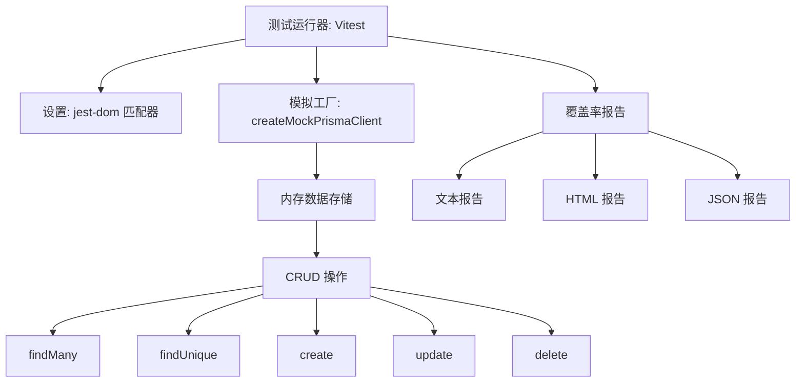

# 测试与配置

# 测试与配置模块

## 概述

本模块为 React + Vite 项目提供测试基础设施和配置。它实现了分层测试策略，包含模拟 Prisma 客户端、隔离的测试数据管理以及全面的工具配置。

## 架构

该模块由三个层次组成：

1. **模拟基础设施** - 用于数据库模拟的内存 Prisma 客户端工厂
2. **测试配置** - Vitest 设置、覆盖率阈值和环境配置
3. **数据策略** - 不同测试类型的测试数据管理指南



## 关键组件

### 1. Prisma 模拟工厂 (`src/test/mocks/prisma.mock.ts`)

核心测试工具，为单元测试和集成测试创建隔离的内存 Prisma 客户端。

**导出函数：**

- `createMockPrismaClient(initialProjects?: PartialProject[])` - 创建带有可选种子数据数组的模拟 Prisma 客户端

**模拟客户端方法：**

| 方法         | 签名                                                         | 行为                            |
| ------------ | ------------------------------------------------------------ | ------------------------------- |
| `findMany`   | `async () => ProjectRecord[]`                                | 返回内存存储中的所有项目        |
| `findUnique` | `async ({ where: { id?, code? } }) => ProjectRecord \| null` | 按 id 或 code 查找              |
| `create`     | `async ({ data }) => ProjectRecord`                          | 创建新记录并自动生成 id         |
| `update`     | `async ({ where, data }) => ProjectRecord \| null`           | 更新匹配记录，未找到则返回 null |
| `delete`     | `async ({ where }) => ProjectRecord \| null`                 | 删除并返回匹配记录              |

**类型定义：**

```typescript
type PartialProject = {
  id?: string
  code?: string
  name?: string
  description?: string
  status?: string
}

interface ProjectRecord {
  id: string
  code?: string
  name?: string
  description?: string
  status?: string
}
```

**数据隔离：** 每次调用 `createMockPrismaClient` 都会创建一个全新的内存存储。记录使用 `mock_${timestamp}_${random}` 格式自动分配唯一 ID。

### 2. 测试设置 (`src/test/setup.ts`)

最小化设置文件，导入 `@testing-library/jest-dom` 以扩展 Vitest 的匹配器，添加 DOM 特定断言（例如 `toBeInTheDocument`、`toHaveTextContent`）。

### 3. 测试数据策略 (`src/test/test-data-strategy.md`)

涵盖三个测试级别的文档化策略：

| 测试级别     | 方法                                | 依赖                     |
| ------------ | ----------------------------------- | ------------------------ |
| **单元测试** | 纯函数测试，直接进行 I/O 断言       | 无（无外部依赖）         |
| **仓库测试** | 使用内存数据的模拟 Prisma 客户端    | `createMockPrismaClient` |
| **集成测试** | 使用模拟 Prisma 的 Express 测试实例 | 模拟 Prisma + Express    |

**核心原则：** 每个测试的数据隔离 - 每个测试创建并清理自己的数据快照，防止跨测试污染。

### 4. Vitest 配置 (`vitest.config.ts`)

```typescript
export default defineConfig({
  plugins: [react()],
  test: {
    globals: true, // 全局测试函数 (describe, it, expect)
    environment: 'jsdom', // 浏览器类似环境
    setupFiles: './src/test/setup.ts', // 测试前设置
    coverage: {
      provider: 'v8', // V8 覆盖率引擎
      reporter: ['text', 'json', 'html'],
      exclude: ['node_modules/', 'src/test/'],
      thresholds: {
        lines: 55,
        statements: 55,
        functions: 42,
        branches: 42,
      },
    },
  },
})
```

**覆盖率阈值：**

- 行覆盖率：55%
- 语句覆盖率：55%
- 函数覆盖率：42%
- 分支覆盖率：42%

### 5. 支持配置文件

| 文件                 | 用途                                             |
| -------------------- | ------------------------------------------------ |
| `vite.config.ts`     | 基础 Vite 配置，包含 React 插件                  |
| `tsconfig.json`      | 根 TypeScript 配置，包含项目引用                 |
| `tsconfig.app.json`  | 应用特定 TS 配置（ES2023、React JSX、严格模式）  |
| `tsconfig.node.json` | 针对 Vite 配置文件的 Node 特定配置               |
| `tailwind.config.js` | Tailwind CSS 配置                                |
| `eslint.config.js`   | 包含 TypeScript、React Hooks 和质量规则的 ESLint |

## 使用示例

### 使用模拟 Prisma 的单元测试

```typescript
import { describe, it, expect } from 'vitest'
import { createMockPrismaClient } from './mocks/prisma.mock'

describe('项目仓库', () => {
  it('应该创建并检索项目', async () => {
    const client = createMockPrismaClient()

    const created = await client.project.create({
      data: { code: 'PRJ-001', name: '测试项目' },
    })

    const found = await client.project.findUnique({
      where: { id: created.id },
    })

    expect(found).toHaveProperty('name', '测试项目')
  })

  it('应该更新现有项目', async () => {
    const initial = [{ id: '1', code: 'PRJ-001', name: '初始' }]
    const client = createMockPrismaClient(initial)

    const updated = await client.project.update({
      where: { id: '1' },
      data: { name: '已更新' },
    })

    expect(updated?.name).toBe('已更新')
  })
})
```

### 集成测试模式

```typescript
// 集成测试使用相同的模拟工厂，但配合 Express 测试实例
import { createMockPrismaClient } from '../mocks/prisma.mock'
import { createTestApp } from '../test-app'

describe('项目 API', () => {
  it('应该返回项目', async () => {
    const mockPrisma = createMockPrismaClient()
    const app = createTestApp(mockPrisma)

    const response = await app.get('/api/projects')
    expect(response.status).toBe(200)
  })
})
```

## 最佳实践

1. **始终创建新的模拟** - 在每个测试中调用 `createMockPrismaClient()` 以确保数据隔离
