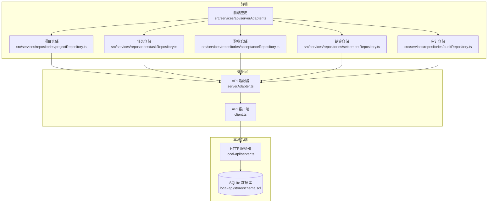
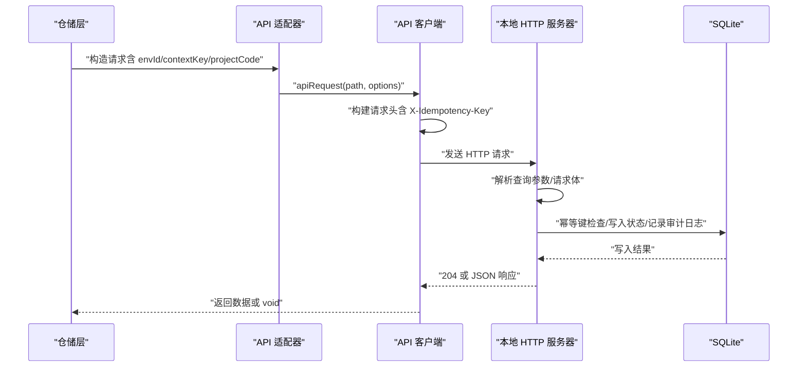
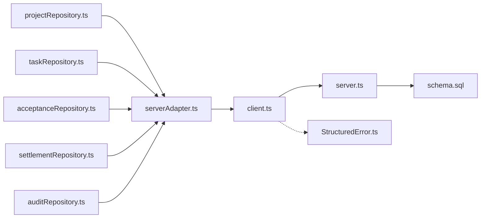

# API参考

<cite>
**本文引用的文件**
- [local-api/server.ts](file://local-api/server.ts)
- [local-api/contracts.ts](file://local-api/contracts.ts)
- [local-api/store/schema.sql](file://local-api/store/schema.sql)
- [local-api/test-api.sh](file://local-api/test-api.sh)
- [src/services/api/client.ts](file://src/services/api/client.ts)
- [src/services/api/serverAdapter.ts](file://src/services/api/serverAdapter.ts)
- [src/services/repositories/projectRepository.ts](file://src/services/repositories/projectRepository.ts)
- [src/services/repositories/taskRepository.ts](file://src/services/repositories/taskRepository.ts)
- [src/services/repositories/acceptanceRepository.ts](file://src/services/repositories/acceptanceRepository.ts)
- [src/services/repositories/settlementRepository.ts](file://src/services/repositories/settlementRepository.ts)
- [src/services/repositories/auditRepository.ts](file://src/services/repositories/auditRepository.ts)
- [src/services/errors/StructuredError.ts](file://src/services/errors/StructuredError.ts)
- [README.md](file://README.md)
</cite>

## 目录

1. [简介](#简介)
2. [项目结构](#项目结构)
3. [核心组件](#核心组件)
4. [架构总览](#架构总览)
5. [详细组件分析](#详细组件分析)
6. [依赖关系分析](#依赖关系分析)
7. [性能考量](#性能考量)
8. [故障排查指南](#故障排查指南)
9. [结论](#结论)
10. [附录](#附录)

## 简介

本文件为 CodeBuddy 项目的本地 API 参考文档，聚焦于五条核心 RESTful 接口：

- 项目状态接口：GET/PUT /api/projects/state
- 任务状态接口：GET/PUT /api/tasks/state
- 验收状态接口：GET/PUT /api/acceptance/state
- 结算状态接口：GET /api/settlement/state
- 审计日志接口：POST /api/audit/logs

内容涵盖：

- HTTP 方法、URL 模式、查询参数、请求体与响应格式
- 错误码与错误响应结构
- 认证机制与请求头要求
- 幂等性保障与重试策略
- 请求/响应示例与常见使用场景
- 版本控制策略与向后兼容性
- 客户端使用指南与集成示例

## 项目结构

本地 API 由 Node.js HTTP 服务器实现，配合 SQLite 存储与幂等键机制，提供上述五条接口。前端通过适配器封装调用，统一注入环境标识与幂等键，并具备网络异常时的本地降级与重试策略。

图表来源

- [local-api/server.ts:1-414](file://local-api/server.ts#L1-L414)
- [local-api/store/schema.sql:1-72](file://local-api/store/schema.sql#L1-L72)
- [src/services/api/serverAdapter.ts:1-87](file://src/services/api/serverAdapter.ts#L1-L87)
- [src/services/api/client.ts:1-172](file://src/services/api/client.ts#L1-L172)

章节来源

- [README.md:137-155](file://README.md#L137-L155)
- [local-api/server.ts:1-414](file://local-api/server.ts#L1-L414)
- [local-api/store/schema.sql:1-72](file://local-api/store/schema.sql#L1-L72)

## 核心组件

- 本地 HTTP 服务器：负责路由分发、CORS 处理、请求解析、响应发送与幂等键检查/记录。
- SQLite 存储：按接口维度维护状态快照与审计日志，提供唯一约束与索引。
- 前端适配器：封装环境标识注入、幂等键生成、请求方法与路径拼接。
- API 客户端：统一构建请求头（含 Content-Type 与 X-Idempotency-Key）、发送请求、处理 204、解析 JSON、重试与降级。
- 仓储层：面向业务的读写封装，负责本地缓存与远程调用的协调。

章节来源

- [local-api/server.ts:68-386](file://local-api/server.ts#L68-L386)
- [local-api/contracts.ts:1-89](file://local-api/contracts.ts#L1-L89)
- [src/services/api/serverAdapter.ts:34-86](file://src/services/api/serverAdapter.ts#L34-L86)
- [src/services/api/client.ts:37-172](file://src/services/api/client.ts#L37-L172)
- [src/services/repositories/projectRepository.ts:53-89](file://src/services/repositories/projectRepository.ts#L53-L89)
- [src/services/repositories/taskRepository.ts:141-195](file://src/services/repositories/taskRepository.ts#L141-L195)
- [src/services/repositories/acceptanceRepository.ts:32-55](file://src/services/repositories/acceptanceRepository.ts#L32-L55)
- [src/services/repositories/settlementRepository.ts:20-31](file://src/services/repositories/settlementRepository.ts#L20-L31)
- [src/services/repositories/auditRepository.ts:6-25](file://src/services/repositories/auditRepository.ts#L6-L25)

## 架构总览

下图展示了从仓储层到本地后端的整体调用链路与幂等保障。

图表来源

- [src/services/api/serverAdapter.ts:44-86](file://src/services/api/serverAdapter.ts#L44-L86)
- [src/services/api/client.ts:83-172](file://src/services/api/client.ts#L83-L172)
- [local-api/server.ts:68-386](file://local-api/server.ts#L68-L386)
- [local-api/store/schema.sql:1-72](file://local-api/store/schema.sql#L1-L72)

## 详细组件分析

### 项目状态接口

- 方法与路径
  - GET /api/projects/state
  - PUT /api/projects/state
- 查询参数
  - envId：环境标识，默认值为 default
- 请求头
  - Content-Type: application/json
  - X-Idempotency-Key：可选，用于幂等性保障
- 请求体（PUT）
  - projects：项目数组
  - logs：以项目 id 为键的状态日志映射
- 响应
  - GET：返回包含 projects 与 logs 的对象；若无记录则返回空数组/空对象
  - PUT：成功返回 204 No Content
- 错误
  - 400：请求体无效（JSON 解析失败）
  - 405：方法不允许
  - 404：未找到（路由匹配不到）
- 幂等性
  - PUT 支持幂等键；相同键与相同负载重放将返回 204，不产生重复副作用
- 常见场景
  - 初始化/恢复项目状态
  - 保存项目状态变更（含状态日志）

章节来源

- [local-api/server.ts:70-129](file://local-api/server.ts#L70-L129)
- [local-api/contracts.ts:11-16](file://local-api/contracts.ts#L11-L16)
- [src/services/api/serverAdapter.ts:44-52](file://src/services/api/serverAdapter.ts#L44-L52)
- [src/services/repositories/projectRepository.ts:53-89](file://src/services/repositories/projectRepository.ts#L53-L89)

### 任务状态接口

- 方法与路径
  - GET /api/tasks/state
  - PUT /api/tasks/state
- 查询参数
  - envId：环境标识，默认 default
  - contextKey：上下文键，必填
- 请求头
  - Content-Type: application/json
  - X-Idempotency-Key：可选
- 请求体（PUT）
  - schemaVersion：可选，版本号
  - tasks：任务数组
- 响应
  - GET：返回包含 tasks 的对象；若无记录则返回空数组
  - PUT：成功返回 204 No Content
- 校验
  - PUT 会对任务快照进行校验，校验失败返回 400
- 错误
  - 400：请求体无效或快照校验失败
  - 405：方法不允许
- 幂等性
  - PUT 支持幂等键；相同键与相同负载重放返回 204

章节来源

- [local-api/server.ts:131-197](file://local-api/server.ts#L131-L197)
- [local-api/contracts.ts:18-23](file://local-api/contracts.ts#L18-L23)
- [src/services/api/serverAdapter.ts:53-63](file://src/services/api/serverAdapter.ts#L53-L63)
- [src/services/repositories/taskRepository.ts:141-169](file://src/services/repositories/taskRepository.ts#L141-L169)

### 验收状态接口

- 方法与路径
  - GET /api/acceptance/state
  - PUT /api/acceptance/state
- 查询参数
  - envId：环境标识，默认 default
  - projectCode：项目编码，必填
- 请求头
  - Content-Type: application/json
  - X-Idempotency-Key：可选
- 请求体（PUT）
  - nodes：验收节点数组
  - milestones：里程碑数组
  - summary：可选，里程碑同步摘要
- 响应
  - GET：返回包含 nodes、milestones 与可选 summary 的对象；若无记录则返回空数组
  - PUT：成功返回 204 No Content
- 错误
  - 400：请求体无效
  - 405：方法不允许
- 幂等性
  - PUT 支持幂等键；相同键与相同负载重放返回 204

章节来源

- [local-api/server.ts:199-259](file://local-api/server.ts#L199-L259)
- [local-api/contracts.ts:25-31](file://local-api/contracts.ts#L25-L31)
- [src/services/api/serverAdapter.ts:64-74](file://src/services/api/serverAdapter.ts#L64-L74)
- [src/services/repositories/acceptanceRepository.ts:32-55](file://src/services/repositories/acceptanceRepository.ts#L32-L55)

### 结算状态接口

- 方法与路径
  - GET /api/settlement/state
- 查询参数
  - envId：环境标识，默认 default
- 请求头
  - Content-Type: application/json
- 响应
  - 返回包含 suggestions 的对象；若无记录则返回空数组
- 错误
  - 405：方法不允许
- 幂等性
  - 该接口为只读 GET，天然幂等

章节来源

- [local-api/server.ts:261-280](file://local-api/server.ts#L261-L280)
- [local-api/contracts.ts:33-44](file://local-api/contracts.ts#L33-L44)
- [src/services/api/serverAdapter.ts:75](file://src/services/api/serverAdapter.ts#L75)
- [src/services/repositories/settlementRepository.ts:20-31](file://src/services/repositories/settlementRepository.ts#L20-L31)

### 审计日志接口

- 方法与路径
  - POST /api/audit/logs
- 查询参数
  - envId：环境标识，默认 default
- 请求头
  - Content-Type: application/json
  - X-Idempotency-Key：可选
- 请求体
  - scene：场景标签
  - detail：详情文本
  - projectCode：可选，项目编码
  - at：ISO 8601 时间戳（由适配器自动注入）
- 响应
  - 成功返回 204 No Content
- 错误
  - 400：请求体无效
  - 405：方法不允许
- 幂等性
  - POST 支持幂等键；相同键与相同负载重放返回 204

章节来源

- [local-api/server.ts:282-329](file://local-api/server.ts#L282-L329)
- [local-api/contracts.ts:46-58](file://local-api/contracts.ts#L46-L58)
- [src/services/api/serverAdapter.ts:76-85](file://src/services/api/serverAdapter.ts#L76-L85)
- [src/services/repositories/taskRepository.ts:184-194](file://src/services/repositories/taskRepository.ts#L184-L194)
- [src/services/repositories/auditRepository.ts:6-25](file://src/services/repositories/auditRepository.ts#L6-L25)

### 统一错误响应

- 字段
  - message：错误信息
  - code：错误码
  - status：HTTP 状态码
  - timestamp：错误发生时间
- 示例
  - 400/INVALID_REQUEST
  - 405/METHOD_NOT_ALLOWED
  - 404/NOT_FOUND

章节来源

- [local-api/contracts.ts:72-89](file://local-api/contracts.ts#L72-L89)
- [local-api/server.ts:64-66](file://local-api/server.ts#L64-L66)

### 认证机制与请求头

- 认证
  - 本地 API 未内置鉴权；通过环境标识 envId 与幂等键实现基本隔离与幂等保障
- 请求头
  - Content-Type: application/json
  - X-Idempotency-Key：可选，用于幂等性保障
- CORS
  - 服务器允许 GET/POST/PUT/DELETE/OPTIONS，并允许上述请求头

章节来源

- [local-api/server.ts:45-62](file://local-api/server.ts#L45-L62)
- [src/services/api/client.ts:37-48](file://src/services/api/client.ts#L37-L48)

### 幂等性保障与重试策略

- 幂等键
  - 客户端生成并随请求头 X-Idempotency-Key 发送
  - 服务器对写操作（PUT/POST）进行幂等键检查，命中则返回 204，不重复处理
- 重试
  - 客户端对 408/425/429/500/502/503/504 自动重试，最多按配置重试
  - 重试期间会等待指数退避时间
- 降级
  - 网络异常或重试耗尽时，触发本地降级事件并抛出结构化错误

章节来源

- [src/services/api/client.ts:32-36](file://src/services/api/client.ts#L32-L36)
- [src/services/api/client.ts:142-159](file://src/services/api/client.ts#L142-L159)
- [src/services/api/client.ts:54-81](file://src/services/api/client.ts#L54-L81)
- [src/services/errors/StructuredError.ts:179-194](file://src/services/errors/StructuredError.ts#L179-L194)

### 请求/响应示例与常见场景

- 项目状态
  - GET /api/projects/state?envId=test-env
  - PUT /api/projects/state?envId=test-env（带 X-Idempotency-Key）
- 任务状态
  - GET /api/tasks/state?contextKey=project-P001&envId=test-env
  - PUT /api/tasks/state?contextKey=project-P001&envId=test-env
- 验收状态
  - GET /api/acceptance/state?projectCode=P001&envId=test-env
  - PUT /api/acceptance/state?projectCode=P001&envId=test-env
- 结算状态
  - GET /api/settlement/state?envId=test-env
- 审计日志
  - POST /api/audit/logs?envId=test-env

章节来源

- [local-api/test-api.sh:19-151](file://local-api/test-api.sh#L19-L151)

## 依赖关系分析

图表来源

- [src/services/repositories/projectRepository.ts:1-90](file://src/services/repositories/projectRepository.ts#L1-L90)
- [src/services/repositories/taskRepository.ts:1-318](file://src/services/repositories/taskRepository.ts#L1-L318)
- [src/services/repositories/acceptanceRepository.ts:1-56](file://src/services/repositories/acceptanceRepository.ts#L1-L56)
- [src/services/repositories/settlementRepository.ts:1-32](file://src/services/repositories/settlementRepository.ts#L1-L32)
- [src/services/repositories/auditRepository.ts:1-26](file://src/services/repositories/auditRepository.ts#L1-L26)
- [src/services/api/serverAdapter.ts:1-87](file://src/services/api/serverAdapter.ts#L1-L87)
- [src/services/api/client.ts:1-172](file://src/services/api/client.ts#L1-L172)
- [local-api/server.ts:1-414](file://local-api/server.ts#L1-L414)
- [local-api/store/schema.sql:1-72](file://local-api/store/schema.sql#L1-L72)
- [src/services/errors/StructuredError.ts:1-195](file://src/services/errors/StructuredError.ts#L1-L195)

章节来源

- [src/services/repositories/projectRepository.ts:53-89](file://src/services/repositories/projectRepository.ts#L53-L89)
- [src/services/repositories/taskRepository.ts:141-195](file://src/services/repositories/taskRepository.ts#L141-L195)
- [src/services/repositories/acceptanceRepository.ts:32-55](file://src/services/repositories/acceptanceRepository.ts#L32-L55)
- [src/services/repositories/settlementRepository.ts:20-31](file://src/services/repositories/settlementRepository.ts#L20-L31)
- [src/services/repositories/auditRepository.ts:6-25](file://src/services/repositories/auditRepository.ts#L6-L25)

## 性能考量

- 本地 SQLite 读写满足演示与联调场景，不建议在高并发/高吞吐生产环境使用
- 建议在生产环境替换为云数据库与鉴权网关，结合 CDN 与缓存策略提升可用性
- 幂等键与重试策略有助于降低网络抖动带来的影响，但不应替代完善的后端治理

## 故障排查指南

- 常见错误码
  - 400：请求体无效或快照校验失败
  - 404：未找到接口
  - 405：方法不允许
- 降级与重试
  - 客户端在网络异常或可重试状态码时自动重试；重试耗尽后触发本地降级事件
- 日志与追踪
  - 使用 StructuredError 记录结构化错误，包含 code、scope、scenario、status、idempotencyKey、at 等字段
- 本地联调
  - 启动本地后端与前端，检查 X-Idempotency-Key 是否正确注入，观察控制台降级日志

章节来源

- [src/services/api/client.ts:131-171](file://src/services/api/client.ts#L131-L171)
- [src/services/errors/StructuredError.ts:27-127](file://src/services/errors/StructuredError.ts#L27-L127)
- [README.md:227-243](file://README.md#L227-L243)

## 结论

本 API 参考文档梳理了本地后端提供的五条核心接口，明确了请求/响应格式、错误码、认证与幂等性保障、重试与降级策略，并提供了集成示例与故障排查指引。建议在生产环境中引入鉴权、限流与可观测性能力，确保稳定性与安全性。

## 附录

### API 版本控制与向后兼容

- 当前本地 API 未显式声明版本号；通过 schemaVersion 字段在任务状态中体现版本演进
- 建议后续引入 API 版本前缀（如 /api/v1/...）以明确语义化版本与兼容性边界

章节来源

- [src/services/repositories/taskRepository.ts:17](file://src/services/repositories/taskRepository.ts#L17)
- [local-api/contracts.ts:21](file://local-api/contracts.ts#L21)

### 客户端使用指南与集成示例

- 基础配置
  - 设置环境变量 VITE_API_BASE_URL 指向前端代理或本地后端地址
  - 通过 serverAdapter 调用各接口，自动注入 envId 与幂等键
- 常见集成步骤
  - 读取状态：调用 getProjectState/getTaskState/getAcceptanceState/getSettlementState
  - 写入状态：调用 saveProjectState/saveTaskState/saveAcceptanceState
  - 追加审计：调用 appendAuditLog
- 幂等键生成
  - 使用 createIdempotencyKey(scope, target?) 生成唯一键，避免重复提交

章节来源

- [src/services/api/serverAdapter.ts:34-86](file://src/services/api/serverAdapter.ts#L34-L86)
- [src/services/api/client.ts:50](file://src/services/api/client.ts#L50)
- [src/services/repositories/projectRepository.ts:76-88](file://src/services/repositories/projectRepository.ts#L76-L88)
- [src/services/repositories/taskRepository.ts:157-169](file://src/services/repositories/taskRepository.ts#L157-L169)
- [src/services/repositories/acceptanceRepository.ts:45-54](file://src/services/repositories/acceptanceRepository.ts#L45-L54)
- [src/services/repositories/auditRepository.ts:7-24](file://src/services/repositories/auditRepository.ts#L7-L24)
