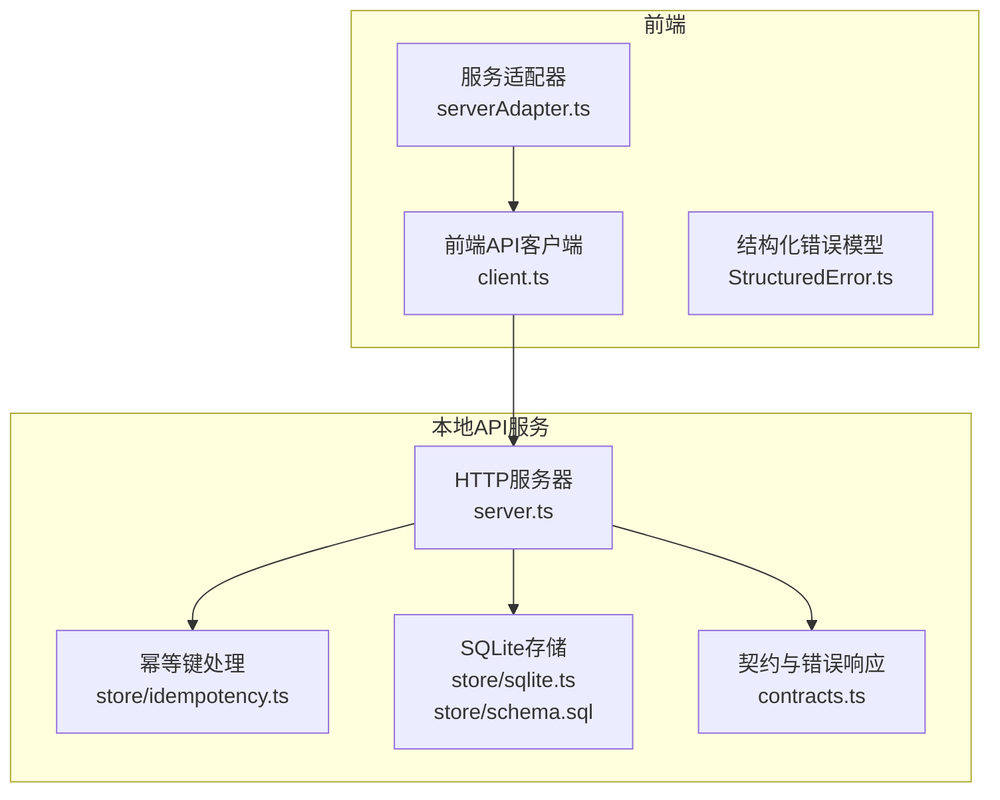
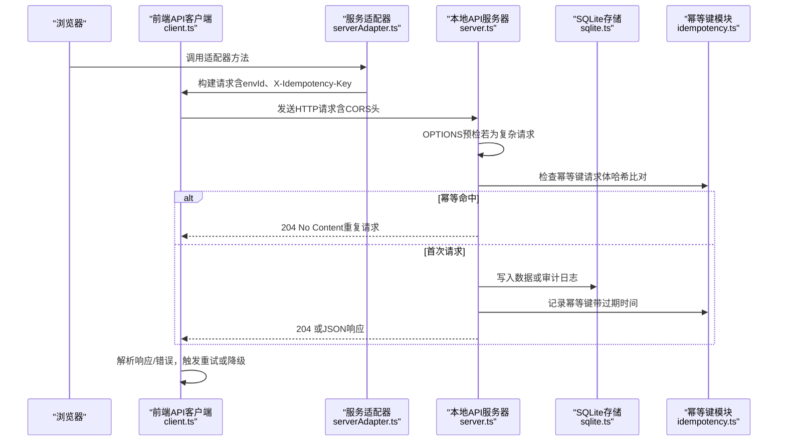
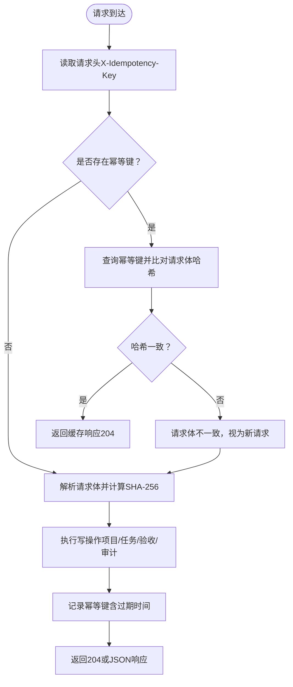
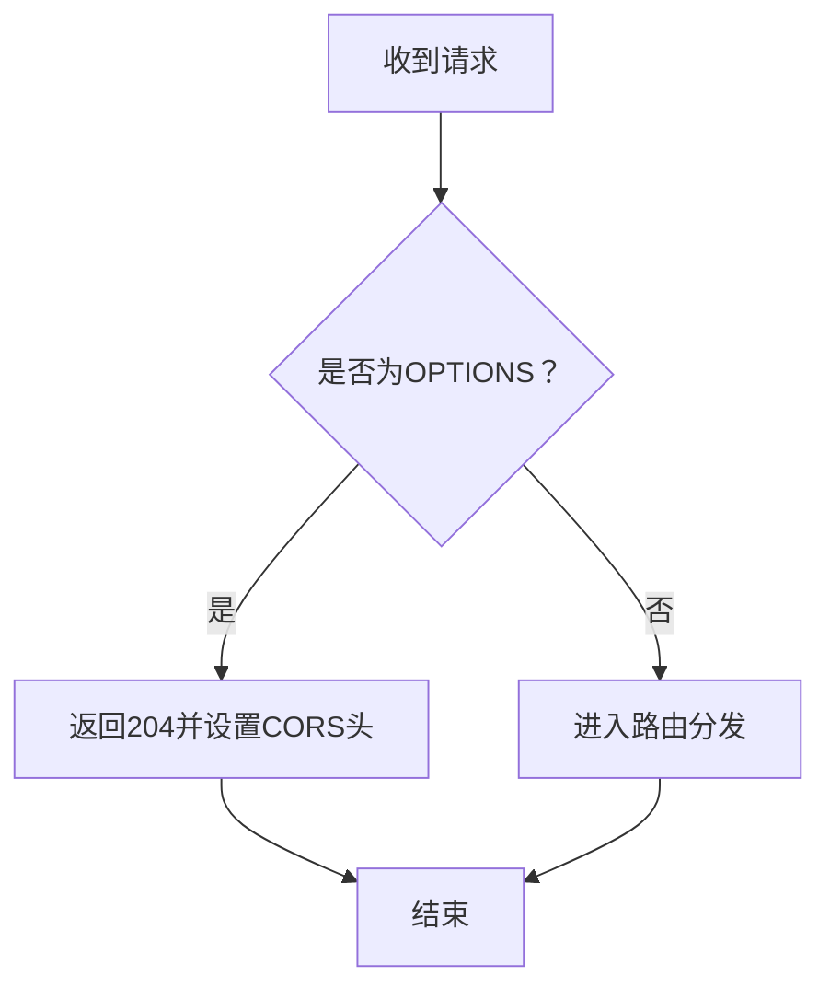
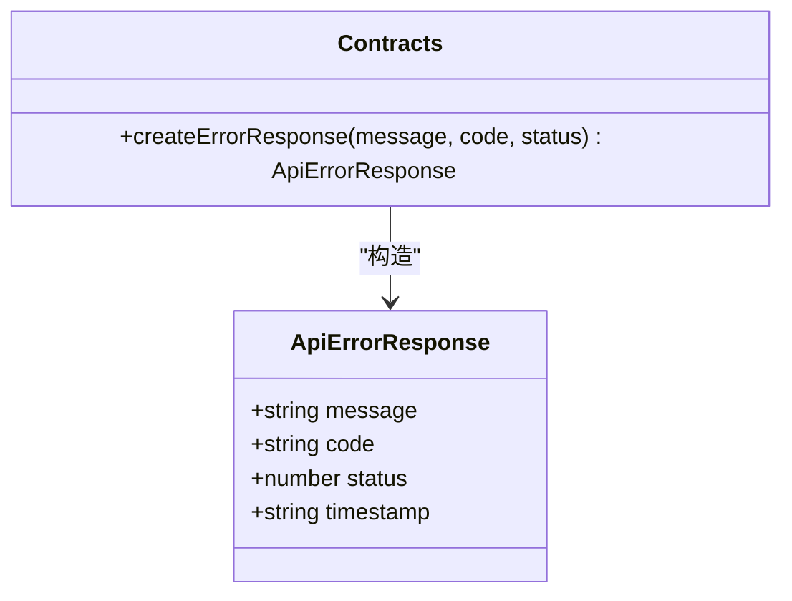
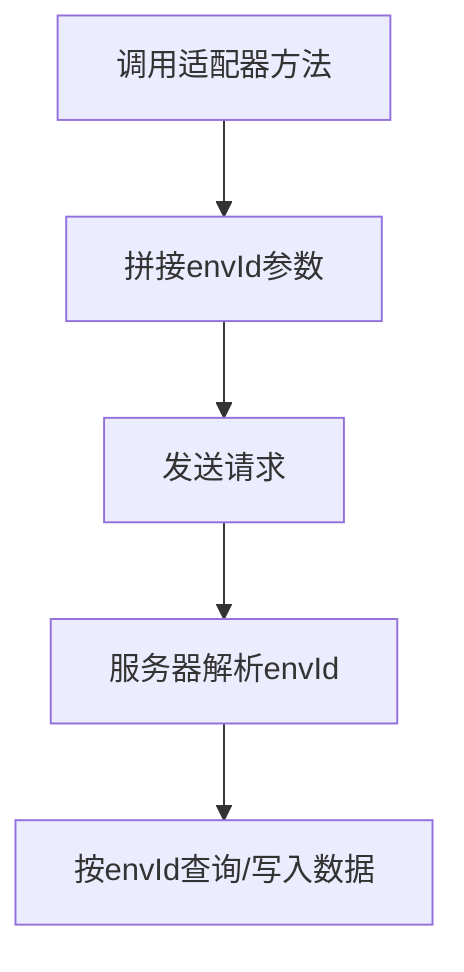
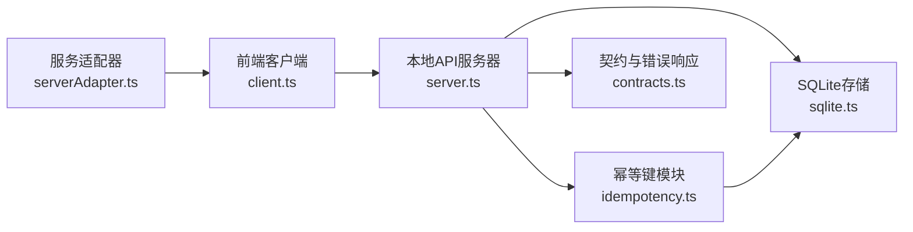

# API认证与安全

<cite>
**本文引用的文件列表**
- [server.ts](file://local-api/server.ts)
- [idempotency.ts](file://local-api/store/idempotency.ts)
- [sqlite.ts](file://local-api/store/sqlite.ts)
- [schema.sql](file://local-api/store/schema.sql)
- [contracts.ts](file://local-api/contracts.ts)
- [client.ts](file://src/services/api/client.ts)
- [serverAdapter.ts](file://src/services/api/serverAdapter.ts)
- [StructuredError.ts](file://src/services/errors/StructuredError.ts)
- [test-api.sh](file://local-api/test-api.sh)
</cite>

## 目录

1. [简介](#简介)
2. [项目结构](#项目结构)
3. [核心组件](#核心组件)
4. [架构总览](#架构总览)
5. [详细组件分析](#详细组件分析)
6. [依赖关系分析](#依赖关系分析)
7. [性能考量](#性能考量)
8. [故障排查指南](#故障排查指南)
9. [结论](#结论)
10. [附录](#附录)

## 简介

本文件聚焦于API认证与安全机制，围绕以下主题展开：

- X-Idempotency-Key幂等性保障机制：如何防止重复请求与重放攻击
- CORS跨域资源共享配置：允许的源、方法与头部
- 错误响应格式：统一错误码与createErrorResponse函数的使用
- 环境ID隔离机制：envId参数在多环境支持中的作用
- API调用安全最佳实践：请求头设置、错误处理与重试策略
- OPTIONS预检请求处理与浏览器兼容性考虑

## 项目结构

该仓库包含本地API服务与前端适配层，安全相关逻辑主要分布在本地API服务与前端客户端两部分：

- 本地API服务：实现五条核心接口，内置CORS与幂等键处理
- 前端适配层：封装API请求、构建请求头、处理错误与重试
- 错误模型：统一错误结构，便于监控与排障

图表来源

- [server.ts:1-414](file://local-api/server.ts#L1-L414)
- [client.ts:1-172](file://src/services/api/client.ts#L1-L172)
- [serverAdapter.ts:1-87](file://src/services/api/serverAdapter.ts#L1-L87)
- [idempotency.ts:1-100](file://local-api/store/idempotency.ts#L1-L100)
- [sqlite.ts:1-99](file://local-api/store/sqlite.ts#L1-L99)
- [schema.sql:1-72](file://local-api/store/schema.sql#L1-L72)
- [contracts.ts:1-89](file://local-api/contracts.ts#L1-L89)

章节来源

- [server.ts:1-414](file://local-api/server.ts#L1-L414)
- [client.ts:1-172](file://src/services/api/client.ts#L1-L172)
- [serverAdapter.ts:1-87](file://src/services/api/serverAdapter.ts#L1-L87)
- [idempotency.ts:1-100](file://local-api/store/idempotency.ts#L1-L100)
- [sqlite.ts:1-99](file://local-api/store/sqlite.ts#L1-L99)
- [schema.sql:1-72](file://local-api/store/schema.sql#L1-L72)
- [contracts.ts:1-89](file://local-api/contracts.ts#L1-L89)

## 核心组件

- 本地API服务器：负责路由分发、CORS配置、幂等键检查与记录、统一错误响应
- 幂等键模块：基于请求体哈希与键值唯一性，实现重复请求防护与重放检测
- SQLite存储：初始化表结构、清理过期幂等键、提供数据库连接
- 前端API客户端：构建请求头（含X-Idempotency-Key）、发送请求、处理响应与错误、重试策略
- 服务适配器：封装环境ID注入、幂等键生成与API调用
- 结构化错误模型：统一错误码、作用域、场景、时间戳与幂等键关联

章节来源

- [server.ts:45-66](file://local-api/server.ts#L45-L66)
- [idempotency.ts:23-86](file://local-api/store/idempotency.ts#L23-L86)
- [sqlite.ts:18-80](file://local-api/store/sqlite.ts#L18-L80)
- [client.ts:37-171](file://src/services/api/client.ts#L37-L171)
- [serverAdapter.ts:34-86](file://src/services/api/serverAdapter.ts#L34-L86)
- [StructuredError.ts:7-127](file://src/services/errors/StructuredError.ts#L7-L127)

## 架构总览

下图展示从浏览器到本地API服务的完整调用链路，重点标注CORS、幂等键与错误处理的关键节点。

图表来源

- [server.ts:342-351](file://local-api/server.ts#L342-L351)
- [server.ts:71-129](file://local-api/server.ts#L71-L129)
- [server.ts:132-197](file://local-api/server.ts#L132-L197)
- [server.ts:199-259](file://local-api/server.ts#L199-L259)
- [server.ts:282-329](file://local-api/server.ts#L282-L329)
- [idempotency.ts:23-86](file://local-api/store/idempotency.ts#L23-L86)
- [sqlite.ts:68-80](file://local-api/store/sqlite.ts#L68-L80)
- [client.ts:83-171](file://src/services/api/client.ts#L83-L171)
- [serverAdapter.ts:34-86](file://src/services/api/serverAdapter.ts#L34-L86)

## 详细组件分析

### 幂等性保障机制（X-Idempotency-Key）

- 设计目标：防止重复请求与重放攻击，确保相同请求体在相同环境下的幂等性
- 关键流程：
  1. 客户端生成唯一幂等键（服务适配器提供生成函数）
  2. 请求头携带X-Idempotency-Key
  3. 服务器解析请求体并计算SHA-256哈希
  4. 查询幂等键表，若命中且请求体哈希一致，则返回204（无内容），避免重复写入
  5. 若未命中，执行写操作并将幂等键与响应状态/体记录到数据库，设置过期时间（默认7天）

图表来源

- [server.ts:87-122](file://local-api/server.ts#L87-L122)
- [server.ts:149-190](file://local-api/server.ts#L149-L190)
- [server.ts:217-252](file://local-api/server.ts#L217-L252)
- [server.ts:289-322](file://local-api/server.ts#L289-L322)
- [idempotency.ts:23-86](file://local-api/store/idempotency.ts#L23-L86)

章节来源

- [server.ts:87-122](file://local-api/server.ts#L87-L122)
- [server.ts:149-190](file://local-api/server.ts#L149-L190)
- [server.ts:217-252](file://local-api/server.ts#L217-L252)
- [server.ts:289-322](file://local-api/server.ts#L289-L322)
- [idempotency.ts:23-86](file://local-api/store/idempotency.ts#L23-L86)

### CORS跨域资源共享配置

- 允许的源：\*（通配符）
- 允许的方法：GET、POST、PUT、DELETE、OPTIONS
- 允许的头部：Content-Type、X-Idempotency-Key
- 预检处理：对OPTIONS请求直接返回204，包含上述CORS头

图表来源

- [server.ts:45-62](file://local-api/server.ts#L45-L62)
- [server.ts:342-351](file://local-api/server.ts#L342-L351)

章节来源

- [server.ts:45-62](file://local-api/server.ts#L45-L62)
- [server.ts:342-351](file://local-api/server.ts#L342-L351)

### 错误响应格式与标准错误码

- 统一错误响应结构：message、code、status、timestamp
- createErrorResponse函数用于构造标准化错误响应
- 前端通过解析响应体提取message与code，结合HTTP状态码进行错误分类与重试

图表来源

- [contracts.ts:72-89](file://local-api/contracts.ts#L72-L89)

章节来源

- [contracts.ts:72-89](file://local-api/contracts.ts#L72-L89)
- [client.ts:134-158](file://src/services/api/client.ts#L134-L158)

### 环境ID隔离机制（envId）

- 多环境支持：通过envId参数区分不同环境的数据存储与访问
- 默认值：未指定时回退至"default"
- 前端注入：服务适配器自动在路径上附加envId参数
- 服务器解析：各接口处理器从查询参数读取envId并据此查询/写入对应环境的数据

图表来源

- [serverAdapter.ts:34-36](file://src/services/api/serverAdapter.ts#L34-L36)
- [server.ts:74](file://local-api/server.ts#L74)
- [server.ts:135](file://local-api/server.ts#L135)
- [server.ts:203](file://local-api/server.ts#L203)
- [server.ts:265](file://local-api/server.ts#L265)
- [server.ts:286](file://local-api/server.ts#L286)

章节来源

- [serverAdapter.ts:34-36](file://src/services/api/serverAdapter.ts#L34-L36)
- [server.ts:74](file://local-api/server.ts#L74)
- [server.ts:135](file://local-api/server.ts#L135)
- [server.ts:203](file://local-api/server.ts#L203)
- [server.ts:265](file://local-api/server.ts#L265)
- [server.ts:286](file://local-api/server.ts#L286)

### API调用安全最佳实践

- 请求头设置
  - Content-Type: application/json
  - X-Idempotency-Key: 仅在写操作（PUT/POST）时携带，且每次请求需唯一
- 错误处理
  - 解析响应体中的message与code，结合HTTP状态码进行分类
  - 使用结构化错误模型记录错误上下文（scope、scenario、status、idempotencyKey）
- 重试策略
  - 可重试状态：408、425、429、500、502、503、504
  - 退避等待：按尝试次数线性递增延迟
  - 重试上限：默认1次，可通过选项覆盖
- 降级与兜底
  - 当云端不可用时触发降级事件，前端弹窗提示并记录上下文

章节来源

- [client.ts:37-48](file://src/services/api/client.ts#L37-L48)
- [client.ts:131-158](file://src/services/api/client.ts#L131-L158)
- [client.ts:32-33](file://src/services/api/client.ts#L32-L33)
- [client.ts:83-171](file://src/services/api/client.ts#L83-L171)
- [StructuredError.ts:7-127](file://src/services/errors/StructuredError.ts#L7-L127)

### OPTIONS预检请求处理与浏览器兼容性

- 预检处理：对OPTIONS请求直接返回204，并设置CORS相关头部
- 兼容性考虑：现代浏览器在复杂请求（自定义头部或非简单方法）时会先发起OPTIONS预检；当前实现对所有OPTIONS请求均返回204，简化跨域交互

章节来源

- [server.ts:342-351](file://local-api/server.ts#L342-L351)

## 依赖关系分析

图表来源

- [client.ts:1-172](file://src/services/api/client.ts#L1-L172)
- [server.ts:1-414](file://local-api/server.ts#L1-L414)
- [serverAdapter.ts:1-87](file://src/services/api/serverAdapter.ts#L1-L87)
- [idempotency.ts:1-100](file://local-api/store/idempotency.ts#L1-L100)
- [sqlite.ts:1-99](file://local-api/store/sqlite.ts#L1-L99)
- [contracts.ts:1-89](file://local-api/contracts.ts#L1-L89)

章节来源

- [client.ts:1-172](file://src/services/api/client.ts#L1-L172)
- [server.ts:1-414](file://local-api/server.ts#L1-L414)
- [serverAdapter.ts:1-87](file://src/services/api/serverAdapter.ts#L1-L87)
- [idempotency.ts:1-100](file://local-api/store/idempotency.ts#L1-L100)
- [sqlite.ts:1-99](file://local-api/store/sqlite.ts#L1-L99)
- [contracts.ts:1-89](file://local-api/contracts.ts#L1-L89)

## 性能考量

- 幂等键过期清理：定期删除过期记录，避免表膨胀
- SQLite WAL模式：提升并发读写性能
- 幂等键命中快速返回：减少重复写入与数据库压力
- 建议优化
  - 为幂等键表添加索引（已存在）
  - 控制幂等键TTL以平衡安全性与存储成本
  - 在高并发场景下评估数据库连接池与事务粒度

章节来源

- [sqlite.ts:68-80](file://local-api/store/sqlite.ts#L68-L80)
- [sqlite.ts:32-33](file://local-api/store/sqlite.ts#L32-L33)
- [idempotency.ts:10](file://local-api/store/idempotency.ts#L10)

## 故障排查指南

- 幂等冲突
  - 现象：相同幂等键与请求体导致重复请求被拒绝
  - 排查：检查请求头X-Idempotency-Key是否唯一；确认请求体是否与历史一致
- CORS错误
  - 现象：浏览器报跨域错误
  - 排查：确认服务器返回了正确的Access-Control-Allow-\*头；复杂请求是否正确处理OPTIONS预检
- 错误响应解析
  - 现象：前端无法正确显示错误信息
  - 排查：确认响应体包含message与code字段；HTTP状态码与业务语义一致
- 重试与降级
  - 现象：请求多次重试后失败并触发降级
  - 排查：检查可重试状态集合；确认网络异常与服务端错误的区分；查看降级事件日志

章节来源

- [server.ts:45-66](file://local-api/server.ts#L45-L66)
- [client.ts:131-158](file://src/services/api/client.ts#L131-L158)
- [client.ts:54-81](file://src/services/api/client.ts#L54-L81)

## 结论

本项目通过X-Idempotency-Key实现了可靠的幂等性保障，结合CORS配置与统一错误响应，提供了清晰的跨域与错误处理机制。环境ID隔离使多环境数据得以独立管理。前端客户端采用结构化错误模型与可配置重试策略，提升了系统的鲁棒性与可观测性。建议在生产环境中进一步完善鉴权与加密传输，并持续优化幂等键TTL与数据库性能指标。

## 附录

- 示例脚本：本地API接口测试脚本展示了envId与X-Idempotency-Key的使用方式
- 幂等键表结构：包含键、作用域、环境ID、请求体哈希、响应状态与过期时间等字段

章节来源

- [test-api.sh:1-123](file://local-api/test-api.sh#L1-L123)
- [schema.sql:57-72](file://local-api/store/schema.sql#L57-L72)
