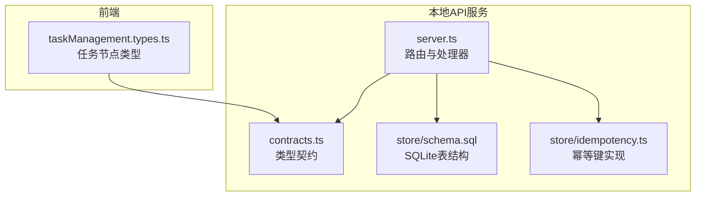
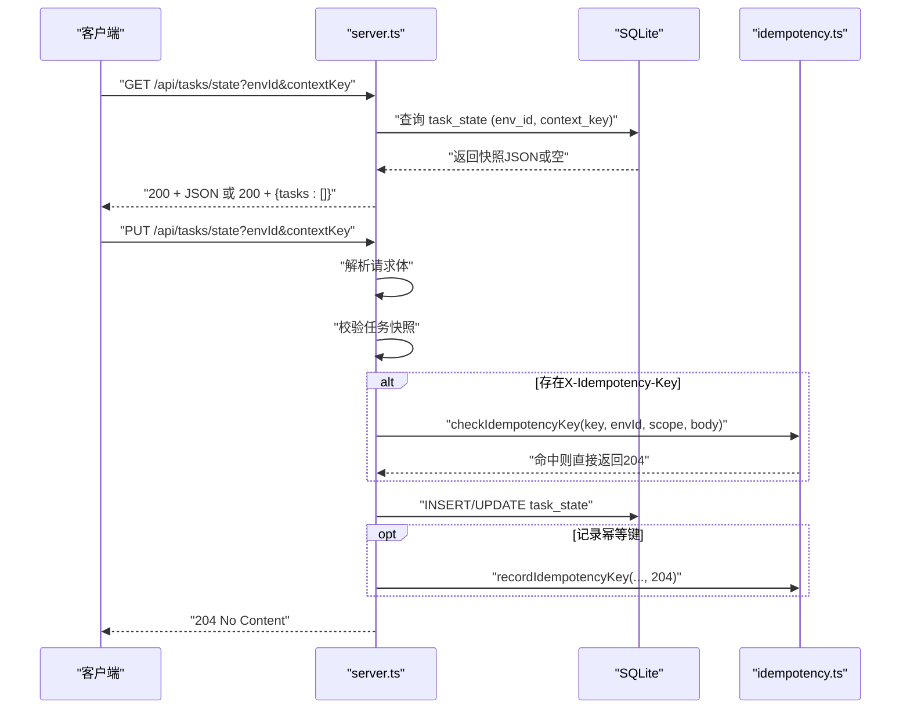
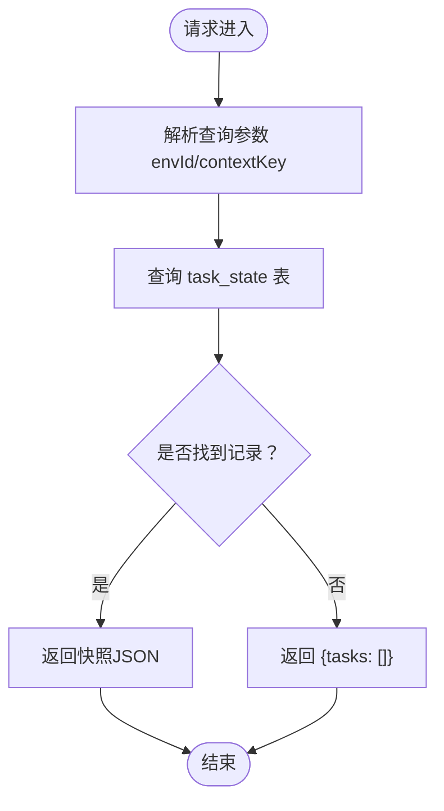
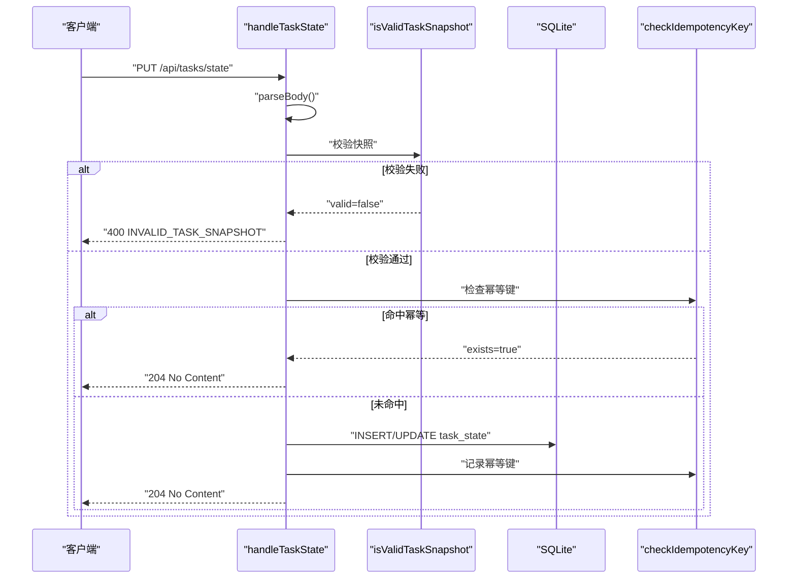
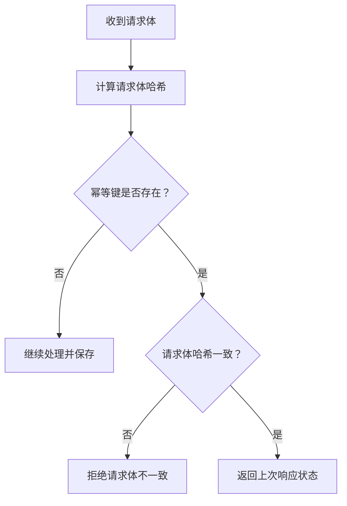
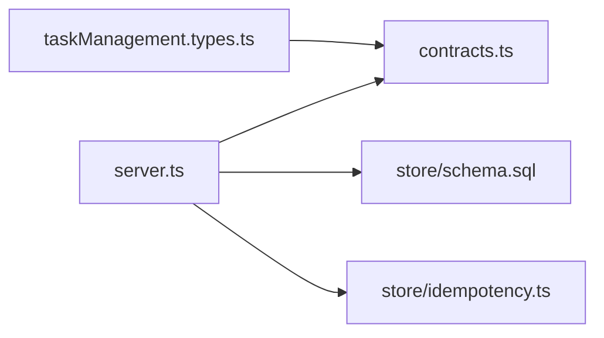

# 任务状态API

<cite>
**本文引用的文件**
- [local-api/server.ts](file://local-api/server.ts)
- [local-api/contracts.ts](file://local-api/contracts.ts)
- [local-api/store/schema.sql](file://local-api/store/schema.sql)
- [local-api/store/idempotency.ts](file://local-api/store/idempotency.ts)
- [local-api/README.md](file://local-api/README.md)
- [local-api/test-api.sh](file://local-api/test-api.sh)
- [src/components/task/taskManagement.types.ts](file://src/components/task/taskManagement.types.ts)
</cite>

## 目录

1. [简介](#简介)
2. [项目结构](#项目结构)
3. [核心组件](#核心组件)
4. [架构总览](#架构总览)
5. [详细组件分析](#详细组件分析)
6. [依赖关系分析](#依赖关系分析)
7. [性能考虑](#性能考虑)
8. [故障排查指南](#故障排查指南)
9. [结论](#结论)
10. [附录](#附录)

## 简介

本文件为任务状态API的权威技术文档，覆盖以下内容：

- GET /api/tasks/state：按环境ID与上下文键获取任务状态快照
- PUT /api/tasks/state：保存任务状态快照并提供幂等性保障
- 请求体结构、校验规则与错误处理
- 响应示例与常见问题排查

## 项目结构

任务状态API位于本地后端服务中，核心文件如下：

- 服务入口与路由：local-api/server.ts
- 类型契约与快照结构：local-api/contracts.ts
- 数据库Schema：local-api/store/schema.sql
- 幂等性实现：local-api/store/idempotency.ts
- 使用说明与约束：local-api/README.md
- 接口测试脚本：local-api/test-api.sh
- 前端任务类型定义（用于理解任务节点属性）：src/components/task/taskManagement.types.ts

图表来源

- [local-api/server.ts:131-197](file://local-api/server.ts#L131-L197)
- [local-api/contracts.ts:18-23](file://local-api/contracts.ts#L18-L23)
- [local-api/store/schema.sql:13-21](file://local-api/store/schema.sql#L13-L21)
- [local-api/store/idempotency.ts:23-86](file://local-api/store/idempotency.ts#L23-L86)
- [src/components/task/taskManagement.types.ts:86-133](file://src/components/task/taskManagement.types.ts#L86-L133)

章节来源

- [local-api/server.ts:131-197](file://local-api/server.ts#L131-L197)
- [local-api/contracts.ts:18-23](file://local-api/contracts.ts#L18-L23)
- [local-api/store/schema.sql:13-21](file://local-api/store/schema.sql#L13-L21)
- [local-api/store/idempotency.ts:23-86](file://local-api/store/idempotency.ts#L23-L86)
- [src/components/task/taskManagement.types.ts:86-133](file://src/components/task/taskManagement.types.ts#L86-L133)

## 核心组件

- 任务状态快照结构
  - schemaVersion：可选版本号，默认不强制要求
  - tasks：任务节点数组，每个节点包含名称、编码、状态、负责人、计划起止时间、SLA、风险等级、前置状态、提醒次数、标准绑定状态、快照状态等字段
- 查询参数
  - envId：环境标识，默认“default”
  - contextKey：上下文键，用于区分不同场景或项目的任务集合
- 幂等性
  - PUT请求支持X-Idempotency-Key头部，服务端基于请求体哈希与幂等键进行去重

章节来源

- [local-api/contracts.ts:20-23](file://local-api/contracts.ts#L20-L23)
- [local-api/README.md:52-68](file://local-api/README.md#L52-L68)
- [local-api/server.ts:135-136](file://local-api/server.ts#L135-L136)
- [local-api/store/idempotency.ts:15-18](file://local-api/store/idempotency.ts#L15-L18)

## 架构总览

任务状态API采用单进程HTTP服务，路由到具体处理器；处理器负责解析查询参数与请求体、执行校验、持久化到SQLite，并在PUT时结合幂等键实现去重。

图表来源

- [local-api/server.ts:131-197](file://local-api/server.ts#L131-L197)
- [local-api/store/schema.sql:13-21](file://local-api/store/schema.sql#L13-L21)
- [local-api/store/idempotency.ts:23-86](file://local-api/store/idempotency.ts#L23-L86)

## 详细组件分析

### GET /api/tasks/state

- 功能
  - 根据envId与contextKey查询任务状态快照
  - 若未找到，返回空任务数组
- 查询参数
  - envId：环境标识，默认“default”
  - contextKey：上下文键，默认“default”
- 响应
  - 200 OK + JSON：包含tasks数组
  - 当未找到记录时，返回tasks为空数组
- 示例
  - 请求：GET /api/tasks/state?contextKey=project-P001&envId=dev
  - 响应：200 + {"tasks": [...]}

图表来源

- [local-api/server.ts:138-147](file://local-api/server.ts#L138-L147)
- [local-api/store/schema.sql:13-21](file://local-api/store/schema.sql#L13-L21)

章节来源

- [local-api/server.ts:138-147](file://local-api/server.ts#L138-L147)
- [local-api/store/schema.sql:13-21](file://local-api/store/schema.sql#L13-L21)

### PUT /api/tasks/state

- 功能
  - 保存任务状态快照至task_state表
  - 支持幂等性：相同键+相同请求体直接返回204
- 请求头
  - Content-Type: application/json
  - X-Idempotency-Key：可选，用于幂等性保障
- 请求体
  - schemaVersion：可选
  - tasks：数组，元素为任务节点对象
- 校验规则（服务端执行）
  - tasks必须为数组
  - 每个任务节点的status必须属于任务状态枚举
  - 计划开始时间 ≤ 计划结束时间
  - 当isBlocked为true时，必须提供blockedReason
- 响应
  - 204 No Content：成功保存或幂等重放
  - 400 Bad Request：请求体无效或快照校验失败
  - 405 Method Not Allowed：方法不被允许
- 示例
  - 请求：PUT /api/tasks/state?contextKey=project-P001&envId=dev
  - 请求体：包含tasks数组
  - 响应：204 + 无正文

图表来源

- [local-api/server.ts:148-197](file://local-api/server.ts#L148-L197)
- [local-api/store/schema.sql:13-21](file://local-api/store/schema.sql#L13-L21)
- [local-api/store/idempotency.ts:23-86](file://local-api/store/idempotency.ts#L23-L86)

章节来源

- [local-api/server.ts:148-197](file://local-api/server.ts#L148-L197)
- [local-api/README.md:63-67](file://local-api/README.md#L63-L67)
- [local-api/store/schema.sql:13-21](file://local-api/store/schema.sql#L13-L21)
- [local-api/store/idempotency.ts:23-86](file://local-api/store/idempotency.ts#L23-L86)

### 任务节点属性与状态

- 关键字段（节选）
  - name、code、projectName、parentPath、taskType、sourceType、originType
  - status、statusTone、owner
  - plannedStartAt、plannedEndAt
  - slaStatus、slaTone、riskLevel、riskTone
  - predecessorStatus、remindCount
  - standardBindingStatus、snapshotStatus、standardSnapshotId
  - isBlocked、progress
- 状态枚举与可用转换见前端类型定义

章节来源

- [src/components/task/taskManagement.types.ts:86-133](file://src/components/task/taskManagement.types.ts#L86-L133)

### 幂等性机制

- 幂等键检查
  - 依据请求体生成SHA-256哈希，与历史记录对比
  - 若键+环境匹配且请求体哈希一致，则直接返回204
- 幂等键记录
  - 记录键、作用域、环境、请求体哈希、响应状态与过期时间
  - TTL默认7天
- 适用范围
  - 仅对PUT/POST写操作生效

图表来源

- [local-api/store/idempotency.ts:23-58](file://local-api/store/idempotency.ts#L23-L58)
- [local-api/store/idempotency.ts:63-86](file://local-api/store/idempotency.ts#L63-L86)

章节来源

- [local-api/store/idempotency.ts:23-58](file://local-api/store/idempotency.ts#L23-L58)
- [local-api/store/idempotency.ts:63-86](file://local-api/store/idempotency.ts#L63-L86)
- [local-api/README.md:92-105](file://local-api/README.md#L92-L105)

## 依赖关系分析

- server.ts依赖
  - contracts.ts：类型契约与错误响应格式
  - store/schema.sql：task_state表结构
  - store/idempotency.ts：幂等键检查与记录
- 前端类型
  - src/components/task/taskManagement.types.ts：任务节点字段定义

图表来源

- [local-api/server.ts:10-16](file://local-api/server.ts#L10-L16)
- [local-api/contracts.ts:6-10](file://local-api/contracts.ts#L6-L10)
- [local-api/store/schema.sql:13-21](file://local-api/store/schema.sql#L13-L21)
- [local-api/store/idempotency.ts:7-8](file://local-api/store/idempotency.ts#L7-L8)
- [src/components/task/taskManagement.types.ts:86-133](file://src/components/task/taskManagement.types.ts#L86-L133)

章节来源

- [local-api/server.ts:10-16](file://local-api/server.ts#L10-L16)
- [local-api/contracts.ts:6-10](file://local-api/contracts.ts#L6-L10)
- [local-api/store/schema.sql:13-21](file://local-api/store/schema.sql#L13-L21)
- [local-api/store/idempotency.ts:7-8](file://local-api/store/idempotency.ts#L7-L8)
- [src/components/task/taskManagement.types.ts:86-133](file://src/components/task/taskManagement.types.ts#L86-L133)

## 性能考虑

- 幂等键命中可避免重复写入，减少数据库压力
- SQLite适合本地开发与小规模测试，生产环境建议评估扩展性
- 建议控制单次快照中的任务数量，避免过大JSON导致内存与序列化开销

## 故障排查指南

- 400 INVALID_TASK_SNAPSHOT
  - 可能原因：tasks非数组、status不在枚举内、计划起止时间不合法、isBlocked=true但缺少blockedReason
  - 处理建议：核对请求体结构与字段取值
- 400 INVALID_REQUEST
  - 可能原因：JSON解析失败或请求体为空
  - 处理建议：检查Content-Type与请求体格式
- 405 METHOD_NOT_ALLOWED
  - 可能原因：使用了不支持的方法
  - 处理建议：确保使用GET/PUT
- 幂等键相关
  - 若请求体哈希不一致，将不会触发幂等重放
  - 幂等键过期（默认7天）后需重新发送完整请求

章节来源

- [local-api/server.ts:154-156](file://local-api/server.ts#L154-L156)
- [local-api/server.ts:191-193](file://local-api/server.ts#L191-L193)
- [local-api/server.ts:194-196](file://local-api/server.ts#L194-L196)
- [local-api/store/idempotency.ts:47-51](file://local-api/store/idempotency.ts#L47-L51)
- [local-api/README.md:63-67](file://local-api/README.md#L63-L67)

## 结论

任务状态API提供了简洁稳定的任务快照读写能力，配合幂等性保障与基础校验，适用于本地开发与集成测试场景。生产迁移时建议评估数据库与网络拓扑，并完善更严格的校验与监控。

## 附录

### API定义与示例

- GET /api/tasks/state
  - 查询参数：envId（可选），contextKey（可选）
  - 响应：200 + {tasks: [...]}

- PUT /api/tasks/state
  - 请求头：Content-Type: application/json，X-Idempotency-Key（可选）
  - 请求体：包含schemaVersion（可选）与tasks数组
  - 响应：204 No Content

- 示例（来自测试脚本）
  - GET：curl -s "${API_BASE}/tasks/state?contextKey=project-P001&envId=${ENV_ID}" | jq .
  - PUT：curl -s -X PUT "${API_BASE}/tasks/state?contextKey=project-P001&envId=${ENV_ID}" -H "Content-Type: application/json" -H "X-Idempotency-Key: test-task-001" -d '{...}' -w "\nHTTP Status: %{http_code}\n"

章节来源

- [local-api/README.md:36](file://local-api/README.md#L36)
- [local-api/README.md:52-68](file://local-api/README.md#L52-L68)
- [local-api/test-api.sh:69-92](file://local-api/test-api.sh#L69-L92)
