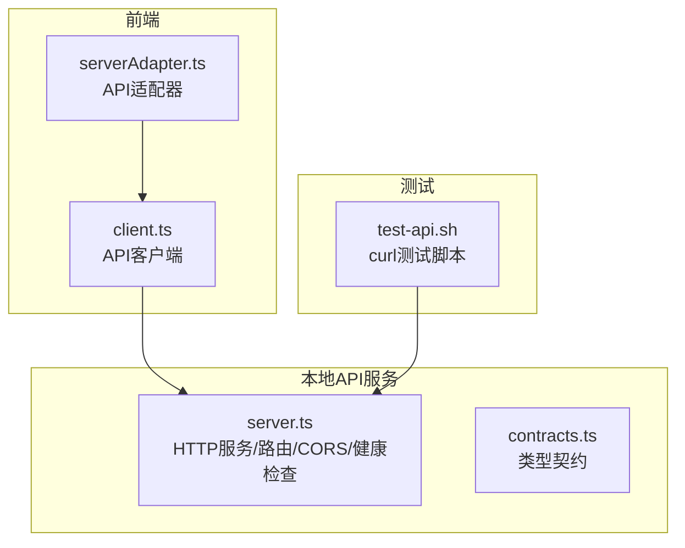
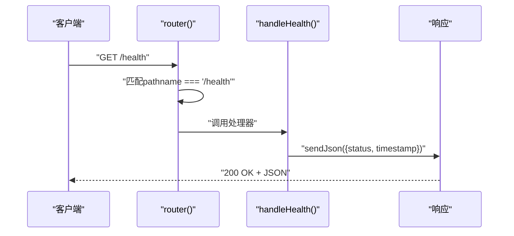
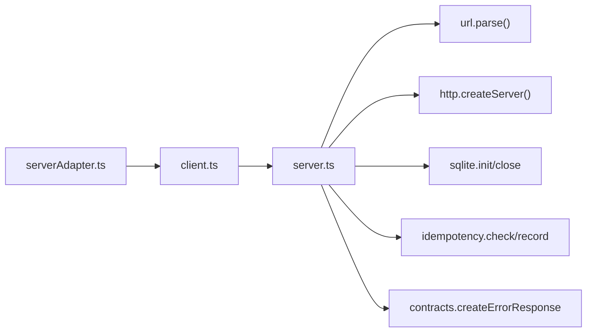

# 健康检查API

<cite>
**本文引用的文件**
- [server.ts](file://local-api/server.ts)
- [test-api.sh](file://local-api/test-api.sh)
- [contracts.ts](file://local-api/contracts.ts)
- [client.ts](file://src/services/api/client.ts)
- [serverAdapter.ts](file://src/services/api/serverAdapter.ts)
- [README.md](file://README.md)
</cite>

## 目录

1. [简介](#简介)
2. [项目结构](#项目结构)
3. [核心组件](#核心组件)
4. [架构总览](#架构总览)
5. [详细组件分析](#详细组件分析)
6. [依赖关系分析](#依赖关系分析)
7. [性能考量](#性能考量)
8. [故障排查指南](#故障排查指南)
9. [结论](#结论)

## 简介

本文件为本地API服务的健康检查端点提供完整的技术文档。GET /health用于检测本地API服务的运行状态，返回包含状态与时间戳的JSON响应。文档涵盖端点行为、响应结构、CORS跨域支持、在服务监控与容器编排中的应用，以及与前端API客户端的集成方式。

## 项目结构

本地API服务位于 local-api 目录，核心文件包括：

- server.ts：HTTP服务与路由、健康检查处理、CORS预检、统一错误响应
- test-api.sh：本地接口测试脚本，包含健康检查示例
- contracts.ts：类型契约定义（与健康检查无关，但用于理解整体API契约）
- 前端API客户端与适配器：client.ts、serverAdapter.ts，用于说明健康检查在前端的集成位置

图表来源

- [server.ts:338-386](file://local-api/server.ts#L338-L386)
- [client.ts:83-171](file://src/services/api/client.ts#L83-L171)
- [serverAdapter.ts:44-86](file://src/services/api/serverAdapter.ts#L44-L86)
- [test-api.sh:14-17](file://local-api/test-api.sh#L14-L17)

章节来源

- [server.ts:1-414](file://local-api/server.ts#L1-L414)
- [README.md:137-215](file://README.md#L137-L215)

## 核心组件

- 健康检查处理器：处理GET /health，返回包含status与timestamp字段的JSON对象
- 路由分发：识别pathname为'/health'的请求并调用健康检查处理器
- CORS预检：对OPTIONS请求返回允许跨域的响应头
- 统一响应：sendJson函数统一设置Content-Type与CORS相关响应头

章节来源

- [server.ts:331-334](file://local-api/server.ts#L331-L334)
- [server.ts:353-357](file://local-api/server.ts#L353-L357)
- [server.ts:342-351](file://local-api/server.ts#L342-L351)
- [server.ts:45-53](file://local-api/server.ts#L45-L53)

## 架构总览

健康检查端点在本地API服务中的位置如下：

- 服务启动后监听端口，接收HTTP请求
- 路由分发根据pathname判断是否为'/health'
- 若是，则调用handleHealth返回JSON响应
- 对于OPTIONS请求，返回CORS预检响应

图表来源

- [server.ts:338-357](file://local-api/server.ts#L338-L357)
- [server.ts:331-334](file://local-api/server.ts#L331-L334)
- [server.ts:45-53](file://local-api/server.ts#L45-L53)

## 详细组件分析

### 健康检查端点 GET /health

- 请求方法：GET
- 路径：/health
- 响应状态：200 OK
- 响应内容：JSON对象，包含status与timestamp两个字段
- CORS：响应头包含允许跨域的Access-Control-Allow-\*字段

响应结构说明

- status：字符串，表示服务健康状态。当前实现固定返回"ok"
- timestamp：字符串，ISO 8601格式的时间戳，表示响应生成时间

请求与响应示例

- 请求示例：GET http://localhost:3100/health
- 响应示例：{"status":"ok","timestamp":"2026-04-19T01:07:44.062Z"}

章节来源

- [server.ts:353-357](file://local-api/server.ts#L353-L357)
- [server.ts:331-334](file://local-api/server.ts#L331-L334)
- [server.ts:45-53](file://local-api/server.ts#L45-L53)
- [test-api.sh:14-17](file://local-api/test-api.sh#L14-L17)

### CORS与预检请求 OPTIONS

- 预检请求：当浏览器发起跨域请求时，会先发送OPTIONS请求进行预检
- 本地API对所有OPTIONS请求统一返回204 No Content，并设置以下响应头：
  - Access-Control-Allow-Origin: \*
  - Access-Control-Allow-Methods: GET, POST, PUT, DELETE, OPTIONS
  - Access-Control-Allow-Headers: Content-Type, X-Idempotency-Key

这使得前端在不同源环境下可以安全地访问本地API，包括健康检查端点。

章节来源

- [server.ts:342-351](file://local-api/server.ts#L342-L351)

### 与前端API客户端的集成

- 前端通过VITE_API_BASE_URL决定API基础地址，默认使用"/api"，在本地开发时可指向本地API服务
- 健康检查在前端的调用路径通常为：BASE_URL + "/health"
- 前端API客户端负责构建请求头（含Content-Type、X-Idempotency-Key等），并处理响应与错误

章节来源

- [client.ts:50](file://src/services/api/client.ts#L50)
- [client.ts:83-171](file://src/services/api/client.ts#L83-L171)
- [serverAdapter.ts:44-86](file://src/services/api/serverAdapter.ts#L44-L86)

### 错误处理与统一响应

- sendJson函数统一设置Content-Type与CORS相关响应头
- 对于非健康检查的其他路径，router会返回404错误
- 健康检查端点不涉及幂等键，因此无需考虑幂等处理

章节来源

- [server.ts:45-53](file://local-api/server.ts#L45-L53)
- [server.ts:385](file://local-api/server.ts#L385)

## 依赖关系分析

- server.ts依赖：
  - http模块：创建HTTP服务器与处理请求
  - url模块：解析URL与查询参数
  - sqlite存储：数据库初始化与关闭
  - idempotency存储：幂等键检查与记录（健康检查不使用）
  - contracts：统一错误响应类型（健康检查不使用）

- 前端依赖：
  - client.ts：负责构建请求、重试、错误降级
  - serverAdapter.ts：封装API路径与参数（健康检查路径为"/health"）

图表来源

- [server.ts:6-16](file://local-api/server.ts#L6-L16)
- [client.ts:83-171](file://src/services/api/client.ts#L83-L171)
- [serverAdapter.ts:44-86](file://src/services/api/serverAdapter.ts#L44-L86)

章节来源

- [server.ts:6-16](file://local-api/server.ts#L6-L16)
- [client.ts:83-171](file://src/services/api/client.ts#L83-L171)
- [serverAdapter.ts:44-86](file://src/services/api/serverAdapter.ts#L44-L86)

## 性能考量

- 健康检查为轻量级端点，不涉及数据库查询，响应延迟极低
- 由于无数据库访问，CPU与内存占用几乎为零
- 适合高频探测，如容器编排的liveness/readiness探针

## 故障排查指南

常见问题与排查步骤

- 无法访问健康检查端点
  - 检查本地API服务是否启动（默认端口3100）
  - 确认请求路径为"/health"
  - 检查CORS是否被正确配置（预检OPTIONS应返回204）

- 响应异常
  - 确认响应头包含正确的CORS字段
  - 检查是否有其他中间件拦截了OPTIONS请求

- 与前端联调
  - 确认VITE_API_BASE_URL指向本地API服务
  - 在Network面板观察请求与响应

章节来源

- [README.md:205-215](file://README.md#L205-L215)
- [server.ts:342-351](file://local-api/server.ts#L342-L351)

## 结论

GET /health端点提供了简单可靠的健康检查能力，适用于服务监控、负载均衡探活与容器编排的健康检查。其响应结构简洁明确，CORS支持完善，便于在多种部署环境中使用。结合本地API服务的幂等与错误处理机制，健康检查可作为系统可观测性的基础组件之一。
