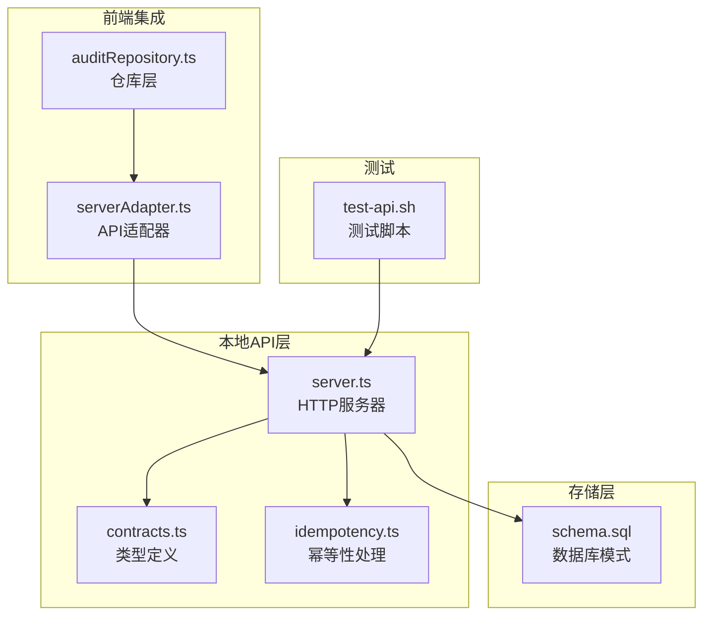
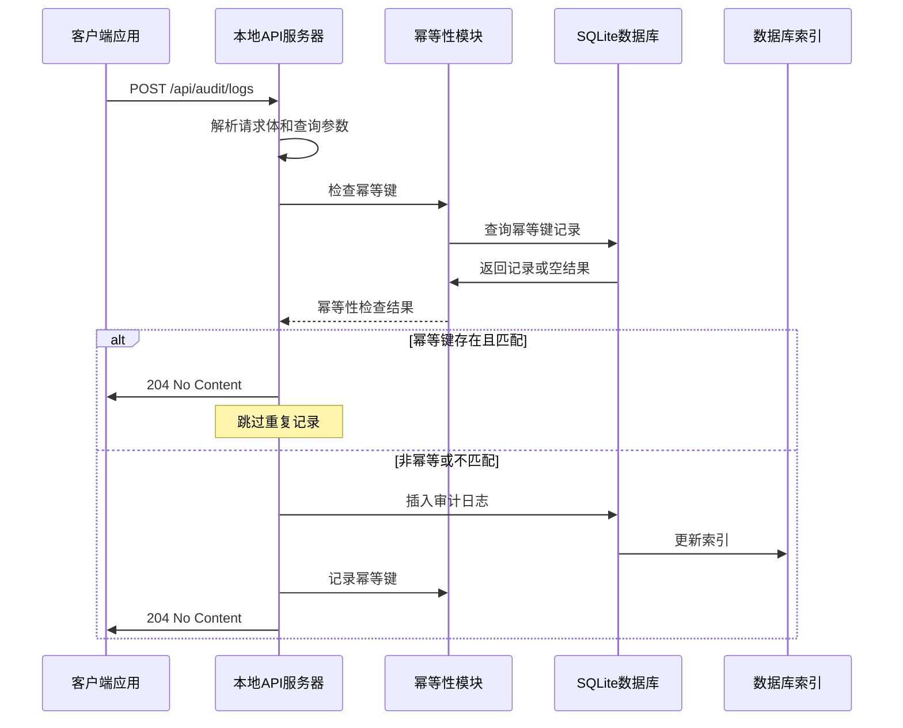
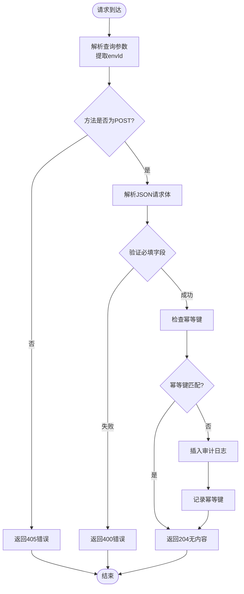
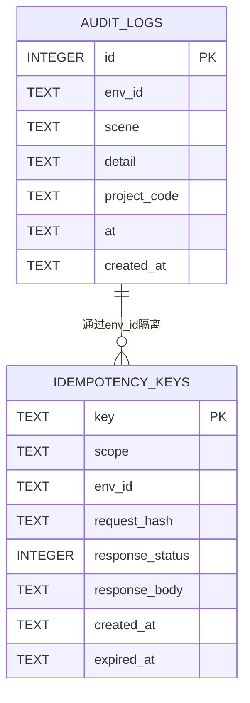
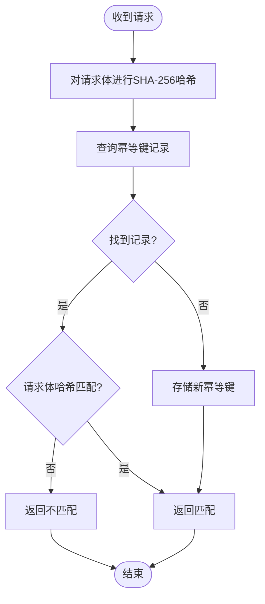
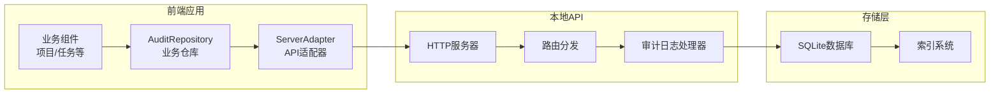

# 审计日志API

<cite>
**本文档引用的文件**
- [server.ts](file://local-api/server.ts)
- [contracts.ts](file://local-api/contracts.ts)
- [schema.sql](file://local-api/store/schema.sql)
- [idempotency.ts](file://local-api/store/idempotency.ts)
- [serverAdapter.ts](file://src/services/api/serverAdapter.ts)
- [auditRepository.ts](file://src/services/repositories/auditRepository.ts)
- [test-api.sh](file://local-api/test-api.sh)
</cite>

## 目录

1. [简介](#简介)
2. [项目结构](#项目结构)
3. [核心组件](#核心组件)
4. [架构概览](#架构概览)
5. [详细组件分析](#详细组件分析)
6. [依赖关系分析](#依赖关系分析)
7. [性能考虑](#性能考虑)
8. [故障排除指南](#故障排除指南)
9. [结论](#结论)

## 简介

审计日志API是本地开发服务器的核心功能之一，用于记录系统中的重要操作和变更事件。该API提供了幂等性保障机制，确保重复请求不会产生重复的日志记录，同时支持按环境隔离的审计日志存储。

该API通过POST /api/audit/logs端点接收审计日志事件，支持多种场景类型的日志记录，并提供完整的错误处理和幂等性控制机制。

## 项目结构

审计日志功能分布在以下关键文件中：

**图表来源**

- [server.ts:1-414](file://local-api/server.ts#L1-L414)
- [contracts.ts:1-89](file://local-api/contracts.ts#L1-L89)
- [schema.sql:1-72](file://local-api/store/schema.sql#L1-L72)

**章节来源**

- [server.ts:1-414](file://local-api/server.ts#L1-L414)
- [contracts.ts:1-89](file://local-api/contracts.ts#L1-L89)
- [schema.sql:1-72](file://local-api/store/schema.sql#L1-L72)

## 核心组件

### 审计日志输入结构

AuditLogInput结构定义了审计日志的基本字段：

| 字段名      | 类型   | 必填 | 描述                                   | 示例值                                 |
| ----------- | ------ | ---- | -------------------------------------- | -------------------------------------- |
| scene       | string | 是   | 场景标识符，描述日志发生的业务场景     | "project_status_change"                |
| detail      | string | 是   | 日志详情，描述具体的操作内容           | "项目状态从【待确认】变更为【待拆解】" |
| projectCode | string | 否   | 项目代码，关联到具体的项目实体         | "P001"                                 |
| at          | string | 是   | ISO 8601格式的时间戳，表示事件发生时间 | "2026-04-14T08:30:00Z"                 |

### 环境隔离机制

系统通过envId参数实现多环境隔离：

- **envId参数**：通过URL查询参数传递，如`?envId=test-env`
- **默认环境**：未指定时使用"default"环境
- **环境独立性**：每个环境的审计日志相互隔离，互不影响

### 幂等性保障

系统实现了完整的幂等性控制机制：

- **X-Idempotency-Key头部**：客户端自定义幂等键
- **请求指纹**：对请求体进行SHA-256哈希计算
- **过期时间**：幂等键有效期7天
- **重复检测**：相同键和环境下的重复请求会被识别并跳过

**章节来源**

- [contracts.ts:48-58](file://local-api/contracts.ts#L48-L58)
- [server.ts:288-329](file://local-api/server.ts#L288-L329)
- [idempotency.ts:23-58](file://local-api/store/idempotency.ts#L23-L58)

## 架构概览

审计日志API采用简洁的三层架构设计：

**图表来源**

- [server.ts:288-329](file://local-api/server.ts#L288-L329)
- [idempotency.ts:23-86](file://local-api/store/idempotency.ts#L23-L86)
- [schema.sql:42-51](file://local-api/store/schema.sql#L42-L51)

## 详细组件分析

### HTTP服务器实现

本地API服务器实现了RESTful接口，专门处理审计日志请求：

**图表来源**

- [server.ts:288-329](file://local-api/server.ts#L288-L329)

### 数据存储结构

审计日志采用SQLite数据库存储，具有以下特点：

**图表来源**

- [schema.sql:42-71](file://local-api/store/schema.sql#L42-L71)

### 幂等性算法

幂等性检查采用以下算法：

**图表来源**

- [idempotency.ts:15-86](file://local-api/store/idempotency.ts#L15-L86)

**章节来源**

- [server.ts:288-329](file://local-api/server.ts#L288-L329)
- [schema.sql:42-71](file://local-api/store/schema.sql#L42-L71)
- [idempotency.ts:15-86](file://local-api/store/idempotency.ts#L15-L86)

## 依赖关系分析

### 前端集成架构

**图表来源**

- [auditRepository.ts:6-25](file://src/services/repositories/auditRepository.ts#L6-L25)
- [serverAdapter.ts:76-85](file://src/services/api/serverAdapter.ts#L76-L85)
- [server.ts:376-378](file://local-api/server.ts#L376-L378)

### 错误处理机制

系统实现了统一的错误处理机制：

| 错误类型   | HTTP状态码 | 错误代码           | 描述                         |
| ---------- | ---------- | ------------------ | ---------------------------- |
| 无效请求   | 400        | INVALID_REQUEST    | JSON解析失败或请求体验证失败 |
| 方法不允许 | 405        | METHOD_NOT_ALLOWED | 非POST方法访问审计日志端点   |
| 资源未找到 | 404        | NOT_FOUND          | 路径不存在                   |
| 网络错误   | 500        | NETWORK_ERROR      | 数据库连接或其他系统错误     |

**章节来源**

- [server.ts:64-66](file://local-api/server.ts#L64-L66)
- [server.ts:323-328](file://local-api/server.ts#L323-L328)

## 性能考虑

### 数据库优化

- **索引策略**：为env_id、project_code、scene字段建立索引，支持高效的查询过滤
- **事务处理**：使用SQLite的ACID特性保证数据一致性
- **内存管理**：连接池管理和自动清理机制

### 幂等性优化

- **哈希计算**：使用SHA-256算法确保请求指纹的唯一性
- **过期清理**：自动清理过期的幂等键记录
- **并发安全**：通过数据库约束避免并发冲突

## 故障排除指南

### 常见问题及解决方案

| 问题类型   | 症状                   | 可能原因                  | 解决方案          |
| ---------- | ---------------------- | ------------------------- | ----------------- |
| 重复日志   | 同一条日志被记录多次   | 缺少X-Idempotency-Key头部 | 添加唯一的幂等键  |
| 环境混淆   | 日志出现在错误的环境中 | envId参数错误             | 检查envId查询参数 |
| 时间戳错误 | 事件时间显示异常       | at字段格式不正确          | 使用ISO 8601格式  |
| 权限问题   | 405错误                | 使用了非POST方法          | 确保使用POST方法  |

### 调试技巧

1. **启用详细日志**：查看服务器控制台输出的调试信息
2. **检查幂等键**：验证幂等键的唯一性和有效性
3. **验证请求格式**：确保JSON格式正确且字段完整
4. **测试环境隔离**：使用不同的envId测试多环境场景

**章节来源**

- [server.ts:294-305](file://local-api/server.ts#L294-L305)
- [idempotency.ts:48-50](file://local-api/store/idempotency.ts#L48-L50)

## 结论

审计日志API提供了完整的企业级审计功能，具有以下优势：

1. **完整的幂等性保障**：通过X-Idempotency-Key头部实现可靠的重复请求防护
2. **灵活的环境隔离**：支持多环境独立的审计日志存储
3. **高性能的存储设计**：合理的数据库索引和查询优化
4. **统一的错误处理**：标准化的错误响应格式
5. **完善的前端集成**：与业务组件无缝对接

该API设计简洁高效，既满足了开发测试阶段的需求，也为生产环境的审计日志收集奠定了坚实基础。
