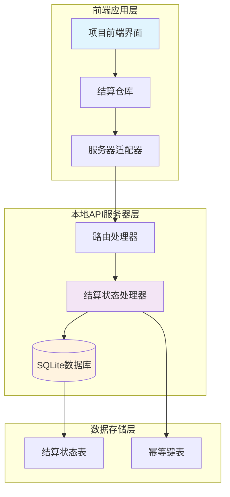
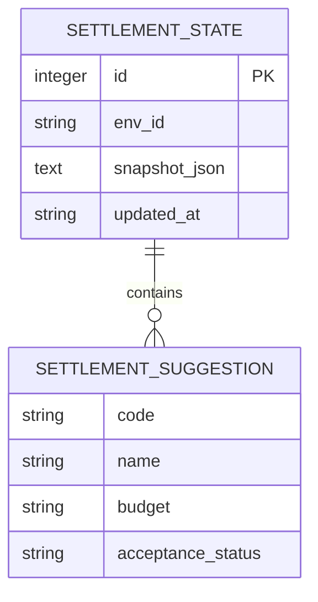
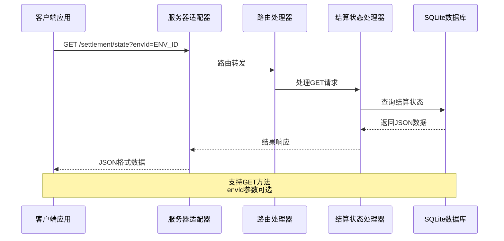
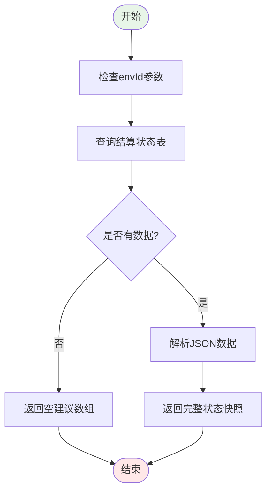
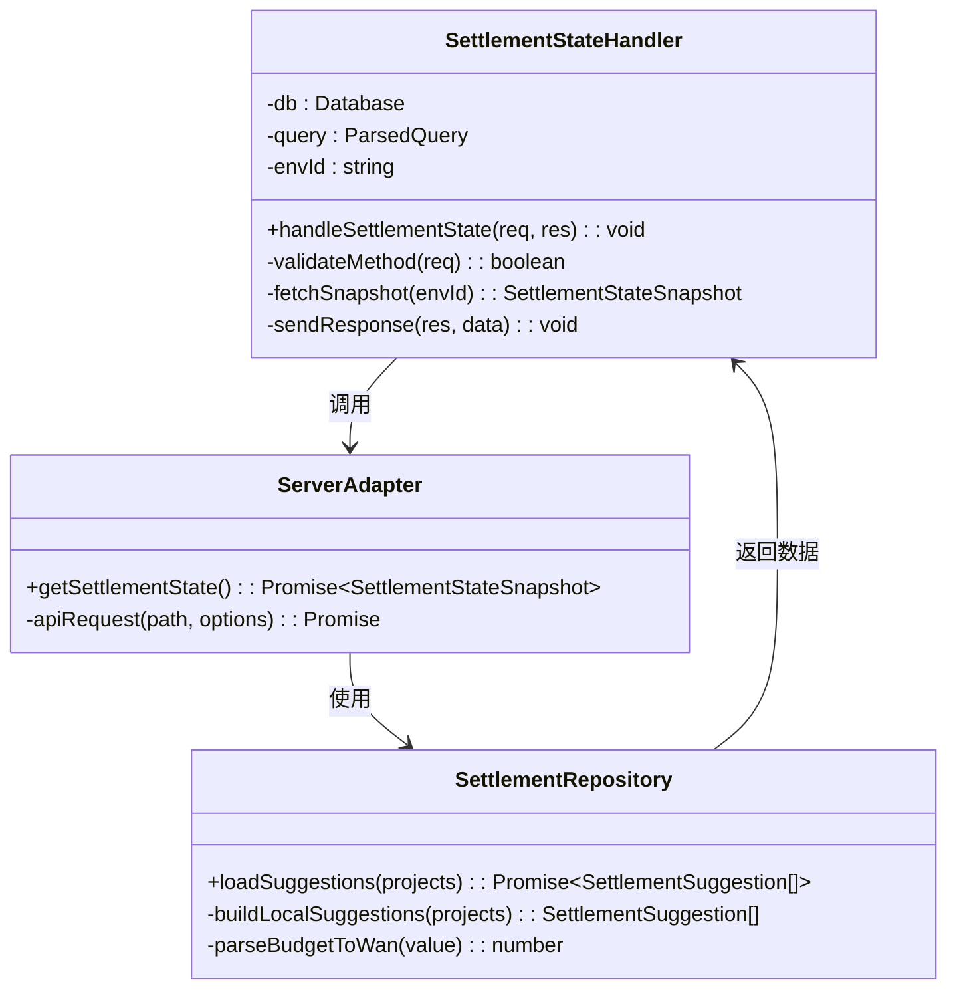
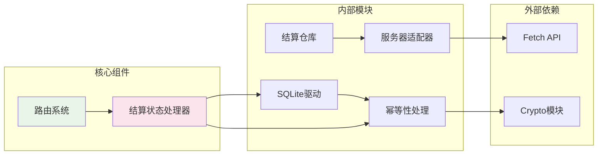

# 结算状态API

<cite>
**本文档引用的文件**
- [local-api/server.ts](file://local-api/server.ts)
- [src/services/api/serverAdapter.ts](file://src/services/api/serverAdapter.ts)
- [src/services/repositories/settlementRepository.ts](file://src/services/repositories/settlementRepository.ts)
- [local-api/store/schema.sql](file://local-api/store/schema.sql)
- [local-api/store/idempotency.ts](file://local-api/store/idempotency.ts)
- [local-api/test-api.sh](file://local-api/test-api.sh)
- [src/data/projects.ts](file://src/data/projects.ts)
</cite>

## 目录

1. [简介](#简介)
2. [项目结构](#项目结构)
3. [核心组件](#核心组件)
4. [架构概览](#架构概览)
5. [详细组件分析](#详细组件分析)
6. [依赖关系分析](#依赖关系分析)
7. [性能考虑](#性能考虑)
8. [故障排除指南](#故障排除指南)
9. [结论](#结论)

## 简介

结算状态API是项目管理系统中的一个关键状态管理接口，用于获取指定环境ID的结算状态快照。该API专门服务于项目结算流程，提供项目结算建议的实时数据，帮助用户了解项目的结算状态和相关建议。

该API具有以下特点：

- 仅支持GET方法进行数据读取
- 使用envId查询参数进行环境隔离
- 返回标准化的结算状态快照数据结构
- 集成幂等性处理机制
- 与项目验收状态紧密关联

## 项目结构

结算状态API在整个系统架构中位于本地API服务器层，负责处理前端应用的状态请求。其核心组件包括：



**图表来源**

- [local-api/server.ts:261-280](file://local-api/server.ts#L261-L280)
- [src/services/api/serverAdapter.ts:75](file://src/services/api/serverAdapter.ts#L75)
- [src/services/repositories/settlementRepository.ts:20-31](file://src/services/repositories/settlementRepository.ts#L20-L31)

**章节来源**

- [local-api/server.ts:261-280](file://local-api/server.ts#L261-L280)
- [src/services/api/serverAdapter.ts:75](file://src/services/api/serverAdapter.ts#L75)

## 核心组件

### API端点定义

结算状态API提供以下核心功能：

**端点信息**

- **URL**: `/api/settlement/state`
- **方法**: `GET`
- **环境参数**: `envId` (可选，默认值: `'default'`)
- **响应格式**: JSON对象，包含结算建议数组

**请求参数**

- `envId`: 环境标识符，用于区分不同的数据环境
- 默认值: `'default'` - 当未提供envId时使用默认环境

**响应数据结构**

```json
{
  "suggestions": [
    {
      "code": "string",
      "name": "string",
      "budget": "string",
      "acceptanceStatus": "string"
    }
  ]
}
```

### 数据模型定义

结算状态API的核心数据模型包括：



**图表来源**

- [local-api/store/schema.sql:33-40](file://local-api/store/schema.sql#L33-L40)
- [src/services/api/serverAdapter.ts:23-32](file://src/services/api/serverAdapter.ts#L23-L32)

**章节来源**

- [src/services/api/serverAdapter.ts:23-32](file://src/services/api/serverAdapter.ts#L23-L32)
- [local-api/store/schema.sql:33-40](file://local-api/store/schema.sql#L33-L40)

## 架构概览

结算状态API采用分层架构设计，确保了系统的可维护性和扩展性：



**图表来源**

- [src/services/api/serverAdapter.ts:75](file://src/services/api/serverAdapter.ts#L75)
- [local-api/server.ts:261-280](file://local-api/server.ts#L261-L280)

### 状态流转机制

结算状态API与项目验收状态存在密切的数据关联：



**图表来源**

- [local-api/server.ts:267-279](file://local-api/server.ts#L267-L279)

**章节来源**

- [local-api/server.ts:267-279](file://local-api/server.ts#L267-L279)

## 详细组件分析

### 结算状态处理器

结算状态处理器是API的核心实现组件，负责处理客户端的请求并返回相应的数据：



**图表来源**

- [local-api/server.ts:261-280](file://local-api/server.ts#L261-L280)
- [src/services/repositories/settlementRepository.ts:20-31](file://src/services/repositories/settlementRepository.ts#L20-L31)
- [src/services/api/serverAdapter.ts:75](file://src/services/api/serverAdapter.ts#L75)

### 数据处理流程

结算状态API的数据处理遵循以下流程：

1. **请求接收**: 处理器接收GET请求并解析查询参数
2. **环境识别**: 提取envId参数，若缺失则使用默认值
3. **数据查询**: 从SQLite数据库中查询对应的结算状态快照
4. **数据转换**: 将存储的JSON字符串解析为JavaScript对象
5. **响应构建**: 返回标准化的JSON响应给客户端

**章节来源**

- [local-api/server.ts:261-280](file://local-api/server.ts#L261-L280)

### 建议数据结构详解

结算建议数组包含多个项目级别的结算建议信息：

| 字段名           | 类型   | 描述         | 示例                 |
| ---------------- | ------ | ------------ | -------------------- |
| code             | string | 项目编码     | "P001"               |
| name             | string | 项目名称     | "深圳万象城开业项目" |
| budget           | string | 结算建议金额 | "1,200万"            |
| acceptanceStatus | string | 验收状态     | "待初验"             |

每个建议项都代表一个需要进行结算确认的项目，其中预算字段通常基于项目原始预算的一定比例计算得出。

**章节来源**

- [src/services/api/serverAdapter.ts:23-28](file://src/services/api/serverAdapter.ts#L23-L28)

## 依赖关系分析

结算状态API的依赖关系体现了清晰的分层架构：



**图表来源**

- [src/services/api/serverAdapter.ts:5](file://src/services/api/serverAdapter.ts#L5)
- [src/services/repositories/settlementRepository.ts:1](file://src/services/repositories/settlementRepository.ts#L1)
- [local-api/store/idempotency.ts:6](file://local-api/store/idempotency.ts#L6)

### 组件耦合度分析

结算状态API展现了良好的内聚性和低耦合性：

- **处理器与适配器**: 通过接口分离，便于测试和替换
- **数据访问层**: 独立于业务逻辑，支持多种存储后端
- **幂等性处理**: 作为横切关注点独立实现
- **错误处理**: 统一的错误响应格式

**章节来源**

- [src/services/api/serverAdapter.ts:44-86](file://src/services/api/serverAdapter.ts#L44-L86)
- [local-api/store/idempotency.ts:23-86](file://local-api/store/idempotency.ts#L23-L86)

## 性能考虑

结算状态API在设计时充分考虑了性能优化：

### 查询优化策略

- **索引利用**: 使用UNIQUE约束确保env_id的快速查找
- **缓存友好**: 支持客户端缓存机制
- **响应优化**: 只传输必要的状态数据

### 并发处理

- **幂等性保证**: 防止重复请求造成的数据不一致
- **事务支持**: 数据库操作的原子性保障
- **连接池管理**: 高效的数据库连接复用

### 内存管理

- **流式处理**: 大数据量时的内存优化
- **及时释放**: 响应后的资源清理
- **垃圾回收**: 自动内存管理

## 故障排除指南

### 常见问题及解决方案

**问题1: 环境参数缺失**

- **症状**: 返回默认环境数据
- **解决**: 明确提供envId参数
- **预防**: 在生产环境中始终指定envId

**问题2: 数据库连接异常**

- **症状**: HTTP 500错误
- **解决**: 检查数据库服务状态
- **预防**: 实施健康检查机制

**问题3: 幂等性冲突**

- **症状**: 请求被拒绝或重复
- **解决**: 检查X-Idempotency-Key头
- **预防**: 实现正确的幂等性处理

**章节来源**

- [local-api/server.ts:277-279](file://local-api/server.ts#L277-L279)
- [local-api/store/idempotency.ts:46-55](file://local-api/store/idempotency.ts#L46-L55)

### 调试工具使用

推荐使用以下命令进行API调试：

```bash
# 获取结算状态
curl -s "http://localhost:3000/api/settlement/state?envId=ENV_ID" | jq .

# 测试幂等性
curl -s -H "X-Idempotency-Key: test-key-001" \
  "http://localhost:3000/api/settlement/state?envId=ENV_ID" | jq .
```

**章节来源**

- [local-api/test-api.sh:121-123](file://local-api/test-api.sh#L121-L123)

## 结论

结算状态API作为项目管理系统的重要组成部分，提供了高效、可靠的结算状态查询能力。其设计特点包括：

### 核心优势

- **简洁性**: 仅支持GET方法，API设计简洁明了
- **可靠性**: 集成幂等性处理，确保数据一致性
- **可扩展性**: 清晰的分层架构支持功能扩展
- **易用性**: 标准化的数据格式便于集成

### 应用场景

- 项目结算流程监控
- 财务审批决策支持
- 项目状态可视化展示
- 报表数据源

### 发展建议

- 增加数据缓存机制
- 扩展过滤和排序功能
- 添加数据版本控制
- 实现更细粒度的权限控制

该API为整个项目管理系统的结算流程提供了坚实的技术基础，通过标准化的数据接口促进了系统的整体效率和用户体验。
