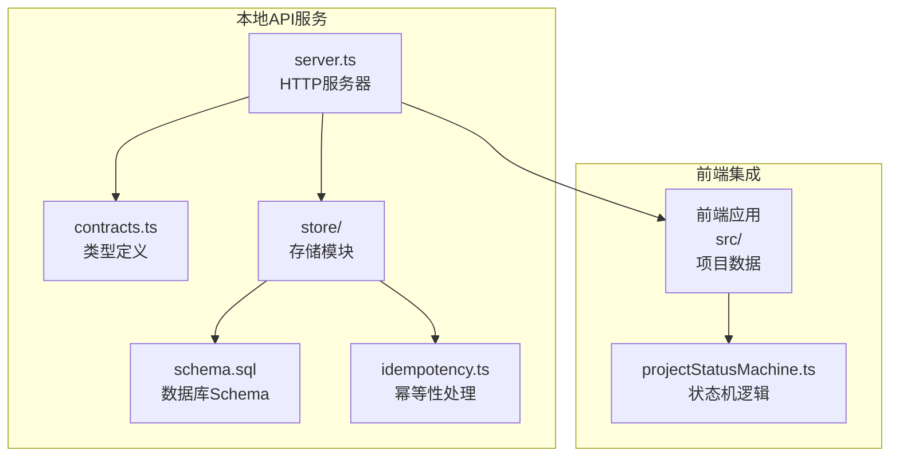
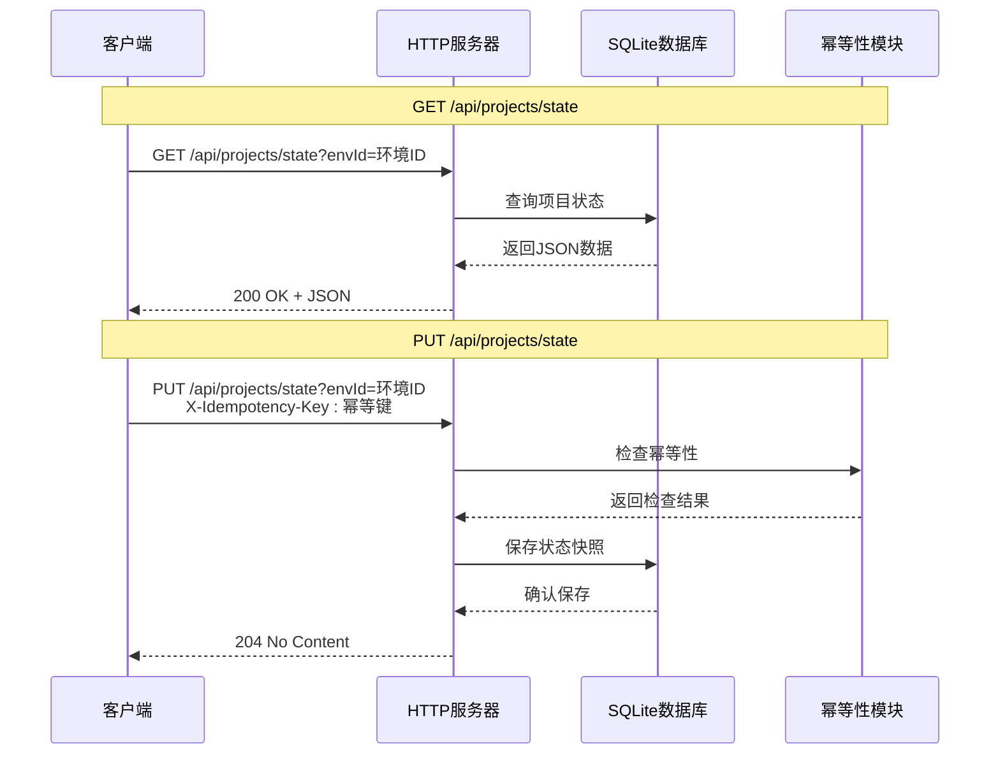
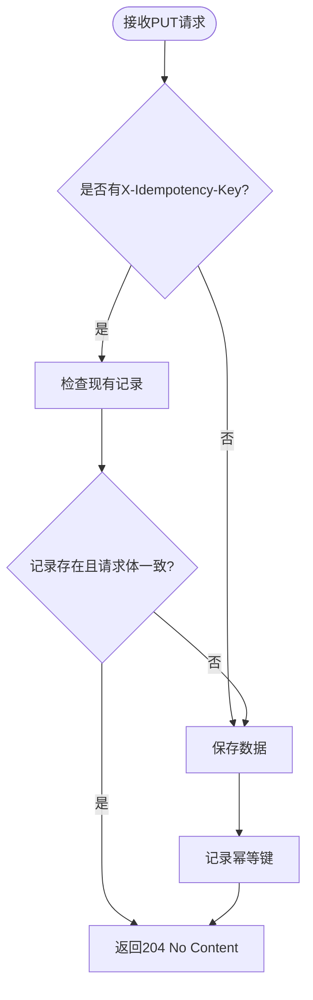
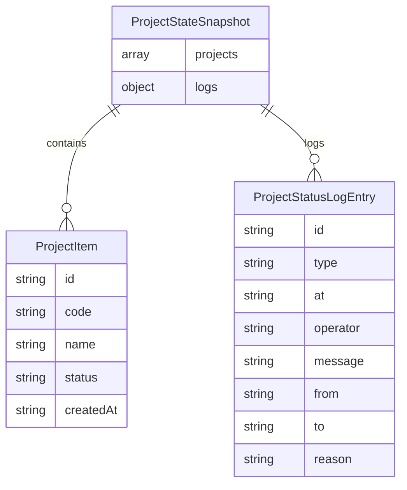
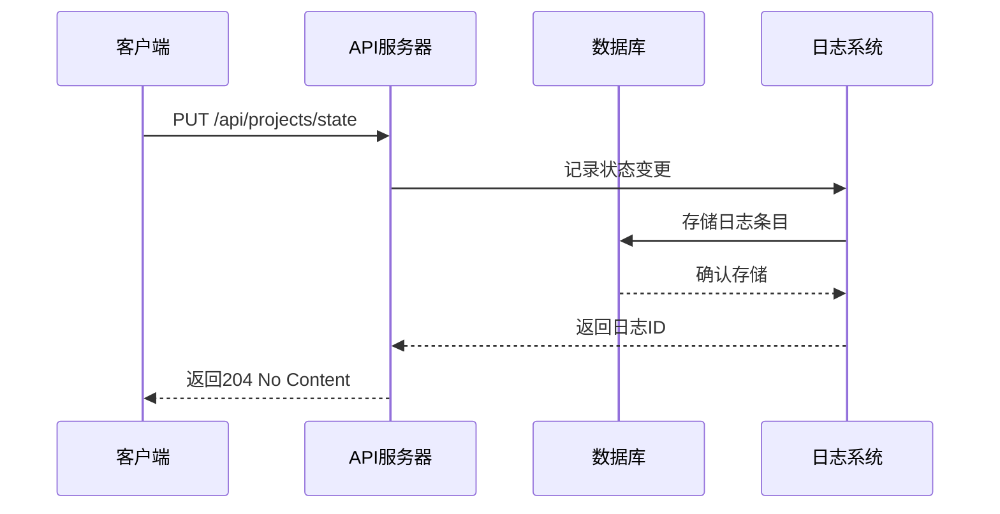
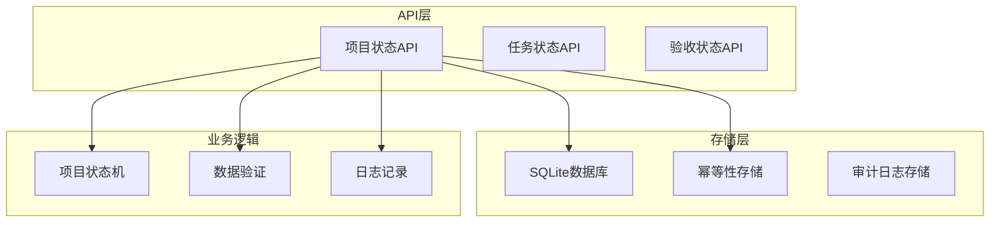

# 项目状态API

<cite>
**本文引用的文件**
- [server.ts](file://local-api/server.ts)
- [contracts.ts](file://local-api/contracts.ts)
- [schema.sql](file://local-api/store/schema.sql)
- [idempotency.ts](file://local-api/store/idempotency.ts)
- [test-api.sh](file://local-api/test-api.sh)
- [projectStatusMachine.ts](file://src/domain/projectStatusMachine.ts)
- [projects.ts](file://src/data/projects.ts)
</cite>

## 目录

1. [简介](#简介)
2. [项目结构](#项目结构)
3. [核心组件](#核心组件)
4. [架构概览](#架构概览)
5. [详细组件分析](#详细组件分析)
6. [依赖关系分析](#依赖关系分析)
7. [性能考虑](#性能考虑)
8. [故障排除指南](#故障排除指南)
9. [结论](#结论)

## 简介

本文档详细描述了项目状态API的两个核心端点：GET /api/projects/state 和 PUT /api/projects/state。该API用于管理项目的状态快照数据，支持按环境ID隔离不同的项目状态存储，并通过幂等性机制确保分布式系统的可靠性。

项目状态API基于本地HTTP服务器实现，采用SQLite作为持久化存储，支持CORS跨域访问。API设计遵循RESTful原则，提供简洁的JSON数据交换格式。

## 项目结构

项目状态API位于local-api目录下，采用模块化设计：



**图表来源**

- [server.ts:1-50](file://local-api/server.ts#L1-L50)
- [contracts.ts:1-89](file://local-api/contracts.ts#L1-L89)
- [schema.sql:1-72](file://local-api/store/schema.sql#L1-L72)

**章节来源**

- [server.ts:1-414](file://local-api/server.ts#L1-L414)
- [contracts.ts:1-89](file://local-api/contracts.ts#L1-L89)
- [schema.sql:1-72](file://local-api/store/schema.sql#L1-L72)

## 核心组件

项目状态API的核心组件包括：

### 1. HTTP服务器

- 基于Node.js原生HTTP模块构建
- 支持CORS跨域访问
- 提供统一的错误响应格式

### 2. 数据模型

- `ProjectStateSnapshot`: 项目状态快照的核心数据结构
- 支持项目列表和状态变更日志
- 类型安全的JSON序列化

### 3. 存储层

- SQLite数据库持久化
- 环境隔离的项目状态存储
- 自动清理过期数据

### 4. 幂等性机制

- 基于请求哈希的重复请求检测
- 可配置的过期时间
- 支持幂等重放

**章节来源**

- [server.ts:70-129](file://local-api/server.ts#L70-L129)
- [contracts.ts:13-16](file://local-api/contracts.ts#L13-L16)
- [idempotency.ts:1-99](file://local-api/store/idempotency.ts#L1-L99)

## 架构概览

项目状态API采用分层架构设计：



**图表来源**

- [server.ts:70-129](file://local-api/server.ts#L70-L129)
- [idempotency.ts:23-58](file://local-api/store/idempotency.ts#L23-L58)

## 详细组件分析

### GET /api/projects/state 端点

#### 功能概述

GET端点用于获取指定环境ID的项目状态快照。如果指定环境中没有状态数据，则返回空的状态结构。

#### 查询参数

- **envId** (可选): 环境标识符，默认值为 'default'

#### 请求示例

```bash
# 获取默认环境的项目状态
curl -s "http://localhost:3100/api/projects/state"

# 获取指定环境的项目状态
curl -s "http://localhost:3100/api/projects/state?envId=test-env"
```

#### 响应结构

成功时返回JSON对象，包含以下字段：

- `projects`: 项目数组，每个项目包含完整信息
- `logs`: 状态变更日志映射

#### 默认行为

当指定环境不存在或无数据时，API返回：

```json
{
  "projects": [],
  "logs": {}
}
```

**章节来源**

- [server.ts:76-85](file://local-api/server.ts#L76-L85)
- [test-api.sh:21-23](file://local-api/test-api.sh#L21-L23)

### PUT /api/projects/state 端点

#### 功能概述

PUT端点用于更新指定环境ID的项目状态快照。支持完整的项目状态数据替换。

#### 查询参数

- **envId** (可选): 环境标识符，默认值为 'default'

#### 请求头

- **Content-Type**: application/json
- **X-Idempotency-Key**: 幂等性键（可选）

#### 请求体结构

项目状态快照包含以下字段：

| 字段名   | 类型                                    | 必填 | 描述                       |
| -------- | --------------------------------------- | ---- | -------------------------- |
| projects | ProjectItem[]                           | 是   | 项目数组，包含所有项目信息 |
| logs     | Record<string, ProjectStatusLogEntry[]> | 否   | 状态变更日志映射           |

##### ProjectItem 字段

- `id`: 项目唯一标识符
- `code`: 项目编码
- `name`: 项目名称
- `status`: 当前状态
- `createdAt`: 创建时间

##### ProjectStatusLogEntry 字段

- `id`: 日志唯一标识符
- `type`: 日志类型（transition/hook）
- `at`: 时间戳
- `operator`: 操作者
- `message`: 日志消息

#### 幂等性机制

API支持基于X-Idempotency-Key的幂等性保证：



**图表来源**

- [server.ts:86-129](file://local-api/server.ts#L86-L129)
- [idempotency.ts:23-58](file://local-api/store/idempotency.ts#L23-L58)

#### 响应状态码

- **204 No Content**: 成功更新状态
- **400 Bad Request**: 请求体无效或格式错误
- **405 Method Not Allowed**: 不支持的HTTP方法
- **404 Not Found**: 资源未找到

#### 错误处理

API提供统一的错误响应格式：

```json
{
  "message": "错误描述",
  "code": "错误代码",
  "status": 400,
  "timestamp": "ISO 8601时间戳"
}
```

**章节来源**

- [server.ts:123-128](file://local-api/server.ts#L123-L128)
- [contracts.ts:74-89](file://local-api/contracts.ts#L74-L89)

### 数据模型详解

#### 项目状态快照结构



**图表来源**

- [contracts.ts:13-16](file://local-api/contracts.ts#L13-L16)
- [projectStatusMachine.ts:36-45](file://src/domain/projectStatusMachine.ts#L36-L45)

#### 状态变更日志机制

项目状态API支持详细的状态变更日志记录：



**图表来源**

- [server.ts:107-121](file://local-api/server.ts#L107-L121)
- [projectStatusMachine.ts:36-45](file://src/domain/projectStatusMachine.ts#L36-L45)

**章节来源**

- [contracts.ts:13-16](file://local-api/contracts.ts#L13-L16)
- [projectStatusMachine.ts:36-45](file://src/domain/projectStatusMachine.ts#L36-L45)

## 依赖关系分析

### 组件依赖图



**图表来源**

- [server.ts:6-16](file://local-api/server.ts#L6-L16)
- [schema.sql:4-11](file://local-api/store/schema.sql#L4-L11)

### 外部依赖

- Node.js HTTP模块
- SQLite数据库引擎
- Crypto哈希算法
- URL解析工具

**章节来源**

- [server.ts:6-16](file://local-api/server.ts#L6-L16)
- [schema.sql:1-72](file://local-api/store/schema.sql#L1-L72)

## 性能考虑

项目状态API在设计时考虑了以下性能因素：

### 1. 数据库优化

- 使用UNIQUE约束确保数据完整性
- 建立适当的索引提高查询性能
- 支持ON CONFLICT处理避免重复插入

### 2. 幂等性优化

- 基于SHA-256的请求哈希计算
- 可配置的过期时间（7天）
- 并发安全的幂等键存储

### 3. 内存管理

- 流式JSON解析避免内存峰值
- 及时的数据库连接管理
- 进程信号处理确保优雅关闭

## 故障排除指南

### 常见问题及解决方案

#### 1. CORS跨域问题

**症状**: 浏览器控制台显示跨域错误
**解决方案**: 确保客户端正确设置CORS头

#### 2. 幂等性冲突

**症状**: 重复请求返回204但无数据更新
**解决方案**: 检查X-Idempotency-Key是否正确传递

#### 3. 数据库连接问题

**症状**: API响应超时或数据库错误
**解决方案**: 检查SQLite文件权限和磁盘空间

#### 4. JSON解析错误

**症状**: 返回400 Bad Request
**解决方案**: 验证请求体格式和必需字段

**章节来源**

- [server.ts:45-66](file://local-api/server.ts#L45-L66)
- [idempotency.ts:75-85](file://local-api/store/idempotency.ts#L75-L85)

## 结论

项目状态API提供了完整的项目状态管理能力，具有以下特点：

1. **简洁易用**: RESTful设计，易于集成
2. **可靠性强**: 幂等性机制确保分布式系统稳定性
3. **扩展性好**: 模块化设计支持功能扩展
4. **监控完善**: 详细的状态变更日志便于追踪

该API为项目管理系统提供了坚实的数据基础，支持多环境隔离和状态机驱动的业务逻辑。通过合理的错误处理和性能优化，能够满足生产环境的高可用性要求。
