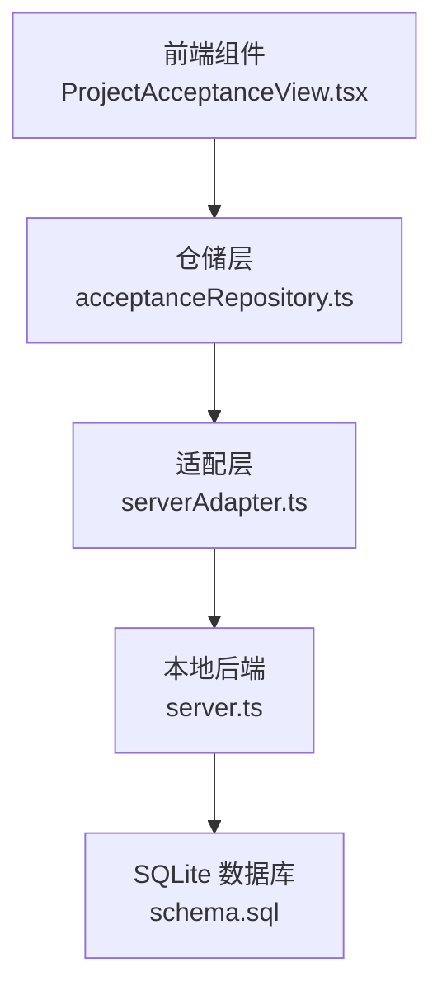
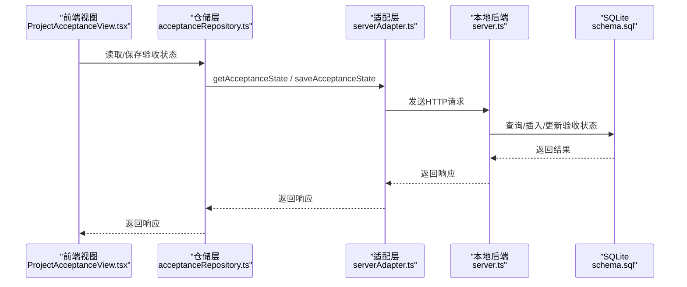
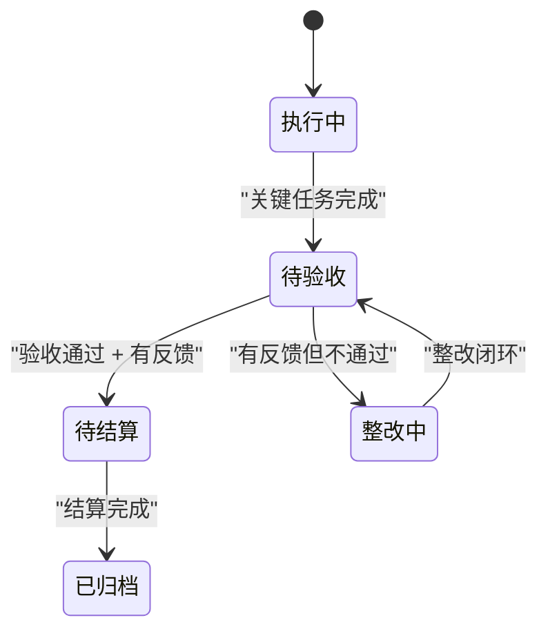
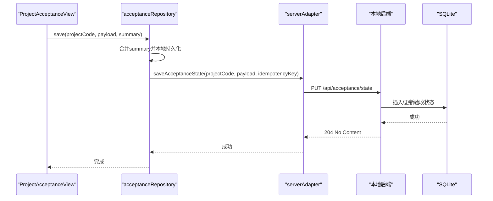
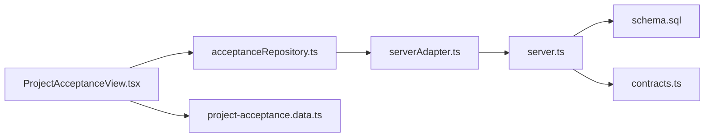

# 验收状态API

<cite>
**本文档引用的文件**
- [serverAdapter.ts](file://src/services/api/serverAdapter.ts)
- [acceptanceRepository.ts](file://src/services/repositories/acceptanceRepository.ts)
- [ProjectAcceptanceView.tsx](file://src/components/project/ProjectAcceptanceView.tsx)
- [project-acceptance.data.ts](file://src/components/project/project-acceptance.data.ts)
- [server.ts](file://local-api/server.ts)
- [contracts.ts](file://local-api/contracts.ts)
- [schema.sql](file://local-api/store/schema.sql)
- [test-api.sh](file://local-api/test-api.sh)
- [README.md](file://local-api/README.md)
- [local-backend-feasibility.md](file://docs/04-operations/phase3/local-backend-feasibility.md)
- [projectStatusMachine.ts](file://src/domain/projectStatusMachine.ts)
</cite>

## 目录

1. [简介](#简介)
2. [项目结构](#项目结构)
3. [核心组件](#核心组件)
4. [架构总览](#架构总览)
5. [详细组件分析](#详细组件分析)
6. [依赖关系分析](#依赖关系分析)
7. [性能考虑](#性能考虑)
8. [故障排除指南](#故障排除指南)
9. [结论](#结论)
10. [附录](#附录)

## 简介

本文件为验收状态API的详细技术文档，覆盖以下内容：

- GET /api/acceptance/state：获取指定环境ID与项目代码对应的验收状态快照
- PUT /api/acceptance/state：更新验收状态快照并支持幂等性
- 验收状态JSON结构、请求体验证规则与响应状态码
- 验收状态与项目生命周期的关系及状态转换逻辑
- 完整的请求/响应示例与最佳实践

## 项目结构

验收状态API涉及三层：

- 前端适配层：负责构造请求、设置幂等键、调用后端
- 仓储层：封装本地缓存与远程同步逻辑
- 本地后端：提供HTTP接口、幂等性保障与数据持久化

图表来源

- [ProjectAcceptanceView.tsx:248-257](file://src/components/project/ProjectAcceptanceView.tsx#L248-L257)
- [acceptanceRepository.ts:32-55](file://src/services/repositories/acceptanceRepository.ts#L32-L55)
- [serverAdapter.ts:64-74](file://src/services/api/serverAdapter.ts#L64-L74)
- [server.ts:199-244](file://local-api/server.ts#L199-L244)
- [schema.sql:23-31](file://local-api/store/schema.sql#L23-L31)

章节来源

- [serverAdapter.ts:64-74](file://src/services/api/serverAdapter.ts#L64-L74)
- [acceptanceRepository.ts:32-55](file://src/services/repositories/acceptanceRepository.ts#L32-L55)
- [server.ts:199-244](file://local-api/server.ts#L199-L244)
- [schema.sql:23-31](file://local-api/store/schema.sql#L23-L31)

## 核心组件

- 接口定义与调用
  - GET /api/acceptance/state?projectCode={code}&envId={envId}
  - PUT /api/acceptance/state?projectCode={code}&envId={envId}
- 请求头
  - PUT请求需携带X-Idempotency-Key以启用幂等性
- 请求体结构
  - nodes：验收节点数组
  - milestones：里程碑数组
  - summary：可选的里程碑同步统计
- 响应
  - GET：返回当前验收状态快照；若无历史数据则返回空数组
  - PUT：成功返回204 No Content；幂等重放返回204；请求体不一致返回400

章节来源

- [serverAdapter.ts:64-74](file://src/services/api/serverAdapter.ts#L64-L74)
- [server.ts:206-244](file://local-api/server.ts#L206-L244)
- [contracts.ts:27-31](file://local-api/contracts.ts#L27-L31)
- [README.md:37-105](file://local-api/README.md#L37-L105)

## 架构总览

验收状态API采用“前端-仓储-适配-后端”的分层架构，结合本地缓存与远程同步，确保在网络异常时仍能继续工作。

图表来源

- [ProjectAcceptanceView.tsx:248-257](file://src/components/project/ProjectAcceptanceView.tsx#L248-L257)
- [acceptanceRepository.ts:32-55](file://src/services/repositories/acceptanceRepository.ts#L32-L55)
- [serverAdapter.ts:64-74](file://src/services/api/serverAdapter.ts#L64-L74)
- [server.ts:199-244](file://local-api/server.ts#L199-L244)
- [schema.sql:23-31](file://local-api/store/schema.sql#L23-L31)

## 详细组件分析

### GET /api/acceptance/state

- 功能：根据envId与projectCode获取验收状态快照
- 查询参数
  - envId：环境标识，默认值为"default"
  - projectCode：项目代码，必填
- 响应
  - 若存在历史数据：返回完整的nodes与milestones
  - 若不存在历史数据：返回空数组
- 示例
  - 请求：GET /api/acceptance/state?projectCode=P001&envId=dev
  - 响应：包含nodes与milestones的JSON对象

章节来源

- [server.ts:206-215](file://local-api/server.ts#L206-L215)
- [test-api.sh:96-98](file://local-api/test-api.sh#L96-L98)

### PUT /api/acceptance/state

- 功能：更新验收状态快照，并支持幂等性
- 查询参数
  - envId：环境标识，默认值为"default"
  - projectCode：项目代码，必填
- 请求头
  - Content-Type: application/json
  - X-Idempotency-Key：幂等键，建议格式为"{业务域}:{业务ID}"
- 请求体结构
  - nodes：验收节点数组
  - milestones：里程碑数组
  - summary：可选的里程碑同步统计
- 幂等性机制
  - 后端基于X-Idempotency-Key与请求体哈希进行匹配
  - 相同幂等键+相同请求体：返回204，不重复处理
  - 相同幂等键+不同请求体：返回400，拒绝处理
  - 不同幂等键：按常规PUT处理
- 响应状态码
  - 204 No Content：成功更新或幂等重放
  - 400 Bad Request：请求体解析失败或幂等键冲突
  - 405 Method Not Allowed：方法不被允许
  - 404 Not Found：路径不存在
- 示例
  - 请求：PUT /api/acceptance/state?projectCode=P001&envId=dev
  - 请求头：Content-Type: application/json, X-Idempotency-Key: acceptance:P001
  - 请求体：包含nodes与milestones
  - 响应：204 No Content

章节来源

- [server.ts:216-244](file://local-api/server.ts#L216-L244)
- [serverAdapter.ts:68-74](file://src/services/api/serverAdapter.ts#L68-L74)
- [contracts.ts:27-31](file://local-api/contracts.ts#L27-L31)
- [README.md:92-105](file://local-api/README.md#L92-L105)
- [test-api.sh:100-117](file://local-api/test-api.sh#L100-L117)

### 验收状态JSON结构

- AcceptanceStateSnapshot
  - nodes：数组，元素为验收节点对象
  - milestones：数组，元素为里程碑对象
  - summary：可选，里程碑同步统计对象
- AcceptanceNode（前端类型定义）
  - id、projectCode、nodeCode、nodeName、phase、owner
  - plannedAt、submittedAt（可选）、status、riskLevel
  - issueCount、standards、attachments、updatedAt
- AcceptanceMilestone（前端类型定义）
  - id、name、phase、owner、plannedAt、status、updatedAt

章节来源

- [contracts.ts:27-31](file://local-api/contracts.ts#L27-L31)
- [project-acceptance.data.ts:16-31](file://src/components/project/project-acceptance.data.ts#L16-L31)
- [ProjectAcceptanceView.tsx:26-34](file://src/components/project/ProjectAcceptanceView.tsx#L26-L34)

### 验收状态与项目生命周期的关系

- 项目生命周期关键节点
  - 执行中 → 待验收：需要关键任务完成
  - 待验收 → 待结算：需要验收通过且有验收反馈
  - 待验收 → 整改中：需要有验收反馈
  - 整改中 → 待验收：需要整改闭环
  - 待结算 → 已归档：需要结算完成
- 验收状态对流转的影响
  - acceptancePassed：影响从“待验收”到“待结算”的流转
  - hasAcceptanceFeedback：影响从“执行中/待验收”到“整改中”的流转
  - rectificationClosed：影响从“整改中”回到“待验收”的流转
  - settlementCompleted：影响从“待结算”到“已归档”的流转

图表来源

- [projectStatusMachine.ts:59-69](file://src/domain/projectStatusMachine.ts#L59-L69)
- [projectStatusMachine.ts:142-160](file://src/domain/projectStatusMachine.ts#L142-L160)

章节来源

- [projectStatusMachine.ts:1-164](file://src/domain/projectStatusMachine.ts#L1-L164)

### 端到端调用序列（前端视角）

图表来源

- [acceptanceRepository.ts:45-54](file://src/services/repositories/acceptanceRepository.ts#L45-L54)
- [serverAdapter.ts:68-74](file://src/services/api/serverAdapter.ts#L68-L74)
- [server.ts:216-244](file://local-api/server.ts#L216-L244)

章节来源

- [acceptanceRepository.ts:32-55](file://src/services/repositories/acceptanceRepository.ts#L32-L55)
- [serverAdapter.ts:64-74](file://src/services/api/serverAdapter.ts#L64-L74)
- [server.ts:199-244](file://local-api/server.ts#L199-L244)

## 依赖关系分析

- 前端依赖
  - ProjectAcceptanceView.tsx依赖acceptanceRepository与taskRepository
  - acceptanceRepository依赖serverAdapter与本地localStorage
  - serverAdapter依赖withEnv与幂等键生成器
- 后端依赖
  - server.ts依赖SQLite数据库与幂等键检查/记录模块
  - schema.sql定义验收状态表结构
- 数据契约
  - contracts.ts定义AcceptanceStateSnapshot类型
  - project-acceptance.data.ts定义AcceptanceNode类型
  - ProjectAcceptanceView.tsx定义AcceptanceMilestone类型

图表来源

- [ProjectAcceptanceView.tsx:1-20](file://src/components/project/ProjectAcceptanceView.tsx#L1-L20)
- [acceptanceRepository.ts:1-2](file://src/services/repositories/acceptanceRepository.ts#L1-L2)
- [serverAdapter.ts:44-74](file://src/services/api/serverAdapter.ts#L44-L74)
- [server.ts:1-16](file://local-api/server.ts#L1-L16)
- [schema.sql:23-31](file://local-api/store/schema.sql#L23-L31)
- [contracts.ts:27-31](file://local-api/contracts.ts#L27-L31)
- [project-acceptance.data.ts:1-31](file://src/components/project/project-acceptance.data.ts#L1-L31)

章节来源

- [ProjectAcceptanceView.tsx:1-20](file://src/components/project/ProjectAcceptanceView.tsx#L1-L20)
- [acceptanceRepository.ts:1-2](file://src/services/repositories/acceptanceRepository.ts#L1-L2)
- [serverAdapter.ts:44-74](file://src/services/api/serverAdapter.ts#L44-L74)
- [server.ts:1-16](file://local-api/server.ts#L1-L16)
- [schema.sql:23-31](file://local-api/store/schema.sql#L23-L31)
- [contracts.ts:27-31](file://local-api/contracts.ts#L27-L31)
- [project-acceptance.data.ts:1-31](file://src/components/project/project-acceptance.data.ts#L1-L31)

## 性能考虑

- 幂等键缓存：后端基于内存/数据库缓存幂等记录，避免重复处理
- 数据库唯一约束：验收状态表按(env_id, project_code)唯一，减少冲突
- 前端本地缓存：localStorage作为降级存储，提升可用性
- 建议
  - PUT请求务必携带X-Idempotency-Key
  - 幂等键命名规范："{业务域}:{业务ID}"，便于追踪与排障
  - 控制请求体大小，避免频繁大体积更新

## 故障排除指南

- 400 Bad Request
  - 可能原因：请求体非JSON、幂等键冲突（相同键+不同请求体）
  - 处理方式：检查请求体格式与幂等键一致性
- 204 No Content（幂等重放）
  - 表示后端检测到重复请求，已直接返回
- 404 Not Found
  - 可能原因：路径错误或未正确代理到本地后端
  - 处理方式：确认请求路径与代理配置
- 405 Method Not Allowed
  - 可能原因：使用了不支持的方法
  - 处理方式：确保使用GET/PUT

章节来源

- [server.ts:194-196](file://local-api/server.ts#L194-L196)
- [README.md:92-105](file://local-api/README.md#L92-L105)

## 结论

验收状态API提供了稳定的验收数据读写能力，结合幂等性与本地缓存，能够在复杂网络环境下保证数据一致性与用户体验。通过与项目生命周期模型的耦合，验收状态直接影响项目的后续流转，建议在前端实现中严格遵循请求规范与幂等键策略。

## 附录

### 请求/响应示例

- GET请求
  - 请求：GET /api/acceptance/state?projectCode=P001&envId=dev
  - 响应：包含nodes与milestones的JSON对象
- PUT请求
  - 请求：PUT /api/acceptance/state?projectCode=P001&envId=dev
  - 请求头：Content-Type: application/json, X-Idempotency-Key: acceptance:P001
  - 请求体：包含nodes与milestones
  - 响应：204 No Content

章节来源

- [test-api.sh:96-117](file://local-api/test-api.sh#L96-L117)
- [README.md:37-105](file://local-api/README.md#L37-L105)

### 数据库表结构（验收状态）

- acceptance_state表
  - env_id、project_code、snapshot_json、updated_at
  - 唯一索引：(env_id, project_code)

章节来源

- [schema.sql:23-31](file://local-api/store/schema.sql#L23-L31)
