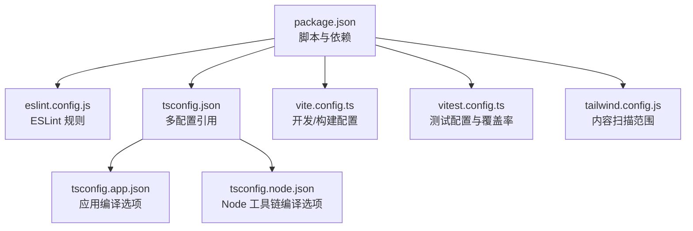
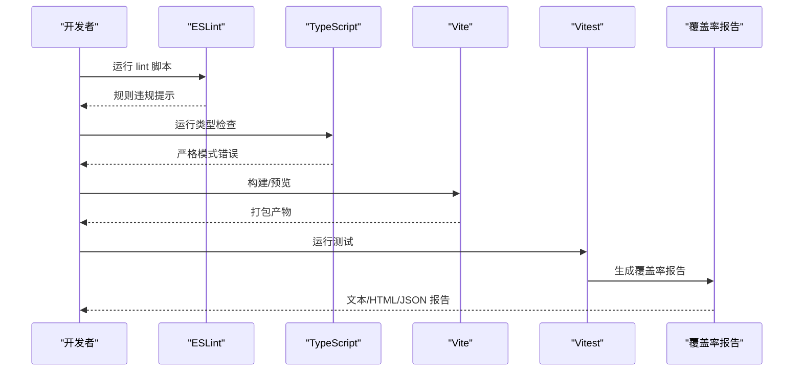
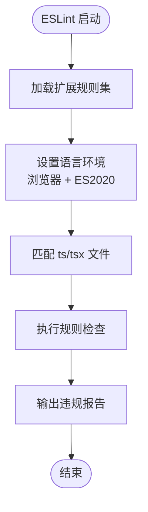
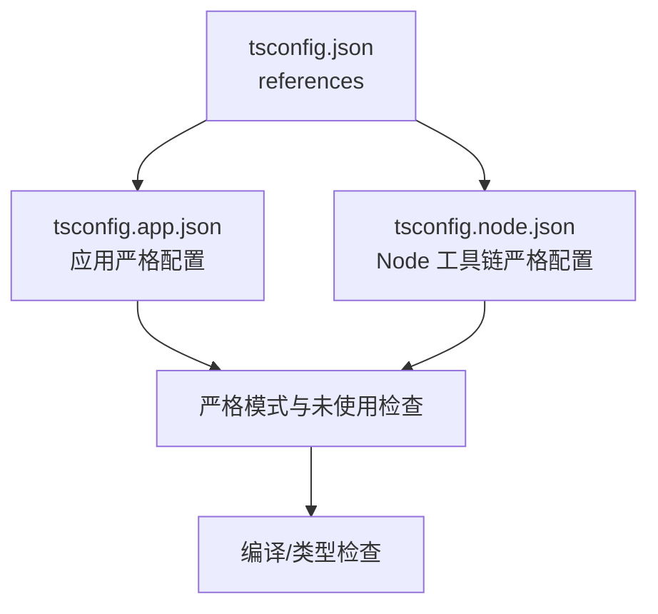
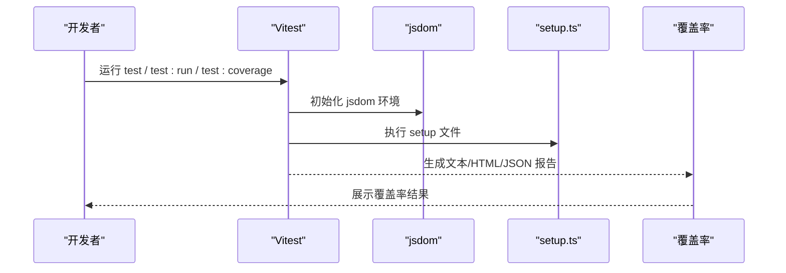
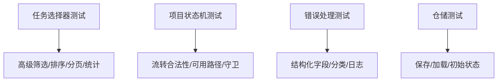
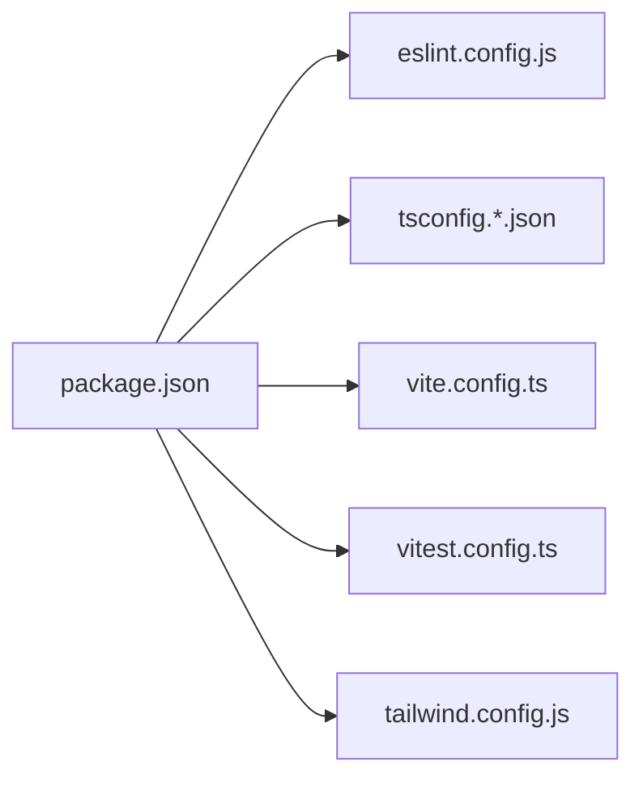

# 代码规范与质量

<cite>
**本文引用的文件**
- [eslint.config.js](file://eslint.config.js)
- [tsconfig.json](file://tsconfig.json)
- [tsconfig.app.json](file://tsconfig.app.json)
- [tsconfig.node.json](file://tsconfig.node.json)
- [package.json](file://package.json)
- [vite.config.ts](file://vite.config.ts)
- [vitest.config.ts](file://vitest.config.ts)
- [tailwind.config.js](file://tailwind.config.js)
- [docs/00-governance/coding-standards.md](file://docs/00-governance/coding-standards.md)
- [docs/03-engineering/development-guide.md](file://docs/03-engineering/development-guide.md)
- [src/test/setup.ts](file://src/test/setup.ts)
- [src/components/task/__tests__/taskManagement.selectors.test.ts](file://src/components/task/__tests__/taskManagement.selectors.test.ts)
- [src/domain/__tests__/projectStatusMachine.test.ts](file://src/domain/__tests__/projectStatusMachine.test.ts)
- [src/services/__tests__/errorHandling.test.ts](file://src/services/__tests__/errorHandling.test.ts)
- [src/services/__tests__/projectRepository.test.ts](file://src/services/__tests__/projectRepository.test.ts)
</cite>

## 目录

1. [简介](#简介)
2. [项目结构](#项目结构)
3. [核心组件](#核心组件)
4. [架构总览](#架构总览)
5. [详细组件分析](#详细组件分析)
6. [依赖分析](#依赖分析)
7. [性能考虑](#性能考虑)
8. [故障排查指南](#故障排查指南)
9. [结论](#结论)
10. [附录](#附录)

## 简介

本文件面向 CodeBuddy 项目，系统化梳理代码规范与质量保证体系，覆盖 ESLint 规则与 TypeScript 严格配置、Prettier 格式化策略、Vitest 单元测试与覆盖率实践，并提供代码审查清单、质量工具集成建议（如 SonarQube、CodeClimate），帮助团队在前端与全栈开发中达成一致的质量基线。

## 项目结构

项目采用 Vite + React + TypeScript 技术栈，结合 Vitest 进行单元测试与覆盖率统计。配置文件分布如下：

- ESLint：扁平配置文件集中管理规则与扩展
- TypeScript：多 tsconfig 引用，分别针对应用与 Node 工具链
- Vite：开发服务器、代理与构建分包策略
- Vitest：测试运行器、环境与覆盖率报告
- Tailwind：内容扫描范围与主题扩展

**图示来源**

- [package.json:1-48](file://package.json#L1-L48)
- [eslint.config.js:1-24](file://eslint.config.js#L1-L24)
- [tsconfig.json:1-8](file://tsconfig.json#L1-L8)
- [tsconfig.app.json:1-29](file://tsconfig.app.json#L1-L29)
- [tsconfig.node.json:1-27](file://tsconfig.node.json#L1-L27)
- [vite.config.ts:1-35](file://vite.config.ts#L1-L35)
- [vitest.config.ts:1-20](file://vitest.config.ts#L1-L20)
- [tailwind.config.js:1-12](file://tailwind.config.js#L1-L12)

**章节来源**

- [package.json:1-48](file://package.json#L1-L48)
- [eslint.config.js:1-24](file://eslint.config.js#L1-L24)
- [tsconfig.json:1-8](file://tsconfig.json#L1-L8)
- [tsconfig.app.json:1-29](file://tsconfig.app.json#L1-L29)
- [tsconfig.node.json:1-27](file://tsconfig.node.json#L1-L27)
- [vite.config.ts:1-35](file://vite.config.ts#L1-L35)
- [vitest.config.ts:1-20](file://vitest.config.ts#L1-L20)
- [tailwind.config.js:1-12](file://tailwind.config.js#L1-L12)

## 核心组件

- ESLint 配置：基于扁平配置，启用 TypeScript 推荐规则、React Hooks 推荐规则、React Refresh Vite 插件，限定语言环境为浏览器与 ES2020。
- TypeScript 配置：应用与 Node 工具链分别配置，均启用严格模式、未使用局部变量/参数检查、switch 无 fallthrough、未检查副作用导入等。
- Vite 配置：开发代理、手动分包策略（基础库与业务分离）、chunk 大小告警阈值提升。
- Vitest 配置：全局环境、jsdom 环境、setup 文件、v8 覆盖率与排除规则。
- Tailwind 配置：内容扫描范围覆盖 src 下 TS/TSX 文件。

**章节来源**

- [eslint.config.js:8-23](file://eslint.config.js#L8-L23)
- [tsconfig.app.json:20-25](file://tsconfig.app.json#L20-L25)
- [tsconfig.node.json:17-23](file://tsconfig.node.json#L17-L23)
- [vite.config.ts:7-33](file://vite.config.ts#L7-L33)
- [vitest.config.ts:6-18](file://vitest.config.ts#L6-L18)
- [tailwind.config.js:3-6](file://tailwind.config.js#L3-L6)

## 架构总览

下图展示前端质量保障的关键流程：开发期由 ESLint 与 TypeScript 提供静态检查，构建期由 Vite 执行打包与分包，测试期由 Vitest 运行单元测试并产出覆盖率报告。

**图示来源**

- [package.json:11-15](file://package.json#L11-L15)
- [eslint.config.js:8-23](file://eslint.config.js#L8-L23)
- [tsconfig.app.json:20-25](file://tsconfig.app.json#L20-L25)
- [vite.config.ts:15-33](file://vite.config.ts#L15-L33)
- [vitest.config.ts:6-18](file://vitest.config.ts#L6-L18)

## 详细组件分析

### ESLint 配置与规则

- 规则来源与扩展
  - 继承 JS 推荐规则、TypeScript 推荐规则、React Hooks 推荐规则、React Refresh Vite 插件
  - 限定语言环境为浏览器与 ES2020
- 关键行为
  - 对 ts/tsx 文件生效
  - 忽略 dist 输出目录
- 建议
  - 如需更严格的规则（如禁止 any、显式返回类型），可在项目内追加自定义规则以满足团队规范

**图示来源**

- [eslint.config.js:8-23](file://eslint.config.js#L8-L23)

**章节来源**

- [eslint.config.js:8-23](file://eslint.config.js#L8-L23)

### TypeScript 配置与严格模式

- 应用配置（tsconfig.app.json）
  - 编译目标：ES2023
  - 模块解析：bundler
  - 严格模式开启，含未使用局部变量/参数、switch 无 fallthrough、未检查副作用导入等
  - JSX：react-jsx
- Node 工具链配置（tsconfig.node.json）
  - 编译目标：ES2023
  - 模块解析：bundler
  - 严格模式开启，含未使用局部变量/参数、switch 无 fallthrough、未检查副作用导入等
- 顶层引用（tsconfig.json）
  - 通过 references 引用应用与 Node 配置

**图示来源**

- [tsconfig.json:3-6](file://tsconfig.json#L3-L6)
- [tsconfig.app.json:4-26](file://tsconfig.app.json#L4-L26)
- [tsconfig.node.json:4-24](file://tsconfig.node.json#L4-L24)

**章节来源**

- [tsconfig.json:1-8](file://tsconfig.json#L1-L8)
- [tsconfig.app.json:1-29](file://tsconfig.app.json#L1-L29)
- [tsconfig.node.json:1-27](file://tsconfig.node.json#L1-L27)

### Prettier 格式化规则（基于文档）

- 文档提供了推荐的 Prettier 配置示例，包括分号、尾随逗号、单引号、行长、缩进宽度、Tab/空格、大括号换行、箭头函数括号、行结尾等
- 建议在项目中落地该配置，统一前端代码风格

**章节来源**

- [docs/00-governance/coding-standards.md:64-80](file://docs/00-governance/coding-standards.md#L64-L80)

### Vite 构建与分包策略

- 开发服务器代理：将 /api 请求转发至本地后端
- 手动分包：将 React 生态核心库单独打包为 react-vendor
- 构建阈值：提升 chunkSizeWarningLimit 以适配懒加载优化后的体积

**章节来源**

- [vite.config.ts:7-33](file://vite.config.ts#L7-L33)

### Vitest 单元测试与覆盖率

- 环境与设置
  - 全局环境启用、jsdom 环境
  - setup 文件引入 @testing-library/jest-dom
- 覆盖率
  - provider: v8
  - 报告器：text、json、html
  - 排除 node_modules 与 src/test 目录
- 脚本
  - test、test:run、test:coverage

**图示来源**

- [vitest.config.ts:6-18](file://vitest.config.ts#L6-L18)
- [src/test/setup.ts:1-2](file://src/test/setup.ts#L1-L2)
- [package.json:13-15](file://package.json#L13-L15)

**章节来源**

- [vitest.config.ts:1-20](file://vitest.config.ts#L1-L20)
- [src/test/setup.ts:1-2](file://src/test/setup.ts#L1-L2)
- [package.json:13-15](file://package.json#L13-L15)

### 测试样例与最佳实践

- 选择器与业务逻辑测试
  - 针对任务管理的选择器（筛选、排序、分页、统计）进行断言
- 状态机测试
  - 验证状态流转的合法性、可用路径与守卫条件
- 错误处理模型测试
  - 结构化错误字段校验、分类识别与日志格式
- 仓储测试
  - 本地状态持久化与加载、初始状态回退

**图示来源**

- [src/components/task/**tests**/taskManagement.selectors.test.ts:35-101](file://src/components/task/__tests__/taskManagement.selectors.test.ts#L35-L101)
- [src/domain/**tests**/projectStatusMachine.test.ts:9-124](file://src/domain/__tests__/projectStatusMachine.test.ts#L9-L124)
- [src/services/**tests**/errorHandling.test.ts:8-127](file://src/services/__tests__/errorHandling.test.ts#L8-L127)
- [src/services/**tests**/projectRepository.test.ts:6-121](file://src/services/__tests__/projectRepository.test.ts#L6-L121)

**章节来源**

- [src/components/task/**tests**/taskManagement.selectors.test.ts:1-102](file://src/components/task/__tests__/taskManagement.selectors.test.ts#L1-L102)
- [src/domain/**tests**/projectStatusMachine.test.ts:1-125](file://src/domain/__tests__/projectStatusMachine.test.ts#L1-L125)
- [src/services/**tests**/errorHandling.test.ts:1-128](file://src/services/__tests__/errorHandling.test.ts#L1-L128)
- [src/services/**tests**/projectRepository.test.ts:1-122](file://src/services/__tests__/projectRepository.test.ts#L1-L122)

## 依赖分析

- 脚本与工具
  - lint：调用 ESLint 检查
  - type-check：TypeScript 无 emit 类型检查
  - test/test:run/test:coverage：Vitest 测试与覆盖率
- 依赖
  - @typescript-eslint、eslint-plugin-react-hooks、eslint-plugin-react-refresh、globals
  - vite、@vitejs/plugin-react、vitest、@testing-library/jest-dom、jsdom

**图示来源**

- [package.json:6-46](file://package.json#L6-L46)
- [eslint.config.js:1-24](file://eslint.config.js#L1-L24)
- [tsconfig.json:1-8](file://tsconfig.json#L1-L8)
- [vite.config.ts:1-35](file://vite.config.ts#L1-L35)
- [vitest.config.ts:1-20](file://vitest.config.ts#L1-L20)
- [tailwind.config.js:1-12](file://tailwind.config.js#L1-L12)

**章节来源**

- [package.json:6-46](file://package.json#L6-L46)

## 性能考虑

- 构建分包：将 React 生态核心库单独打包，降低重复依赖与首屏体积
- 体积告警阈值提升：配合懒加载优化，缓解大 chunk 警告
- 测试覆盖率：通过 Vitest 与 jsdom 环境，确保关键逻辑被覆盖

**章节来源**

- [vite.config.ts:17-33](file://vite.config.ts#L17-L33)
- [vitest.config.ts:6-18](file://vitest.config.ts#L6-L18)

## 故障排查指南

- ESLint 报错
  - 检查规则扩展与语言环境配置
  - 确认文件匹配与忽略规则
- TypeScript 报错
  - 严格模式下关注未使用变量/参数、switch fallthrough、未检查副作用导入
  - 确认应用与 Node 配置的 target/moduleResolution 一致性
- Vitest 覆盖率异常
  - 检查覆盖率 provider 与排除规则
  - 确保 setup 文件正确引入 jest-dom
- Tailwind 样式未生效
  - 检查 content 扫描范围是否包含目标文件

**章节来源**

- [eslint.config.js:8-23](file://eslint.config.js#L8-L23)
- [tsconfig.app.json:20-25](file://tsconfig.app.json#L20-L25)
- [tsconfig.node.json:17-23](file://tsconfig.node.json#L17-L23)
- [vitest.config.ts:10-17](file://vitest.config.ts#L10-L17)
- [tailwind.config.js:3-6](file://tailwind.config.js#L3-L6)

## 结论

本规范文档基于现有配置与测试实践，明确了 ESLint、TypeScript、Vite、Vitest 与 Tailwind 的关键设置与最佳实践。建议在团队内推广文档中的 Prettier 配置与代码风格示例，并持续完善测试用例与覆盖率目标，逐步引入 SonarQube/CodeClimate 等静态分析平台，形成“编码—构建—测试—分析”的闭环质量体系。

## 附录

### 代码审查检查清单（建议）

- 命名约定
  - 变量与函数：camelCase；布尔值前缀语义化
  - 组件与类型：PascalCase；组件名体现功能
  - 常量：UPPER_SNAKE_CASE；枚举与配置对象
- 注释规范
  - 关键逻辑/边界条件/复杂状态流需中文注释
  - 导入语句、变量声明、函数定义、条件/循环、JSX 元素、CSS 类名等按要求注释
- 模块组织
  - 目录结构清晰，文件命名规范
  - 组件组合优于继承，合理拆分与复用
- 代码风格
  - 遵循 Prettier 推荐配置
  - JSX 与函数体缩进、空行、换行符合示例
- TypeScript 规范
  - 接口与联合类型使用恰当；避免 any
  - Props 类型清晰；默认值解构
  - 类型守卫与判别属性使用正确
- React 组件规范
  - 标准组件结构：Hooks、计算属性、副作用、事件处理、渲染辅助函数
  - 自定义 Hook：use 前缀，返回数组或对象
  - 组件组合：Card.Header/Title/Content 等子组件
- 性能优化
  - 使用 useMemo/useCallback 缓存计算与函数
  - 组件懒加载与虚拟滚动（长列表）

**章节来源**

- [docs/00-governance/coding-standards.md:505-800](file://docs/00-governance/coding-standards.md#L505-L800)

### 单元测试编写规范与覆盖率要求（建议）

- 测试文件组织
  - 与被测模块同目录下创建 **tests**，测试文件以 .test.ts 结尾
- 断言与场景
  - 覆盖正常路径、边界条件、异常分支
  - 使用工厂函数构造测试数据，减少重复
- 覆盖率
  - 建议设置最低覆盖率阈值（如语句/分支/函数/行 ≥ 80%），并结合 CI 报告
- 脚本
  - 使用 test:coverage 生成 HTML 报告，便于本地查看

**章节来源**

- [src/components/task/**tests**/taskManagement.selectors.test.ts:1-102](file://src/components/task/__tests__/taskManagement.selectors.test.ts#L1-L102)
- [src/domain/**tests**/projectStatusMachine.test.ts:1-125](file://src/domain/__tests__/projectStatusMachine.test.ts#L1-L125)
- [src/services/**tests**/errorHandling.test.ts:1-128](file://src/services/__tests__/errorHandling.test.ts#L1-L128)
- [src/services/**tests**/projectRepository.test.ts:1-122](file://src/services/__tests__/projectRepository.test.ts#L1-L122)
- [vitest.config.ts:10-17](file://vitest.config.ts#L10-L17)
- [package.json:13-15](file://package.json#L13-L15)

### 质量工具集成建议（SonarQube / CodeClimate）

- SonarQube
  - 在 CI 中集成 sonar-scanner，配置项目键、令牌与质量阈值
  - 关联 ESLint/Vitest 报告，统一质量门禁
- CodeClimate
  - 配置引擎与规则集，结合 ESLint 与 TypeScript 分析
  - 通过覆盖率与复杂度指标驱动改进
- 建议
  - 将覆盖率与规则违规纳入 PR 检查
  - 定期回顾质量趋势，持续优化规则与阈值

[本节为通用实践建议，无需特定文件引用]
