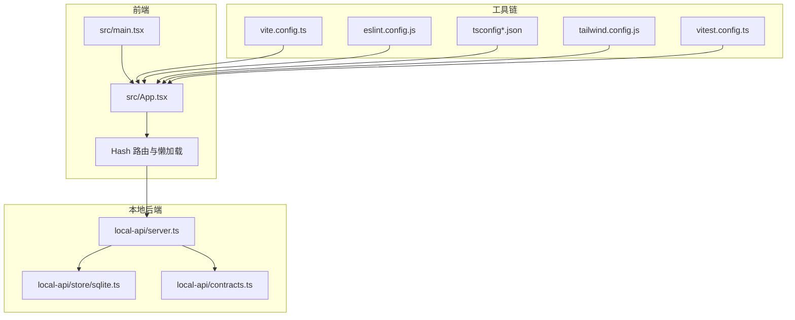
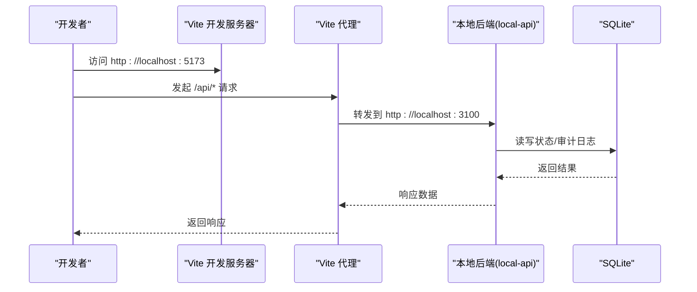
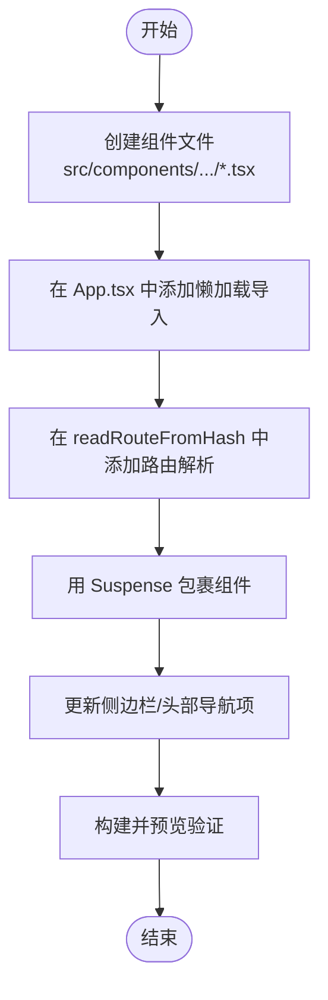
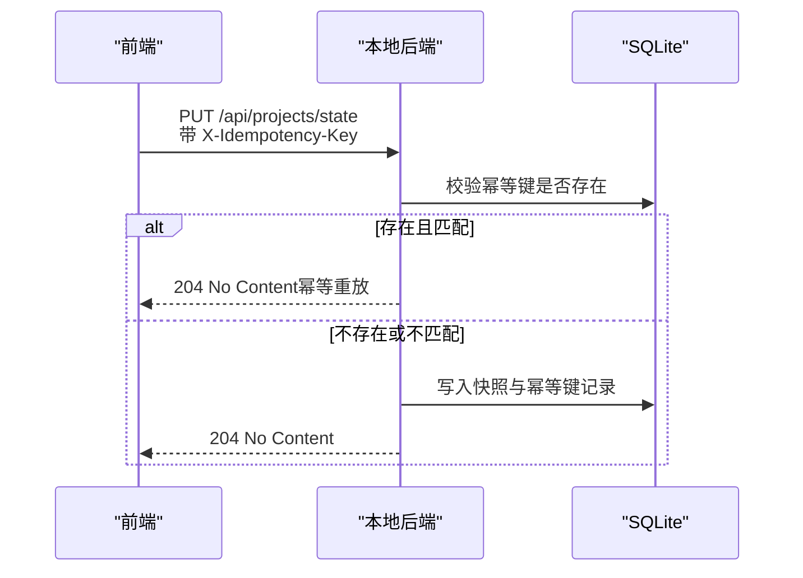
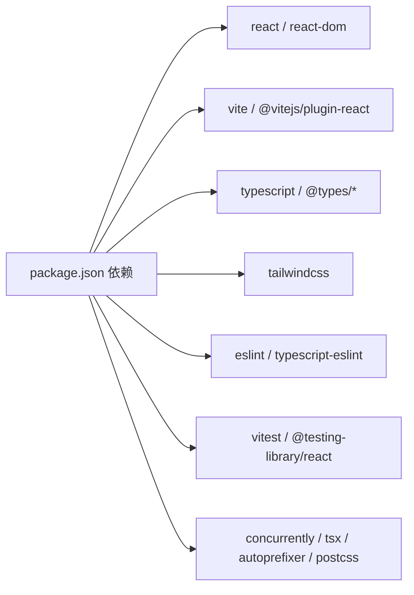

# 开发指南

<cite>
**本文引用的文件**
- [package.json](file://package.json)
- [vite.config.ts](file://vite.config.ts)
- [eslint.config.js](file://eslint.config.js)
- [tsconfig.json](file://tsconfig.json)
- [tsconfig.app.json](file://tsconfig.app.json)
- [tsconfig.node.json](file://tsconfig.node.json)
- [vitest.config.ts](file://vitest.config.ts)
- [tailwind.config.js](file://tailwind.config.js)
- [README.md](file://README.md)
- [CODEBUDDY.md](file://CODEBUDDY.md)
- [docs/03-engineering/development-guide.md](file://docs/03-engineering/development-guide.md)
- [docs/00-governance/coding-standards.md](file://docs/00-governance/coding-standards.md)
- [src/main.tsx](file://src/main.tsx)
- [src/App.tsx](file://src/App.tsx)
- [src/test/setup.ts](file://src/test/setup.ts)
- [local-api/server.ts](file://local-api/server.ts)
- [local-api/store/sqlite.ts](file://local-api/store/sqlite.ts)
- [local-api/contracts.ts](file://local-api/contracts.ts)
</cite>

## 目录

1. [简介](#简介)
2. [项目结构](#项目结构)
3. [核心组件](#核心组件)
4. [架构总览](#架构总览)
5. [详细组件分析](#详细组件分析)
6. [依赖分析](#依赖分析)
7. [性能考虑](#性能考虑)
8. [故障排查指南](#故障排查指南)
9. [结论](#结论)
10. [附录](#附录)

## 简介

本指南面向新加入的开发者，提供 CodeBuddy 项目的完整开发流程与最佳实践，涵盖开发环境搭建、IDE 配置、代码规范、构建与部署、调试技巧、新增页面流程、测试与 CI、常见问题与性能优化建议。项目采用 React 19 + TypeScript + Vite 8 + Tailwind CSS 4，前端通过 Hash 路由实现单页应用，结合本地 Express 服务器（SQLite）提供联调后端能力。

## 项目结构

- 根目录包含构建配置、类型配置、测试配置、文档与本地 API 服务等。
- 源代码位于 src/，按领域划分：components（页面与组件）、domain（业务域逻辑）、services（服务层与仓库）、data（模拟数据）。
- local-api/ 提供本地 HTTP 服务，支持项目/任务/验收/结算状态与审计日志接口，并内置幂等性保障。
- docs/ 提供治理与工程文档，包含开发指南、设计规范、编码规范等。

**图表来源**

- [src/main.tsx:1-11](file://src/main.tsx#L1-L11)
- [src/App.tsx:1-800](file://src/App.tsx#L1-L800)
- [vite.config.ts:1-35](file://vite.config.ts#L1-L35)
- [eslint.config.js:1-24](file://eslint.config.js#L1-L24)
- [tsconfig.json:1-8](file://tsconfig.json#L1-L8)
- [tailwind.config.js:1-12](file://tailwind.config.js#L1-L12)
- [vitest.config.ts:1-20](file://vitest.config.ts#L1-L20)
- [local-api/server.ts:1-414](file://local-api/server.ts#L1-L414)
- [local-api/store/sqlite.ts:1-99](file://local-api/store/sqlite.ts#L1-L99)
- [local-api/contracts.ts:1-89](file://local-api/contracts.ts#L1-L89)

**章节来源**

- [README.md:55-114](file://README.md#L55-L114)
- [CODEBUDDY.md:23-90](file://CODEBUDDY.md#L23-L90)

## 核心组件

- 应用入口与路由编排：src/main.tsx 挂载应用，src/App.tsx 负责 Hash 路由解析、页面懒加载、状态持久化与项目状态机驱动的状态流转。
- 本地后端服务：local-api/server.ts 提供五条核心接口，支持 GET/PUT 读写项目/任务/验收/结算状态与审计日志，并通过 SQLite 存储与幂等键保障。
- 构建与测试：Vite 8 作为开发与生产构建工具，ESLint + TypeScript 提供类型与风格约束，Vitest + @testing-library/react 提供单元测试与覆盖率。
- 样式系统：Tailwind CSS 4 配置扫描 src 与 public 下的模板文件，统一视觉与交互。

**章节来源**

- [src/main.tsx:1-11](file://src/main.tsx#L1-L11)
- [src/App.tsx:1-800](file://src/App.tsx#L1-L800)
- [local-api/server.ts:1-414](file://local-api/server.ts#L1-L414)
- [vite.config.ts:1-35](file://vite.config.ts#L1-L35)
- [eslint.config.js:1-24](file://eslint.config.js#L1-L24)
- [tsconfig.json:1-8](file://tsconfig.json#L1-L8)
- [tailwind.config.js:1-12](file://tailwind.config.js#L1-L12)
- [vitest.config.ts:1-20](file://vitest.config.ts#L1-L20)

## 架构总览

前端通过 Hash 路由集中编排多页面，页面组件按需懒加载，减少首包体积。本地后端通过 Vite 代理转发 /api 请求，提供状态读写与审计日志能力，支持幂等键避免重复提交。开发脚本统一在 package.json 中管理，便于快速启动与联调。

**图表来源**

- [vite.config.ts:7-14](file://vite.config.ts#L7-L14)
- [local-api/server.ts:338-386](file://local-api/server.ts#L338-L386)
- [local-api/store/sqlite.ts:18-42](file://local-api/store/sqlite.ts#L18-L42)

**章节来源**

- [README.md:18-28](file://README.md#L18-L28)
- [README.md:137-155](file://README.md#L137-L155)
- [CODEBUDDY.md:25-33](file://CODEBUDDY.md#L25-L33)

## 详细组件分析

### 开发环境与 IDE 配置

- 环境要求：Node.js >= 18.0.0，npm >= 9.0.0。
- 依赖安装：npm install。
- 开发启动：
  - 单独前端：npm run dev
  - 前端 + 本地后端：npm run dev:local（同时启动 Vite 与本地 API）
- 本地后端服务：默认监听 3100 端口，提供健康检查与五条核心接口。
- IDE 推荐：VS Code + TypeScript/ESLint 插件，启用 ESLint 与 Prettier 格式化，保持与仓库配置一致。

**章节来源**

- [README.md:7-28](file://README.md#L7-L28)
- [README.md:137-155](file://README.md#L137-L155)
- [CODEBUDDY.md:3-22](file://CODEBUDDY.md#L3-L22)

### 代码规范与 ESLint 配置

- ESLint 配置采用 flat config，启用 @typescript-eslint、react-hooks、react-refresh 推荐规则，语言选项针对浏览器与 2020 ECMAScript。
- TypeScript 严格模式开启，包含 noUnusedLocals、noUnusedParameters、noFallthroughCasesInSwitch 等约束。
- 文档提供了推荐的 ESLint 与 Prettier 配置示例，建议在 IDE 中启用自动修复与保存时格式化。

**章节来源**

- [eslint.config.js:1-24](file://eslint.config.js#L1-L24)
- [tsconfig.app.json:1-29](file://tsconfig.app.json#L1-L29)
- [tsconfig.node.json:1-27](file://tsconfig.node.json#L1-L27)
- [docs/00-governance/coding-standards.md:37-80](file://docs/00-governance/coding-standards.md#L37-L80)

### 构建与部署流程

- 开发构建：tsc -b && vite build（先类型检查，再打包）。
- 预览：vite preview 本地预览构建产物。
- 生产构建策略：
  - 代码分割：手动分包策略将 React 生态核心库抽离为独立 chunk，降低缓存失效影响。
  - 警告阈值：提升 chunkSizeWarningLimit 至 400KB，配合懒加载优化。
- 部署最佳实践：
  - 使用静态托管服务（如 Vercel、Netlify）部署 dist 目录。
  - 保持 /api 前缀请求通过反向代理或服务端路由转发至后端。
  - 本地开发与生产环境的 API 基址可通过环境变量或构建参数配置。

**章节来源**

- [package.json:10-15](file://package.json#L10-L15)
- [vite.config.ts:15-33](file://vite.config.ts#L15-L33)
- [README.md:30-34](file://README.md#L30-L34)

### 调试技巧与工具使用

- 浏览器调试：利用控制台 Network 面板观察 /api/\* 请求，核对 X-Idempotency-Key 请求头与响应状态。
- 状态流转调试：在 App.tsx 中观察 transitionProjectStatus 的守卫校验与日志输出，结合 localStorage pm-projects-state-v1 与 pm-project-logs-v1 校验本地缓存一致性。
- 本地后端调试：通过 npm run local-api 启动，访问 http://localhost:3100/health 验证健康检查，使用 curl 或 Postman 调试各接口。
- 错误降级与提示：当触发 pm:remote-fallback 事件时，弹窗提示范围、场景、原因与状态码，便于快速定位问题。

**章节来源**

- [README.md:201-226](file://README.md#L201-L226)
- [src/App.tsx:366-389](file://src/App.tsx#L366-L389)
- [local-api/server.ts:332-334](file://local-api/server.ts#L332-L334)

### 新增页面的完整流程

- 创建组件：在 src/components/ 下按模块创建页面组件与样式文件。
- 路由与懒加载：
  - 在 src/App.tsx 中使用 lazy 导入新组件。
  - 在 readRouteFromHash 中添加路由解析逻辑，支持主路径与子路径匹配。
  - 使用 Suspense 包裹懒加载组件，提供加载占位。
- 导航与激活：确保侧边栏与统一头部的导航项 href 与路由一致，避免误判。
- 验证与回归：构建并手工验证“项目/任务/标准详情”等关键入口跳转。

**图表来源**

- [src/App.tsx:3-20](file://src/App.tsx#L3-L20)
- [src/App.tsx:226-344](file://src/App.tsx#L226-L344)
- [README.md:275-286](file://README.md#L275-L286)

**章节来源**

- [README.md:275-286](file://README.md#L275-L286)
- [CODEBUDDY.md:522-537](file://CODEBUDDY.md#L522-L537)

### 测试编写规范与持续集成

- 测试框架：Vitest + @testing-library/react。
- 配置要点：启用 jsdom 环境、setupFiles 引入 @testing-library/jest-dom、覆盖率输出为 text/json/html。
- 覆盖率排除：node_modules 与 src/test 目录。
- 测试运行：
  - npm run test：启动 Vitest UI。
  - npm run test:run：一次性运行测试。
  - npm run test:coverage：生成覆盖率报告。
- 覆盖范围：状态机守卫逻辑、仓储层数据持久化、错误处理模型等核心域。

**章节来源**

- [vitest.config.ts:1-20](file://vitest.config.ts#L1-L20)
- [src/test/setup.ts:1-2](file://src/test/setup.ts#L1-L2)
- [README.md:167-179](file://README.md#L167-L179)

### 本地后端服务与幂等性

- 接口清单：
  - GET /api/projects/state：获取项目状态快照
  - PUT /api/projects/state：保存项目状态快照（支持幂等键）
  - GET /api/tasks/state：获取任务状态快照
  - PUT /api/tasks/state：保存任务状态快照（支持幂等键）
  - POST /api/audit/logs：记录审计日志（支持幂等键）
- 幂等性：通过 X-Idempotency-Key 与 SQLite 记录去重，避免重复提交导致副作用。
- 数据库：SQLite 文件位于 local-api/store/local.db，Schema 位于 local-api/store/schema.sql。

**图表来源**

- [local-api/server.ts:86-129](file://local-api/server.ts#L86-L129)
- [local-api/server.ts:148-197](file://local-api/server.ts#L148-L197)
- [local-api/server.ts:288-329](file://local-api/server.ts#L288-L329)
- [local-api/store/sqlite.ts:68-80](file://local-api/store/sqlite.ts#L68-L80)

**章节来源**

- [README.md:137-155](file://README.md#L137-L155)
- [local-api/server.ts:1-414](file://local-api/server.ts#L1-L414)
- [local-api/store/sqlite.ts:1-99](file://local-api/store/sqlite.ts#L1-L99)
- [local-api/contracts.ts:1-89](file://local-api/contracts.ts#L1-L89)

## 依赖分析

- 前端依赖：React 19、React DOM、@vitejs/plugin-react、tailwindcss、typescript、@types/react 等。
- 开发依赖：ESLint、typescript-eslint、@vitest/ui、jsdom、concurrently、tsx 等。
- 构建与运行：Vite 8、TypeScript、Tailwind CSS 4、Vitest。

**图表来源**

- [package.json:17-46](file://package.json#L17-L46)

**章节来源**

- [package.json:1-48](file://package.json#L1-L48)

## 性能考虑

- 懒加载与代码分割：14+ 页面组件按需加载，React 生态核心库独立 chunk，主包体积优化至 27 KB，首屏 216 KB，较优化前减少 62%。
- 构建优化：rollupOptions.manualChunks 将 react 与 react-dom 单独打包；提升 chunkSizeWarningLimit 至 400KB。
- 前端状态持久化：localStorage 缓存项目状态与日志，减少网络依赖，提高可用性。

**章节来源**

- [README.md:156-166](file://README.md#L156-L166)
- [vite.config.ts:15-33](file://vite.config.ts#L15-L33)

## 故障排查指南

- 网络请求失败：
  - 检查本地后端是否启动（http://localhost:3100）。
  - 查看控制台的 [降级] 日志与 pm:remote-fallback 事件。
  - 核对 Vite proxy 配置（vite.config.ts）与 /api 前缀。
- 状态流转失败：
  - 检查守卫条件（projectStatusMachine.ts）与项目里程碑、任务树、验收结果等字段。
  - 查看控制台的日志与审计日志接口调用。
- 本地缓存不一致：
  - 清空 localStorage（localStorage.clear()），刷新页面重新加载数据。
  - 校验 projectRepository.loadState() 返回值与持久化逻辑。

**章节来源**

- [README.md:227-243](file://README.md#L227-L243)
- [src/App.tsx:394-409](file://src/App.tsx#L394-L409)

## 结论

本指南围绕 CodeBuddy 项目的开发流程、规范与最佳实践进行了系统梳理，帮助新开发者快速上手并高质量交付功能。建议在日常开发中坚持：

- 严格遵循 ESLint 与 TypeScript 规范；
- 使用懒加载与代码分割优化首屏性能；
- 通过本地后端与幂等键保障联调稳定性；
- 借助 Vitest 与覆盖率工具完善测试体系；
- 借助文档与回归清单持续改进工程质量。

## 附录

- 常用命令速查：
  - 安装依赖：npm install
  - 本地开发：npm run dev
  - 前端 + 本地后端：npm run dev:local
  - 生产构建：npm run build
  - 代码检查：npm run lint
  - 预览构建：npm run preview
  - 运行测试：npm run test
  - 单次测试：npm run test:run
  - 测试覆盖率：npm run test:coverage

**章节来源**

- [README.md:14-53](file://README.md#L14-L53)
- [CODEBUDDY.md:3-22](file://CODEBUDDY.md#L3-L22)
