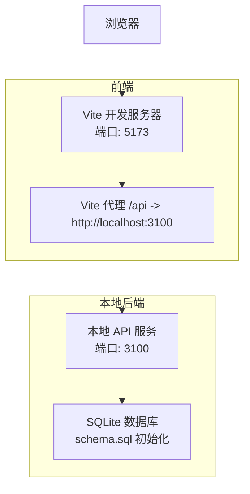
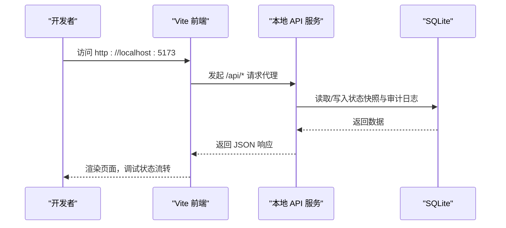
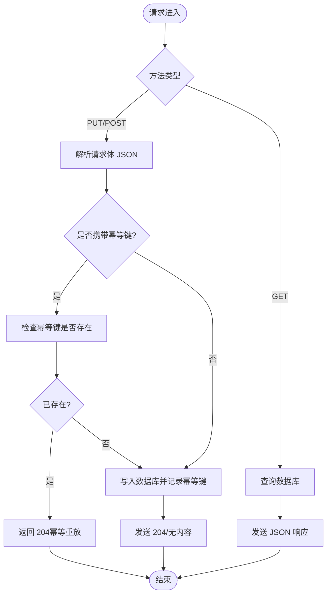
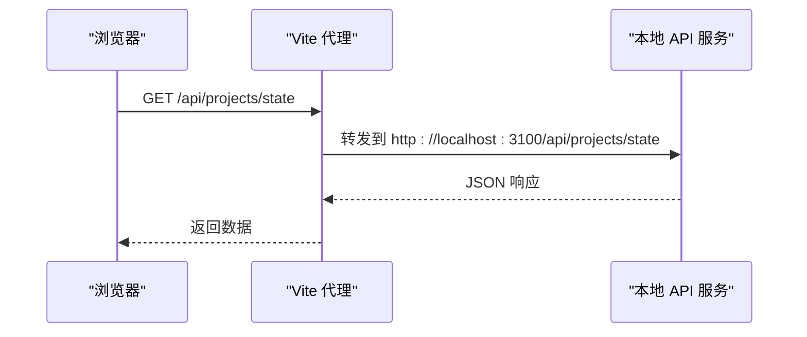
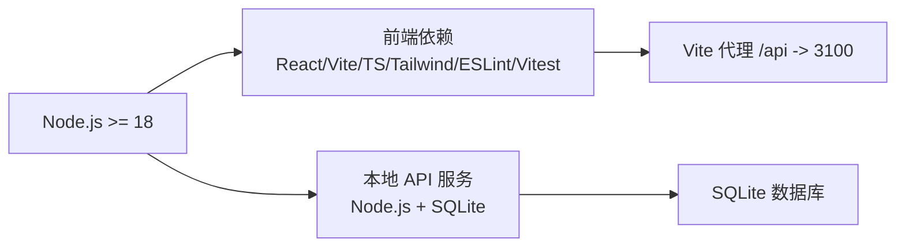

# 开发环境搭建

<cite>
**本文引用的文件**
- [package.json](file://package.json)
- [README.md](file://README.md)
- [CODEBUDDY.md](file://CODEBUDDY.md)
- [vite.config.ts](file://vite.config.ts)
- [eslint.config.js](file://eslint.config.js)
- [tsconfig.json](file://tsconfig.json)
- [tsconfig.app.json](file://tsconfig.app.json)
- [tsconfig.node.json](file://tsconfig.node.json)
- [local-api/server.ts](file://local-api/server.ts)
- [local-api/store/schema.sql](file://local-api/store/schema.sql)
- [local-api/test-api.sh](file://local-api/test-api.sh)
- [.gitignore](file://.gitignore)
- [docs/03-engineering/development-guide.md](file://docs/03-engineering/development-guide.md)
- [docs/00-governance/coding-standards.md](file://docs/00-governance/coding-standards.md)
</cite>

## 目录

1. [简介](#简介)
2. [项目结构](#项目结构)
3. [核心组件](#核心组件)
4. [架构总览](#架构总览)
5. [详细组件分析](#详细组件分析)
6. [依赖分析](#依赖分析)
7. [性能考虑](#性能考虑)
8. [故障排查指南](#故障排查指南)
9. [结论](#结论)
10. [附录](#附录)

## 简介

本指南面向首次参与 CodeBuddy 项目的开发者，提供从零到一的完整开发环境搭建流程，涵盖 Node.js 与包管理器要求、VS Code 插件推荐、Git 版本控制设置、项目克隆与依赖安装、数据库初始化、本地 API 服务启动与联调、环境变量配置以及常见问题解决方案。同时给出 ESLint、Prettier、TypeScript 等工具链的配置与使用建议，帮助你在本地高效开展前端与本地后端联调工作。

## 项目结构

该项目采用前端 Vite + React + TypeScript 的单页应用架构，并内置一个基于 Node.js 的本地 API 服务（SQLite 数据库存储），通过 Vite 的代理将前端对 /api 的请求转发到本地后端。整体结构清晰，便于并行启动前端开发服务器、本地后端服务与数据库管理工具。

**图表来源**

- [vite.config.ts:1-35](file://vite.config.ts#L1-L35)
- [local-api/server.ts:18-414](file://local-api/server.ts#L18-L414)
- [local-api/store/schema.sql:1-72](file://local-api/store/schema.sql#L1-L72)

**章节来源**

- [README.md:55-113](file://README.md#L55-L113)
- [CODEBUDDY.md:23-90](file://CODEBUDDY.md#L23-L90)

## 核心组件

- 前端开发服务器：Vite 提供热更新与快速启动，代理 /api 到本地后端。
- 本地 API 服务：基于 Node.js 的 HTTP 服务器，提供项目状态、任务状态、验收状态、结算状态、审计日志等接口，并内置幂等性保障。
- SQLite 数据库：通过 schema.sql 初始化，存储项目状态、任务状态、验收状态、结算建议、审计日志与幂等键记录。
- 本地联调脚本：提供 curl 测试脚本，验证健康检查与五条核心接口及幂等机制。

**章节来源**

- [README.md:137-155](file://README.md#L137-L155)
- [local-api/server.ts:1-414](file://local-api/server.ts#L1-L414)
- [local-api/store/schema.sql:1-72](file://local-api/store/schema.sql#L1-L72)
- [local-api/test-api.sh:1-156](file://local-api/test-api.sh#L1-L156)

## 架构总览

本地开发采用“前端 + 本地后端 + SQLite”三段式架构，通过 Vite 代理实现前后端联调。本地后端负责状态快照读写与审计日志记录，前端通过统一的 /api 前缀访问，无需额外跨域配置。

**图表来源**

- [vite.config.ts:7-14](file://vite.config.ts#L7-L14)
- [local-api/server.ts:338-386](file://local-api/server.ts#L338-L386)
- [local-api/store/schema.sql:4-72](file://local-api/store/schema.sql#L4-L72)

## 详细组件分析

### 本地 API 服务

- 端口与路由：默认监听 3100，API 前缀为 /api；提供健康检查 /health。
- 核心接口：
  - GET/PUT /api/projects/state（项目状态）
  - GET/PUT /api/tasks/state（任务状态）
  - GET/PUT /api/acceptance/state（验收状态）
  - GET /api/settlement/state（结算状态）
  - POST /api/audit/logs（审计日志）
- 幂等性：所有写操作支持 X-Idempotency-Key，避免重复提交。
- 数据库：通过 schema.sql 初始化多张表，含审计日志与幂等键记录表。

**图表来源**

- [local-api/server.ts:70-129](file://local-api/server.ts#L70-L129)
- [local-api/server.ts:131-197](file://local-api/server.ts#L131-L197)
- [local-api/server.ts:199-280](file://local-api/server.ts#L199-L280)
- [local-api/server.ts:282-329](file://local-api/server.ts#L282-L329)

**章节来源**

- [local-api/server.ts:18-414](file://local-api/server.ts#L18-L414)
- [local-api/store/schema.sql:1-72](file://local-api/store/schema.sql#L1-L72)

### Vite 代理与前端联调

- 代理配置：将 /api 前缀代理到 http://localhost:3100，无需额外 CORS 配置。
- 启动方式：npm run dev 启动前端；npm run dev:local 并行启动本地 API 与前端。

**图表来源**

- [vite.config.ts:7-14](file://vite.config.ts#L7-L14)
- [README.md:20-26](file://README.md#L20-L26)

**章节来源**

- [vite.config.ts:1-35](file://vite.config.ts#L1-L35)
- [README.md:18-28](file://README.md#L18-L28)

### 本地 API 接口测试脚本

- 覆盖健康检查、项目状态、任务状态、验收状态、结算状态、审计日志六类场景。
- 支持幂等重放验证，便于联调与回归测试。

**章节来源**

- [local-api/test-api.sh:1-156](file://local-api/test-api.sh#L1-L156)

## 依赖分析

- Node.js 与包管理器：要求 Node.js >= 18，npm >= 9；亦可使用 pnpm（版本要求见工程文档）。
- 前端依赖：React、Vite、TypeScript、Tailwind CSS、ESLint、Vitest 等。
- 本地后端：Node.js 原生 http 模块，SQLite 存储，幂等性与审计日志记录。
- 代理与并发：Vite 代理与 concurrently 并发启动本地 API 与前端。

**图表来源**

- [package.json:6-46](file://package.json#L6-L46)
- [README.md:7-11](file://README.md#L7-L11)
- [docs/03-engineering/development-guide.md:35-45](file://docs/03-engineering/development-guide.md#L35-L45)

**章节来源**

- [package.json:1-48](file://package.json#L1-L48)
- [README.md:7-11](file://README.md#L7-L11)
- [docs/03-engineering/development-guide.md:35-45](file://docs/03-engineering/development-guide.md#L35-L45)

## 性能考虑

- 前端构建：Vite 提供快速冷启动与热更新；rollupOptions 中对 React 生态进行手动分包，提升缓存命中率。
- 体积控制：通过 chunkSizeWarningLimit 提升阈值，结合懒加载策略降低主包体积。
- 本地后端：SQLite 本地文件数据库，启动即用，无需额外服务依赖。

**章节来源**

- [vite.config.ts:15-34](file://vite.config.ts#L15-L34)
- [README.md:156-166](file://README.md#L156-L166)

## 故障排查指南

- 网络请求失败
  - 确认本地后端已启动（http://localhost:3100）。
  - 检查 Vite 代理配置（vite.config.ts）。
  - 查看浏览器控制台网络面板与本地后端日志。
- 状态流转失败
  - 检查项目状态机守卫条件（projectStatusMachine.ts）。
  - 核对项目里程碑、任务树、验收结果等字段。
- 本地缓存不一致
  - 清空 localStorage（localStorage.clear()），刷新页面重新加载。
  - 检查项目仓库的 loadState() 返回值。
- 幂等性问题
  - 确认请求头携带 X-Idempotency-Key。
  - 使用测试脚本验证幂等重放行为。

**章节来源**

- [README.md:227-243](file://README.md#L227-L243)

## 结论

通过本指南，你可以快速完成 CodeBuddy 的本地开发环境搭建：安装 Node.js 与包管理器、克隆项目、安装依赖、启动本地 API 与前端开发服务器，并通过 Vite 代理完成前后端联调。配合 ESLint、Prettier、TypeScript 等工具链，确保代码质量与一致性。遇到问题时，可依据故障排查指南逐项定位并解决。

## 附录

### 环境要求与安装步骤

- 环境要求
  - Node.js >= 18.0.0
  - npm >= 9.0.0（或 pnpm >= 8.0.0）
  - Git
- 安装依赖
  - npm install 或 pnpm install
- 启动本地开发
  - 前端开发：npm run dev
  - 前后端联调：npm run dev:local（并行启动本地 API 与前端）

**章节来源**

- [README.md:7-16](file://README.md#L7-L16)
- [README.md:18-26](file://README.md#L18-L26)
- [docs/03-engineering/development-guide.md:35-78](file://docs/03-engineering/development-guide.md#L35-L78)

### 数据库初始化

- 本地后端自带 SQLite 初始化逻辑，启动时自动创建表结构。
- 如需手动初始化，可参考本地 API 的数据库初始化与清理逻辑。

**章节来源**

- [local-api/server.ts:390-414](file://local-api/server.ts#L390-L414)
- [local-api/store/schema.sql:1-72](file://local-api/store/schema.sql#L1-L72)

### 本地 API 接口一览

- 健康检查：GET /health
- 项目状态：GET/PUT /api/projects/state?envId={envId}
- 任务状态：GET/PUT /api/tasks/state?contextKey={key}&envId={envId}
- 验收状态：GET/PUT /api/acceptance/state?projectCode={code}&envId={envId}
- 结算状态：GET /api/settlement/state?envId={envId}
- 审计日志：POST /api/audit/logs?envId={envId}

**章节来源**

- [local-api/server.ts:331-334](file://local-api/server.ts#L331-L334)
- [local-api/server.ts:363-382](file://local-api/server.ts#L363-L382)

### 环境变量与配置

- 本地 API 端口：LOCAL_API_PORT（默认 3100）
- Vite 代理：/api -> http://localhost:3100
- TypeScript 多配置：tsconfig.json 引用 tsconfig.app.json 与 tsconfig.node.json
- ESLint：eslint.config.js 使用 flat 配置，集成 TS、React Hooks、React Refresh

**章节来源**

- [local-api/server.ts:18](file://local-api/server.ts#L18)
- [vite.config.ts:7-14](file://vite.config.ts#L7-L14)
- [tsconfig.json:1-8](file://tsconfig.json#L1-L8)
- [tsconfig.app.json:1-29](file://tsconfig.app.json#L1-L29)
- [tsconfig.node.json:1-27](file://tsconfig.node.json#L1-L27)
- [eslint.config.js:1-24](file://eslint.config.js#L1-L24)

### VS Code 推荐插件与设置

- ESLint：启用 ESLint 并配置为保存时自动修复
- Prettier：格式化配置与保存时格式化
- TypeScript：启用 TS 语言服务与类型检查
- GitLens：增强 Git 历史与协作体验
- Tailwind CSS IntelliSense：提供类名补全与语法高亮

**章节来源**

- [docs/00-governance/coding-standards.md:37-80](file://docs/00-governance/coding-standards.md#L37-L80)

### Git 版本控制设置

- .gitignore 已包含 node_modules、dist、IDE 目录与日志文件
- 建议开启 commit-msg 钩子，遵循项目提交规范
- 推荐使用分支策略：feature/xxx、hotfix/xxx、release/xxx

**章节来源**

- [.gitignore:1-25](file://.gitignore#L1-L25)

### 开发工具链配置要点

- ESLint：使用 eslint.config.js 的 flat 配置，启用 TS、React Hooks、React Refresh 规则
- Prettier：参考 coding-standards.md 的配置示例，统一缩进、引号、换行等风格
- TypeScript：严格模式、未使用变量/参数检查、不可达语句检查等
- Vitest：单元测试与覆盖率收集，测试 UI 可选

**章节来源**

- [eslint.config.js:1-24](file://eslint.config.js#L1-L24)
- [docs/00-governance/coding-standards.md:37-80](file://docs/00-governance/coding-standards.md#L37-L80)
- [package.json:11-16](file://package.json#L11-L16)
