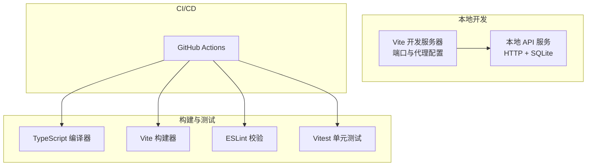
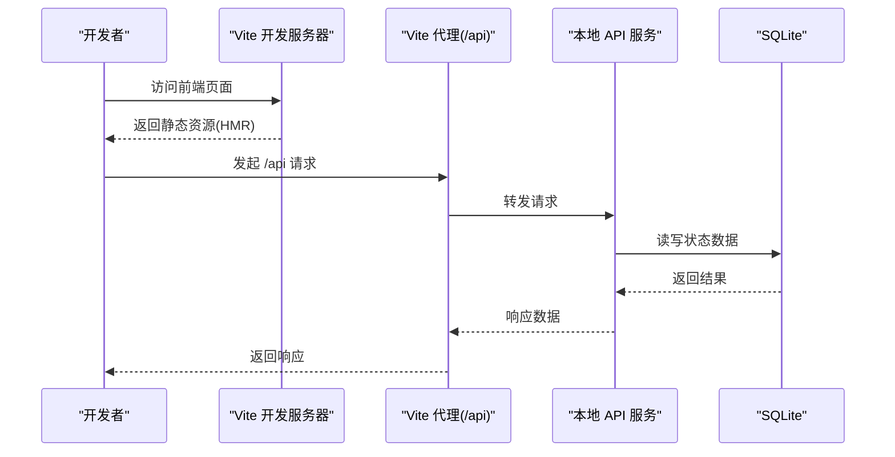
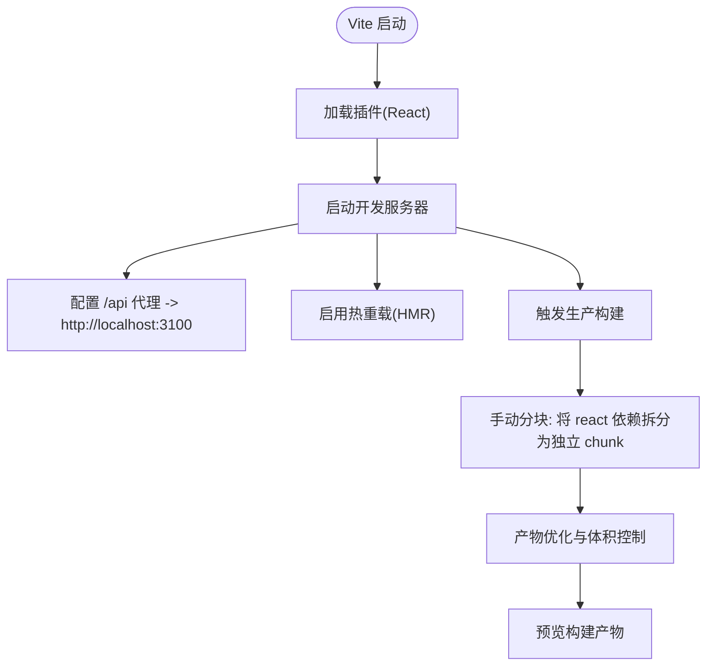
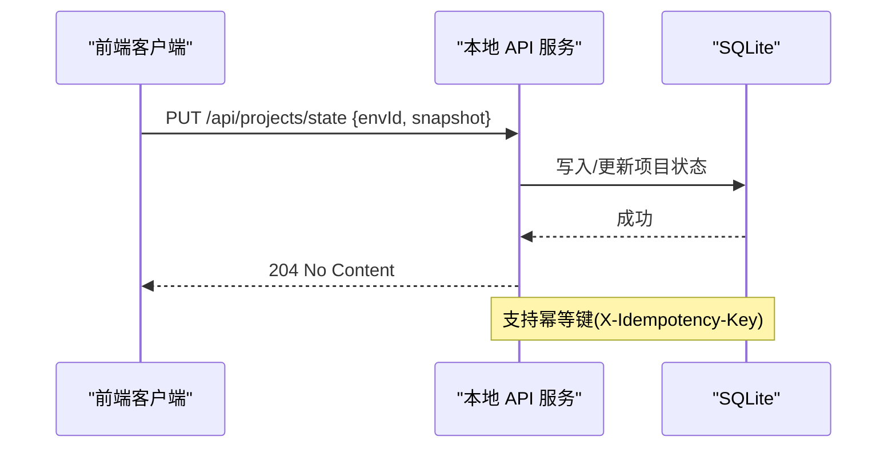
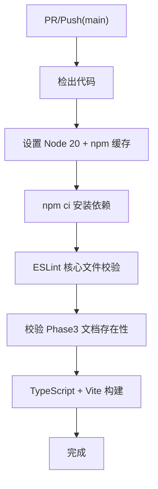
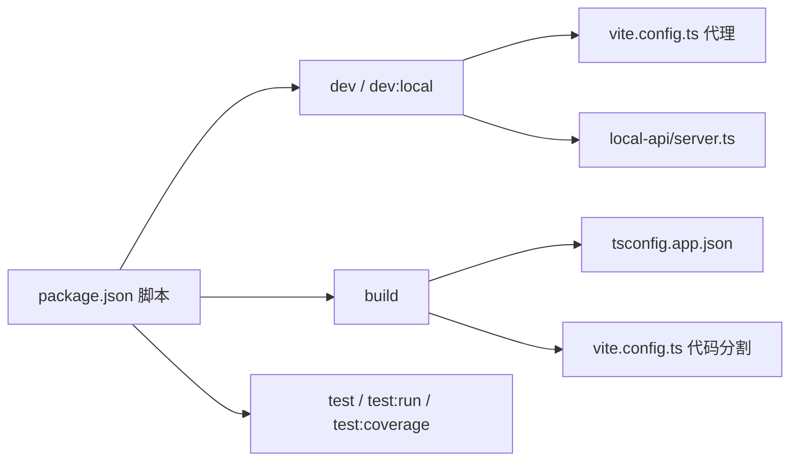

# 构建与部署

<cite>
**本文引用的文件**
- [vite.config.ts](file://vite.config.ts)
- [package.json](file://package.json)
- [.github/workflows/ci.yml](file://.github/workflows/ci.yml)
- [tailwind.config.js](file://tailwind.config.js)
- [tsconfig.json](file://tsconfig.json)
- [tsconfig.app.json](file://tsconfig.app.json)
- [eslint.config.js](file://eslint.config.js)
- [vitest.config.ts](file://vitest.config.ts)
- [local-api/server.ts](file://local-api/server.ts)
- [local-api/store/sqlite.ts](file://local-api/store/sqlite.ts)
</cite>

## 目录

1. [简介](#简介)
2. [项目结构](#项目结构)
3. [核心组件](#核心组件)
4. [架构总览](#架构总览)
5. [详细组件分析](#详细组件分析)
6. [依赖关系分析](#依赖关系分析)
7. [性能考量](#性能考量)
8. [故障排查指南](#故障排查指南)
9. [结论](#结论)
10. [附录](#附录)

## 简介

本指南面向 CodeBuddy 前端工程的构建与部署，覆盖 Vite 开发服务器与代理、热重载机制、生产构建流程（含代码压缩、资源优化、bundle 分析）、静态资源处理策略（图片、字体、CSS）、本地开发 API 的集成方式，以及 CI/CD 流水线配置要点。由于当前仓库未包含 Dockerfile 或容器化部署脚本，本指南不提供 Docker 镜像构建与多阶段优化的具体实现；但提供了可扩展的建议与最佳实践。

## 项目结构

前端采用 Vite + React 技术栈，配合 TypeScript、TailwindCSS、ESLint、Vitest 等工具链。本地开发通过 npm 脚本组合启动前端与本地 API，并通过 Vite 代理将 /api 请求转发到本地后端服务。CI 使用 GitHub Actions 执行质量门禁与构建。

**章节来源**

- [package.json:1-48](file://package.json#L1-L48)
- [vite.config.ts:1-35](file://vite.config.ts#L1-L35)
- [local-api/server.ts:1-414](file://local-api/server.ts#L1-L414)

## 核心组件

- Vite 构建配置：定义插件、开发服务器、代理、代码分割与 chunk 警告阈值。
- 本地 API 服务：基于 Node HTTP 与 SQLite，提供项目/任务/验收/结算/审计等状态接口，支持幂等性与 CORS。
- 类型与规范：TypeScript、ESLint、TailwindCSS、Vitest。
- CI：ESLint 核心文件校验、文档完整性检查、类型与构建验证。

**章节来源**

- [vite.config.ts:1-35](file://vite.config.ts#L1-L35)
- [package.json:1-48](file://package.json#L1-L48)
- [eslint.config.js:1-24](file://eslint.config.js#L1-L24)
- [tailwind.config.js:1-12](file://tailwind.config.js#L1-L12)
- [vitest.config.ts:1-20](file://vitest.config.ts#L1-L20)
- [.github/workflows/ci.yml:1-39](file://.github/workflows/ci.yml#L1-L39)

## 架构总览

下图展示了本地开发与 CI 构建的关键交互：

**图表来源**

- [vite.config.ts:7-14](file://vite.config.ts#L7-L14)
- [local-api/server.ts:338-386](file://local-api/server.ts#L338-L386)
- [local-api/store/sqlite.ts:18-42](file://local-api/store/sqlite.ts#L18-L42)

**章节来源**

- [vite.config.ts:1-35](file://vite.config.ts#L1-L35)
- [local-api/server.ts:1-414](file://local-api/server.ts#L1-L414)
- [local-api/store/sqlite.ts:1-99](file://local-api/store/sqlite.ts#L1-L99)

## 详细组件分析

### Vite 构建配置与开发服务器

- 插件：启用 React 插件以支持 JSX/TSX。
- 代理：将 /api 前缀请求代理至本地 API 服务，默认目标为 http://localhost:3100。
- 代码分割：通过手动分块策略将 React 生态核心库（react、react-dom）单独打包为独立 chunk，减少重复依赖与缓存命中成本。
- 性能阈值：提升 chunkSizeWarningLimit，配合懒加载降低误报风险。

**图表来源**

- [vite.config.ts:5-35](file://vite.config.ts#L5-L35)

**章节来源**

- [vite.config.ts:1-35](file://vite.config.ts#L1-L35)

### 本地 API 服务与数据库

- 服务职责：提供项目状态、任务状态、验收状态、结算状态、审计日志等接口；支持 GET/PUT/POST 方法与幂等键；内置健康检查。
- 数据存储：使用 better-sqlite3 连接 SQLite，WAL 模式提升并发；按需初始化表结构；清理过期幂等键。
- CORS：对预检与常规请求统一设置允许跨域头。
- 环境变量：通过 LOCAL_API_PORT 控制监听端口。

**图表来源**

- [local-api/server.ts:70-129](file://local-api/server.ts#L70-L129)
- [local-api/store/sqlite.ts:18-42](file://local-api/store/sqlite.ts#L18-L42)

**章节来源**

- [local-api/server.ts:1-414](file://local-api/server.ts#L1-L414)
- [local-api/store/sqlite.ts:1-99](file://local-api/store/sqlite.ts#L1-L99)

### TypeScript、ESLint、TailwindCSS、Vitest

- TypeScript：多项目引用配置，区分应用与 Node 工具链编译目标与模块解析策略。
- ESLint：推荐规则集与 React Hooks/Vite 刷新插件集成，忽略 dist 输出目录。
- TailwindCSS：content 覆盖 HTML 与 src 下所有 TSX 文件，确保按需生成样式。
- Vitest：JS DOM 环境、全局配置、覆盖率报告与排除规则。

**章节来源**

- [tsconfig.json:1-8](file://tsconfig.json#L1-L8)
- [tsconfig.app.json:1-29](file://tsconfig.app.json#L1-L29)
- [eslint.config.js:1-24](file://eslint.config.js#L1-L24)
- [tailwind.config.js:1-12](file://tailwind.config.js#L1-L12)
- [vitest.config.ts:1-20](file://vitest.config.ts#L1-L20)

### CI/CD 流水线

- 触发条件：PR 与推送到 main 分支。
- 步骤：检出代码、安装依赖、ESLint 核心文件校验、文档完整性检查、TypeScript 与 Vite 构建。
- 建议：可在构建后增加测试覆盖率与安全扫描步骤，以进一步完善质量门禁。

**图表来源**

- [.github/workflows/ci.yml:1-39](file://.github/workflows/ci.yml#L1-L39)

**章节来源**

- [.github/workflows/ci.yml:1-39](file://.github/workflows/ci.yml#L1-L39)

## 依赖关系分析

- 开发脚本：dev、dev:local（并行启动本地 API 与前端）、build、lint、preview、test、test:run、test:coverage。
- 本地 API：通过环境变量 LOCAL_API_PORT 控制端口；默认代理目标与之保持一致。
- 构建产物：Vite 输出静态资源，TypeScript 先行增量编译再交由 Vite 打包。

**图表来源**

- [package.json:6-16](file://package.json#L6-L16)
- [vite.config.ts:5-35](file://vite.config.ts#L5-L35)
- [local-api/server.ts:18](file://local-api/server.ts#L18)
- [tsconfig.app.json:1-29](file://tsconfig.app.json#L1-L29)

**章节来源**

- [package.json:1-48](file://package.json#L1-L48)
- [vite.config.ts:1-35](file://vite.config.ts#L1-L35)
- [local-api/server.ts:1-414](file://local-api/server.ts#L1-L414)
- [tsconfig.app.json:1-29](file://tsconfig.app.json#L1-L29)

## 性能考量

- 代码分割：将 react、react-dom 独立打包，提升浏览器缓存复用率，降低业务代码更新对第三方库缓存的影响。
- 懒加载：结合路由或组件级动态导入，进一步缩小首屏 bundle 体积。
- chunk 警告阈值：适当提高阈值以配合懒加载策略，避免误报。
- CSS 按需生成：Tailwind content 覆盖范围明确，避免无用样式进入产物。
- 静态资源优化：建议在生产构建中启用资源内联阈值与压缩策略（如 Vite 插件），并结合 CDN 与缓存头策略。
- 代理与 HMR：开发时仅代理必要路径，避免不必要的网络开销；HMR 仅在开发环境生效。

**章节来源**

- [vite.config.ts:15-33](file://vite.config.ts#L15-L33)
- [tailwind.config.js:3-6](file://tailwind.config.js#L3-L6)

## 故障排查指南

- 代理 404/跨域问题
  - 确认 Vite 代理配置的 target 与本地 API 端口一致。
  - 检查前端请求是否以 /api 前缀发起。
- 本地 API 无法启动
  - 检查 LOCAL_API_PORT 是否被占用；确认 SQLite schema 初始化成功。
- 幂等性无效
  - 确认请求头携带 X-Idempotency-Key；查看幂等键是否过期清理。
- 构建失败
  - 先运行 TypeScript 增量编译，再进行 Vite 构建；确保 ESLint 无严重错误。
- CI 失败
  - 检查 ESLint 核心文件列表是否匹配实际文件；确认 Phase3 文档存在。

**章节来源**

- [vite.config.ts:7-14](file://vite.config.ts#L7-L14)
- [local-api/server.ts:18](file://local-api/server.ts#L18)
- [local-api/server.ts:87-125](file://local-api/server.ts#L87-L125)
- [local-api/store/sqlite.ts:68-80](file://local-api/store/sqlite.ts#L68-L80)
- [.github/workflows/ci.yml:26-38](file://.github/workflows/ci.yml#L26-L38)

## 结论

本指南系统梳理了 CodeBuddy 前端的构建与部署要点：Vite 的开发代理与代码分割策略、本地 API 的幂等与 CORS 设计、TypeScript 与 ESLint/Tailwind/Vitest 的工程化配置，以及 CI 的质量门禁流程。建议在现有基础上补充生产构建的资源优化与缓存策略，并在后续迭代中引入容器化与更完善的 CI/CD 流水线。

## 附录

- 环境变量
  - LOCAL_API_PORT：本地 API 监听端口，默认 3100。
- 代理配置
  - /api 前缀代理至 http://localhost:3100。
- 本地 API 端点示例
  - GET/PUT /api/projects/state?envId=...
  - GET/PUT /api/tasks/state?envId=...&contextKey=...
  - GET/PUT /api/acceptance/state?envId=...&projectCode=...
  - GET /api/settlement/state?envId=...
  - POST /api/audit/logs
  - GET /health

**章节来源**

- [local-api/server.ts:18](file://local-api/server.ts#L18)
- [local-api/server.ts:338-386](file://local-api/server.ts#L338-L386)
