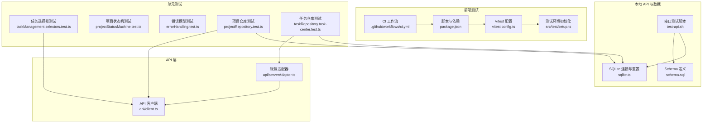
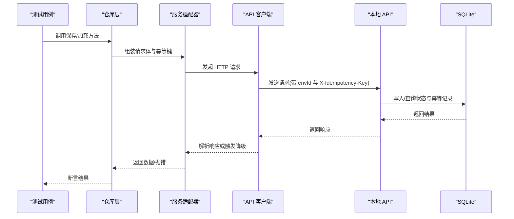
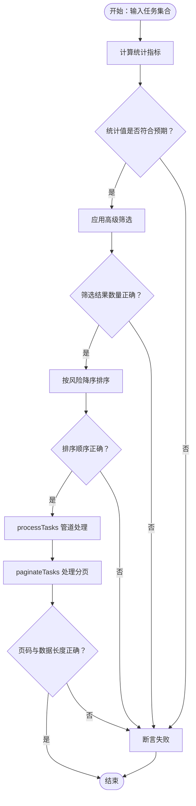
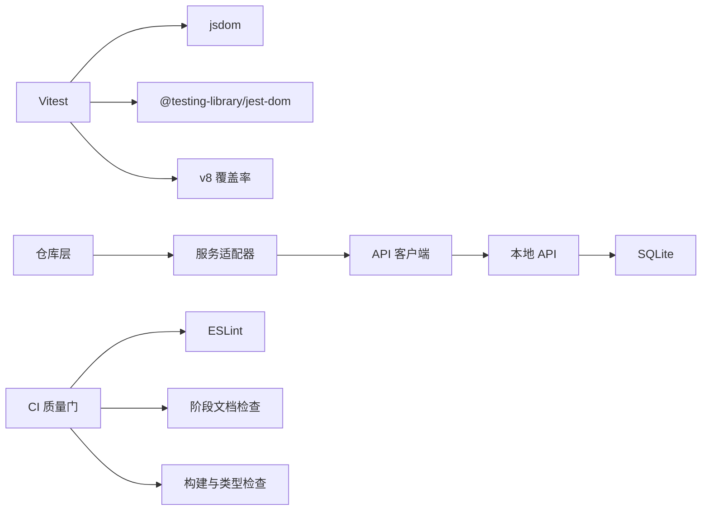

# 测试策略与实践

<cite>
**本文引用的文件**
- [vitest.config.ts](file://vitest.config.ts)
- [package.json](file://package.json)
- [.github/workflows/ci.yml](file://.github/workflows/ci.yml)
- [src/test/setup.ts](file://src/test/setup.ts)
- [src/components/task/__tests__/taskManagement.selectors.test.ts](file://src/components/task/__tests__/taskManagement.selectors.test.ts)
- [src/domain/__tests__/projectStatusMachine.test.ts](file://src/domain/__tests__/projectStatusMachine.test.ts)
- [src/services/__tests__/errorHandling.test.ts](file://src/services/__tests__/errorHandling.test.ts)
- [src/services/__tests__/projectRepository.test.ts](file://src/services/__tests__/projectRepository.test.ts)
- [src/services/__tests__/taskRepository.task-center.test.ts](file://src/services/__tests__/taskRepository.task-center.test.ts)
- [local-api/test-api.sh](file://local-api/test-api.sh)
- [local-api/store/schema.sql](file://local-api/store/schema.sql)
- [local-api/store/sqlite.ts](file://local-api/store/sqlite.ts)
- [src/services/api/client.ts](file://src/services/api/client.ts)
- [src/services/api/serverAdapter.ts](file://src/services/api/serverAdapter.ts)
</cite>

## 目录

1. [简介](#简介)
2. [项目结构](#项目结构)
3. [核心组件](#核心组件)
4. [架构总览](#架构总览)
5. [详细组件分析](#详细组件分析)
6. [依赖关系分析](#依赖关系分析)
7. [性能考虑](#性能考虑)
8. [故障排查指南](#故障排查指南)
9. [结论](#结论)
10. [附录](#附录)

## 简介

本文件系统化梳理 CodeBuddy 项目的测试策略与实践，覆盖以下方面：

- Vitest 配置与使用：测试环境、覆盖率配置、测试命令与报告
- 单元测试编写规范：用例设计、Mock 数据准备、断言策略
- 集成测试方案：组件测试、API 测试、端到端测试
- 测试数据管理：测试数据库、Mock 服务、测试工具
- 持续集成中的测试流程：自动化执行与报告生成
- 性能与压力测试：实施方法与注意事项
- 最佳实践与常见陷阱：避免低效与脆弱测试

## 项目结构

项目采用“按功能域划分”的组织方式，测试文件遵循就近原则放置于对应源码目录下，便于维护与定位。

图表来源

- [vitest.config.ts:1-20](file://vitest.config.ts#L1-L20)
- [src/test/setup.ts:1-2](file://src/test/setup.ts#L1-L2)
- [package.json:1-48](file://package.json#L1-L48)
- [.github/workflows/ci.yml:1-39](file://.github/workflows/ci.yml#L1-L39)
- [src/components/task/**tests**/taskManagement.selectors.test.ts:1-102](file://src/components/task/__tests__/taskManagement.selectors.test.ts#L1-L102)
- [src/domain/**tests**/projectStatusMachine.test.ts:1-125](file://src/domain/__tests__/projectStatusMachine.test.ts#L1-L125)
- [src/services/**tests**/errorHandling.test.ts:1-128](file://src/services/__tests__/errorHandling.test.ts#L1-L128)
- [src/services/**tests**/projectRepository.test.ts:1-122](file://src/services/__tests__/projectRepository.test.ts#L1-L122)
- [src/services/**tests**/taskRepository.task-center.test.ts:1-99](file://src/services/__tests__/taskRepository.task-center.test.ts#L1-L99)
- [local-api/store/schema.sql:1-72](file://local-api/store/schema.sql#L1-L72)
- [local-api/store/sqlite.ts:1-99](file://local-api/store/sqlite.ts#L1-L99)
- [local-api/test-api.sh:1-156](file://local-api/test-api.sh#L1-L156)
- [src/services/api/client.ts:1-172](file://src/services/api/client.ts#L1-L172)
- [src/services/api/serverAdapter.ts:1-87](file://src/services/api/serverAdapter.ts#L1-L87)

章节来源

- [vitest.config.ts:1-20](file://vitest.config.ts#L1-L20)
- [package.json:1-48](file://package.json#L1-L48)
- [.github/workflows/ci.yml:1-39](file://.github/workflows/ci.yml#L1-L39)

## 核心组件

- 测试运行器与配置
  - 使用 Vitest，启用 jsdom 环境、全局断言、setupFiles 引入 @testing-library/jest-dom
  - 覆盖率提供者为 v8，输出文本、JSON、HTML 报告，并排除 node_modules 与 src/test 目录
- 测试脚本与依赖
  - 提供 test、test:run、test:coverage 三个脚本，便于本地与 CI 执行
- 测试环境初始化
  - 在 setup.ts 中引入 jest-dom，统一断言扩展（如 toBeInTheDocument）

章节来源

- [vitest.config.ts:1-20](file://vitest.config.ts#L1-L20)
- [src/test/setup.ts:1-2](file://src/test/setup.ts#L1-L2)
- [package.json:13-16](file://package.json#L13-L16)

## 架构总览

测试体系围绕“单元测试 + 集成测试 + API/端到端测试 + CI 质量门禁”展开，前端通过 serverAdapter 调用本地 API，本地 API 使用 SQLite 存储状态与幂等记录，测试脚本对核心接口进行幂等性与数据一致性验证。

图表来源

- [src/services/api/serverAdapter.ts:34-86](file://src/services/api/serverAdapter.ts#L34-L86)
- [src/services/api/client.ts:83-171](file://src/services/api/client.ts#L83-L171)
- [local-api/store/sqlite.ts:18-52](file://local-api/store/sqlite.ts#L18-L52)
- [local-api/test-api.sh:25-64](file://local-api/test-api.sh#L25-L64)

## 详细组件分析

### 单元测试：任务选择器与统计

- 目标：验证任务统计、高级筛选、排序与分页逻辑
- 设计要点：
  - 使用工厂函数构建测试数据，保证用例独立与可复现
  - 针对边界场景（越界页码）进行断言
  - 对组合流程（筛选+排序+分页）进行端到端断言
- 断言策略：数量断言、顺序断言、字段断言、分页断言

图表来源

- [src/components/task/**tests**/taskManagement.selectors.test.ts:35-101](file://src/components/task/__tests__/taskManagement.selectors.test.ts#L35-L101)

章节来源

- [src/components/task/**tests**/taskManagement.selectors.test.ts:1-102](file://src/components/task/__tests__/taskManagement.selectors.test.ts#L1-L102)

### 单元测试：项目状态机

- 目标：验证状态流转守卫、可用流转集合与守卫代码解析
- 设计要点：
  - 使用上下文对象模拟不同业务条件，覆盖“允许/拒绝/需要原因”等分支
  - 对可用流转集合进行集合断言，确保包含/不包含特定目标状态
- 断言策略：布尔 ok 字段、reason 文本包含、可用流转长度与目标状态集合

章节来源

- [src/domain/**tests**/projectStatusMachine.test.ts:1-125](file://src/domain/__tests__/projectStatusMachine.test.ts#L1-L125)

### 单元测试：错误处理模型

- 目标：确保错误具备结构化字段，便于排障与监控
- 设计要点：
  - 创建不同类型的结构化错误（网络、验证、幂等冲突），断言字段完整性
  - 错误分类断言：区分网络错误、业务错误、幂等冲突（需同时满足错误码与幂等键）
  - 日志字符串断言：包含 scope、scenario、HTTP 状态、幂等键等关键信息
- 断言策略：字段存在性与值断言、布尔表达式断言、字符串包含断言

章节来源

- [src/services/**tests**/errorHandling.test.ts:1-128](file://src/services/__tests__/errorHandling.test.ts#L1-L128)

### 单元测试：项目仓库（localStorage）

- 目标：验证项目状态与日志的保存与加载，以及无数据时的回退行为
- 设计要点：
  - beforeEach 清空 localStorage，确保用例隔离
  - 保存后断言本地存储键存在且内容可解析；加载时断言返回初始项目列表
  - 幂等性说明：当前实现不接受幂等键参数（仅远程调用使用）
- 断言策略：键存在性、JSON 可解析性、数组长度与字段断言

章节来源

- [src/services/**tests**/projectRepository.test.ts:1-122](file://src/services/__tests__/projectRepository.test.ts#L1-L122)

### 单元测试：任务仓库（Mock 适配器）

- 目标：验证任务状态保存、旧版快照兼容、操作日志追加
- 设计要点：
  - 使用 vi.mock 替换 serverAdapter，注入 hoisted 的 Mock 对象
  - 保存任务时断言 schemaVersion 与任务数组长度；同时断言远程调用被调用
  - 兼容旧版数组快照读取；操作日志断言保留最近日志
- 断言策略：调用次数与参数断言、本地存储键存在性与内容断言

章节来源

- [src/services/**tests**/taskRepository.task-center.test.ts:1-99](file://src/services/__tests__/taskRepository.task-center.test.ts#L1-L99)

### API 测试：本地接口与幂等

- 目标：验证项目、任务、验收、结算建议与审计日志接口，以及幂等机制
- 设计要点：
  - 健康检查、状态读取、PUT 保存、幂等重放（相同 X-Idempotency-Key）
  - 验证 HTTP 状态码与响应体结构
- 断言策略：HTTP 状态断言、响应体字段断言、幂等重放返回一致

章节来源

- [local-api/test-api.sh:1-156](file://local-api/test-api.sh#L1-L156)

### 测试数据管理：SQLite 与 Schema

- 目标：提供稳定的测试数据存储与清理能力
- 设计要点：
  - 初始化时启用 WAL 模式以提升并发；执行 schema.sql 创建表与索引
  - 提供 resetDatabase 重置所有状态表与审计日志，便于测试隔离
  - 幂等键表支持过期清理，避免历史数据膨胀
- 断言策略：通过接口测试验证写入/读取与幂等一致性

章节来源

- [local-api/store/schema.sql:1-72](file://local-api/store/schema.sql#L1-L72)
- [local-api/store/sqlite.ts:18-99](file://local-api/store/sqlite.ts#L18-L99)

### API 客户端与适配器：重试、降级与幂等

- 目标：保障网络异常下的稳定性与幂等性
- 设计要点：
  - 默认重试次数与可重试状态集合；网络错误与可重试状态自动重试
  - 未配置云端环境时主动降级并触发自定义事件，便于前端感知
  - 服务适配器统一拼接 envId 与幂等键，客户端负责幂等头注入
- 断言策略：重试次数与等待时间、降级事件触发、幂等键生成与传递

章节来源

- [src/services/api/client.ts:32-171](file://src/services/api/client.ts#L32-L171)
- [src/services/api/serverAdapter.ts:34-86](file://src/services/api/serverAdapter.ts#L34-L86)

## 依赖关系分析

- 测试对环境与工具的依赖
  - Vitest + jsdom + @testing-library/jest-dom
  - 覆盖率 v8 + 多格式输出
- 测试对业务模块的依赖
  - 仓库层依赖 API 客户端与服务适配器
  - 本地 API 依赖 SQLite 与 Schema
- CI 对质量门禁的依赖
  - ESLint 核心链路校验、文档存在性检查、构建与类型检查

图表来源

- [vitest.config.ts:4-19](file://vitest.config.ts#L4-L19)
- [package.json:22-45](file://package.json#L22-L45)
- [src/services/api/serverAdapter.ts:5-86](file://src/services/api/serverAdapter.ts#L5-L86)
- [src/services/api/client.ts:50-81](file://src/services/api/client.ts#L50-L81)
- [local-api/store/sqlite.ts:18-52](file://local-api/store/sqlite.ts#L18-L52)
- [.github/workflows/ci.yml:26-38](file://.github/workflows/ci.yml#L26-L38)

章节来源

- [vitest.config.ts:1-20](file://vitest.config.ts#L1-L20)
- [package.json:1-48](file://package.json#L1-L48)
- [.github/workflows/ci.yml:1-39](file://.github/workflows/ci.yml#L1-L39)

## 性能考虑

- 单元测试
  - 使用工厂函数与最小化数据集，避免昂贵的外部依赖
  - 对纯函数与选择器进行快速断言，减少异步与 DOM 操作
- 集成测试
  - 优先使用内存/本地存储替代真实数据库，必要时使用 SQLite 快速重置
  - 控制重试次数与等待时间，避免测试执行时间过长
- API 测试
  - 通过本地 API 快速验证接口契约与幂等性，减少对外部服务的依赖
- 覆盖率
  - 合理排除测试与第三方目录，聚焦业务代码覆盖率

## 故障排查指南

- 测试无法启动或环境报错
  - 检查 jsdom 环境与 setupFiles 是否正确加载
  - 确认 @testing-library/jest-dom 已安装并引入
- 覆盖率报告缺失
  - 确认覆盖率 provider 为 v8，输出格式包含 html/json/text
  - 排除目录配置是否正确，避免误排除业务代码
- 本地 API 无法访问或数据不一致
  - 检查本地数据库初始化与 schema 执行
  - 使用 resetDatabase 清理脏数据，再重跑测试
- 幂等性测试失败
  - 确认 X-Idempotency-Key 头正确传递
  - 验证服务端幂等记录表是否正确去重
- CI 失败
  - 查看 ESLint 核心链路与文档检查步骤
  - 确认构建与类型检查通过后再进行测试

章节来源

- [vitest.config.ts:10-19](file://vitest.config.ts#L10-L19)
- [src/test/setup.ts:1-2](file://src/test/setup.ts#L1-L2)
- [local-api/store/sqlite.ts:85-98](file://local-api/store/sqlite.ts#L85-L98)
- [local-api/test-api.sh:25-64](file://local-api/test-api.sh#L25-L64)
- [.github/workflows/ci.yml:26-38](file://.github/workflows/ci.yml#L26-L38)

## 结论

本项目测试体系以 Vitest 为核心，结合本地 API 与 SQLite，实现了从单元到集成再到 API 的多层测试覆盖。通过明确的测试规范、Mock 策略与幂等机制，既保证了测试的稳定性与可维护性，也为后续扩展（如端到端测试）提供了清晰的落点。建议在现有基础上逐步引入 Playwright 端到端测试，并完善性能与压力测试基线，持续提升交付质量与可靠性。

## 附录

- 测试命令参考
  - 本地开发：npm run test（带 UI）
  - 运行测试：npm run test:run
  - 生成覆盖率：npm run test:coverage
- CI 质量门禁
  - ESLint 核心链路校验
  - 阶段文档存在性检查
  - 构建与类型检查

章节来源

- [package.json:13-16](file://package.json#L13-L16)
- [.github/workflows/ci.yml:26-38](file://.github/workflows/ci.yml#L26-L38)
