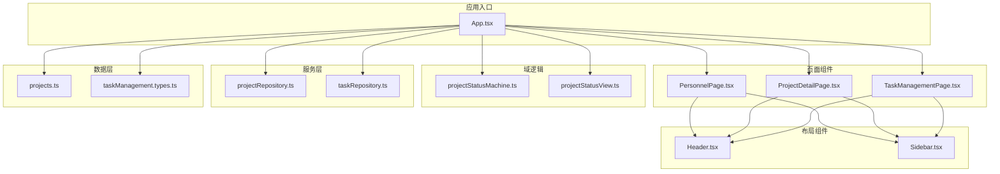
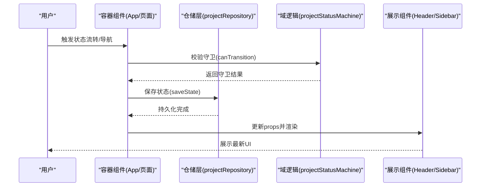
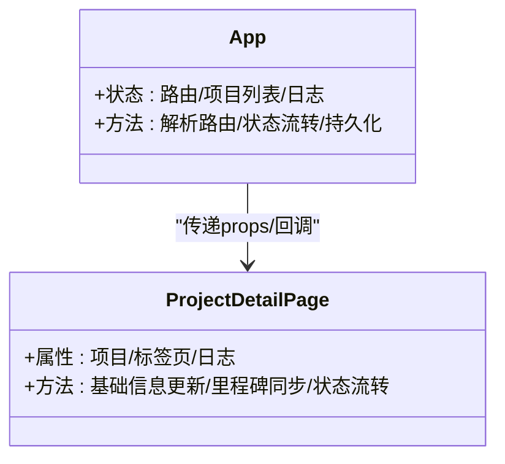
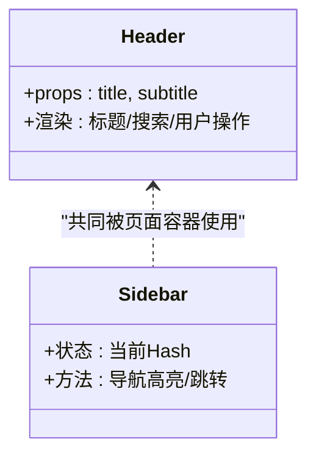
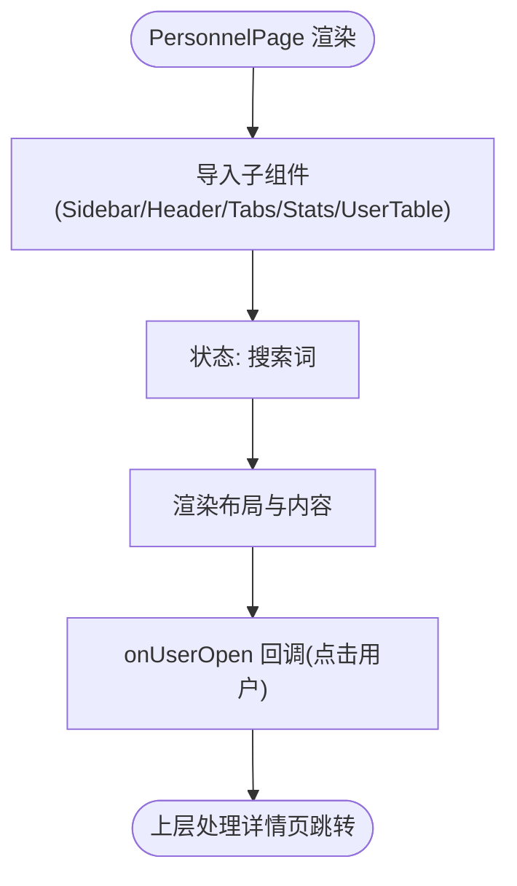
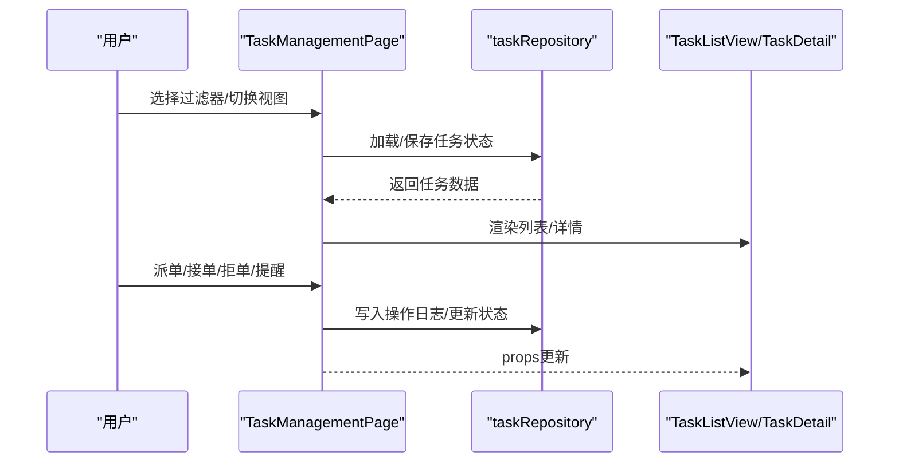
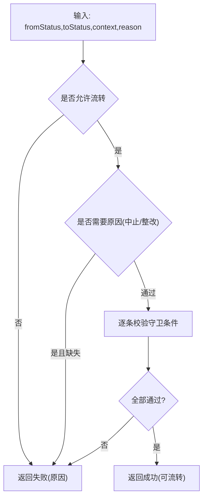
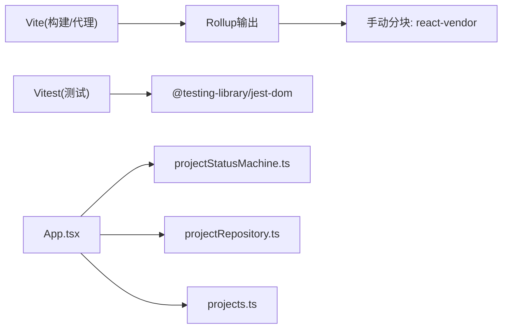

# 组件开发流程

<cite>
**本文引用的文件**
- [README.md](file://README.md)
- [package.json](file://package.json)
- [vite.config.ts](file://vite.config.ts)
- [vitest.config.ts](file://vitest.config.ts)
- [src/App.tsx](file://src/App.tsx)
- [src/components/layout/Header.tsx](file://src/components/layout/Header.tsx)
- [src/components/layout/Sidebar.tsx](file://src/components/layout/Sidebar.tsx)
- [src/components/personnel/PersonnelPage.tsx](file://src/components/personnel/PersonnelPage.tsx)
- [src/components/project/ProjectDetailPage.tsx](file://src/components/project/ProjectDetailPage.tsx)
- [src/components/task/TaskManagementPage.tsx](file://src/components/task/TaskManagementPage.tsx)
- [src/services/repositories/projectRepository.ts](file://src/services/repositories/projectRepository.ts)
- [src/domain/projectStatusMachine.ts](file://src/domain/projectStatusMachine.ts)
- [src/data/projects.ts](file://src/data/projects.ts)
- [src/test/setup.ts](file://src/test/setup.ts)
</cite>

## 目录

1. [简介](#简介)
2. [项目结构](#项目结构)
3. [核心组件](#核心组件)
4. [架构总览](#架构总览)
5. [组件详解](#组件详解)
6. [依赖关系分析](#依赖关系分析)
7. [性能考量](#性能考量)
8. [故障排查指南](#故障排查指南)
9. [结论](#结论)
10. [附录](#附录)

## 简介

本指南面向CodeBuddy项目中的React组件开发，系统讲解从组件创建、设计模式、通信机制、测试策略、复用与组合、性能优化到文档与Storybook实践的全流程方法论。结合项目实际的页面组件、布局组件、状态机与仓储层，帮助开发者高效、高质量地构建前端组件。

## 项目结构

项目采用“按功能域分层 + 按页面组件组织”的结构：

- 组件层：src/components 下按业务域划分（如 personnel、project、task、layout 等）
- 域逻辑层：src/domain（如项目状态机）
- 服务层：src/services（API客户端、仓储层）
- 数据层：src/data（模拟数据、工厂与类型）
- 应用入口：src/App.tsx（路由与页面懒加载）

**图表来源**

- [src/App.tsx:1-800](file://src/App.tsx#L1-L800)
- [src/components/personnel/PersonnelPage.tsx:1-37](file://src/components/personnel/PersonnelPage.tsx#L1-L37)
- [src/components/project/ProjectDetailPage.tsx:1-800](file://src/components/project/ProjectDetailPage.tsx#L1-L800)
- [src/components/task/TaskManagementPage.tsx:1-800](file://src/components/task/TaskManagementPage.tsx#L1-L800)
- [src/components/layout/Header.tsx:1-37](file://src/components/layout/Header.tsx#L1-L37)
- [src/components/layout/Sidebar.tsx:1-108](file://src/components/layout/Sidebar.tsx#L1-L108)
- [src/domain/projectStatusMachine.ts:1-164](file://src/domain/projectStatusMachine.ts#L1-L164)
- [src/services/repositories/projectRepository.ts:1-90](file://src/services/repositories/projectRepository.ts#L1-L90)
- [src/data/projects.ts:1-451](file://src/data/projects.ts#L1-L451)

**章节来源**

- [README.md:55-113](file://README.md#L55-L113)
- [src/App.tsx:1-800](file://src/App.tsx#L1-L800)

## 核心组件

- 页面容器组件：负责路由解析、状态管理、业务逻辑编排（如 App.tsx、ProjectDetailPage.tsx、TaskManagementPage.tsx）
- 展示组件：负责UI渲染与交互（如 Header.tsx、Sidebar.tsx、PersonnelPage.tsx）
- 仓储与域逻辑：封装状态机守卫、本地/远程状态持久化（如 projectRepository.ts、projectStatusMachine.ts、projects.ts）

关键点：

- 页面容器组件承担“状态提升”与“事件编排”，展示组件专注“数据呈现”
- 通过props向下传递数据，通过回调向上冒泡事件
- 使用懒加载与代码分割降低首屏体积

**章节来源**

- [src/App.tsx:1-800](file://src/App.tsx#L1-L800)
- [src/components/layout/Header.tsx:1-37](file://src/components/layout/Header.tsx#L1-L37)
- [src/components/layout/Sidebar.tsx:1-108](file://src/components/layout/Sidebar.tsx#L1-L108)
- [src/components/personnel/PersonnelPage.tsx:1-37](file://src/components/personnel/PersonnelPage.tsx#L1-L37)
- [src/services/repositories/projectRepository.ts:1-90](file://src/services/repositories/projectRepository.ts#L1-L90)
- [src/domain/projectStatusMachine.ts:1-164](file://src/domain/projectStatusMachine.ts#L1-L164)
- [src/data/projects.ts:1-451](file://src/data/projects.ts#L1-L451)

## 架构总览

应用采用“容器-展示”分层与“仓储-域逻辑-服务-组件”协作模式：

- 容器组件（App、各页面）负责状态与路由
- 展示组件接收props并触发回调
- 仓储层负责本地/远程状态持久化与降级
- 域逻辑层提供状态机守卫与计算
- 构建与测试分别由Vite与Vitest负责

**图表来源**

- [src/App.tsx:439-504](file://src/App.tsx#L439-L504)
- [src/domain/projectStatusMachine.ts:105-163](file://src/domain/projectStatusMachine.ts#L105-L163)
- [src/services/repositories/projectRepository.ts:76-88](file://src/services/repositories/projectRepository.ts#L76-L88)
- [src/components/layout/Header.tsx:1-37](file://src/components/layout/Header.tsx#L1-L37)
- [src/components/layout/Sidebar.tsx:1-108](file://src/components/layout/Sidebar.tsx#L1-L108)

## 组件详解

### 页面容器组件：App 与 ProjectDetailPage

- App：负责路由解析、Hash变化监听、远程状态拉取与本地持久化、项目状态机编排
- ProjectDetailPage：作为项目详情的容器，聚合多个展示卡片与视图，暴露回调给子组件

**图表来源**

- [src/App.tsx:346-504](file://src/App.tsx#L346-L504)
- [src/components/project/ProjectDetailPage.tsx:103-115](file://src/components/project/ProjectDetailPage.tsx#L103-L115)

**章节来源**

- [src/App.tsx:346-504](file://src/App.tsx#L346-L504)
- [src/components/project/ProjectDetailPage.tsx:103-115](file://src/components/project/ProjectDetailPage.tsx#L103-L115)

### 展示组件：Header 与 Sidebar

- Header：接收标题与副标题，渲染顶部区域
- Sidebar：根据当前Hash高亮导航项，支持跳转

**图表来源**

- [src/components/layout/Header.tsx:1-37](file://src/components/layout/Header.tsx#L1-L37)
- [src/components/layout/Sidebar.tsx:1-108](file://src/components/layout/Sidebar.tsx#L1-L108)

**章节来源**

- [src/components/layout/Header.tsx:1-37](file://src/components/layout/Header.tsx#L1-L37)
- [src/components/layout/Sidebar.tsx:1-108](file://src/components/layout/Sidebar.tsx#L1-L108)

### 人员管理页面：PersonnelPage

- 职责：整合侧边栏、头部、标签页、统计卡片与用户表格
- 交互：搜索框状态提升至容器，回调打开用户详情

**图表来源**

- [src/components/personnel/PersonnelPage.tsx:1-37](file://src/components/personnel/PersonnelPage.tsx#L1-L37)

**章节来源**

- [src/components/personnel/PersonnelPage.tsx:1-37](file://src/components/personnel/PersonnelPage.tsx#L1-L37)

### 任务中心页面：TaskManagementPage

- 职责：任务列表、统计、工具栏、详情弹窗与状态机驱动的流转
- 特点：基于Hash上下文维护过滤器、分页与活动任务；封装派单、接单、拒单、提醒等动作

**图表来源**

- [src/components/task/TaskManagementPage.tsx:196-311](file://src/components/task/TaskManagementPage.tsx#L196-L311)
- [src/services/repositories/projectRepository.ts:76-88](file://src/services/repositories/projectRepository.ts#L76-L88)

**章节来源**

- [src/components/task/TaskManagementPage.tsx:196-311](file://src/components/task/TaskManagementPage.tsx#L196-L311)

### 项目状态机与仓储层

- 状态机：定义状态集合、允许流转、守卫条件与进入钩子
- 仓储：封装本地/远程状态读写与错误降级

**图表来源**

- [src/domain/projectStatusMachine.ts:105-163](file://src/domain/projectStatusMachine.ts#L105-L163)

**章节来源**

- [src/domain/projectStatusMachine.ts:1-164](file://src/domain/projectStatusMachine.ts#L1-L164)
- [src/services/repositories/projectRepository.ts:1-90](file://src/services/repositories/projectRepository.ts#L1-L90)
- [src/data/projects.ts:1-451](file://src/data/projects.ts#L1-L451)

## 依赖关系分析

- 组件耦合：页面容器对展示组件松耦合（通过props/回调），对域逻辑与仓储紧耦合（状态与业务）
- 外部依赖：Vite（构建/代理）、Vitest（测试）、Tailwind（样式）
- 代码分割：Vite按需打包React生态与业务代码，减少主包体积

**图表来源**

- [vite.config.ts:15-33](file://vite.config.ts#L15-L33)
- [vitest.config.ts:1-20](file://vitest.config.ts#L1-L20)
- [src/App.tsx:1-800](file://src/App.tsx#L1-L800)
- [src/domain/projectStatusMachine.ts:1-164](file://src/domain/projectStatusMachine.ts#L1-L164)
- [src/services/repositories/projectRepository.ts:1-90](file://src/services/repositories/projectRepository.ts#L1-L90)
- [src/data/projects.ts:1-451](file://src/data/projects.ts#L1-L451)

**章节来源**

- [vite.config.ts:1-35](file://vite.config.ts#L1-L35)
- [vitest.config.ts:1-20](file://vitest.config.ts#L1-L20)
- [package.json:1-48](file://package.json#L1-L48)

## 性能考量

- 懒加载与代码分割：页面组件全部按需加载，React生态独立chunk
- 首屏优化：主包体积与首屏体积显著下降
- 计算优化：useMemo/useCallback在容器组件中避免重复计算
- 本地降级：网络异常时自动降级到本地缓存，保证可用性

**章节来源**

- [README.md:156-166](file://README.md#L156-L166)
- [src/App.tsx:422-437](file://src/App.tsx#L422-L437)
- [src/services/repositories/projectRepository.ts:65-73](file://src/services/repositories/projectRepository.ts#L65-L73)

## 故障排查指南

常见问题与定位思路：

- 网络请求失败：检查本地后端是否启动、代理配置、幂等键
- 状态流转失败：检查守卫条件、项目里程碑/任务树/验收结果等字段
- 本地缓存不一致：清理localStorage、刷新页面、检查仓储层返回值

**章节来源**

- [README.md:227-243](file://README.md#L227-L243)
- [src/domain/projectStatusMachine.ts:119-160](file://src/domain/projectStatusMachine.ts#L119-L160)
- [src/services/repositories/projectRepository.ts:14-38](file://src/services/repositories/projectRepository.ts#L14-L38)

## 结论

本指南提供了从组件创建到测试、性能优化与文档化的完整流程。通过“容器-展示”分层、状态机守卫与仓储降级，项目实现了高内聚、低耦合与强健的运行时表现。建议在新组件开发中遵循本文的设计原则与实践路径。

## 附录

### 组件创建步骤（函数组件优先）

- 选择组件类型：优先函数组件，必要时再考虑类组件
- 设计职责：单一职责，明确props与回调
- 组合与复用：抽离通用展示组件，使用Hook抽象逻辑
- 性能优化：合理使用memo、useMemo、useCallback
- 测试策略：单元测试（组件行为）、集成测试（容器+仓储）、端到端测试（关键流程）

### 函数组件 vs 类组件

- 函数组件：更易测试、更利于Hook组合、更贴近现代React
- 类组件：仅在需要生命周期或内部状态时考虑

### 设计模式

- 容器组件：App、ProjectDetailPage、TaskManagementPage
- 展示组件：Header、Sidebar、PersonnelPage
- 高阶组件：本项目未直接使用，可通过Hook与Render Props替代

### 组件通信机制

- Props传递：父传子（数据与回调）
- 事件处理：子组件通过回调向上冒泡
- 状态提升：App/页面容器集中管理状态与副作用

### 测试策略

- 单元测试：组件行为与纯函数（如状态机守卫）
- 集成测试：容器组件与仓储层交互
- 端到端测试：关键业务流程（如项目状态流转）

**章节来源**

- [vitest.config.ts:1-20](file://vitest.config.ts#L1-L20)
- [src/test/setup.ts:1-2](file://src/test/setup.ts#L1-L2)

### 组件复用与组合

- Hook：抽取状态与副作用（如任务派单、接单、提醒）
- 自定义Hook：封装复杂逻辑（如任务过滤、分页、日志拼装）

### 组件性能优化

- memoization：useMemo/useCallback
- 懒加载：页面组件按需加载
- 代码分割：React生态独立chunk

### 组件文档与Storybook

- 文档规范：组件API、Props说明、事件回调、使用示例
- Storybook：为展示组件编写故事，覆盖不同状态与交互
