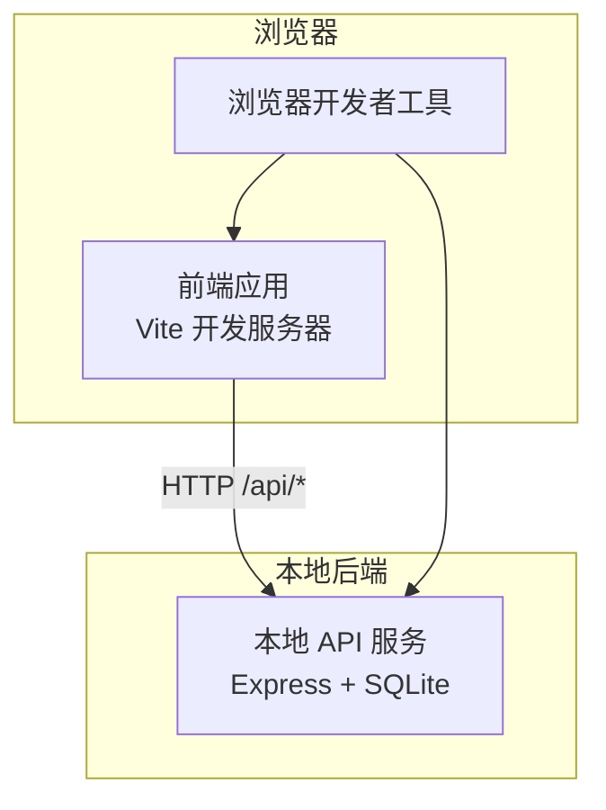
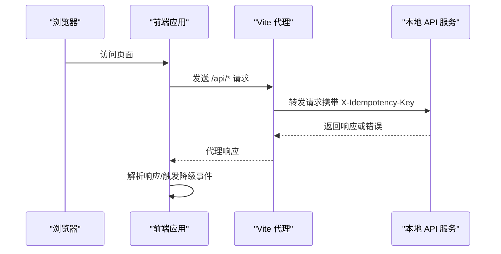
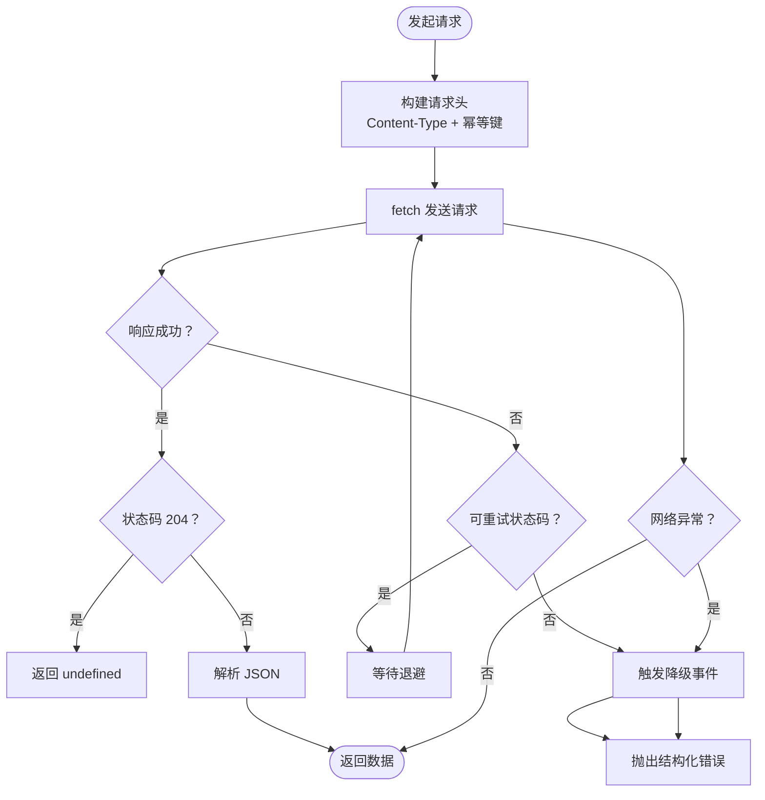
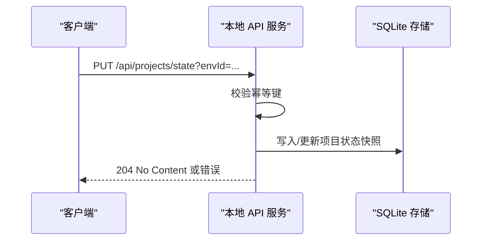
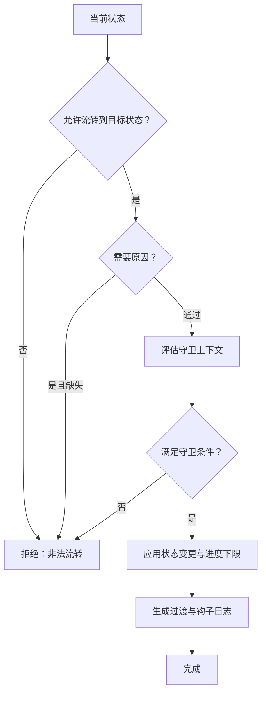
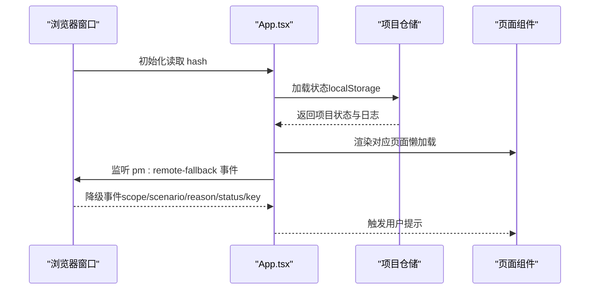
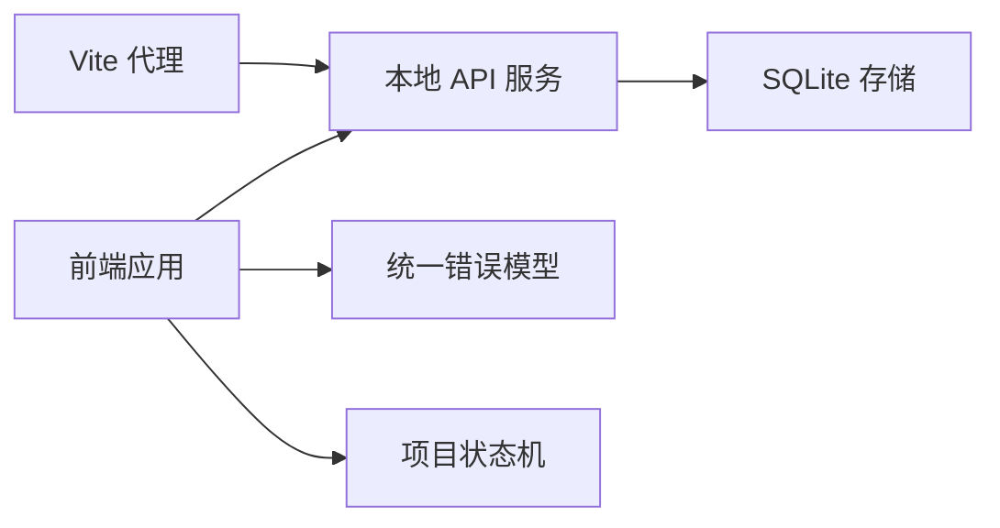

# 调试与开发工具

<cite>
**本文引用的文件**
- [package.json](file://package.json)
- [vite.config.ts](file://vite.config.ts)
- [README.md](file://README.md)
- [CODEBUDDY.md](file://CODEBUDDY.md)
- [local-api/server.ts](file://local-api/server.ts)
- [local-api/test-api.sh](file://local-api/test-api.sh)
- [src/services/api/client.ts](file://src/services/api/client.ts)
- [src/services/errors/StructuredError.ts](file://src/services/errors/StructuredError.ts)
- [src/domain/projectStatusMachine.ts](file://src/domain/projectStatusMachine.ts)
- [src/App.tsx](file://src/App.tsx)
- [eslint.config.js](file://eslint.config.js)
- [vitest.config.ts](file://vitest.config.ts)
</cite>

## 目录

1. [简介](#简介)
2. [项目结构](#项目结构)
3. [核心组件](#核心组件)
4. [架构总览](#架构总览)
5. [详细组件分析](#详细组件分析)
6. [依赖关系分析](#依赖关系分析)
7. [性能考量](#性能考量)
8. [故障排查指南](#故障排查指南)
9. [结论](#结论)
10. [附录](#附录)

## 简介

本指南面向 CodeBuddy 项目的前端与本地后端开发与调试，聚焦以下主题：

- 浏览器开发者工具：Network 面板监控 API 请求、Console 调试错误、Elements 面板检查 DOM 结构
- React DevTools：安装与使用，组件树检查、Props 与 State 调试
- VS Code 调试配置：断点设置、变量监视、调用栈分析
- API 调试技巧：Postman 使用、cURL 命令、网络拦截工具
- 性能分析：Chrome Lighthouse、Web Vitals 监控、内存泄漏检测
- 常见开发问题的诊断方法与解决方案

## 项目结构

该项目采用 React + Vite + TypeScript 技术栈，前端通过 Vite 的开发服务器提供本地联调，同时内置本地 Express 服务器（SQLite）作为后端联调支撑。核心调试相关要点如下：

- 前端开发服务器：Vite 默认端口 5173
- 本地后端服务：Express 服务器，监听端口 3100，提供五条核心接口与健康检查
- 代理配置：前端对 /api 前缀的请求自动代理到本地后端
- 错误治理：统一结构化错误模型与降级事件，便于在 Console 与 UI 中定位问题
- 状态机：项目状态流转由状态机驱动，结合守卫条件与日志，便于调试状态推进

**图表来源**

- [vite.config.ts:1-35](file://vite.config.ts#L1-L35)
- [local-api/server.ts:1-414](file://local-api/server.ts#L1-L414)

**章节来源**

- [README.md:18-53](file://README.md#L18-L53)
- [vite.config.ts:1-35](file://vite.config.ts#L1-L35)
- [local-api/server.ts:1-414](file://local-api/server.ts#L1-L414)

## 核心组件

- API 客户端与错误治理
  - API 客户端封装了请求构建、重试、幂等键注入与降级事件触发，便于在 Console 中观察网络错误与降级日志
  - 统一错误模型提供结构化日志字符串与序列化输出，便于排查
- 本地 API 服务
  - 提供项目状态、任务状态、验收状态、结算状态与审计日志接口，支持 CORS 与幂等键
  - 健康检查接口便于快速验证服务可用性
- 项目状态机
  - 定义状态集合、允许的流转与守卫条件，结合日志与 UI 反馈，便于调试状态推进
- 应用入口与路由
  - 基于 Hash 路由的单页应用，集中编排页面与状态，便于在 Console 中观察路由与状态变化

**章节来源**

- [src/services/api/client.ts:1-172](file://src/services/api/client.ts#L1-L172)
- [src/services/errors/StructuredError.ts:1-195](file://src/services/errors/StructuredError.ts#L1-L195)
- [local-api/server.ts:1-414](file://local-api/server.ts#L1-L414)
- [src/domain/projectStatusMachine.ts:1-164](file://src/domain/projectStatusMachine.ts#L1-L164)
- [src/App.tsx:1-800](file://src/App.tsx#L1-L800)

## 架构总览

前端通过 Vite 代理将 /api 请求转发至本地后端，API 客户端负责构建请求头（含幂等键）、发送请求、处理响应与错误，并在必要时触发降级事件。本地 API 服务对每条接口进行幂等检查与数据持久化，同时提供健康检查。

**图表来源**

- [vite.config.ts:7-14](file://vite.config.ts#L7-L14)
- [src/services/api/client.ts:83-172](file://src/services/api/client.ts#L83-L172)
- [local-api/server.ts:338-386](file://local-api/server.ts#L338-L386)

## 详细组件分析

### API 客户端与错误治理

- 请求构建与重试
  - 自动注入 Content-Type 与可选的幂等键头
  - 支持可配置重试次数，针对特定状态码进行指数退避重试
- 降级事件
  - 网络错误或可重试错误耗尽时，触发自定义事件，便于 UI 弹窗提示
  - Console 输出详细的降级上下文（scope、scenario、reason、status、key）
- 统一错误模型
  - 结构化错误对象包含 code、scope、scenario、status、idempotencyKey、at 等字段
  - 提供 toLogString 与 toJSON，便于日志记录与排查

**图表来源**

- [src/services/api/client.ts:83-172](file://src/services/api/client.ts#L83-L172)
- [src/services/errors/StructuredError.ts:27-127](file://src/services/errors/StructuredError.ts#L27-L127)

**章节来源**

- [src/services/api/client.ts:1-172](file://src/services/api/client.ts#L1-L172)
- [src/services/errors/StructuredError.ts:1-195](file://src/services/errors/StructuredError.ts#L1-L195)

### 本地 API 服务

- 接口清单
  - 项目状态：GET/PUT /api/projects/state
  - 任务状态：GET/PUT /api/tasks/state
  - 验收状态：GET/PUT /api/acceptance/state
  - 结算状态：GET /api/settlement/state
  - 审计日志：POST /api/audit/logs
- 幂等性
  - 通过请求头 X-Idempotency-Key 识别重复请求，避免副作用
- CORS 与健康检查
  - 支持跨域与预检请求
  - 健康检查 /health 便于快速验证服务可用性

**图表来源**

- [local-api/server.ts:70-129](file://local-api/server.ts#L70-L129)
- [local-api/server.ts:338-386](file://local-api/server.ts#L338-L386)

**章节来源**

- [local-api/server.ts:1-414](file://local-api/server.ts#L1-L414)

### 项目状态机与守卫条件

- 状态集合与允许流转
  - 定义状态集合与每种状态的允许目标状态
- 守卫上下文
  - 依据项目字段计算守卫条件（如里程碑、任务树、验收结果、结算完成等）
- 日志与钩子
  - 状态变更与进入状态钩子生成日志，便于调试与审计

**图表来源**

- [src/domain/projectStatusMachine.ts:105-163](file://src/domain/projectStatusMachine.ts#L105-L163)

**章节来源**

- [src/domain/projectStatusMachine.ts:1-164](file://src/domain/projectStatusMachine.ts#L1-L164)

### 应用入口与路由编排

- Hash 路由解析
  - 从 URL hash 解析为统一的 AppRoute 类型，支持项目详情、任务中心、人员管理等页面
- 状态持久化
  - 项目主数据与状态日志分别持久化到 localStorage，便于离线调试与数据一致性验证
- 降级事件处理
  - 监听 pm:remote-fallback 自定义事件，在 UI 中弹窗提示，同时在 Console 输出降级上下文

**图表来源**

- [src/App.tsx:346-420](file://src/App.tsx#L346-L420)
- [src/App.tsx:366-389](file://src/App.tsx#L366-L389)

**章节来源**

- [src/App.tsx:1-800](file://src/App.tsx#L1-L800)

## 依赖关系分析

- 前端代理
  - Vite 将 /api 前缀请求代理至本地后端，简化联调流程
- 错误链路
  - API 客户端捕获网络与业务错误，统一转换为结构化错误并触发降级事件
- 状态机耦合
  - App.tsx 通过状态机决定可用的流转选项，守卫条件影响 UI 可用性与日志输出

**图表来源**

- [vite.config.ts:7-14](file://vite.config.ts#L7-L14)
- [src/services/api/client.ts:83-172](file://src/services/api/client.ts#L83-L172)
- [src/services/errors/StructuredError.ts:27-127](file://src/services/errors/StructuredError.ts#L27-L127)
- [src/domain/projectStatusMachine.ts:105-163](file://src/domain/projectStatusMachine.ts#L105-L163)

**章节来源**

- [vite.config.ts:1-35](file://vite.config.ts#L1-L35)
- [src/services/api/client.ts:1-172](file://src/services/api/client.ts#L1-L172)
- [src/services/errors/StructuredError.ts:1-195](file://src/services/errors/StructuredError.ts#L1-L195)
- [src/domain/projectStatusMachine.ts:1-164](file://src/domain/projectStatusMachine.ts#L1-L164)

## 性能考量

- 构建优化
  - 通过 Vite 与 Rollup 的手动分包策略，将 React 生态核心库独立打包，降低主包体积
  - 代码分割与懒加载策略减少首屏体积
- 性能监控
  - Chrome Lighthouse：检查性能、可访问性、最佳实践与 SEO
  - Web Vitals：关注 Largest Contentful Paint、First Input Delay、Cumulative Layout Shift 等指标
  - 内存泄漏检测：使用 Performance/Heap 工具定位异常增长
- 本地联调性能
  - 本地 API 使用 SQLite，避免外部依赖；合理设置幂等键与重试策略，减少无效请求

**章节来源**

- [vite.config.ts:15-33](file://vite.config.ts#L15-L33)
- [README.md:156-166](file://README.md#L156-L166)

## 故障排查指南

- 网络请求失败
  - 检查本地后端是否启动（端口 3100）
  - 在 Console 查看降级日志与错误上下文
  - 核对 Vite 代理配置与请求头中的幂等键
- 状态流转失败
  - 查看状态机守卫条件与日志输出
  - 检查项目关键字段（里程碑、任务树、验收结果、结算完成等）
- 本地缓存不一致
  - 清空 localStorage 并刷新页面
  - 验证仓储层 loadState 的返回值
- 本地 API 接口联调
  - 使用提供的 cURL 脚本快速验证各接口与幂等机制
  - 健康检查 /health 用于快速验证服务可用性

**章节来源**

- [README.md:227-243](file://README.md#L227-L243)
- [local-api/test-api.sh:1-156](file://local-api/test-api.sh#L1-L156)
- [local-api/server.ts:332-334](file://local-api/server.ts#L332-L334)

## 结论

本指南围绕浏览器开发者工具、React DevTools、VS Code 调试、API 调试与性能分析，结合项目实际的代理、错误治理与状态机实现，提供了系统性的调试与开发实践。建议在日常开发中：

- 优先使用 Network 面板核对 /api 请求与幂等键
- 在 Console 查看降级事件与结构化错误日志
- 使用 Elements 面板定位 UI 与路由相关的 DOM 问题
- 通过 React DevTools 检查组件 Props 与 State
- 利用 Lighthouse 与 Web Vitals 持续优化性能
- 以 cURL/Postman 验证后端接口与幂等性

## 附录

### 浏览器开发者工具使用

- Network 面板
  - 监控 /api 前缀请求，核对请求头（尤其是 X-Idempotency-Key）与响应状态
  - 观察重试与降级行为，定位网络波动与服务异常
- Console
  - 查看降级事件日志与结构化错误输出，定位 scope、scenario、reason、status、key
  - 搜索关键字“降级”“Network error”“Retry exhausted”等
- Elements
  - 检查页面元素与类名，定位路由切换导致的 DOM 结构差异
  - 使用选择器与断点调试事件绑定问题

**章节来源**

- [src/services/api/client.ts:54-81](file://src/services/api/client.ts#L54-L81)
- [src/services/errors/StructuredError.ts:57-73](file://src/services/errors/StructuredError.ts#L57-L73)

### React DevTools

- 安装与使用
  - 在浏览器扩展商店安装 React DevTools
  - 在页面打开 React DevTools 面板，查看组件树、Props 与 State
- 调试要点
  - 关注 App.tsx 中的状态提升与持久化（localStorage）
  - 检查路由懒加载组件的渲染时机与状态传递

**章节来源**

- [src/App.tsx:346-420](file://src/App.tsx#L346-L420)

### VS Code 调试配置

- 断点设置
  - 在前端源码中设置断点，观察变量与调用栈
- 变量监视
  - 在 Watch 面板监视关键状态（如项目状态、守卫上下文）
- 调用栈分析
  - 在 Call Stack 中定位状态机守卫与 API 请求的调用链

**章节来源**

- [eslint.config.js:1-24](file://eslint.config.js#L1-L24)
- [vitest.config.ts:1-20](file://vitest.config.ts#L1-L20)

### API 调试技巧

- Postman
  - 导入接口集合，批量验证 /api/\* 接口与幂等键
- cURL
  - 使用项目提供的脚本快速验证健康检查与各接口
- 网络拦截工具
  - 使用浏览器 Network 面板与代理工具（如 Charles/Proxyman）拦截与修改请求头（如 X-Idempotency-Key）

**章节来源**

- [local-api/test-api.sh:1-156](file://local-api/test-api.sh#L1-L156)
- [local-api/server.ts:338-386](file://local-api/server.ts#L338-L386)

### 性能分析工具

- Chrome Lighthouse
  - 运行全面的性能与可访问性检查
- Web Vitals
  - 在 Chrome Performance 面板中观察关键指标
- 内存泄漏检测
  - 使用 Performance/Heap 工具记录内存快照，对比多次操作后的增长趋势

**章节来源**

- [README.md:156-166](file://README.md#L156-L166)
