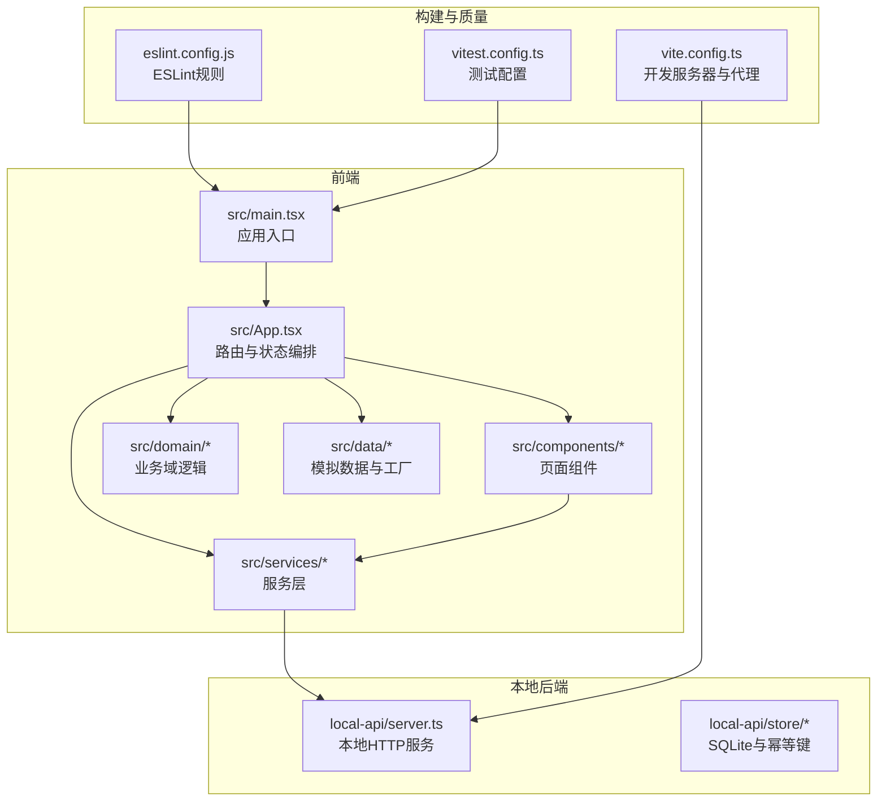
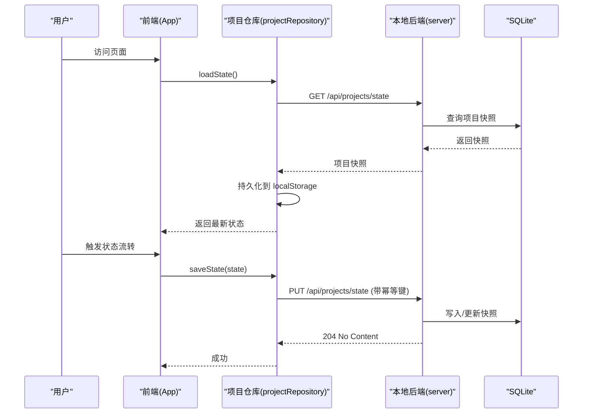
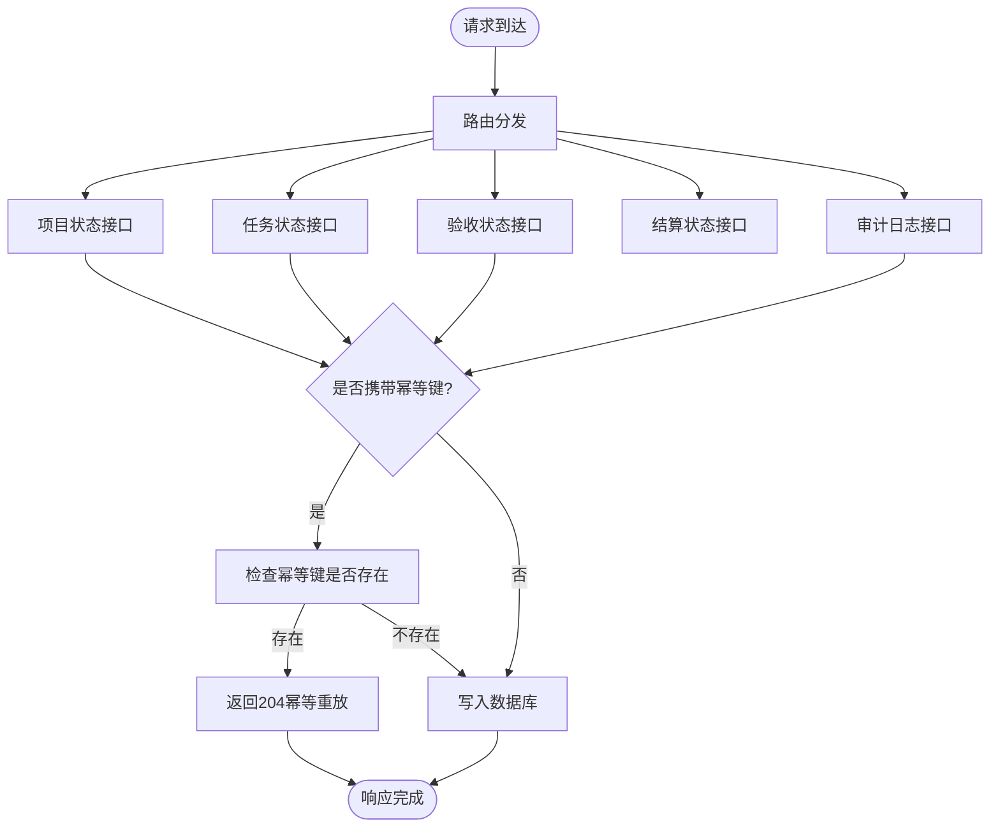
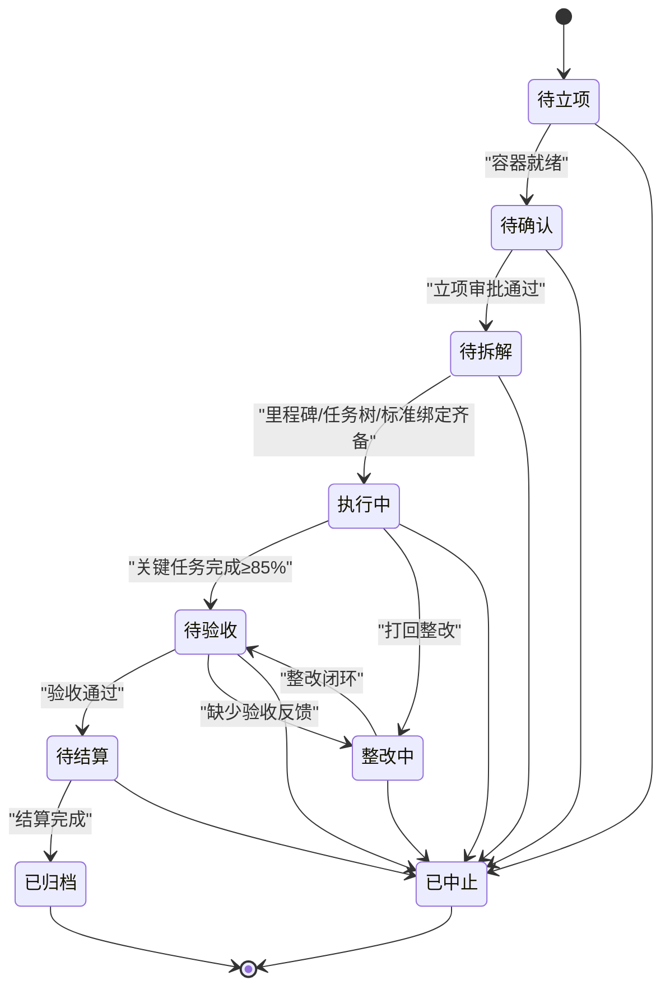
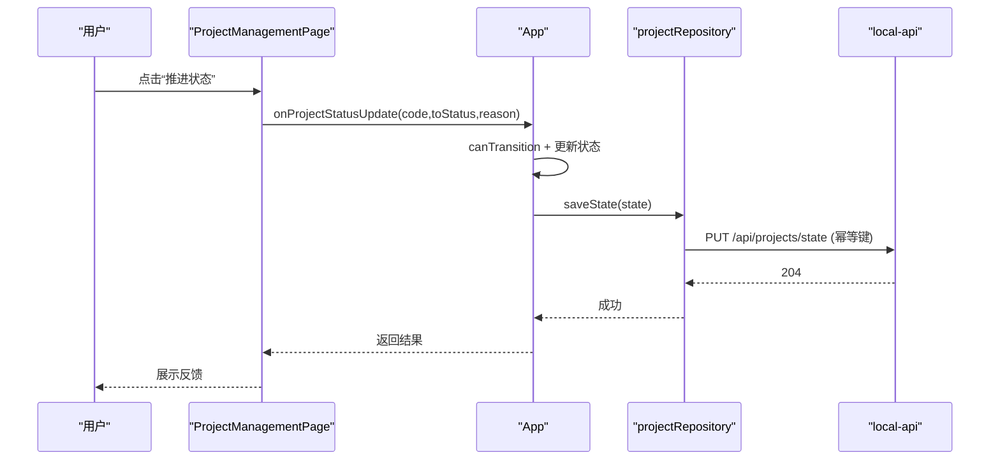
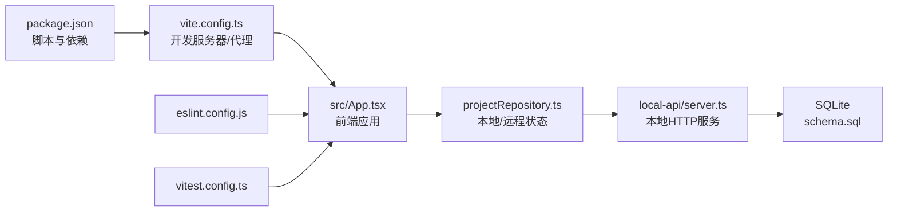

# 快速开始

<cite>
**本文引用的文件**
- [package.json](file://package.json)
- [README.md](file://README.md)
- [CODEBUDDY.md](file://CODEBUDDY.md)
- [vite.config.ts](file://vite.config.ts)
- [eslint.config.js](file://eslint.config.js)
- [vitest.config.ts](file://vitest.config.ts)
- [src/main.tsx](file://src/main.tsx)
- [src/App.tsx](file://src/App.tsx)
- [src/domain/projectStatusMachine.ts](file://src/domain/projectStatusMachine.ts)
- [src/services/repositories/projectRepository.ts](file://src/services/repositories/projectRepository.ts)
- [local-api/server.ts](file://local-api/server.ts)
- [local-api/store/schema.sql](file://local-api/store/schema.sql)
- [src/components/project/ProjectManagementPage.tsx](file://src/components/project/ProjectManagementPage.tsx)
- [src/components/task/TaskManagementPage.tsx](file://src/components/task/TaskManagementPage.tsx)
</cite>

## 目录

1. [简介](#简介)
2. [项目结构](#项目结构)
3. [核心组件](#核心组件)
4. [架构总览](#架构总览)
5. [详细组件分析](#详细组件分析)
6. [依赖关系分析](#依赖关系分析)
7. [性能考量](#性能考量)
8. [故障排查指南](#故障排查指南)
9. [结论](#结论)
10. [附录](#附录)

## 简介

CodeBuddy 是一个基于 React + Vite + TypeScript 的多模块项目管理平台，支持项目全生命周期管理、任务跟踪、人员管理、采购管理、合同结算、订单管理、设施管理、资源池、客户管理、标准管理、数字员工与系统设置等核心功能。项目采用 Hash 路由与单入口控制多页面的前端架构，结合本地后端服务（SQLite）与幂等性保障，提供完整的本地联调体验与错误降级机制。

- 项目目标与核心价值
  - 项目全生命周期管理：从“待立项”到“已归档”的状态机驱动，严格守卫条件确保流程合规。
  - 任务跟踪：任务中心支持列表、详情、筛选、排序与 SLA 管理。
  - 人员管理：人员列表、详情与项目绑定，支持项目视图与统计卡片。
  - 本地后端与联调：内置 Express 服务器 + SQLite，提供五类核心接口，支持幂等键与审计日志。
  - 错误治理：统一结构化错误模型与日志追踪，网络异常自动降级到本地缓存。

**章节来源**

- [README.md: 第1-327节:1-327](file://README.md#L1-L327)

## 项目结构

- 核心目录与职责
  - src：应用源码，包含组件、领域模型、服务层与数据层
  - local-api：本地后端服务（Express + SQLite）
  - public/assets：公共资源
  - docs：项目治理与设计文档
  - .github/workflows：CI 工作流
  - 配置文件：package.json、vite.config.ts、eslint.config.js、vitest.config.ts 等

**图表来源**

- [src/main.tsx: 第1-11节:1-11](file://src/main.tsx#L1-L11)
- [src/App.tsx: 第1-879节:1-879](file://src/App.tsx#L1-L879)
- [vite.config.ts: 第1-35节:1-35](file://vite.config.ts#L1-L35)
- [local-api/server.ts: 第1-414节:1-414](file://local-api/server.ts#L1-L414)

**章节来源**

- [README.md: 第55-113节:55-113](file://README.md#L55-L113)

## 核心组件

- 应用入口与路由编排
  - 入口：src/main.tsx 挂载 App
  - 编排：src/App.tsx 使用 Hash 路由解析与页面懒加载，集中管理项目状态与日志，并通过仓库层持久化
- 项目状态机
  - src/domain/projectStatusMachine.ts 定义状态集合、允许流转与守卫条件，提供可用状态选项与钩子日志
- 服务层与本地后端
  - src/services/repositories/projectRepository.ts 负责本地与远程状态加载/保存，网络异常自动降级
  - local-api/server.ts 提供五类核心接口（项目/任务/验收/结算/审计），支持幂等键与 CORS
- 页面组件
  - 项目管理：src/components/project/ProjectManagementPage.tsx
  - 任务中心：src/components/task/TaskManagementPage.tsx

**章节来源**

- [src/main.tsx: 第1-11节:1-11](file://src/main.tsx#L1-L11)
- [src/App.tsx: 第1-879节:1-879](file://src/App.tsx#L1-L879)
- [src/domain/projectStatusMachine.ts: 第1-164节:1-164](file://src/domain/projectStatusMachine.ts#L1-L164)
- [src/services/repositories/projectRepository.ts: 第1-90节:1-90](file://src/services/repositories/projectRepository.ts#L1-L90)
- [local-api/server.ts: 第1-414节:1-414](file://local-api/server.ts#L1-L414)

## 架构总览

- 前端架构
  - 单入口控制多页面：Hash 路由 + 懒加载组件
  - 状态持久化：localStorage 存储项目状态与日志
  - 服务适配：通过 serverAdapter 与本地后端通信
- 本地后端
  - 本地 Express 服务监听 3100 端口，代理 /api 前缀到本地
  - SQLite 存储项目/任务/验收/结算/审计快照，支持幂等键去重
- 错误治理
  - StructuredError 统一错误模型，错误日志包含 scope、scenario、idempotencyKey 等上下文
  - 网络失败自动降级到本地缓存并触发 UI 提示

**图表来源**

- [src/App.tsx: 第346-504节:346-504](file://src/App.tsx#L346-L504)
- [src/services/repositories/projectRepository.ts: 第54-88节:54-88](file://src/services/repositories/projectRepository.ts#L54-L88)
- [local-api/server.ts: 第70-129节:70-129](file://local-api/server.ts#L70-L129)

**章节来源**

- [README.md: 第137-155节:137-155](file://README.md#L137-L155)
- [CODEBUDDY.md: 第34-41节:34-41](file://CODEBUDDY.md#L34-L41)

## 详细组件分析

### 本地后端服务（local-api）

- 启动与代理
  - 本地服务监听 3100 端口，Vite 代理将 /api 请求转发到本地后端
- 核心接口
  - 项目状态：GET/PUT /api/projects/state
  - 任务状态：GET/PUT /api/tasks/state
  - 验收状态：GET/PUT /api/acceptance/state
  - 结算状态：GET /api/settlement/state
  - 审计日志：POST /api/audit/logs
- 幂等性
  - 所有写接口支持 X-Idempotency-Key，避免重复提交
- 数据存储
  - SQLite 表：project_state、task_state、acceptance_state、settlement_state、audit_logs

**图表来源**

- [local-api/server.ts: 第338-386节:338-386](file://local-api/server.ts#L338-L386)
- [local-api/server.ts: 第70-129节:70-129](file://local-api/server.ts#L70-L129)
- [local-api/server.ts: 第131-197节:131-197](file://local-api/server.ts#L131-L197)
- [local-api/server.ts: 第199-280节:199-280](file://local-api/server.ts#L199-L280)
- [local-api/server.ts: 第282-329节:282-329](file://local-api/server.ts#L282-L329)

**章节来源**

- [README.md: 第137-155节:137-155](file://README.md#L137-L155)
- [local-api/server.ts: 第1-414节:1-414](file://local-api/server.ts#L1-L414)

### 项目状态机（projectStatusMachine）

- 状态集合与允许流转
  - 待立项 → 待确认 → 待拆解 → 执行中 → 待验收 → 整改中 → 待结算 → 已归档
  - 中止状态为终止态
- 守卫条件
  - 例如：从“待拆解”到“执行中”需要容器、里程碑、任务树、标准绑定齐备
  - 从“执行中”到“待验收”需要关键任务完成度 ≥ 85%
  - 中止/整改需填写原因
- 可用状态选项与钩子日志
  - 提供“推进到…”等标签与进入状态时的联动日志

**图表来源**

- [src/domain/projectStatusMachine.ts: 第59-69节:59-69](file://src/domain/projectStatusMachine.ts#L59-L69)
- [src/domain/projectStatusMachine.ts: 第105-163节:105-163](file://src/domain/projectStatusMachine.ts#L105-L163)

**章节来源**

- [README.md: 第115-136节:115-136](file://README.md#L115-L136)
- [src/domain/projectStatusMachine.ts: 第1-164节:1-164](file://src/domain/projectStatusMachine.ts#L1-L164)

### 项目管理页面（ProjectManagementPage）

- 功能要点
  - 支持列表/看板/网格三种视图
  - 统计卡片、搜索、筛选、分页与排序
  - 创建项目、打开项目详情、状态更新
- 与状态机集成
  - 通过 App.tsx 的 transitionProjectStatus 触发状态流转
  - 与项目仓库层协作，实现本地/远程状态同步

**图表来源**

- [src/components/project/ProjectManagementPage.tsx: 第105-122节:105-122](file://src/components/project/ProjectManagementPage.tsx#L105-L122)
- [src/App.tsx: 第439-504节:439-504](file://src/App.tsx#L439-L504)
- [src/services/repositories/projectRepository.ts: 第76-88节:76-88](file://src/services/repositories/projectRepository.ts#L76-L88)
- [local-api/server.ts: 第86-129节:86-129](file://local-api/server.ts#L86-L129)

**章节来源**

- [src/components/project/ProjectManagementPage.tsx: 第1-200节:1-200](file://src/components/project/ProjectManagementPage.tsx#L1-L200)
- [src/App.tsx: 第439-504节:439-504](file://src/App.tsx#L439-L504)

### 任务中心页面（TaskManagementPage）

- 功能要点
  - 支持模板实例化、项目关联、来源类型筛选
  - 任务状态流转、SLA 重算、派发推荐
  - 详情页与列表页联动
- 与人员与仓库层协作
  - 通过 personnelRepository 与 taskRepository 提供派发建议与数据持久化

**章节来源**

- [src/components/task/TaskManagementPage.tsx: 第1-200节:1-200](file://src/components/task/TaskManagementPage.tsx#L1-L200)

## 依赖关系分析

- 开发与构建
  - Vite 8 作为开发服务器与打包工具，配置代理到本地后端
  - TypeScript + ESLint + Vitest 提供类型检查、代码规范与测试
- 前后端耦合
  - 前端通过 /api 代理访问本地后端，写操作携带幂等键
  - 仓库层负责本地与远程状态同步，网络异常自动降级

**图表来源**

- [package.json: 第6-16节:6-16](file://package.json#L6-L16)
- [vite.config.ts: 第7-14节:7-14](file://vite.config.ts#L7-L14)
- [src/services/repositories/projectRepository.ts: 第53-88节:53-88](file://src/services/repositories/projectRepository.ts#L53-L88)
- [local-api/server.ts: 第18-18:18-18](file://local-api/server.ts#L18-L18)
- [local-api/store/schema.sql: 第1-200节:1-200](file://local-api/store/schema.sql#L1-L200)
- [eslint.config.js: 第1-24节:1-24](file://eslint.config.js#L1-L24)
- [vitest.config.ts: 第4-19节:4-19](file://vitest.config.ts#L4-L19)

**章节来源**

- [package.json: 第1-48节:1-48](file://package.json#L1-L48)
- [vite.config.ts: 第1-35节:1-35](file://vite.config.ts#L1-L35)
- [eslint.config.js: 第1-24节:1-24](file://eslint.config.js#L1-L24)
- [vitest.config.ts: 第1-20节:1-20](file://vitest.config.ts#L1-L20)

## 性能考量

- 懒加载与代码分割
  - 页面组件按需加载，vendor chunk 单独打包，提升首屏性能
- 构建优化
  - 通过 rollupOptions 的 manualChunks 将 React 生态库独立打包
- 首屏与体积
  - 首屏体积与主包体积显著优化，按需加载页面组件

**章节来源**

- [README.md: 第156-166节:156-166](file://README.md#L156-L166)
- [vite.config.ts: 第15-33节:15-33](file://vite.config.ts#L15-L33)

## 故障排查指南

- 网络请求失败
  - 检查本地后端是否启动（http://localhost:3100）
  - 查看浏览器控制台的“降级”日志
  - 验证 Vite proxy 配置（vite.config.ts）
- 状态流转失败
  - 检查守卫条件（projectStatusMachine.ts）
  - 查看控制台的“状态流转失败”日志
  - 验证项目的里程碑、任务树、验收结果等字段
- 本地缓存不一致
  - 清空 localStorage：localStorage.clear()
  - 刷新页面，重新加载数据
  - 检查 projectRepository.loadState() 的返回值

**章节来源**

- [README.md: 第227-243节:227-243](file://README.md#L227-L243)
- [src/domain/projectStatusMachine.ts: 第105-163节:105-163](file://src/domain/projectStatusMachine.ts#L105-L163)
- [src/services/repositories/projectRepository.ts: 第14-38节:14-38](file://src/services/repositories/projectRepository.ts#L14-L38)

## 结论

CodeBuddy 提供了从开发到生产的完整工作流：清晰的前端架构、严谨的状态机守卫、完善的本地后端与幂等性保障，以及统一的错误治理与降级机制。通过本快速开始指南，你可以快速搭建本地开发环境、运行前后端联调、构建生产版本并进行代码检查与测试。

## 附录

### 环境要求与安装

- 环境要求
  - Node.js >= 18.0.0
  - npm >= 9.0.0
- 安装依赖
  - 执行安装命令以获取 React、Vite、TypeScript、ESLint、测试框架等依赖

**章节来源**

- [README.md: 第7-16节:7-16](file://README.md#L7-L16)
- [package.json: 第17-46节:17-46](file://package.json#L17-L46)

### 本地开发与联调

- 启动前端开发服务器
  - npm run dev
  - 访问 http://localhost:5173
- 启动前端 + 本地后端（推荐）
  - npm run dev:local
  - 本地后端服务运行于 http://localhost:3100
  - 所有 /api/\* 请求自动代理到本地后端
- 本地联调流程
  - 启动本地后端：npm run local-api
  - 启动前端开发服务器：npm run dev
  - 验证接口联调：查看浏览器控制台网络请求
  - 测试状态流转：创建新项目 → 推进到不同状态 → 验证守卫条件

**章节来源**

- [README.md: 第18-28节:18-28](file://README.md#L18-L28)
- [README.md: 第201-226节:201-226](file://README.md#L201-L226)
- [CODEBUDDY.md: 第8-22节:8-22](file://CODEBUDDY.md#L8-L22)
- [vite.config.ts: 第7-14节:7-14](file://vite.config.ts#L7-L14)

### 生产构建与质量工具

- 生产构建
  - npm run build
  - 先执行类型构建，再执行 Vite 打包
- 代码检查
  - npm run lint
  - 运行 ESLint 检查
- 预览构建产物
  - npm run preview
  - 本地预览打包结果
- 测试
  - npm run test：启动 Vitest UI
  - npm run test:run：单次运行测试
  - npm run test:coverage：生成覆盖率报告

**章节来源**

- [README.md: 第30-53节:30-53](file://README.md#L30-L53)
- [CODEBUDDY.md: 第11-18节:11-18](file://CODEBUDDY.md#L11-L18)
- [package.json: 第6-16节:6-16](file://package.json#L6-L16)
- [vitest.config.ts: 第6-19节:6-19](file://vitest.config.ts#L6-L19)

### 基本使用示例

- 访问地址
  - http://localhost:5173
- 常用页面
  - 项目列表：#/projects
  - 项目详情：#/projects/:code
  - 任务中心：#/tasks
  - 人员管理：#/personnel
  - 合同结算：#/contracts
  - 订单管理：#/orders
  - 设施管理：#/facility
  - 资源池：#/resources
  - 客户管理：#/customers
  - 标准管理：#/standards
  - 数字员工：#/digital-employee
  - 系统设置：#/settings

**章节来源**

- [README.md: 第92-113节:92-113](file://README.md#L92-L113)
