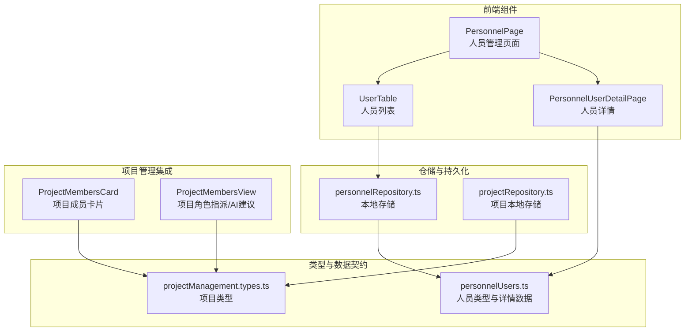
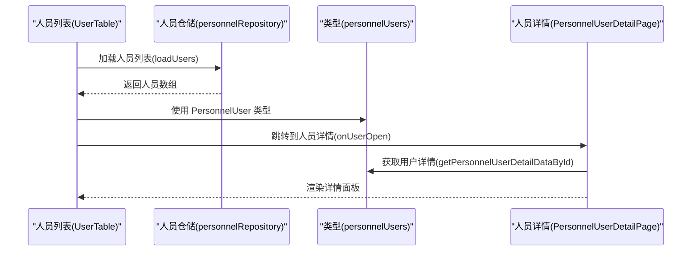
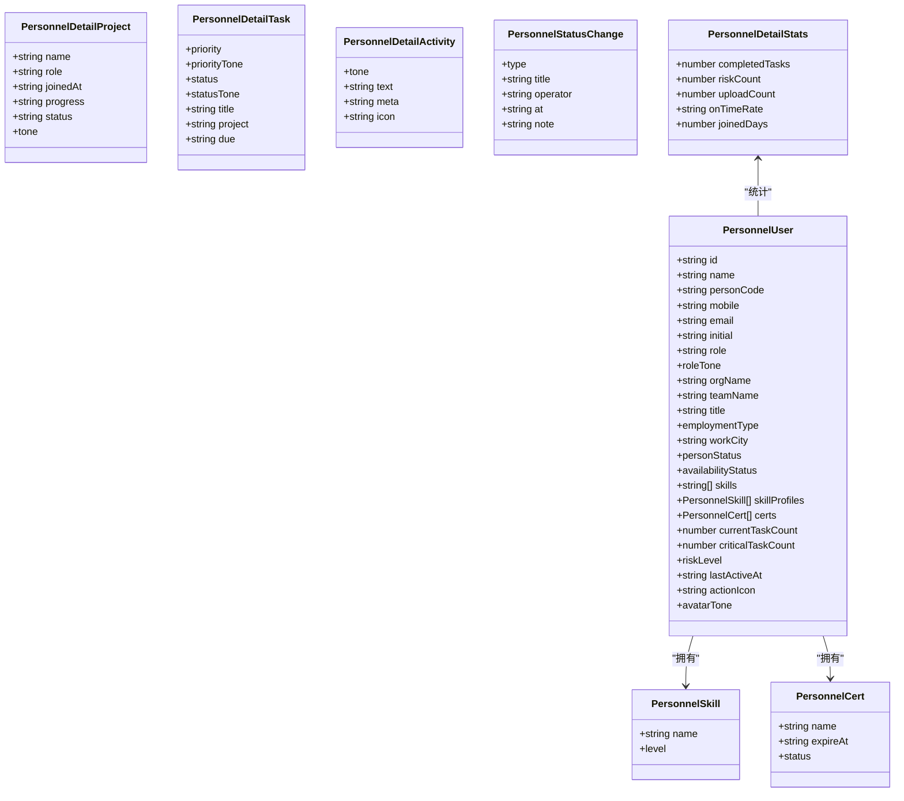
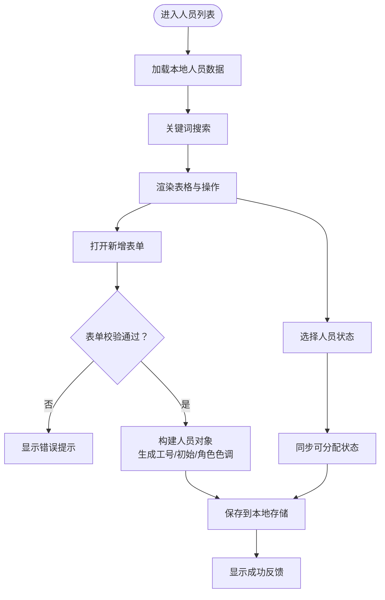
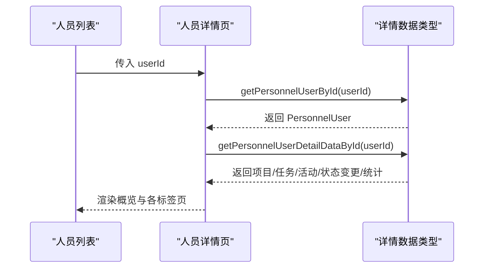
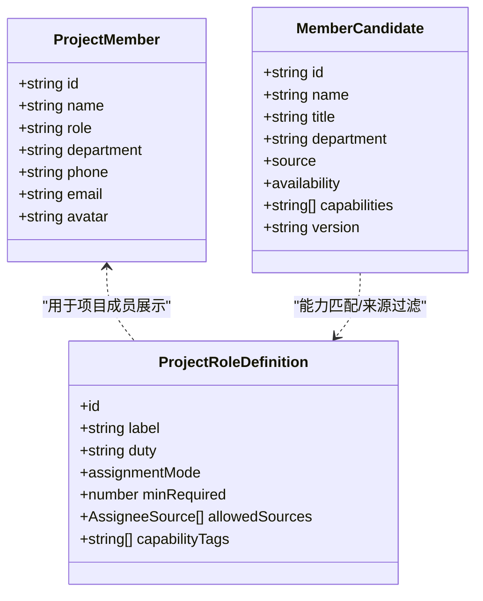
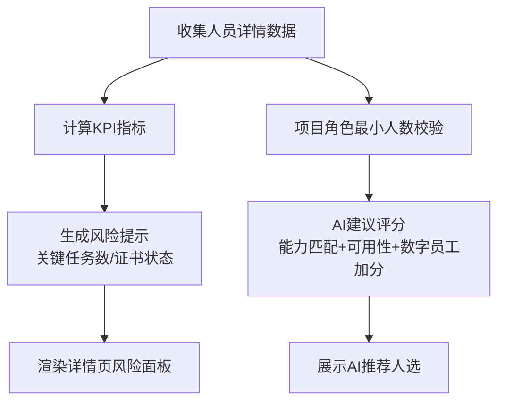
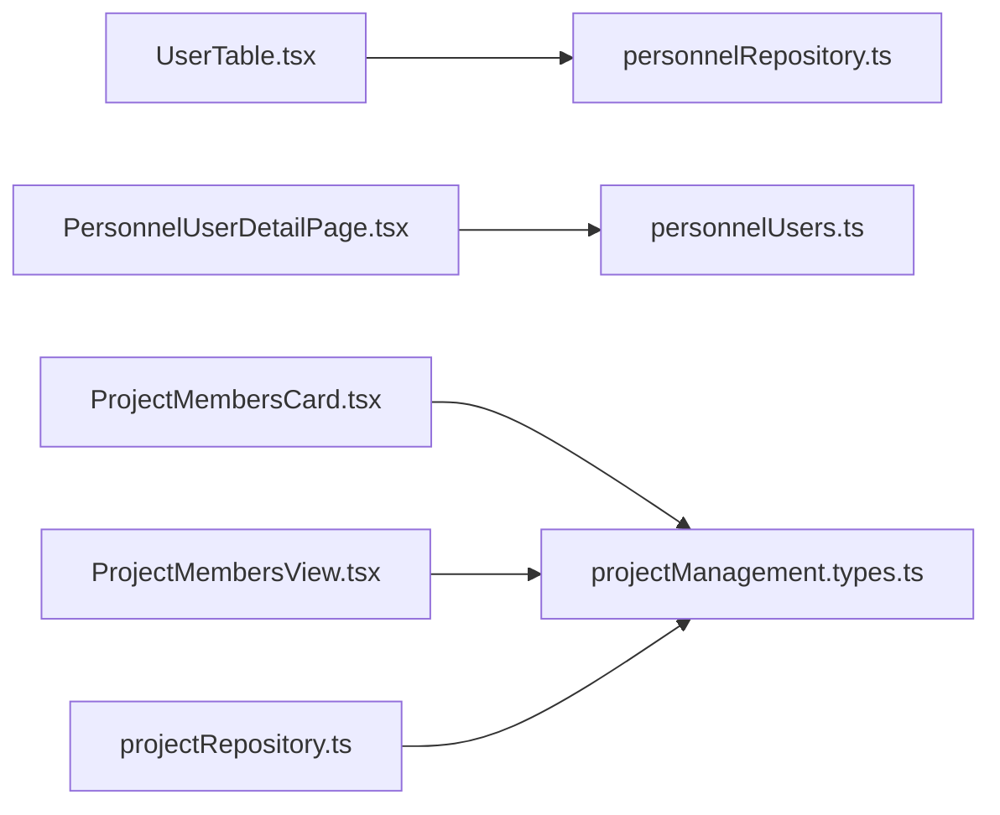

# 人员数据模型

<cite>
**本文档引用的文件**
- [personnelUsers.ts](file://src/components/personnel/personnelUsers.ts)
- [UserTable.tsx](file://src/components/personnel/UserTable.tsx)
- [PersonnelPage.tsx](file://src/components/personnel/PersonnelPage.tsx)
- [PersonnelUserDetailPage.tsx](file://src/components/personnel/PersonnelUserDetailPage.tsx)
- [personnelRepository.ts](file://src/services/repositories/personnelRepository.ts)
- [projectManagement.types.ts](file://src/components/personnel/projectManagement.types.ts)
- [ProjectMembersCard.tsx](file://src/components/project/ProjectMembersCard.tsx)
- [ProjectMembersView.tsx](file://src/components/project/ProjectMembersView.tsx)
- [projectRepository.ts](file://src/services/repositories/projectRepository.ts)
</cite>

## 目录

1. [简介](#简介)
2. [项目结构](#项目结构)
3. [核心组件](#核心组件)
4. [架构总览](#架构总览)
5. [详细组件分析](#详细组件分析)
6. [依赖关系分析](#依赖关系分析)
7. [性能考虑](#性能考虑)
8. [故障排除指南](#故障排除指南)
9. [结论](#结论)

## 简介

本文件系统性梳理 CodeBuddy 项目中的人员数据模型，涵盖员工信息实体的字段定义、业务含义与数据类型；项目成员角色定义与权限级别；人员与项目关联关系；人员绩效统计与工作量分配；以及人员信息管理、团队协作、技能矩阵等业务场景的数据处理方式。同时说明人员数据的本地持久化策略、权限控制与访问审计机制，并阐述人员数据与其他模块（项目、任务、资源）的关联关系与数据一致性保障。

## 项目结构

人员管理相关代码主要分布在以下位置：

- 前端组件层：人员列表、详情、权限展示等
- 类型定义层：人员、项目、角色等数据契约
- 仓储层：本地持久化与状态管理
- 项目管理集成：角色指派、成员卡片、AI建议等

**图表来源**

- [PersonnelPage.tsx:12-33](file://src/components/personnel/PersonnelPage.tsx#L12-L33)
- [UserTable.tsx:119-130](file://src/components/personnel/UserTable.tsx#L119-L130)
- [PersonnelUserDetailPage.tsx:65-69](file://src/components/personnel/PersonnelUserDetailPage.tsx#L65-L69)
- [personnelUsers.ts:4-29](file://src/components/personnel/personnelUsers.ts#L4-L29)
- [projectManagement.types.ts:118-127](file://src/components/personnel/projectManagement.types.ts#L118-L127)
- [personnelRepository.ts:44-57](file://src/services/repositories/personnelRepository.ts#L44-L57)
- [projectRepository.ts:53-89](file://src/services/repositories/projectRepository.ts#L53-L89)
- [ProjectMembersCard.tsx:13-38](file://src/components/project/ProjectMembersCard.tsx#L13-L38)
- [ProjectMembersView.tsx:208-241](file://src/components/project/ProjectMembersView.tsx#L208-L241)

**章节来源**

- [PersonnelPage.tsx:12-33](file://src/components/personnel/PersonnelPage.tsx#L12-L33)
- [UserTable.tsx:119-130](file://src/components/personnel/UserTable.tsx#L119-L130)
- [PersonnelUserDetailPage.tsx:65-69](file://src/components/personnel/PersonnelUserDetailPage.tsx#L65-L69)
- [personnelUsers.ts:4-29](file://src/components/personnel/personnelUsers.ts#L4-L29)
- [projectManagement.types.ts:118-127](file://src/components/personnel/projectManagement.types.ts#L118-L127)
- [personnelRepository.ts:44-57](file://src/services/repositories/personnelRepository.ts#L44-L57)
- [projectRepository.ts:53-89](file://src/services/repositories/projectRepository.ts#L53-L89)
- [ProjectMembersCard.tsx:13-38](file://src/components/project/ProjectMembersCard.tsx#L13-L38)
- [ProjectMembersView.tsx:208-241](file://src/components/project/ProjectMembersView.tsx#L208-L241)

## 核心组件

- 人员实体与详情数据：定义人员基本信息、状态、技能、证书、任务与活动等
- 人员列表与表单：支持搜索、筛选、创建/编辑、状态变更
- 人员详情页：概览、项目参与、任务、活动与权限详情
- 仓储与持久化：基于 localStorage 的本地状态管理
- 项目角色与成员：项目级角色定义、成员指派、AI建议与统计

**章节来源**

- [personnelUsers.ts:4-29](file://src/components/personnel/personnelUsers.ts#L4-L29)
- [UserTable.tsx:119-296](file://src/components/personnel/UserTable.tsx#L119-L296)
- [PersonnelUserDetailPage.tsx:65-442](file://src/components/personnel/PersonnelUserDetailPage.tsx#L65-L442)
- [personnelRepository.ts:44-57](file://src/services/repositories/personnelRepository.ts#L44-L57)
- [ProjectMembersView.tsx:208-394](file://src/components/project/ProjectMembersView.tsx#L208-L394)

## 架构总览

人员数据模型采用“类型定义 + 组件渲染 + 仓储持久化”的分层架构。前端组件通过类型契约消费数据，使用仓储层进行本地持久化，项目管理模块通过角色定义与成员卡片/视图与人员数据产生关联。

**图表来源**

- [UserTable.tsx:120-130](file://src/components/personnel/UserTable.tsx#L120-L130)
- [personnelRepository.ts:44-47](file://src/services/repositories/personnelRepository.ts#L44-L47)
- [personnelUsers.ts:411-415](file://src/components/personnel/personnelUsers.ts#L411-L415)
- [PersonnelUserDetailPage.tsx:68-69](file://src/components/personnel/PersonnelUserDetailPage.tsx#L68-L69)

## 详细组件分析

### 人员实体与详情数据模型

- 人员基础信息：id、姓名、工号、手机号、邮箱、初始、角色、角色色调、组织/团队、职称、用工类型、工作城市
- 人员状态：在岗/请假/离岗/禁用；可分配状态由在岗状态推导
- 能力与资质：技能标签数组、技能等级档案、证书清单（含有效期与状态）
- 负载与风险：当前任务数、关键任务数、风险等级
- 最近活跃时间、头像色调、动作图标等

**图表来源**

- [personnelUsers.ts:4-29](file://src/components/personnel/personnelUsers.ts#L4-L29)
- [personnelUsers.ts:41-50](file://src/components/personnel/personnelUsers.ts#L41-L50)
- [personnelUsers.ts:52-69](file://src/components/personnel/personnelUsers.ts#L52-L69)
- [personnelUsers.ts:71-84](file://src/components/personnel/personnelUsers.ts#L71-L84)
- [personnelUsers.ts:86-92](file://src/components/personnel/personnelUsers.ts#L86-L92)

**章节来源**

- [personnelUsers.ts:4-29](file://src/components/personnel/personnelUsers.ts#L4-L29)
- [personnelUsers.ts:41-50](file://src/components/personnel/personnelUsers.ts#L41-L50)
- [personnelUsers.ts:52-69](file://src/components/personnel/personnelUsers.ts#L52-L69)
- [personnelUsers.ts:71-84](file://src/components/personnel/personnelUsers.ts#L71-L84)
- [personnelUsers.ts:86-92](file://src/components/personnel/personnelUsers.ts#L86-L92)

### 人员列表与表单处理流程

- 列表渲染：支持按姓名/手机/工号搜索，显示组织/团队、角色、人员状态、可分配状态、技能摘要、负载与风险、最近活跃
- 表单创建/编辑：必填校验、生成工号、计算初始、解析角色色调、更新可分配状态、记录最后活跃时间
- 状态变更：在岗/请假/离岗/禁用切换，自动同步可分配状态

**图表来源**

- [UserTable.tsx:120-130](file://src/components/personnel/UserTable.tsx#L120-L130)
- [UserTable.tsx:132-143](file://src/components/personnel/UserTable.tsx#L132-L143)
- [UserTable.tsx:152-274](file://src/components/personnel/UserTable.tsx#L152-L274)
- [UserTable.tsx:276-296](file://src/components/personnel/UserTable.tsx#L276-L296)

**章节来源**

- [UserTable.tsx:119-296](file://src/components/personnel/UserTable.tsx#L119-L296)
- [personnelRepository.ts:44-57](file://src/services/repositories/personnelRepository.ts#L44-L57)

### 人员详情页与权限展示

- 详情概览：基本信息、状态与可分配状态、角色与用工类型、联系信息、KPI统计
- 项目参与：按“全部/当前/历史”筛选，显示项目角色、进度与状态
- 待办任务：优先级与状态可视化，显示项目与截止日期
- 变更记录：状态变更与活动记录的时间线
- 权限详情：当前身份的角色与已开通模块（演示）

**图表来源**

- [PersonnelUserDetailPage.tsx:65-69](file://src/components/personnel/PersonnelUserDetailPage.tsx#L65-L69)
- [personnelUsers.ts:411-415](file://src/components/personnel/personnelUsers.ts#L411-L415)

**章节来源**

- [PersonnelUserDetailPage.tsx:65-442](file://src/components/personnel/PersonnelUserDetailPage.tsx#L65-L442)
- [personnelUsers.ts:94-100](file://src/components/personnel/personnelUsers.ts#L94-L100)

### 项目成员角色与人员关联

- 项目成员数据契约：包含 id、name、role、department、phone、email、avatar
- 项目角色定义：项目经理、客户服务、客户经理、预算工程师、监理、设计师、助理等，含职责、分配模式、最小人数、允许来源（真人/数字员工）、能力标签
- 成员卡片：按角色排序展示成员基本信息与联系方式
- 角色指派与AI建议：支持搜索、筛选、编辑、采纳建议，统计配置情况与数字员工接入数

**图表来源**

- [projectManagement.types.ts:118-127](file://src/components/personnel/projectManagement.types.ts#L118-L127)
- [ProjectMembersCard.tsx:13-54](file://src/components/project/ProjectMembersCard.tsx#L13-L54)
- [ProjectMembersView.tsx:16-97](file://src/components/project/ProjectMembersView.tsx#L16-L97)
- [ProjectMembersView.tsx:99-193](file://src/components/project/ProjectMembersView.tsx#L99-L193)

**章节来源**

- [projectManagement.types.ts:118-127](file://src/components/personnel/projectManagement.types.ts#L118-L127)
- [ProjectMembersCard.tsx:13-165](file://src/components/project/ProjectMembersCard.tsx#L13-L165)
- [ProjectMembersView.tsx:16-394](file://src/components/project/ProjectMembersView.tsx#L16-L394)

### 人员绩效统计与工作量分配

- 绩效指标：累计完成任务、创建风险/问题、上传资料、任务按期完成率、入职天数
- 负载指标：当前任务数/关键任务数，结合风险等级与证书状态生成风险提示
- 工作量分配：项目角色最小人数约束、来源限制（如项目经理必须为真人），AI建议综合能力匹配度、可用性与数字员工加分

**图表来源**

- [PersonnelUserDetailPage.tsx:94-106](file://src/components/personnel/PersonnelUserDetailPage.tsx#L94-L106)
- [ProjectMembersView.tsx:317-348](file://src/components/project/ProjectMembersView.tsx#L317-L348)

**章节来源**

- [PersonnelUserDetailPage.tsx:94-106](file://src/components/personnel/PersonnelUserDetailPage.tsx#L94-L106)
- [ProjectMembersView.tsx:317-348](file://src/components/project/ProjectMembersView.tsx#L317-L348)

### 人员信息管理与团队协作示例

- 人员信息管理：新增/编辑人员、状态变更、搜索与筛选、本地持久化
- 团队协作：项目角色指派、AI建议采纳、成员卡片快速联系
- 技能矩阵：技能标签与等级、证书有效期与状态可视化

**章节来源**

- [UserTable.tsx:152-274](file://src/components/personnel/UserTable.tsx#L152-L274)
- [ProjectMembersView.tsx:268-391](file://src/components/project/ProjectMembersView.tsx#L268-L391)
- [PersonnelUserDetailPage.tsx:116-151](file://src/components/personnel/PersonnelUserDetailPage.tsx#L116-L151)

### 权限控制、隐私保护与访问审计

- 权限控制：人员详情页展示“当前身份：角色（组织/团队）”与“已开通模块”，提示后续接入后端权限模型
- 隐私保护：前端本地存储，不涉及敏感数据传输；可扩展后端鉴权与字段脱敏
- 访问审计：人员状态变更记录与活动记录形成时间线，便于追溯

**章节来源**

- [PersonnelUserDetailPage.tsx:423-434](file://src/components/personnel/PersonnelUserDetailPage.tsx#L423-L434)
- [PersonnelUserDetailPage.tsx:219-245](file://src/components/personnel/PersonnelUserDetailPage.tsx#L219-L245)
- [PersonnelUserDetailPage.tsx:419-420](file://src/components/personnel/PersonnelUserDetailPage.tsx#L419-L420)

### 人员数据与其他模块的关联与一致性

- 人员与项目：项目成员卡片与角色视图通过角色定义与候选集进行关联，支持真人与数字员工混合指派
- 人员与任务：人员详情页展示待办任务与项目参与，便于工作量与负载分析
- 人员与资源：项目仓库提供项目状态与日志的本地持久化，人员数据与项目数据保持独立但可通过角色关系耦合

**章节来源**

- [ProjectMembersCard.tsx:13-165](file://src/components/project/ProjectMembersCard.tsx#L13-L165)
- [ProjectMembersView.tsx:16-394](file://src/components/project/ProjectMembersView.tsx#L16-L394)
- [projectRepository.ts:53-89](file://src/services/repositories/projectRepository.ts#L53-L89)

## 依赖关系分析

- 组件依赖：人员页面依赖人员列表与详情；人员列表依赖仓储；详情页依赖类型与详情数据映射
- 项目集成：项目成员卡片与角色视图依赖项目类型与角色定义
- 仓储依赖：人员仓储依赖类型定义；项目仓储独立维护项目状态

**图表来源**

- [UserTable.tsx:1-13](file://src/components/personnel/UserTable.tsx#L1-L13)
- [personnelRepository.ts:1-1](file://src/services/repositories/personnelRepository.ts#L1-L1)
- [PersonnelUserDetailPage.tsx:1-10](file://src/components/personnel/PersonnelUserDetailPage.tsx#L1-L10)
- [personnelUsers.ts:1-1](file://src/components/personnel/personnelUsers.ts#L1-L1)
- [ProjectMembersCard.tsx:1-6](file://src/components/project/ProjectMembersCard.tsx#L1-L6)
- [ProjectMembersView.tsx:1-6](file://src/components/project/ProjectMembersView.tsx#L1-L6)
- [projectManagement.types.ts:1-6](file://src/components/personnel/projectManagement.types.ts#L1-L6)
- [projectRepository.ts:1-4](file://src/services/repositories/projectRepository.ts#L1-L4)

**章节来源**

- [UserTable.tsx:1-13](file://src/components/personnel/UserTable.tsx#L1-L13)
- [PersonnelUserDetailPage.tsx:1-10](file://src/components/personnel/PersonnelUserDetailPage.tsx#L1-L10)
- [ProjectMembersCard.tsx:1-6](file://src/components/project/ProjectMembersCard.tsx#L1-L6)
- [ProjectMembersView.tsx:1-6](file://src/components/project/ProjectMembersView.tsx#L1-L6)
- [projectManagement.types.ts:1-6](file://src/components/personnel/projectManagement.types.ts#L1-L6)
- [projectRepository.ts:1-4](file://src/services/repositories/projectRepository.ts#L1-L4)

## 性能考虑

- 本地存储：使用 localStorage 进行读写，避免网络请求开销；注意存储大小限制与序列化成本
- 计算复杂度：搜索与筛选为 O(n)；分组与排序在内存中进行，建议在大数据量时引入虚拟滚动与分页
- 依赖更新：useMemo/useEffect 仅在必要时触发，减少不必要的重渲染

## 故障排除指南

- 本地存储异常：仓储层已捕获异常并降级为初始状态，检查浏览器存储容量与格式
- 状态不同步：确保状态变更时同步更新可分配状态与最后活跃时间
- 权限显示异常：确认角色与组织/团队映射正确，权限详情为演示态，需接入后端模型

**章节来源**

- [personnelRepository.ts:13-25](file://src/services/repositories/personnelRepository.ts#L13-L25)
- [UserTable.tsx:276-296](file://src/components/personnel/UserTable.tsx#L276-L296)
- [PersonnelUserDetailPage.tsx:423-434](file://src/components/personnel/PersonnelUserDetailPage.tsx#L423-L434)

## 结论

本文件系统化梳理了 CodeBuddy 人员数据模型，明确了人员实体字段、角色与权限、与项目的关联关系、绩效与工作量统计方法，以及本地持久化与权限控制策略。通过类型契约与组件分层，实现了清晰的数据流与良好的扩展性。后续可进一步接入后端权限模型与审计日志，完善数据一致性与合规性保障。
