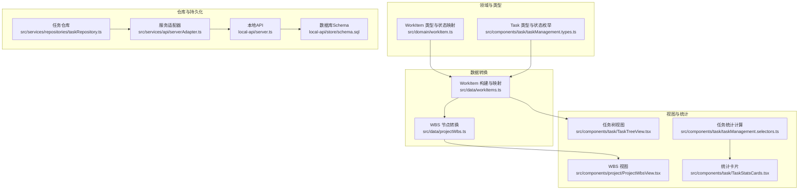
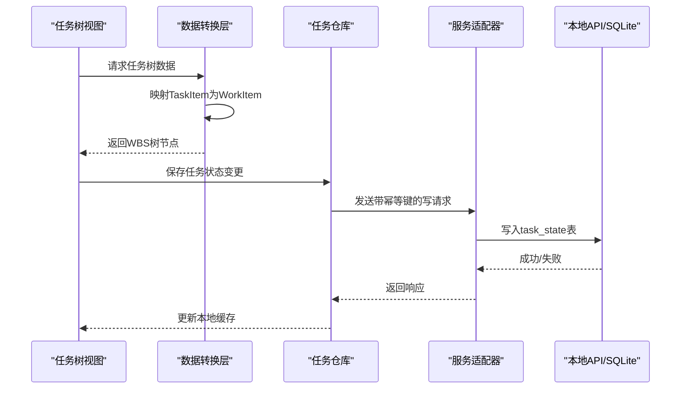
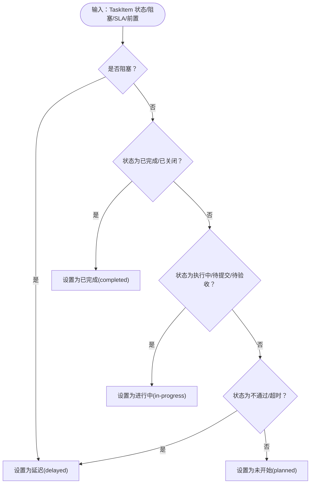
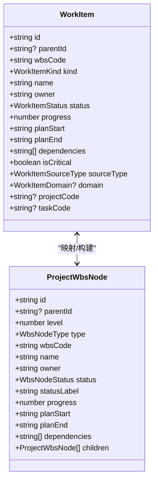
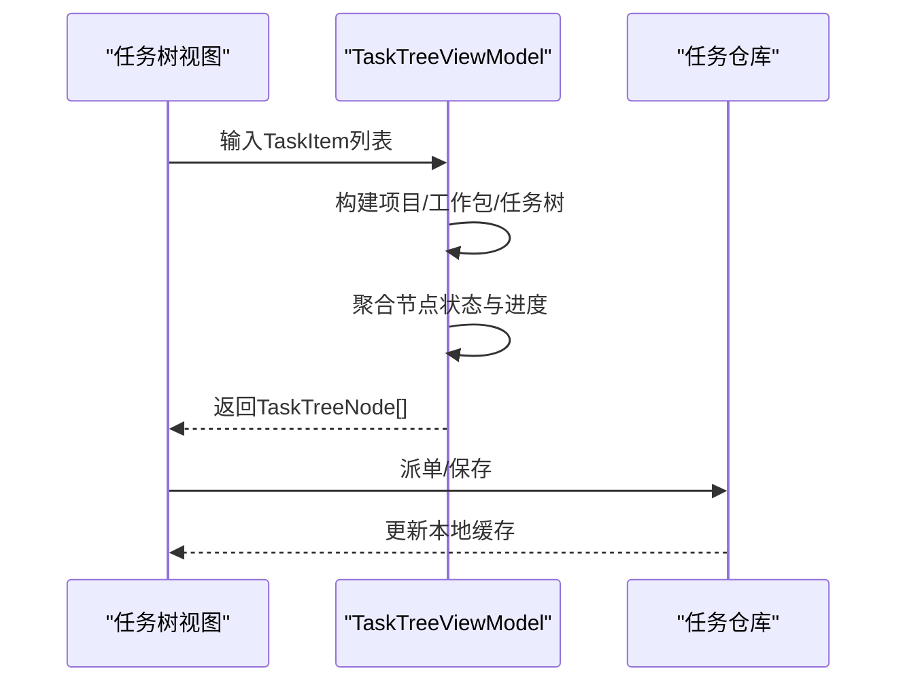
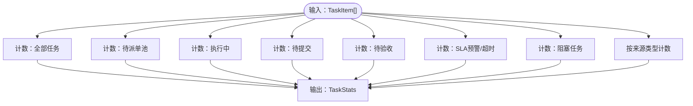
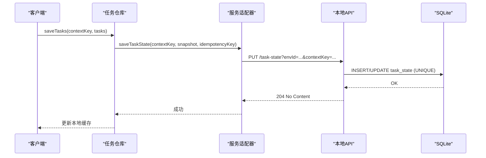
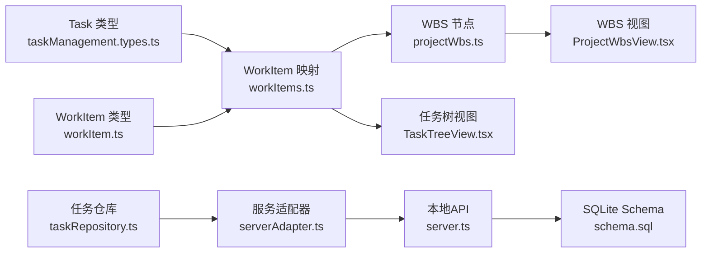

# 任务数据模型

<cite>
**本文引用的文件**
- [src/domain/workItem.ts](file://src/domain/workItem.ts)
- [src/data/workItems.ts](file://src/data/workItems.ts)
- [src/components/task/taskManagement.types.ts](file://src/components/task/taskManagement.types.ts)
- [src/components/task/taskManagement.data.ts](file://src/components/task/taskManagement.data.ts)
- [src/components/task/TaskTreeView.tsx](file://src/components/task/TaskTreeView.tsx)
- [src/components/project/ProjectWbsView.tsx](file://src/components/project/ProjectWbsView.tsx)
- [src/data/projectWbs.ts](file://src/data/projectWbs.ts)
- [src/services/repositories/taskRepository.ts](file://src/services/repositories/taskRepository.ts)
- [src/services/api/serverAdapter.ts](file://src/services/api/serverAdapter.ts)
- [local-api/server.ts](file://local-api/server.ts)
- [local-api/store/schema.sql](file://local-api/store/schema.sql)
- [src/components/task/taskManagement.selectors.ts](file://src/components/task/taskManagement.selectors.ts)
- [src/components/task/TaskStatsCards.tsx](file://src/components/task/TaskStatsCards.tsx)
- [src/services/repositories/projectRepository.ts](file://src/services/repositories/projectRepository.ts)
- [src/domain/projectStatusMachine.ts](file://src/domain/projectStatusMachine.ts)
</cite>

## 目录

1. [简介](#简介)
2. [项目结构](#项目结构)
3. [核心组件](#核心组件)
4. [架构总览](#架构总览)
5. [详细组件分析](#详细组件分析)
6. [依赖分析](#依赖分析)
7. [性能考虑](#性能考虑)
8. [故障排查指南](#故障排查指南)
9. [结论](#结论)
10. [附录](#附录)

## 简介

本文件面向CodeBuddy项目的任务数据模型，围绕WorkItem任务实体的字段定义、任务层级结构（项目-阶段-工作包-执行任务）、状态管理机制、任务分配与关键属性、任务树形结构与继承规则、统计分析指标以及数据一致性保障等方面进行全面说明。目标是帮助开发者与产品人员准确理解任务数据模型的设计与实现，并为后续扩展与维护提供清晰依据。

## 项目结构

围绕任务数据模型的关键模块分布如下：

- 领域模型与类型定义：WorkItem领域类型、任务状态映射、来源类型等
- 数据转换与聚合：将TaskItem映射为WorkItem，构建项目模板任务树
- 视图与统计：任务树视图、WBS视图、任务统计卡片与指标计算
- 仓库与持久化：本地缓存与远程同步、幂等写入、审计日志
- 本地API与数据库：SQLite表结构、幂等键清理、任务状态写入

图表来源

- [src/domain/workItem.ts:1-68](file://src/domain/workItem.ts#L1-L68)
- [src/components/task/taskManagement.types.ts:1-239](file://src/components/task/taskManagement.types.ts#L1-L239)
- [src/data/workItems.ts:1-441](file://src/data/workItems.ts#L1-L441)
- [src/data/projectWbs.ts:1-133](file://src/data/projectWbs.ts#L1-L133)
- [src/components/task/TaskTreeView.tsx:1-253](file://src/components/task/TaskTreeView.tsx#L1-L253)
- [src/components/project/ProjectWbsView.tsx:1-110](file://src/components/project/ProjectWbsView.tsx#L1-L110)
- [src/components/task/taskManagement.selectors.ts:1-20](file://src/components/task/taskManagement.selectors.ts#L1-L20)
- [src/components/task/TaskStatsCards.tsx:1-87](file://src/components/task/TaskStatsCards.tsx#L1-L87)
- [src/services/repositories/taskRepository.ts:1-318](file://src/services/repositories/taskRepository.ts#L1-L318)
- [src/services/api/serverAdapter.ts:1-42](file://src/services/api/serverAdapter.ts#L1-L42)
- [local-api/server.ts:159-204](file://local-api/server.ts#L159-L204)
- [local-api/store/schema.sql:1-72](file://local-api/store/schema.sql#L1-L72)

章节来源

- [src/domain/workItem.ts:1-68](file://src/domain/workItem.ts#L1-L68)
- [src/components/task/taskManagement.types.ts:1-239](file://src/components/task/taskManagement.types.ts#L1-L239)
- [src/data/workItems.ts:1-441](file://src/data/workItems.ts#L1-L441)
- [src/data/projectWbs.ts:1-133](file://src/data/projectWbs.ts#L1-L133)
- [src/components/task/TaskTreeView.tsx:1-253](file://src/components/task/TaskTreeView.tsx#L1-L253)
- [src/components/project/ProjectWbsView.tsx:1-110](file://src/components/project/ProjectWbsView.tsx#L1-L110)
- [src/components/task/taskManagement.selectors.ts:1-20](file://src/components/task/taskManagement.selectors.ts#L1-L20)
- [src/components/task/TaskStatsCards.tsx:1-87](file://src/components/task/TaskStatsCards.tsx#L1-L87)
- [src/services/repositories/taskRepository.ts:1-318](file://src/services/repositories/taskRepository.ts#L1-L318)
- [src/services/api/serverAdapter.ts:1-42](file://src/services/api/serverAdapter.ts#L1-L42)
- [local-api/server.ts:159-204](file://local-api/server.ts#L159-L204)
- [local-api/store/schema.sql:1-72](file://local-api/store/schema.sql#L1-L72)

## 核心组件

本节聚焦WorkItem任务实体的字段定义、业务属性与状态映射，以及与TaskItem的映射关系。

- WorkItem 字段定义与业务属性
  - 标识与层级：id、parentId、wbsCode、kind（project/work_package/task/subtask/milestone）
  - 基本信息：name、owner、description、tags、stage、domain
  - 时间与进度：planStart、planEnd、progress（0-100）
  - 关系与关键性：dependencies（前置任务标识列表）、isCritical
  - 来源与分组：sourceType（project/maintenance/inspection/compliance/adHoc）、groupId/groupLabel/groupSummary
  - 可选扩展：projectCode、taskCode、groupSummary

- WorkItem 状态与来源映射
  - WorkItemStatus：completed/in-progress/delayed/planned
  - WorkItemSourceType：project/maintenance/inspection/compliance/adHoc
  - WorkItemDomain：工程/设备/运营/合规/通用
  - 状态映射函数 toWorkItemStatus 将Task状态与阻塞/SLA/前置状态综合转换为WorkItem状态

- 与TaskItem的映射关系
  - 来源推断：inferTaskSourceType 根据任务编码/父路径/项目名指纹识别来源类型
  - 领域推断：inferDomain 将来源类型映射到工程/设备/运营/合规/通用
  - 字段映射：name、owner、计划期、进度、依赖、关键性、阶段、描述、标签等
  - kind映射：里程碑映射为milestone，其他映射为task/subtask

章节来源

- [src/domain/workItem.ts:9-32](file://src/domain/workItem.ts#L9-L32)
- [src/domain/workItem.ts:49-67](file://src/domain/workItem.ts#L49-L67)
- [src/data/workItems.ts:6-17](file://src/data/workItems.ts#L6-L17)
- [src/data/workItems.ts:19-33](file://src/data/workItems.ts#L19-L33)
- [src/data/workItems.ts:411-440](file://src/data/workItems.ts#L411-L440)

## 架构总览

任务数据模型贯穿“类型定义-数据转换-视图渲染-仓库持久化”的完整链路，形成统一的WorkItem抽象，既兼容TaskItem的丰富字段，又服务于WBS与任务树的展示与统计。

图表来源

- [src/components/task/TaskTreeView.tsx:120-253](file://src/components/task/TaskTreeView.tsx#L120-L253)
- [src/data/workItems.ts:411-440](file://src/data/workItems.ts#L411-L440)
- [src/services/repositories/taskRepository.ts:141-169](file://src/services/repositories/taskRepository.ts#L141-L169)
- [src/services/api/serverAdapter.ts:34-42](file://src/services/api/serverAdapter.ts#L34-L42)
- [local-api/server.ts:159-204](file://local-api/server.ts#L159-L204)
- [local-api/store/schema.sql:13-21](file://local-api/store/schema.sql#L13-L21)

## 详细组件分析

### WorkItem 任务实体与状态管理

- 字段与约束
  - id：全局唯一标识；parentId为空表示根节点
  - wbsCode：工作分解结构编码，支持层级推导
  - kind：节点类型，决定展示与统计行为
  - progress：整数百分比，用于进度条与聚合
  - planStart/planEnd：ISO日期字符串，用于甘特与时间轴
  - dependencies：前置任务标识列表，支持依赖可视化
  - isCritical：关键路径标记，影响风险统计
  - sourceType/domain：来源与业务域，用于分组与过滤
- 状态转换规则
  - toWorkItemStatus 综合任务状态、阻塞标志、SLA状态与前置状态，映射为WorkItem状态
  - 优先级：阻塞 > 超时/不通过 > 进行中 > 已完成 > 其他

图表来源

- [src/domain/workItem.ts:49-67](file://src/domain/workItem.ts#L49-L67)

章节来源

- [src/domain/workItem.ts:9-32](file://src/domain/workItem.ts#L9-L32)
- [src/domain/workItem.ts:49-67](file://src/domain/workItem.ts#L49-L67)

### 任务层级结构与WBS映射

- 层级设计
  - 项目（project）→ 工作包（work_package）→ 任务（task）→ 子任务（subtask）
  - 通过wbsCode与parentId建立树形关系
- 节点类型映射
  - WorkItem.kind → WbsNodeType：project/work_package/task/subtask
- 聚合与默认展开
  - 默认展开项目与工作包层级，便于快速定位任务
  - 统计工作包/任务/子任务数量与延误节点数

图表来源

- [src/domain/workItem.ts:9-32](file://src/domain/workItem.ts#L9-L32)
- [src/data/projectWbs.ts:9-37](file://src/data/projectWbs.ts#L9-L37)

章节来源

- [src/data/projectWbs.ts:48-85](file://src/data/projectWbs.ts#L48-L85)
- [src/data/projectWbs.ts:114-133](file://src/data/projectWbs.ts#L114-L133)

### 任务分配、截止日期、负责人、优先级与关键性

- 任务分配
  - owner 字段承载负责人名称；在任务树面板支持派单编辑
  - 派单状态通过dispatchStatus与状态机联动
- 截止日期
  - planStart/planEnd 用于时间轴与甘特图展示
- 优先级与风险
  - riskLevel/riskTone：高/中/低风险与视觉色调
  - isCritical：关键路径标记
- SLA与阻塞
  - slaStatus/slaTone：正常/即将超时/超时
  - isBlocked：阻塞标志，影响状态映射与统计

章节来源

- [src/components/task/taskManagement.types.ts:66-133](file://src/components/task/taskManagement.types.ts#L66-L133)
- [src/data/workItems.ts:411-440](file://src/data/workItems.ts#L411-L440)
- [src/components/task/TaskTreeView.tsx:370-420](file://src/components/task/TaskTreeView.tsx#L370-L420)

### 任务树形结构与继承规则

- 递归关系
  - parentId指向父节点；children数组承载子节点
  - 通过collectNodeMap/collectParentMap建立映射，支持定位与导航
- 继承规则
  - 子节点继承部分属性（如关键性、风险级别可按策略继承）
  - 聚合规则：父节点状态=子节点状态聚合（阻塞>进行中>完成>待开始），进度=子节点平均值
- 展示与交互
  - 支持展开/收起、状态筛选、定位风险节点、打开任务详情

图表来源

- [src/components/task/taskManagement.data.ts:672-738](file://src/components/task/taskManagement.data.ts#L672-L738)
- [src/components/task/TaskTreeView.tsx:120-253](file://src/components/task/TaskTreeView.tsx#L120-L253)

章节来源

- [src/components/task/taskManagement.data.ts:560-738](file://src/components/task/taskManagement.data.ts#L560-L738)
- [src/components/task/TaskTreeView.tsx:120-253](file://src/components/task/TaskTreeView.tsx#L120-L253)

### 任务统计分析与指标计算

- 统计维度
  - 总任务数、待派单池、执行中、待提交、待验收、SLA预警/超时、阻塞任务
  - 按来源类型（项目/维修/巡检/合规/临时）统计
- 计算方法
  - 通过calculateTaskStats遍历TaskItem，按状态与来源分类计数
  - 任务树视图统计：按最大层级统计完成/总数，计算完成率
- 可视化
  - 统计卡片组件展示各指标与趋势

图表来源

- [src/components/task/taskManagement.selectors.ts:3-19](file://src/components/task/taskManagement.selectors.ts#L3-L19)
- [src/components/task/TaskStatsCards.tsx:48-86](file://src/components/task/TaskStatsCards.tsx#L48-L86)

章节来源

- [src/components/task/taskManagement.selectors.ts:3-19](file://src/components/task/taskManagement.selectors.ts#L3-L19)
- [src/components/task/TaskStatsCards.tsx:48-86](file://src/components/task/TaskStatsCards.tsx#L48-L86)
- [src/components/task/TaskTreeView.tsx:182-200](file://src/components/task/TaskTreeView.tsx#L182-L200)

### 数据一致性与幂等写入

- 本地缓存与远程同步
  - localStorage作为本地缓存，schemaVersion用于版本兼容
  - 读取优先本地，失败时降级；写入同时持久化本地与远程
- 幂等写入
  - 服务端使用UNIQUE(env_id, context_key)避免重复写入
  - 客户端生成X-Idempotency-Key，服务端记录并重放保护
- 审计与回溯
  - 操作日志与审计事件持久化，支持任务操作审计与验收审计

图表来源

- [src/services/repositories/taskRepository.ts:154-169](file://src/services/repositories/taskRepository.ts#L154-L169)
- [src/services/api/serverAdapter.ts:38-42](file://src/services/api/serverAdapter.ts#L38-L42)
- [local-api/server.ts:159-204](file://local-api/server.ts#L159-L204)
- [local-api/store/schema.sql:13-21](file://local-api/store/schema.sql#L13-L21)

章节来源

- [src/services/repositories/taskRepository.ts:22-83](file://src/services/repositories/taskRepository.ts#L22-L83)
- [src/services/repositories/taskRepository.ts:141-169](file://src/services/repositories/taskRepository.ts#L141-L169)
- [src/services/api/serverAdapter.ts:38-42](file://src/services/api/serverAdapter.ts#L38-L42)
- [local-api/server.ts:159-204](file://local-api/server.ts#L159-L204)
- [local-api/store/schema.sql:13-21](file://local-api/store/schema.sql#L13-L21)

## 依赖分析

- 类型与实现耦合
  - WorkItem 与 TaskItem 的映射关系清晰，降低UI与后端差异带来的耦合
  - WBS节点与WorkItem一一对应，便于视图层稳定渲染
- 外部依赖
  - 本地API提供SQLite存储与幂等键管理
  - 服务适配器封装网络请求与重试、降级逻辑
- 循环依赖
  - 未发现直接循环依赖；数据转换层与视图层通过类型接口解耦

图表来源

- [src/components/task/taskManagement.types.ts:86-133](file://src/components/task/taskManagement.types.ts#L86-L133)
- [src/domain/workItem.ts:9-32](file://src/domain/workItem.ts#L9-L32)
- [src/data/workItems.ts:411-440](file://src/data/workItems.ts#L411-L440)
- [src/data/projectWbs.ts:48-85](file://src/data/projectWbs.ts#L48-L85)
- [src/components/project/ProjectWbsView.tsx:26-106](file://src/components/project/ProjectWbsView.tsx#L26-L106)
- [src/components/task/TaskTreeView.tsx:120-253](file://src/components/task/TaskTreeView.tsx#L120-L253)
- [src/services/repositories/taskRepository.ts:141-169](file://src/services/repositories/taskRepository.ts#L141-L169)
- [src/services/api/serverAdapter.ts:34-42](file://src/services/api/serverAdapter.ts#L34-L42)
- [local-api/server.ts:159-204](file://local-api/server.ts#L159-L204)
- [local-api/store/schema.sql:13-21](file://local-api/store/schema.sql#L13-L21)

章节来源

- [src/components/task/taskManagement.types.ts:86-133](file://src/components/task/taskManagement.types.ts#L86-L133)
- [src/domain/workItem.ts:9-32](file://src/domain/workItem.ts#L9-L32)
- [src/data/workItems.ts:411-440](file://src/data/workItems.ts#L411-L440)
- [src/data/projectWbs.ts:48-85](file://src/data/projectWbs.ts#L48-L85)
- [src/components/project/ProjectWbsView.tsx:26-106](file://src/components/project/ProjectWbsView.tsx#L26-L106)
- [src/components/task/TaskTreeView.tsx:120-253](file://src/components/task/TaskTreeView.tsx#L120-L253)
- [src/services/repositories/taskRepository.ts:141-169](file://src/services/repositories/taskRepository.ts#L141-L169)
- [src/services/api/serverAdapter.ts:34-42](file://src/services/api/serverAdapter.ts#L34-L42)
- [local-api/server.ts:159-204](file://local-api/server.ts#L159-L204)
- [local-api/store/schema.sql:13-21](file://local-api/store/schema.sql#L13-L21)

## 性能考虑

- 渲染优化
  - 任务树采用虚拟滚动与可见行构建，减少DOM节点数量
  - 默认展开策略仅展开项目与工作包，降低初始渲染压力
- 数据访问
  - 使用Map建立节点/父节点映射，提升查找效率
  - 聚合计算在内存中完成，避免频繁重渲染
- 网络与存储
  - 本地缓存与远程同步双写，提高可用性与一致性
  - SQLite写入使用UNIQUE约束，避免重复写入与数据膨胀

## 故障排查指南

- 状态异常
  - 若任务状态与预期不符，检查 toWorkItemStatus 的输入参数（状态、阻塞、SLA、前置）
  - 在任务树视图中定位风险节点，优先处理阻塞/超时任务
- 数据不一致
  - 检查本地缓存与远程状态是否同步；必要时清空本地缓存并重新拉取
  - 确认幂等键是否正确传递，避免重复写入
- 统计偏差
  - 核对 calculateTaskStats 的过滤条件与来源类型映射
  - 检查WBS节点聚合逻辑，确保父节点状态与进度计算正确

章节来源

- [src/domain/workItem.ts:49-67](file://src/domain/workItem.ts#L49-L67)
- [src/components/task/TaskTreeView.tsx:183-191](file://src/components/task/TaskTreeView.tsx#L183-L191)
- [src/services/repositories/taskRepository.ts:141-169](file://src/services/repositories/taskRepository.ts#L141-L169)
- [src/components/task/taskManagement.selectors.ts:3-19](file://src/components/task/taskManagement.selectors.ts#L3-L19)
- [src/data/projectWbs.ts:602-622](file://src/data/projectWbs.ts#L602-L622)

## 结论

CodeBuddy的任务数据模型以WorkItem为核心，通过TaskItem映射与WBS转换，实现了从任务到工作分解结构的统一抽象。状态管理、层级结构、统计分析与数据一致性保障共同构成了稳定可靠的任务管理体系。该模型既满足当前业务需求，也为未来扩展（如里程碑、验收、结算等环节）提供了清晰的演进路径。

## 附录

- 项目状态机（与任务协同）
  - 项目状态流转与关键条件（容器/审批/里程碑/任务树/标准绑定/验收反馈/整改闭环/结算完成）共同决定项目能否进入下一阶段
  - 任务树初始化、风险重算、验收摘要生成等钩子与项目状态机联动

章节来源

- [src/domain/projectStatusMachine.ts:1-164](file://src/domain/projectStatusMachine.ts#L1-L164)
