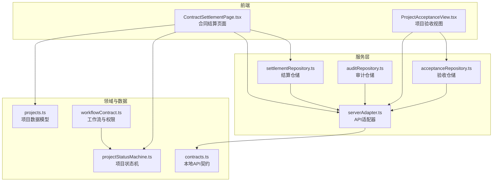
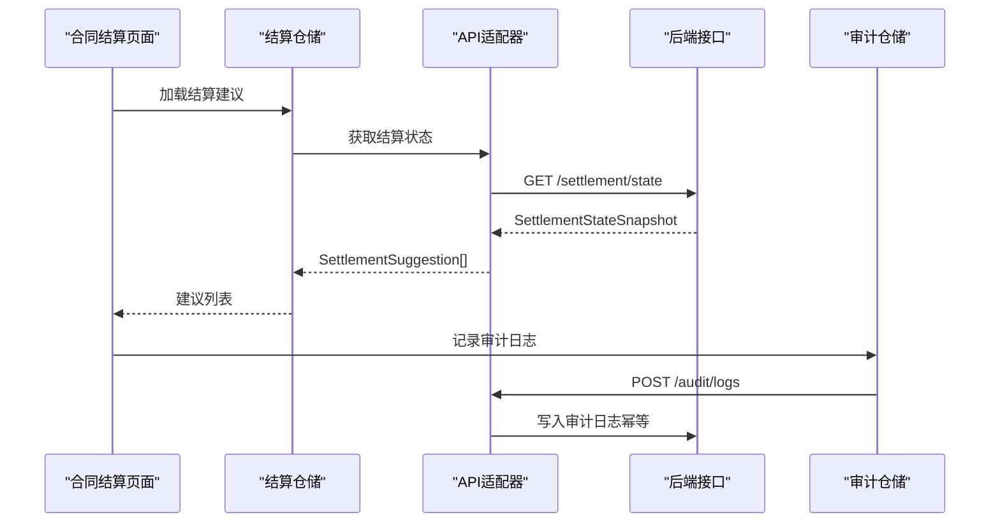
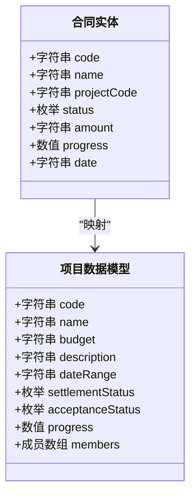
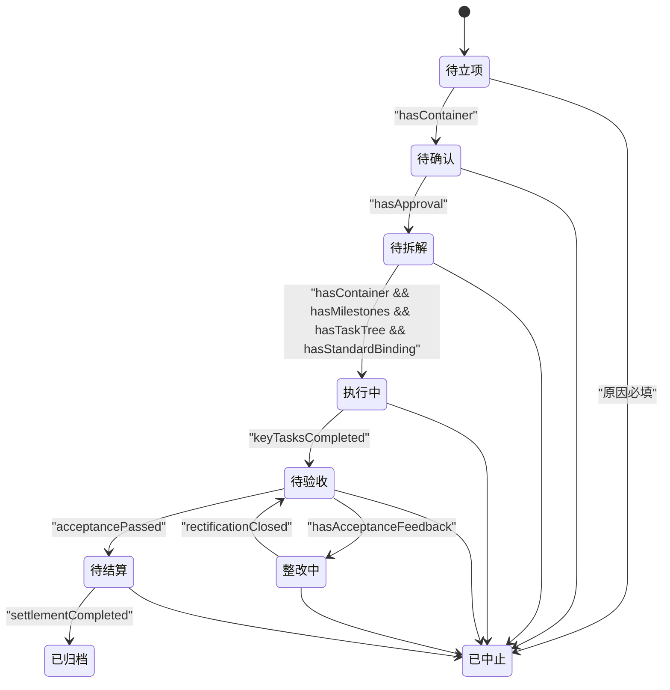
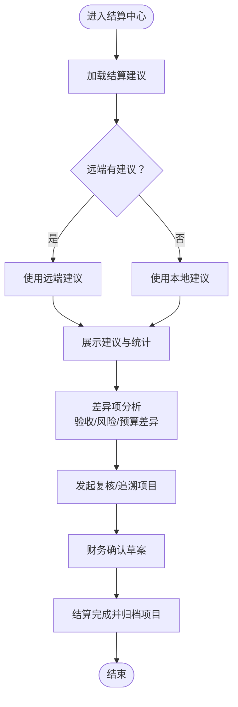
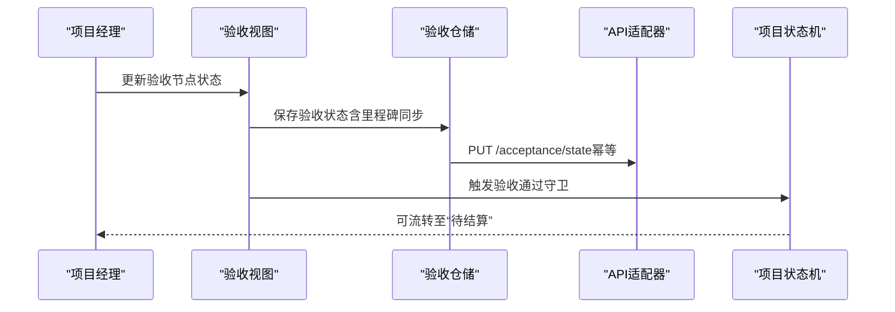
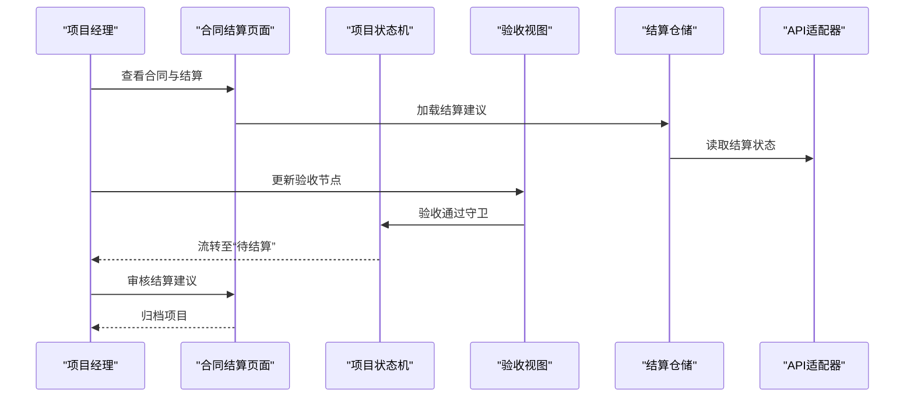
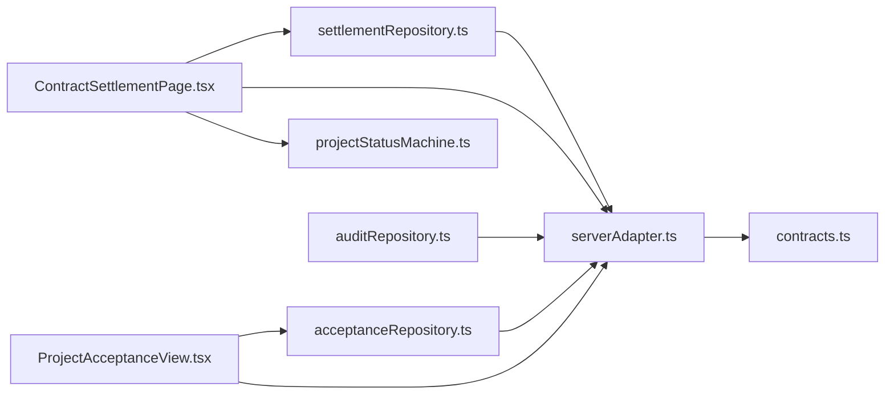

# 合同结算数据模型

<cite>
**本文引用的文件**
- [workflowContract.ts](file://src/services/contracts/workflowContract.ts)
- [projectStatusMachine.ts](file://src/domain/projectStatusMachine.ts)
- [projects.ts](file://src/data/projects.ts)
- [settlementRepository.ts](file://src/services/repositories/settlementRepository.ts)
- [ContractSettlementPage.tsx](file://src/components/contracts/ContractSettlementPage.tsx)
- [serverAdapter.ts](file://src/services/api/serverAdapter.ts)
- [contracts.ts](file://local-api/contracts.ts)
- [auditRepository.ts](file://src/services/repositories/auditRepository.ts)
- [acceptanceRepository.ts](file://src/services/repositories/acceptanceRepository.ts)
- [ProjectAcceptanceView.tsx](file://src/components/project/ProjectAcceptanceView.tsx)
- [state-machine-design.md](file://docs/02-architecture/state-machine-design.md)
</cite>

## 目录

1. [简介](#简介)
2. [项目结构](#项目结构)
3. [核心组件](#核心组件)
4. [架构总览](#架构总览)
5. [详细组件分析](#详细组件分析)
6. [依赖分析](#依赖分析)
7. [性能考虑](#性能考虑)
8. [故障排查指南](#故障排查指南)
9. [结论](#结论)
10. [附录](#附录)

## 简介

本文件面向CodeBuddy项目，系统化梳理合同结算数据模型与业务流程，覆盖合同实体字段、合同生命周期状态控制、结算流程（支付计划、发票管理、成本核算、财务对账）、风险控制与合规要素，以及与项目执行、供应商管理、资金管理的关联关系。同时提供从合同创建、审批、执行到结算的完整业务流程示例，并说明数据安全、电子签名与区块链存证的技术实现思路，以及审计追踪、合规检查与报表生成机制。

## 项目结构

围绕合同与结算的关键代码分布在以下层次：

- 数据契约与领域模型：项目状态机、项目数据模型、结算建议数据契约
- 服务层：API适配器、仓储层（结算、验收、审计）
- 前端组件：合同结算页面、验收视图
- 架构文档：状态机设计与联动规则

图表来源

- [ContractSettlementPage.tsx:191-583](file://src/components/contracts/ContractSettlementPage.tsx#L191-L583)
- [ProjectAcceptanceView.tsx:163-642](file://src/components/project/ProjectAcceptanceView.tsx#L163-L642)
- [serverAdapter.ts:44-87](file://src/services/api/serverAdapter.ts#L44-L87)
- [settlementRepository.ts:20-32](file://src/services/repositories/settlementRepository.ts#L20-L32)
- [acceptanceRepository.ts:32-56](file://src/services/repositories/acceptanceRepository.ts#L32-L56)
- [projectStatusMachine.ts:1-164](file://src/domain/projectStatusMachine.ts#L1-L164)
- [projects.ts:26-45](file://src/data/projects.ts#L26-L45)
- [contracts.ts:35-89](file://local-api/contracts.ts#L35-L89)
- [workflowContract.ts:51-76](file://src/services/contracts/workflowContract.ts#L51-L76)

章节来源

- [ContractSettlementPage.tsx:191-583](file://src/components/contracts/ContractSettlementPage.tsx#L191-L583)
- [ProjectAcceptanceView.tsx:163-642](file://src/components/project/ProjectAcceptanceView.tsx#L163-L642)
- [serverAdapter.ts:44-87](file://src/services/api/serverAdapter.ts#L44-L87)
- [settlementRepository.ts:20-32](file://src/services/repositories/settlementRepository.ts#L20-L32)
- [acceptanceRepository.ts:32-56](file://src/services/repositories/acceptanceRepository.ts#L32-L56)
- [projectStatusMachine.ts:1-164](file://src/domain/projectStatusMachine.ts#L1-L164)
- [projects.ts:26-45](file://src/data/projects.ts#L26-L45)
- [contracts.ts:35-89](file://local-api/contracts.ts#L35-L89)
- [workflowContract.ts:51-76](file://src/services/contracts/workflowContract.ts#L51-L76)

## 核心组件

- 项目状态机与流转守卫：定义项目生命周期状态、可用流转、守卫条件与联动钩子，支撑合同生命周期的合法性与业务约束。
- 结算建议与差异分析：基于项目验收与预算数据生成结算草案建议，识别差异来源与处理状态。
- 验收状态与里程碑：验收节点状态、风险等级、里程碑计划与同步统计，驱动结算进入“待结算”。
- 审计与幂等：审计日志写入与幂等键生成，保障结算与状态变更的可追溯性。
- 权限与工作流：系统角色与操作权限矩阵，约束合同与结算相关操作。

章节来源

- [projectStatusMachine.ts:1-164](file://src/domain/projectStatusMachine.ts#L1-L164)
- [settlementRepository.ts:9-31](file://src/services/repositories/settlementRepository.ts#L9-L31)
- [ProjectAcceptanceView.tsx:101-257](file://src/components/project/ProjectAcceptanceView.tsx#L101-L257)
- [auditRepository.ts:6-25](file://src/services/repositories/auditRepository.ts#L6-L25)
- [workflowContract.ts:20-49](file://src/services/contracts/workflowContract.ts#L20-L49)

## 架构总览

合同结算贯穿“项目执行—验收—结算—归档”的主线，前端页面通过仓储与API适配器访问后端，状态变更受状态机与工作流合约约束，审计日志确保合规与可追溯。

图表来源

- [ContractSettlementPage.tsx:203-219](file://src/components/contracts/ContractSettlementPage.tsx#L203-L219)
- [settlementRepository.ts:20-31](file://src/services/repositories/settlementRepository.ts#L20-L31)
- [serverAdapter.ts:75-85](file://src/services/api/serverAdapter.ts#L75-L85)
- [contracts.ts:42-58](file://local-api/contracts.ts#L42-L58)
- [auditRepository.ts:6-25](file://src/services/repositories/auditRepository.ts#L6-L25)

## 详细组件分析

### 合同实体与字段定义

- 合同实体映射至项目数据模型，关键字段包括：
  - 项目标识：code、name
  - 预算与金额：budget（字符串，如“1,280万”）
  - 履约状态：progress、dispatchStatus、executionStatus、acceptanceStatus、settlementStatus
  - 描述与时间：description、plannedOpenDate、dateRange
  - 风险与成员：riskLevel、members
- 合同状态映射：
  - 依据项目状态与结算状态映射为“草稿”“履约中”“审核中”“已归档”。

图表来源

- [projects.ts:26-45](file://src/data/projects.ts#L26-L45)
- [ContractSettlementPage.tsx:9-92](file://src/components/contracts/ContractSettlementPage.tsx#L9-L92)

章节来源

- [projects.ts:26-45](file://src/data/projects.ts#L26-L45)
- [ContractSettlementPage.tsx:66-92](file://src/components/contracts/ContractSettlementPage.tsx#L66-L92)

### 合同生命周期与状态控制

- 状态机定义了项目主状态与允许流转，关键守卫条件包括：
  - “待立项”→“待确认”：需具备项目容器
  - “待确认”→“待拆解”：需立项审批完成
  - “待拆解”→“执行中”：需容器、里程碑、任务树、标准绑定齐全
  - “执行中”→“待验收”：关键任务完成
  - “待验收”→“待结算”：验收通过
  - “待验收”→“整改中”：需验收反馈
  - “整改中”→“待验收”：整改闭环
  - “待结算”→“已归档”：结算完成
- 联动钩子：进入“待拆解”触发任务树初始化；进入“待验收”触发验收摘要生成；进入“执行中”触发风险重算。

图表来源

- [projectStatusMachine.ts:59-163](file://src/domain/projectStatusMachine.ts#L59-L163)
- [state-machine-design.md:596-601](file://docs/02-architecture/state-machine-design.md#L596-L601)

章节来源

- [projectStatusMachine.ts:59-163](file://src/domain/projectStatusMachine.ts#L59-L163)
- [state-machine-design.md:596-601](file://docs/02-architecture/state-machine-design.md#L596-L601)

### 结算流程：支付计划、发票管理、成本核算与财务对账

- 支付计划与发票管理：
  - 结算建议来源于项目验收与预算数据，草案金额通常按预算的一定比例生成，用于财务复核与差异说明。
  - 页面提供“待确认草案”概览与建议列表，支持按项目筛选与跳转。
- 成本核算与财务对账：
  - 差异项来源包括：验收节点待处理、高风险未闭环、预算差异等；系统计算差异金额与差异率，并给出处理建议。
  - 结算完成作为项目归档条件之一，财务对账完成后方可归档。
- 仓储与API：
  - 结算仓储负责加载建议并与远端状态合并回退至本地缓存策略。
  - API适配器封装结算状态读取与审计日志写入，支持幂等键避免重复写入。

图表来源

- [settlementRepository.ts:20-31](file://src/services/repositories/settlementRepository.ts#L20-L31)
- [ContractSettlementPage.tsx:134-171](file://src/components/contracts/ContractSettlementPage.tsx#L134-L171)
- [serverAdapter.ts:75-85](file://src/services/api/serverAdapter.ts#L75-L85)

章节来源

- [settlementRepository.ts:9-31](file://src/services/repositories/settlementRepository.ts#L9-L31)
- [ContractSettlementPage.tsx:134-171](file://src/components/contracts/ContractSettlementPage.tsx#L134-L171)
- [serverAdapter.ts:75-85](file://src/services/api/serverAdapter.ts#L75-L85)

### 验收与结算衔接

- 验收视图维护验收节点状态、风险等级、里程碑计划与同步统计，支持整改任务自动创建与状态联动。
- 当验收通过且无整改任务时，项目可进入“待结算”状态，驱动结算流程启动。

图表来源

- [ProjectAcceptanceView.tsx:244-257](file://src/components/project/ProjectAcceptanceView.tsx#L244-L257)
- [acceptanceRepository.ts:45-54](file://src/services/repositories/acceptanceRepository.ts#L45-L54)
- [serverAdapter.ts:64-74](file://src/services/api/serverAdapter.ts#L64-L74)
- [projectStatusMachine.ts:146-148](file://src/domain/projectStatusMachine.ts#L146-L148)

章节来源

- [ProjectAcceptanceView.tsx:244-257](file://src/components/project/ProjectAcceptanceView.tsx#L244-L257)
- [acceptanceRepository.ts:32-56](file://src/services/repositories/acceptanceRepository.ts#L32-L56)
- [serverAdapter.ts:64-74](file://src/services/api/serverAdapter.ts#L64-L74)
- [projectStatusMachine.ts:146-148](file://src/domain/projectStatusMachine.ts#L146-L148)

### 风险控制、履约保证金与违约责任

- 风险控制：
  - 验收视图统计高风险未闭环数量，驱动整改任务创建与风险重算。
  - 结算差异分析中将“高风险未闭环”作为差异来源之一，建议补充风险处置结论与责任签认。
- 履约保证金与违约责任：
  - 项目数据模型包含风险级别字段，可用于识别高风险项目并触发保证金与违约条款的预审流程（在当前代码中体现为风险提示与流程建议）。

章节来源

- [ProjectAcceptanceView.tsx:194-208](file://src/components/project/ProjectAcceptanceView.tsx#L194-L208)
- [ContractSettlementPage.tsx:134-171](file://src/components/contracts/ContractSettlementPage.tsx#L134-L171)
- [projects.ts:13-16](file://src/data/projects.ts#L13-L16)

### 合同与项目执行、供应商管理、资金管理的关联

- 项目执行：状态机驱动项目从“待立项”到“执行中”，验收通过后进入“待结算”，最终“已归档”。
- 供应商管理：验收节点与里程碑计划可与供应商交付节点对齐，验收通过即视为供应商履约完成。
- 资金管理：结算建议与差异分析为财务对账提供依据，结算完成后归档，形成资金支付闭环。

章节来源

- [projectStatusMachine.ts:59-163](file://src/domain/projectStatusMachine.ts#L59-L163)
- [ProjectAcceptanceView.tsx:77-97](file://src/components/project/ProjectAcceptanceView.tsx#L77-L97)
- [ContractSettlementPage.tsx:134-171](file://src/components/contracts/ContractSettlementPage.tsx#L134-L171)

### 合同创建、审批、执行、结算的完整业务流程示例

- 创建：根据模板或空白创建项目草稿，生成项目编码与基础信息。
- 审批：完成立项审批后进入“待拆解”，准备任务树与标准绑定。
- 执行：进入“执行中”，持续更新验收节点与里程碑，完成关键任务。
- 验收：验收通过后进入“待结算”，生成结算建议并进行差异分析。
- 结算：财务确认草案，完成对账与支付，项目归档。

图表来源

- [ContractSettlementPage.tsx:203-219](file://src/components/contracts/ContractSettlementPage.tsx#L203-L219)
- [ProjectAcceptanceView.tsx:244-257](file://src/components/project/ProjectAcceptanceView.tsx#L244-L257)
- [projectStatusMachine.ts:146-148](file://src/domain/projectStatusMachine.ts#L146-L148)
- [serverAdapter.ts:75-85](file://src/services/api/serverAdapter.ts#L75-L85)

章节来源

- [ContractSettlementPage.tsx:203-219](file://src/components/contracts/ContractSettlementPage.tsx#L203-L219)
- [ProjectAcceptanceView.tsx:244-257](file://src/components/project/ProjectAcceptanceView.tsx#L244-L257)
- [projectStatusMachine.ts:146-148](file://src/domain/projectStatusMachine.ts#L146-L148)
- [serverAdapter.ts:75-85](file://src/services/api/serverAdapter.ts#L75-L85)

### 数据安全、电子签名与区块链存证

- 幂等与审计：
  - 幂等键生成策略：scope-target-timestamp-random，避免重复写入。
  - 审计日志写入：统一接口与错误降级，增强日志记录，不影响主流程。
- 电子签名与区块链存证：
  - 当前代码未直接实现电子签名与区块链存证逻辑，建议在结算确认环节引入数字证书与哈希存证，结合审计日志形成不可篡改的证据链。

章节来源

- [serverAdapter.ts:38-42](file://src/services/api/serverAdapter.ts#L38-L42)
- [auditRepository.ts:6-25](file://src/services/repositories/auditRepository.ts#L6-L25)
- [contracts.ts:62-70](file://local-api/contracts.ts#L62-L70)

### 审计追踪、合规检查与报表生成

- 审计追踪：
  - 场景化审计日志（项目/任务/验收/结算/系统），支持按场景与项目码过滤。
  - 幂等写入与错误降级，保证审计可用性。
- 合规检查：
  - 状态流转守卫与工作流权限矩阵共同确保合规性，如“整改中/已中止”需填写原因。
- 报表生成：
  - 合同结算页面提供统计卡片（合同总额、已结算金额、预算超支风险）与差异项表格，支持筛选与导出。

章节来源

- [auditRepository.ts:6-25](file://src/services/repositories/auditRepository.ts#L6-L25)
- [contracts.ts:48-58](file://local-api/contracts.ts#L48-L58)
- [workflowContract.ts:20-49](file://src/services/contracts/workflowContract.ts#L20-L49)
- [ContractSettlementPage.tsx:94-132](file://src/components/contracts/ContractSettlementPage.tsx#L94-L132)

## 依赖分析

- 组件耦合与内聚：
  - 合同结算页面依赖结算仓储与API适配器，内聚于“建议加载—差异分析—状态流转—归档”的闭环。
  - 验收视图与验收仓储耦合，保障验收状态持久化与里程碑同步。
- 外部依赖与集成点：
  - API适配器统一接入后端接口，承担幂等与环境参数注入。
  - 本地API契约定义前后端一致的数据结构，便于测试与文档化。

图表来源

- [ContractSettlementPage.tsx:191-583](file://src/components/contracts/ContractSettlementPage.tsx#L191-L583)
- [ProjectAcceptanceView.tsx:163-642](file://src/components/project/ProjectAcceptanceView.tsx#L163-L642)
- [settlementRepository.ts:20-32](file://src/services/repositories/settlementRepository.ts#L20-L32)
- [acceptanceRepository.ts:32-56](file://src/services/repositories/acceptanceRepository.ts#L32-L56)
- [serverAdapter.ts:44-87](file://src/services/api/serverAdapter.ts#L44-L87)
- [contracts.ts:35-89](file://local-api/contracts.ts#L35-L89)
- [auditRepository.ts:6-25](file://src/services/repositories/auditRepository.ts#L6-L25)

章节来源

- [ContractSettlementPage.tsx:191-583](file://src/components/contracts/ContractSettlementPage.tsx#L191-L583)
- [ProjectAcceptanceView.tsx:163-642](file://src/components/project/ProjectAcceptanceView.tsx#L163-L642)
- [settlementRepository.ts:20-32](file://src/services/repositories/settlementRepository.ts#L20-L32)
- [acceptanceRepository.ts:32-56](file://src/services/repositories/acceptanceRepository.ts#L32-L56)
- [serverAdapter.ts:44-87](file://src/services/api/serverAdapter.ts#L44-L87)
- [contracts.ts:35-89](file://local-api/contracts.ts#L35-L89)
- [auditRepository.ts:6-25](file://src/services/repositories/auditRepository.ts#L6-L25)

## 性能考虑

- 建议优化
  - 结算建议加载：采用分页与缓存策略，减少一次性渲染压力。
  - 验收状态：本地存储与远端同步分离，避免网络异常影响体验。
  - 幂等键：合理设置过期时间，平衡一致性与性能。
  - 审计日志：批量写入与去抖策略，降低频繁写入开销。

## 故障排查指南

- 结算建议为空
  - 检查远端接口是否可用，若失败则回退至本地建议。
  - 确认项目验收状态与预算字段格式正确。
- 验收状态不同步
  - 检查本地存储与远端保存是否成功，必要时清理缓存重试。
- 审计日志写入失败
  - 查看错误降级日志，确认幂等键与请求体格式。
- 状态流转被阻断
  - 根据守卫条件逐项核查，补齐容器、里程碑、任务树、标准绑定、验收反馈、整改闭环、结算完成等前置条件。

章节来源

- [settlementRepository.ts:24-29](file://src/services/repositories/settlementRepository.ts#L24-L29)
- [acceptanceRepository.ts:33-43](file://src/services/repositories/acceptanceRepository.ts#L33-L43)
- [auditRepository.ts:17-24](file://src/services/repositories/auditRepository.ts#L17-L24)
- [projectStatusMachine.ts:105-163](file://src/domain/projectStatusMachine.ts#L105-L163)

## 结论

CodeBuddy的合同结算数据模型以项目状态机为核心，串联验收、结算与归档流程，结合仓储与API适配器实现建议加载、差异分析与审计追踪。通过权限矩阵与守卫条件保障合规性，建议在后续版本中完善电子签名与区块链存证能力，进一步提升合同数据的可信度与可追溯性。

## 附录

- 术语
  - 合同：与项目绑定的结算实体，状态随项目状态变化。
  - 结算建议：基于验收与预算生成的草案金额与差异说明。
  - 幂等键：用于防止重复写入的唯一标识。
- 参考文档
  - 状态机设计与联动规则

章节来源

- [state-machine-design.md:596-601](file://docs/02-architecture/state-machine-design.md#L596-L601)
