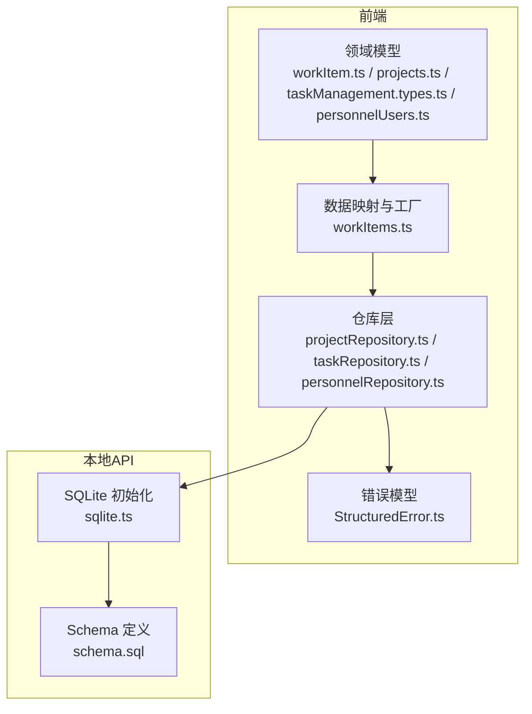
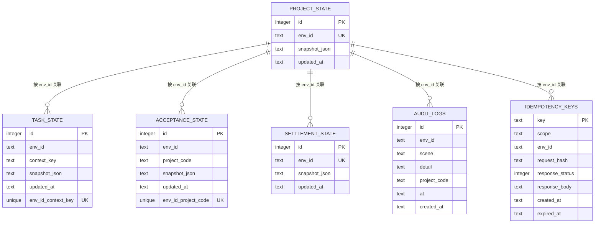
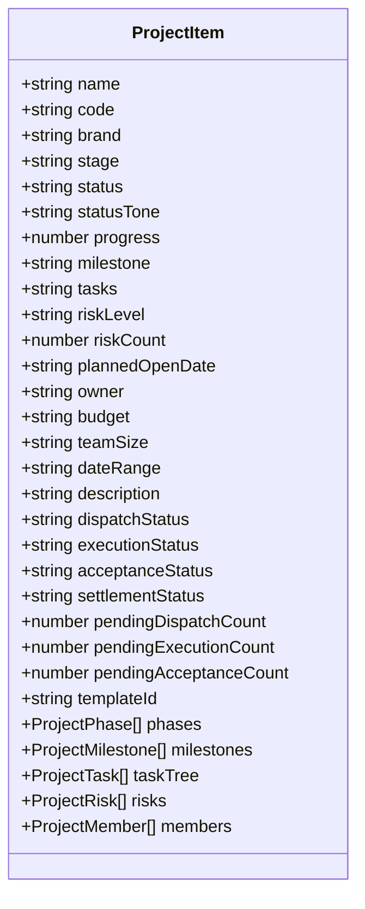
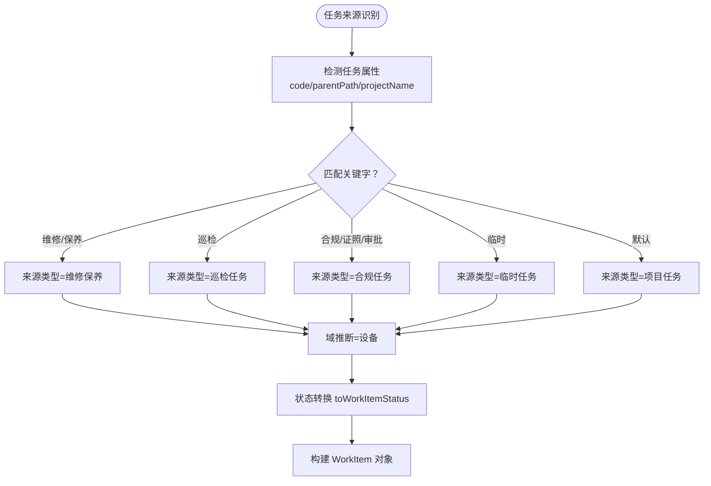
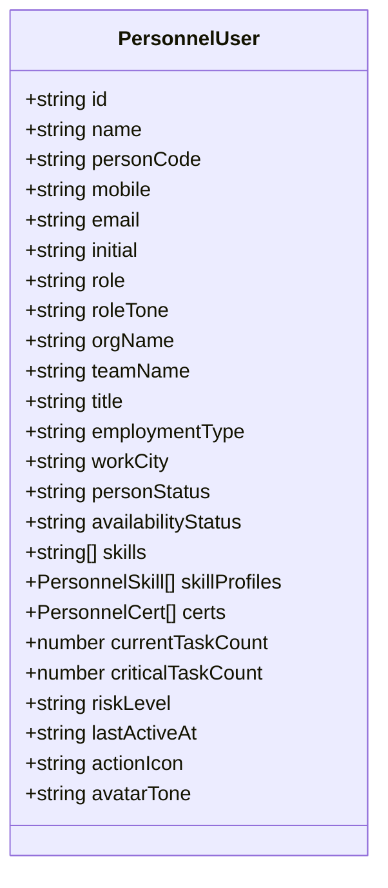
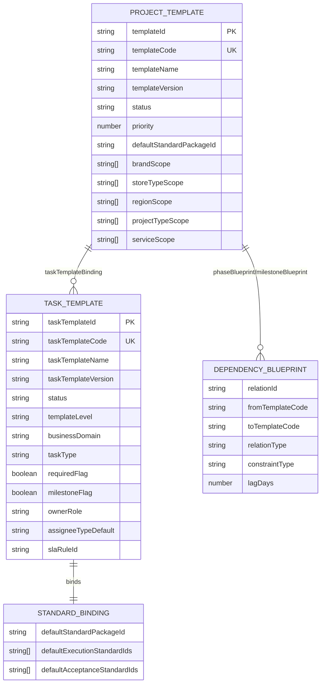
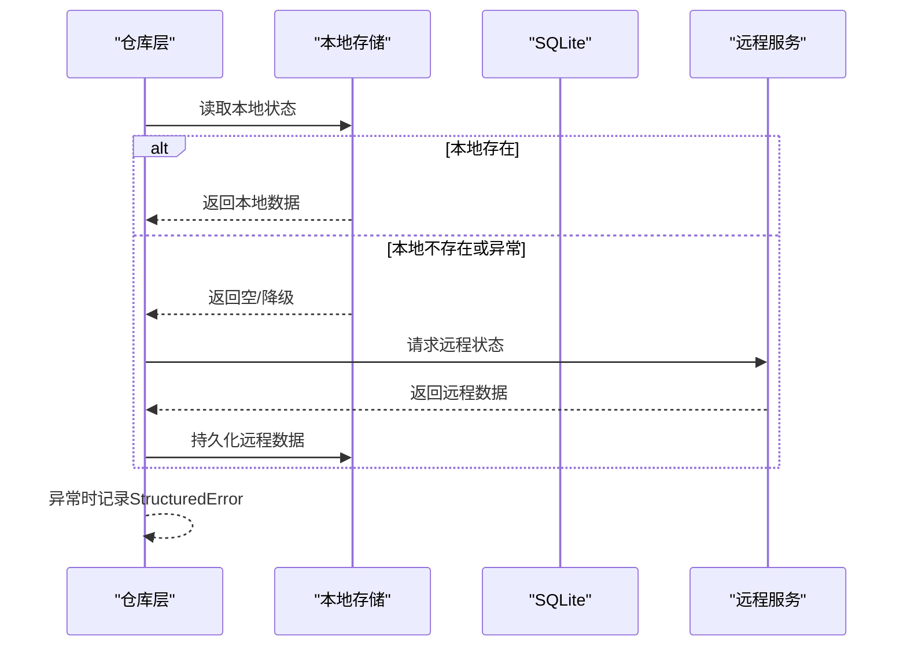
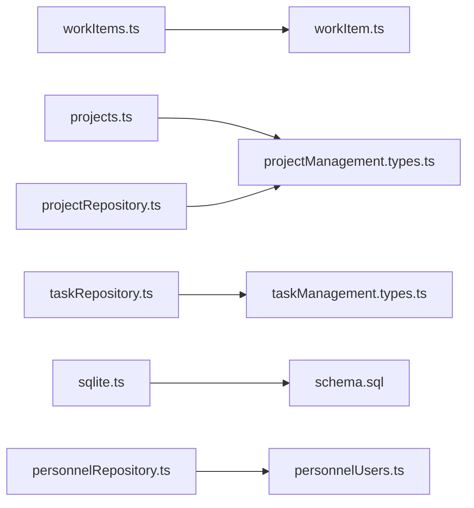

# 数据模型设计

<cite>
**本文引用的文件**
- [schema.sql](file://local-api/store/schema.sql)
- [sqlite.ts](file://local-api/store/sqlite.ts)
- [workItem.ts](file://src/domain/workItem.ts)
- [workItems.ts](file://src/data/workItems.ts)
- [projects.ts](file://src/data/projects.ts)
- [projectManagement.types.ts](file://src/components/personnel/projectManagement.types.ts)
- [personnelUsers.ts](file://src/components/personnel/personnelUsers.ts)
- [taskManagement.types.ts](file://src/components/task/taskManagement.types.ts)
- [taskRepository.ts](file://src/services/repositories/taskRepository.ts)
- [projectRepository.ts](file://src/services/repositories/projectRepository.ts)
- [personnelRepository.ts](file://src/services/repositories/personnelRepository.ts)
- [StructuredError.ts](file://src/services/errors/StructuredError.ts)
- [standard-template.data.ts](file://src/components/standard/standard-template.data.ts)
- [template-contract.types.ts](file://src/components/standard/template-contract.types.ts)
</cite>

## 目录

1. [简介](#简介)
2. [项目结构](#项目结构)
3. [核心组件](#核心组件)
4. [架构总览](#架构总览)
5. [详细组件分析](#详细组件分析)
6. [依赖分析](#依赖分析)
7. [性能考量](#性能考量)
8. [故障排查指南](#故障排查指南)
9. [结论](#结论)
10. [附录](#附录)

## 简介

本文件面向 CodeBuddy 项目，提供全面的数据模型设计文档。重点覆盖以下实体与关系：

- 项目数据模型（ProjectItem）
- 任务数据模型（WorkItem）
- 人员数据模型（PersonnelUser）
- 标准模板数据模型（StandardTemplate）
- 本地状态与审计日志（project_state、task_state、acceptance_state、settlement_state、audit_logs、idempotency_keys）

文档内容包括字段定义、数据类型、主键/外键关系与数据库约束；阐述数据验证规则、业务规则约束与数据完整性保障机制；说明数据访问模式、缓存策略与性能优化；给出数据库 Schema 图与示例数据；描述数据生命周期管理、版本控制与迁移路径；并说明数据安全、隐私保护与访问控制机制。

## 项目结构

项目采用前端 TypeScript + 本地 SQLite 的混合架构：

- 前端领域模型与数据映射位于 src 下的 domain、data、components、services 等目录
- 本地 API 使用 SQLite 存储项目状态、任务状态、验收状态、结算状态、审计日志与幂等键
- 仓库层负责本地持久化（localStorage）与远程同步（serverAdapter），并提供幂等控制

**图表来源**

- [sqlite.ts:18-42](file://local-api/store/sqlite.ts#L18-L42)
- [schema.sql:1-72](file://local-api/store/schema.sql#L1-L72)
- [workItem.ts:1-68](file://src/domain/workItem.ts#L1-L68)
- [workItems.ts:1-441](file://src/data/workItems.ts#L1-L441)
- [projectRepository.ts:53-90](file://src/services/repositories/projectRepository.ts#L53-L90)
- [taskRepository.ts:141-318](file://src/services/repositories/taskRepository.ts#L141-L318)
- [personnelRepository.ts:44-58](file://src/services/repositories/personnelRepository.ts#L44-L58)
- [StructuredError.ts:27-127](file://src/services/errors/StructuredError.ts#L27-L127)

**章节来源**

- [sqlite.ts:18-42](file://local-api/store/sqlite.ts#L18-L42)
- [schema.sql:1-72](file://local-api/store/schema.sql#L1-L72)

## 核心组件

本节概述四大核心数据模型及其职责与关系。

- 项目数据模型（ProjectItem）
  - 职责：承载项目基本信息、阶段、里程碑、任务树、风险与成员等扩展信息
  - 关键字段：code、name、brand、stage、status、statusTone、progress、milestone、tasks、riskLevel、riskCount、plannedOpenDate、owner、预算/团队规模/日期范围/描述、各类状态与待办计数、模板ID、扩展数组字段
  - 业务规则：状态与阶段、风险等级、进度计算、草稿与模板创建逻辑

- 任务数据模型（WorkItem）
  - 职责：统一任务视图，支持项目任务、工作包、任务、子任务、里程碑等层级
  - 关键字段：id、sourceType、projectCode、taskCode、parentId、kind（project/work_package/task/subtask/milestone）、wbsCode、name、owner、status、progress、planStart/planEnd、dependencies、isCritical、stage、domain、groupId/groupLabel/groupSummary、tags、description
  - 业务规则：来源类型推断、域推断、状态转换、关键路径标记

- 人员数据模型（PersonnelUser）
  - 职责：人员档案与能力画像，支持内部/外包/供应商身份、可用性状态、技能证书、项目与任务明细
  - 关键字段：id、name、personCode、mobile、email、initial、role、roleTone、orgName/teamName、title、employmentType、workCity、personStatus、availabilityStatus、skills、skillProfiles、certs、currentTaskCount、criticalTaskCount、riskLevel、lastActiveAt、actionIcon、avatarTone
  - 业务规则：状态与可用性映射、编号生成策略

- 标准模板数据模型（StandardTemplate）
  - 职责：项目模板与任务模板的蓝图与实例化契约，支撑标准包绑定、依赖蓝图、SLA 规则、里程碑与阶段蓝图
  - 关键字段：ProjectTemplate 与 TaskTemplate 的元数据、范围、优先级、蓝图、依赖、标准包绑定、版本号
  - 业务规则：模板匹配输入、实例化输出、审计事件、关系约束（单父唯一、禁止自依赖、禁止循环依赖）

**章节来源**

- [projects.ts:26-45](file://src/data/projects.ts#L26-L45)
- [projectManagement.types.ts:21-41](file://src/components/personnel/projectManagement.types.ts#L21-L41)
- [workItem.ts:9-32](file://src/domain/workItem.ts#L9-L32)
- [workItems.ts:6-441](file://src/data/workItems.ts#L6-L441)
- [personnelUsers.ts:4-100](file://src/components/personnel/personnelUsers.ts#L4-L100)
- [standard-template.data.ts:38-383](file://src/components/standard/standard-template.data.ts#L38-L383)
- [template-contract.types.ts:91-206](file://src/components/standard/template-contract.types.ts#L91-L206)

## 架构总览

本地状态与审计日志通过 SQLite 统一存储，前端仓库层负责读写与幂等控制，并在异常时回退至 localStorage 缓存。

**图表来源**

- [schema.sql:5-71](file://local-api/store/schema.sql#L5-L71)

**章节来源**

- [schema.sql:1-72](file://local-api/store/schema.sql#L1-L72)
- [sqlite.ts:68-80](file://local-api/store/sqlite.ts#L68-L80)

## 详细组件分析

### 项目数据模型（ProjectItem）

- 字段与类型
  - 基础字段：name、code、brand、stage、status、statusTone、progress、milestone、tasks、riskLevel、riskCount、plannedOpenDate、owner
  - 扩展字段：budget、teamSize、dateRange、description、dispatchStatus、executionStatus、acceptanceStatus、settlementStatus、pendingDispatchCount、pendingExecutionCount、pendingAcceptanceCount、templateId、phases、milestones、taskTree、risks、members
- 主键/外键与约束
  - code 作为业务主键；扩展数组字段为可选
- 业务规则
  - 状态归一化与阶段映射、风险等级与统计、草稿与模板创建、项目编号生成（基于年份与序号）
- 数据访问模式
  - 仓库层：本地 localStorage 读写 + 远程同步；异常时降级
  - 版本控制：草稿与模板驱动的项目快照
- 示例数据
  - 多个示例项目（PRJ-2024-001 至 PRJ-2024-012），包含阶段、里程碑、任务树、风险与成员等

**图表来源**

- [projects.ts:26-45](file://src/data/projects.ts#L26-L45)
- [projectManagement.types.ts:21-127](file://src/components/personnel/projectManagement.types.ts#L21-L127)

**章节来源**

- [projects.ts:26-45](file://src/data/projects.ts#L26-L45)
- [projectManagement.types.ts:21-127](file://src/components/personnel/projectManagement.types.ts#L21-L127)
- [projectRepository.ts:14-51](file://src/services/repositories/projectRepository.ts#L14-L51)

### 任务数据模型（WorkItem）

- 字段与类型
  - 标识：id、sourceType、projectCode、taskCode、parentId、kind、wbsCode
  - 描述：name、owner、description、tags
  - 时间：planStart、planEnd
  - 进度：progress、status、dependencies、isCritical
  - 分类：stage、domain、groupId/groupLabel/groupSummary
- 主键/外键与约束
  - id 为业务标识；parentId 支持层级关系；kind 决定层级类型
- 业务规则
  - 来源类型推断（基于任务指纹）、域推断（维护/巡检/合规/临时/项目）、状态转换（toWorkItemStatus）
- 数据访问模式
  - 仓库层：按 contextKey 维度读写任务快照；支持操作日志追加与审计上报
  - 幂等控制：保存时生成幂等键，避免重复提交
- 示例数据
  - 项目模板任务树（根节点、工作包、任务、子任务、里程碑）与任务中心任务列表

**图表来源**

- [workItems.ts:6-33](file://src/data/workItems.ts#L6-L33)
- [workItem.ts:49-67](file://src/domain/workItem.ts#L49-L67)

**章节来源**

- [workItem.ts:9-32](file://src/domain/workItem.ts#L9-L32)
- [workItems.ts:437-441](file://src/data/workItems.ts#L437-L441)
- [taskRepository.ts:141-195](file://src/services/repositories/taskRepository.ts#L141-L195)

### 人员数据模型（PersonnelUser）

- 字段与类型
  - 基本信息：id、name、personCode、mobile、email、initial、role、roleTone、orgName、teamName、title、employmentType、workCity
  - 状态：personStatus、availabilityStatus、lastActiveAt、actionIcon、avatarTone
  - 能力：skills、skillProfiles、certs
  - 统计：currentTaskCount、criticalTaskCount、riskLevel
- 主键/外键与约束
  - id 为业务主键；roleTone 与 employmentType 为枚举
- 业务规则
  - 状态到可用性的映射、编号生成策略（从现有最大值+1）
- 数据访问模式
  - 仓库层：本地持久化与初始态构建；异常时回退到默认初始态

**图表来源**

- [personnelUsers.ts:4-100](file://src/components/personnel/personnelUsers.ts#L4-L100)

**章节来源**

- [personnelUsers.ts:4-100](file://src/components/personnel/personnelUsers.ts#L4-L100)
- [personnelRepository.ts:5-57](file://src/services/repositories/personnelRepository.ts#L5-L57)

### 标准模板数据模型（StandardTemplate）

- 字段与类型
  - 项目模板：templateId、templateCode、templateName、templateVersion、status、priority、defaultStandardPackageId、brandScope、storeTypeScope、regionScope、projectTypeScope、serviceScope、phaseBlueprint、milestoneBlueprint、taskTemplateBinding
  - 任务模板：taskTemplateId、taskTemplateCode、taskTemplateVersion、status、templateLevel、businessDomain、taskType、requiredFlag、milestoneFlag、ownerRole、assigneeTypeDefault、slaRuleId、standardBinding、dependencyBlueprint、childTemplateRefs、sortOrder
  - 实例化契约：ResolvedTemplateBundle、TemplateInstantiationInput/Output、TemplateAuditEvent
- 主键/外键与约束
  - 模板版本号为语义版本；模板间依赖关系受约束（单父唯一、禁止自依赖、禁止循环依赖）
- 业务规则
  - 匹配输入（品牌/门店类型/区域/项目类型/计划时间等）决定模板选择；实例化输出包含阶段、里程碑、任务树与关系实例
- 数据访问模式
  - 仓库层：模板审计事件本地缓存与远程上报；幂等键用于审计日志追加

**图表来源**

- [standard-template.data.ts:57-177](file://src/components/standard/standard-template.data.ts#L57-L177)
- [standard-template.data.ts:198-382](file://src/components/standard/standard-template.data.ts#L198-L382)
- [template-contract.types.ts:91-123](file://src/components/standard/template-contract.types.ts#L91-L123)
- [template-contract.types.ts:155-206](file://src/components/standard/template-contract.types.ts#L155-L206)

**章节来源**

- [standard-template.data.ts:38-383](file://src/components/standard/standard-template.data.ts#L38-L383)
- [template-contract.types.ts:91-206](file://src/components/standard/template-contract.types.ts#L91-L206)
- [taskRepository.ts:281-317](file://src/services/repositories/taskRepository.ts#L281-L317)

### 本地状态与审计日志（SQLite）

- 表结构与约束
  - project_state：env_id 唯一
  - task_state：(env_id, context_key) 唯一
  - acceptance_state：(env_id, project_code) 唯一
  - settlement_state：env_id 唯一
  - audit_logs：包含索引（env_id、project_code、scene）
  - idempotency_keys：key 主键，scope/env_id/expired_at 索引
- 生命周期与清理
  - WAL 模式提升并发；定期清理过期幂等键
- 数据访问模式
  - 初始化时读取 schema.sql 并执行；提供重置数据库接口（测试用途）

**图表来源**

- [projectRepository.ts:54-74](file://src/services/repositories/projectRepository.ts#L54-L74)
- [taskRepository.ts:142-152](file://src/services/repositories/taskRepository.ts#L142-L152)
- [sqlite.ts:35-37](file://local-api/store/sqlite.ts#L35-L37)

**章节来源**

- [schema.sql:4-71](file://local-api/store/schema.sql#L4-L71)
- [sqlite.ts:18-42](file://local-api/store/sqlite.ts#L18-L42)
- [projectRepository.ts:53-90](file://src/services/repositories/projectRepository.ts#L53-L90)
- [taskRepository.ts:141-195](file://src/services/repositories/taskRepository.ts#L141-L195)
- [StructuredError.ts:27-127](file://src/services/errors/StructuredError.ts#L27-L127)

## 依赖分析

- 组件耦合
  - 仓库层依赖 serverAdapter（远程适配）与 localStorage（本地缓存）
  - 数据映射层依赖领域模型与类型定义
  - SQLite 仅作为本地持久化载体，不承担业务逻辑
- 外部依赖
  - better-sqlite3 提供 SQLite 访问
  - 浏览器 localStorage 提供离线缓存
- 可能的循环依赖
  - 当前结构清晰，未发现循环导入

**图表来源**

- [workItems.ts:1-4](file://src/data/workItems.ts#L1-L4)
- [workItem.ts:1-8](file://src/domain/workItem.ts#L1-L8)
- [projects.ts:1-11](file://src/data/projects.ts#L1-L11)
- [projectManagement.types.ts:1-12](file://src/components/personnel/projectManagement.types.ts#L1-L12)
- [taskRepository.ts:1-4](file://src/services/repositories/taskRepository.ts#L1-L4)
- [taskManagement.types.ts:1-239](file://src/components/task/taskManagement.types.ts#L1-L239)
- [projectRepository.ts:1-4](file://src/services/repositories/projectRepository.ts#L1-L4)
- [sqlite.ts:1-12](file://local-api/store/sqlite.ts#L1-L12)
- [schema.sql:1-72](file://local-api/store/schema.sql#L1-L72)
- [personnelRepository.ts:1-4](file://src/services/repositories/personnelRepository.ts#L1-L4)
- [personnelUsers.ts:1-4](file://src/components/personnel/personnelUsers.ts#L1-L4)

**章节来源**

- [workItems.ts:1-4](file://src/data/workItems.ts#L1-L4)
- [projects.ts:1-11](file://src/data/projects.ts#L1-L11)
- [taskRepository.ts:1-4](file://src/services/repositories/taskRepository.ts#L1-L4)
- [sqlite.ts:1-12](file://local-api/store/sqlite.ts#L1-L12)

## 性能考量

- SQLite
  - WAL 模式提升并发读写性能
  - 合理使用索引（audit_logs 的 env_id、project_code、scene；idempotency_keys 的 env_id、scope、expired_at）
- 本地缓存
  - localStorage 作为降级与加速手段，减少网络往返
- 幂等控制
  - 幂等键避免重复提交，降低无效写入
- 数据访问
  - 任务按 contextKey 维度隔离，避免全局扫描
  - 审计日志追加限制数量，防止无限增长

[本节为通用指导，无需特定文件引用]

## 故障排查指南

- 错误模型
  - StructuredError 提供统一错误码、作用域、场景、时间戳与原始错误信息
  - 支持网络错误、验证错误、业务错误、幂等冲突、未授权、禁止、未找到、限流、服务器错误、重试耗尽等
- 日志与上报
  - 控制台输出结构化日志；可扩展远程上报
- 典型问题
  - 本地读取失败：记录 BUSINESS_ERROR 并降级
  - 远程加载失败：记录 NETWORK_ERROR 并返回本地缓存
  - 幂等冲突：抛出 IDEMPOTENCY_CONFLICT 并携带幂等键

**章节来源**

- [StructuredError.ts:27-127](file://src/services/errors/StructuredError.ts#L27-L127)
- [projectRepository.ts:26-37](file://src/services/repositories/projectRepository.ts#L26-L37)
- [taskRepository.ts:157-168](file://src/services/repositories/taskRepository.ts#L157-L168)

## 结论

本设计文档系统性梳理了 CodeBuddy 的核心数据模型与本地存储架构。通过清晰的实体定义、严格的业务规则与完善的缓存/幂等策略，确保了数据一致性、可追溯性与运行稳定性。建议在后续迭代中持续完善模板版本治理、审计事件的远程聚合与可视化，以及访问控制策略的落地。

[本节为总结性内容，无需特定文件引用]

## 附录

### 数据库 Schema 与示例

- SQLite 表结构与索引
  - project_state、task_state、acceptance_state、settlement_state、audit_logs、idempotency_keys
  - 索引：audit_logs(env_id, project_code, scene)；idempotency_keys(env_id, scope, expired_at)
- 示例数据
  - 项目：PRJ-2024-001 至 PRJ-2024-012，包含阶段、里程碑、任务树、风险与成员
  - 任务：项目模板任务树与任务中心任务列表
  - 人员：多条人员记录与能力画像
  - 模板：项目模板与任务模板蓝图及实例化契约

**章节来源**

- [schema.sql:4-71](file://local-api/store/schema.sql#L4-L71)
- [projects.ts:55-317](file://src/data/projects.ts#L55-L317)
- [workItems.ts:43-406](file://src/data/workItems.ts#L43-L406)
- [personnelUsers.ts:102-320](file://src/components/personnel/personnelUsers.ts#L102-L320)
- [standard-template.data.ts:38-383](file://src/components/standard/standard-template.data.ts#L38-L383)
- [template-contract.types.ts:181-206](file://src/components/standard/template-contract.types.ts#L181-L206)

### 数据生命周期与版本控制

- 项目与任务快照：按 env_id/context_key 维度存储，支持版本号字段
- 模板：语义版本号，实例化输出包含版本信息
- 审计：审计日志记录关键操作与事件，支持模板审计事件本地缓存与远程上报

**章节来源**

- [taskRepository.ts:17-21](file://src/services/repositories/taskRepository.ts#L17-L21)
- [taskRepository.ts:281-317](file://src/services/repositories/taskRepository.ts#L281-L317)
- [standard-template.data.ts:36-37](file://src/components/standard/standard-template.data.ts#L36-L37)
- [template-contract.types.ts:23-31](file://src/components/standard/template-contract.types.ts#L23-L31)

### 数据安全、隐私与访问控制

- 本地存储安全
  - localStorage 仅存放非敏感业务数据；错误与审计日志避免泄露敏感信息
- 幂等控制
  - 幂等键避免重复提交；过期清理降低存储压力
- 访问控制建议
  - 基于角色的最小权限原则；对敏感操作进行鉴权与审计
  - 审计日志保留关键操作轨迹，支持回溯与合规

**章节来源**

- [sqlite.ts:68-80](file://local-api/store/sqlite.ts#L68-L80)
- [taskRepository.ts:157-168](file://src/services/repositories/taskRepository.ts#L157-L168)
- [StructuredError.ts:179-194](file://src/services/errors/StructuredError.ts#L179-L194)
