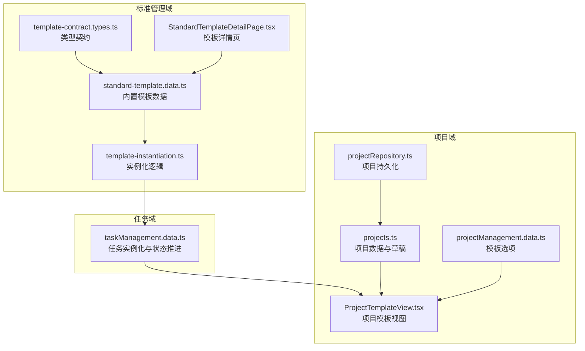
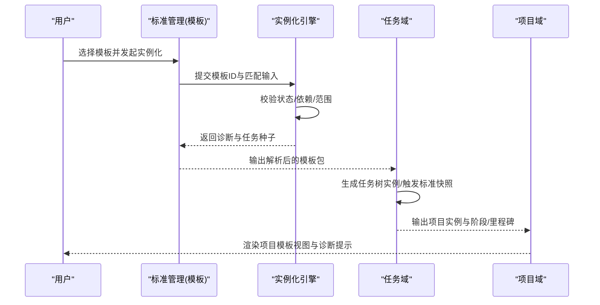
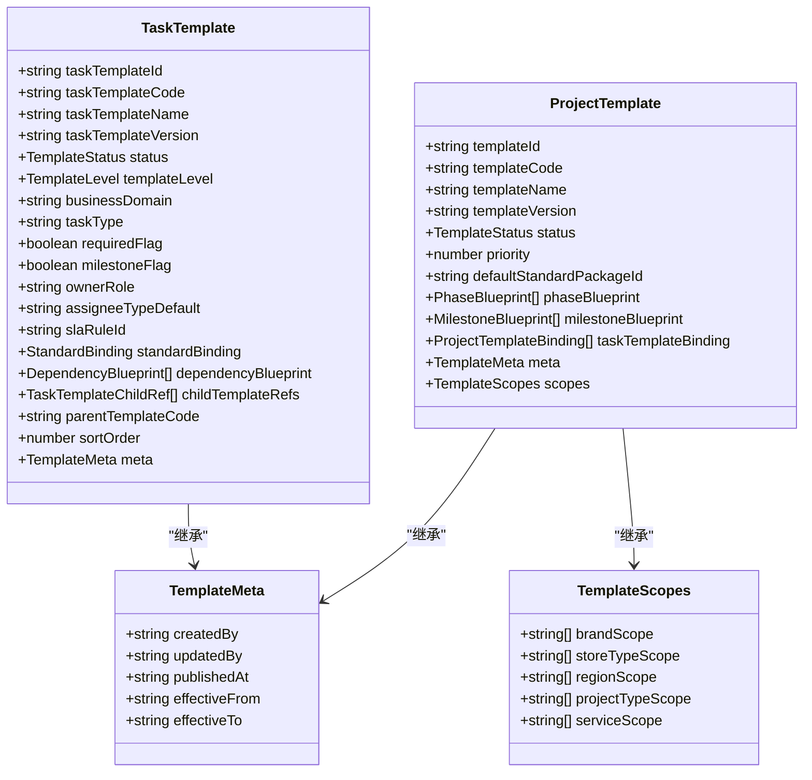
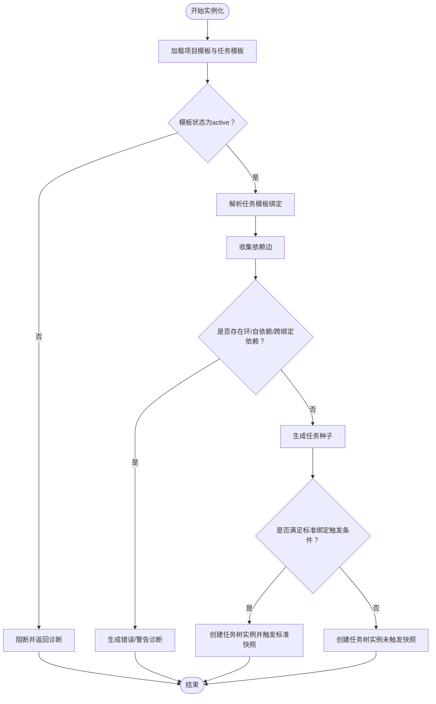

# 标准模板数据模型

<cite>
**本文引用的文件**
- [template-data-contract.md](file://docs/02-architecture/template-data-contract.md)
- [template-contract.types.ts](file://src/components/standard/template-contract.types.ts)
- [standard-template.data.ts](file://src/components/standard/standard-template.data.ts)
- [template-instantiation.ts](file://src/components/standard/template-instantiation.ts)
- [StandardTemplateDetailPage.tsx](file://src/components/standard/StandardTemplateDetailPage.tsx)
- [ProjectTemplateView.tsx](file://src/components/project/ProjectTemplateView.tsx)
- [taskManagement.data.ts](file://src/components/task/taskManagement.data.ts)
- [projects.ts](file://src/data/projects.ts)
- [projectRepository.ts](file://src/services/repositories/projectRepository.ts)
- [projectManagement.data.ts](file://src/components/personnel/projectManagement.data.ts)
</cite>

## 目录

1. [简介](#简介)
2. [项目结构](#项目结构)
3. [核心组件](#核心组件)
4. [架构总览](#架构总览)
5. [详细组件分析](#详细组件分析)
6. [依赖分析](#依赖分析)
7. [性能考虑](#性能考虑)
8. [故障排查指南](#故障排查指南)
9. [结论](#结论)
10. [附录](#附录)

## 简介

本文件面向CodeBuddy项目的“标准模板数据模型”，系统化阐述模板实体的字段定义、模板结构与业务规则，模板类型分类（项目模板、任务模板等）、版本管理机制，模板实例化过程中的数据映射与字段填充，以及与项目创建、合同签署、流程执行等业务场景的关联关系。同时说明模板数据的标准化程度、可配置性与扩展性设计，并给出模板创建、编辑、发布、使用的完整生命周期管理示例，涵盖权限控制、模板继承与组合等高级特性，以及模板数据与其他模块的集成与数据同步机制。

## 项目结构

围绕模板数据模型的关键文件组织如下：

- 架构契约与规范：docs/02-architecture/template-data-contract.md
- 类型契约与数据模型：src/components/standard/template-contract.types.ts
- 模板数据与目录：src/components/standard/standard-template.data.ts
- 实例化逻辑：src/components/standard/template-instantiation.ts
- 模板详情页：src/components/standard/StandardTemplateDetailPage.tsx
- 项目模板视图：src/components/project/ProjectTemplateView.tsx
- 任务实例化与状态推进：src/components/task/taskManagement.data.ts
- 项目数据与草稿：src/data/projects.ts
- 项目仓库与持久化：src/services/repositories/projectRepository.ts
- 项目模板选项：src/components/personnel/projectManagement.data.ts

图表来源

- [template-contract.types.ts:1-244](file://src/components/standard/template-contract.types.ts#L1-L244)
- [standard-template.data.ts:1-408](file://src/components/standard/standard-template.data.ts#L1-L408)
- [template-instantiation.ts:1-192](file://src/components/standard/template-instantiation.ts#L1-L192)
- [StandardTemplateDetailPage.tsx:1-363](file://src/components/standard/StandardTemplateDetailPage.tsx#L1-L363)
- [ProjectTemplateView.tsx:1-115](file://src/components/project/ProjectTemplateView.tsx#L1-L115)
- [taskManagement.data.ts:460-551](file://src/components/task/taskManagement.data.ts#L460-L551)
- [projects.ts:1-451](file://src/data/projects.ts#L1-L451)
- [projectRepository.ts:1-90](file://src/services/repositories/projectRepository.ts#L1-L90)
- [projectManagement.data.ts:283-312](file://src/components/personnel/projectManagement.data.ts#L283-L312)

章节来源

- [template-contract.types.ts:1-244](file://src/components/standard/template-contract.types.ts#L1-L244)
- [standard-template.data.ts:1-408](file://src/components/standard/standard-template.data.ts#L1-L408)
- [template-instantiation.ts:1-192](file://src/components/standard/template-instantiation.ts#L1-L192)
- [StandardTemplateDetailPage.tsx:1-363](file://src/components/standard/StandardTemplateDetailPage.tsx#L1-L363)
- [ProjectTemplateView.tsx:1-115](file://src/components/project/ProjectTemplateView.tsx#L1-L115)
- [taskManagement.data.ts:460-551](file://src/components/task/taskManagement.data.ts#L460-L551)
- [projects.ts:1-451](file://src/data/projects.ts#L1-L451)
- [projectRepository.ts:1-90](file://src/services/repositories/projectRepository.ts#L1-L90)
- [projectManagement.data.ts:283-312](file://src/components/personnel/projectManagement.data.ts#L283-L312)

## 核心组件

- 模板类型契约与版本模型：定义模板状态、层级、依赖关系、范围与元信息等统一类型。
- 项目模板与任务模板：分别承载项目阶段/里程碑/任务绑定与任务树结构、依赖、标准绑定等。
- 模板目录与内置模板：提供内置项目模板与任务模板的数据样例与目录查询能力。
- 实例化引擎：负责模板命中、依赖校验、状态门禁与任务种子输出。
- 任务实例化与状态推进：基于模板实例化结果生成任务树实例，推进任务状态与标准快照触发。
- 项目模板视图：将模板实例化结果渲染为项目模板视图，支持诊断提示与任务跳转。
- 项目数据与草稿：支撑项目创建流程，支持模板驱动的项目草稿生成。
- 项目仓库：提供本地与远端状态读写，保障模板数据与项目数据的同步一致性。

章节来源

- [template-contract.types.ts:6-132](file://src/components/standard/template-contract.types.ts#L6-L132)
- [template-contract.types.ts:91-123](file://src/components/standard/template-contract.types.ts#L91-L123)
- [standard-template.data.ts:38-178](file://src/components/standard/standard-template.data.ts#L38-L178)
- [standard-template.data.ts:180-383](file://src/components/standard/standard-template.data.ts#L180-L383)
- [template-instantiation.ts:79-191](file://src/components/standard/template-instantiation.ts#L79-L191)
- [taskManagement.data.ts:460-551](file://src/components/task/taskManagement.data.ts#L460-L551)
- [ProjectTemplateView.tsx:25-111](file://src/components/project/ProjectTemplateView.tsx#L25-L111)
- [projects.ts:416-450](file://src/data/projects.ts#L416-L450)
- [projectRepository.ts:14-90](file://src/services/repositories/projectRepository.ts#L14-L90)

## 架构总览

模板数据模型遵循“模板作为规则源”的主链路，先稳定模板定义，再驱动任务实例化；先保证标准可绑定、可快照，再扩展高级排程；先控制复杂度，再迭代智能化。

图表来源

- [template-data-contract.md:232-233](file://docs/02-architecture/template-data-contract.md#L232-L233)
- [template-instantiation.ts:79-191](file://src/components/standard/template-instantiation.ts#L79-L191)
- [taskManagement.data.ts:460-551](file://src/components/task/taskManagement.data.ts#L460-L551)
- [ProjectTemplateView.tsx:33-111](file://src/components/project/ProjectTemplateView.tsx#L33-L111)

## 详细组件分析

### 项目模板与任务模板实体模型

- 项目模板（ProjectTemplate）：包含模板元信息、优先级、默认标准包、阶段蓝图、里程碑蓝图、任务模板绑定等字段。
- 任务模板（TaskTemplate）：包含模板层级、业务域、任务类型、是否关键/里程碑、默认责任人、SLA规则、标准绑定、依赖蓝图、父子引用等字段。
- 关系约束：单父树、无环依赖、禁止自依赖、依赖默认在同一项目内生效、子模板默认继承父模板标准上下文且可覆盖并记录原因。

图表来源

- [template-contract.types.ts:91-123](file://src/components/standard/template-contract.types.ts#L91-L123)
- [template-contract.types.ts:33-39](file://src/components/standard/template-contract.types.ts#L33-L39)
- [template-contract.types.ts:25-31](file://src/components/standard/template-contract.types.ts#L25-L31)

章节来源

- [template-contract.types.ts:91-123](file://src/components/standard/template-contract.types.ts#L91-L123)
- [template-contract.types.ts:33-39](file://src/components/standard/template-contract.types.ts#L33-L39)
- [template-contract.types.ts:25-31](file://src/components/standard/template-contract.types.ts#L25-L31)

### 模板类型与版本管理

- 模板状态机：draft -> reviewing -> ready -> active -> inactive -> deprecated
- 版本字段：语义化版本（x.y.z），大版本可不兼容，小版本向后兼容，补丁版本仅修正规则或文案
- 生效原则：draft/reviewing/ready不可参与实例化；仅active可被项目创建流程命中；模板修改采用“新版本发布”，禁止覆盖历史版本；inactive/deprecated不影响历史实例与快照

章节来源

- [template-contract.types.ts:6-6](file://src/components/standard/template-contract.types.ts#L6-L6)
- [template-data-contract.md:192-201](file://docs/02-architecture/template-data-contract.md#L192-L201)
- [template-data-contract.md:203-207](file://docs/02-architecture/template-data-contract.md#L203-L207)

### 模板实例化流程与数据映射

- 输入：项目基础信息、命中项目模板版本、命中任务模板集合、命中标准包版本
- 输出：项目实例ID、阶段实例、里程碑实例、任务树实例（四层）、任务依赖关系、默认责任角色与计划时间、标准绑定结果
- 生成模式：模板结构 + 规则补全 + Agent建议 + 人工确认
- 依赖校验：收集依赖边、拓扑排序检测环、排除跨绑定依赖、禁止自依赖
- 状态门禁：仅active模板可实例化，非active模板会阻断诊断

图表来源

- [template-instantiation.ts:79-191](file://src/components/standard/template-instantiation.ts#L79-L191)
- [taskManagement.data.ts:460-551](file://src/components/task/taskManagement.data.ts#L460-L551)

章节来源

- [template-data-contract.md:211-233](file://docs/02-architecture/template-data-contract.md#L211-L233)
- [template-instantiation.ts:79-191](file://src/components/standard/template-instantiation.ts#L79-L191)
- [taskManagement.data.ts:460-551](file://src/components/task/taskManagement.data.ts#L460-L551)

### 模板与业务场景的关联关系

- 项目创建：项目草稿可由模板驱动生成，模板ID写入项目对象，项目模板视图展示模板任务结构与诊断提示
- 合同签署：模板数据与项目实例结合，验收与结算建议可基于模板快照与实例状态推进
- 流程执行：任务实例化后，状态推进与标准快照触发，支撑流程执行与验收闭环

章节来源

- [projects.ts:416-450](file://src/data/projects.ts#L416-L450)
- [ProjectTemplateView.tsx:33-111](file://src/components/project/ProjectTemplateView.tsx#L33-L111)
- [taskManagement.data.ts:460-551](file://src/components/task/taskManagement.data.ts#L460-L551)

### 模板生命周期管理示例

- 创建：定义项目模板/任务模板，填写元信息与范围，保存为草稿
- 编辑：更新模板内容与依赖关系，保持单父树与无环约束
- 发布：提交评审，状态流转至ready，最终激活为active
- 使用：项目创建时选择模板，实例化生成任务树与标准快照
- 迭代：新版本发布，历史版本保留，不影响在途实例与快照

章节来源

- [template-contract.types.ts:6-6](file://src/components/standard/template-contract.types.ts#L6-L6)
- [template-data-contract.md:192-201](file://docs/02-architecture/template-data-contract.md#L192-L201)

### 模板数据的标准化、可配置性与扩展性

- 标准化：统一的状态机、版本模型、依赖关系与范围字段，确保跨模块一致消费
- 可配置性：模板范围（品牌/店型/区域/项目类型/服务类型）、默认标准包、默认责任人、SLA规则、里程碑与阶段计划偏移等均可配置
- 扩展性：支持多层级任务结构（项目根/阶段/工作包/执行任务），标准绑定链路可扩展更多标准类型与检查清单模板

章节来源

- [template-contract.types.ts:25-31](file://src/components/standard/template-contract.types.ts#L25-L31)
- [template-contract.types.ts:77-83](file://src/components/standard/template-contract.types.ts#L77-L83)
- [template-contract.types.ts:41-61](file://src/components/standard/template-contract.types.ts#L41-L61)

### 权限控制、模板继承与模板组合

- 权限控制：模板状态门禁统一在实例化入口判定，避免散落判断；审计事件类型统一，便于前后端对接
- 模板继承：子模板默认继承父模板的标准上下文，可覆盖并记录原因
- 模板组合：项目模板通过任务模板绑定实现组合，任务模板通过依赖蓝图与子模板引用实现组合

章节来源

- [.codebuddy/plans/阶段2下一步任务-P0闭环深化\_ef47909f.md:66-71](file://.codebuddy/plans/阶段2下一步任务-P0闭环深化_ef47909f.md#L66-L71)
- [template-data-contract.md:159-159](file://docs/02-architecture/template-data-contract.md#L159-L159)
- [template-contract.types.ts:125-132](file://src/components/standard/template-contract.types.ts#L125-L132)

### 模板数据与其他模块的集成与数据同步

- 标准管理输出给任务中心：解析后的项目模板、任务模板与标准包，以及校验告警
- 任务中心回写给标准管理：模板实例创建、模板覆盖应用、标准快照创建、模板不匹配检测等审计事件
- 项目管理消费字段：模板名称/版本、标准包ID/版本、快照摘要等只读字段
- 本地与远端同步：项目仓库支持本地localStorage与远端服务端适配器的读写与降级

章节来源

- [template-data-contract.md:236-259](file://docs/02-architecture/template-data-contract.md#L236-L259)
- [projectRepository.ts:14-90](file://src/services/repositories/projectRepository.ts#L14-L90)

## 依赖分析

模板域内部依赖清晰，职责分离：

- 类型契约（template-contract.types.ts）为所有模板相关模块提供统一类型定义
- 模板数据（standard-template.data.ts）提供内置模板与目录查询
- 实例化引擎（template-instantiation.ts）负责模板命中、依赖校验与任务种子输出
- 任务域（taskManagement.data.ts）承接实例化结果，推进任务状态与标准快照
- 项目域（ProjectTemplateView.tsx、projects.ts、projectRepository.ts）消费模板实例化结果，支撑项目模板视图与项目草稿

图表来源

- [template-contract.types.ts:1-244](file://src/components/standard/template-contract.types.ts#L1-L244)
- [standard-template.data.ts:1-408](file://src/components/standard/standard-template.data.ts#L1-L408)
- [template-instantiation.ts:1-192](file://src/components/standard/template-instantiation.ts#L1-L192)
- [taskManagement.data.ts:460-551](file://src/components/task/taskManagement.data.ts#L460-L551)
- [ProjectTemplateView.tsx:1-115](file://src/components/project/ProjectTemplateView.tsx#L1-L115)
- [projects.ts:1-451](file://src/data/projects.ts#L1-L451)
- [projectRepository.ts:1-90](file://src/services/repositories/projectRepository.ts#L1-L90)

章节来源

- [template-contract.types.ts:1-244](file://src/components/standard/template-contract.types.ts#L1-L244)
- [standard-template.data.ts:1-408](file://src/components/standard/standard-template.data.ts#L1-L408)
- [template-instantiation.ts:1-192](file://src/components/standard/template-instantiation.ts#L1-L192)
- [taskManagement.data.ts:460-551](file://src/components/task/taskManagement.data.ts#L460-L551)
- [ProjectTemplateView.tsx:1-115](file://src/components/project/ProjectTemplateView.tsx#L1-L115)
- [projects.ts:1-451](file://src/data/projects.ts#L1-L451)
- [projectRepository.ts:1-90](file://src/services/repositories/projectRepository.ts#L1-L90)

## 性能考虑

- 实例化路径保持O(n)列表处理，避免重复过滤与额外渲染
- 依赖校验采用邻接表与入度统计进行拓扑排序，复杂度可控
- 仅改动主链相关文件，减少无关重构与路由参数变更
- 本地与远端状态读写采用幂等键与降级策略，提升稳定性

章节来源

- [.codebuddy/plans/阶段2下一步任务-P0闭环深化\_ef47909f.md:66-71](file://.codebuddy/plans/阶段2下一步任务-P0闭环深化_ef47909f.md#L66-L71)
- [template-instantiation.ts:38-77](file://src/components/standard/template-instantiation.ts#L38-L77)

## 故障排查指南

- 模板状态问题：仅active模板可实例化，若状态非active，实例化将返回阻断诊断
- 依赖关系问题：检测到自依赖、环依赖或跨绑定依赖时，实例化会返回错误/警告诊断
- 标准绑定问题：关键任务需具备执行与验收标准绑定，未满足将影响快照触发
- 审计与回写：模板实例创建、覆盖应用、标准快照创建、模板不匹配检测等审计事件类型统一，便于问题追踪

章节来源

- [template-instantiation.ts:96-150](file://src/components/standard/template-instantiation.ts#L96-L150)
- [taskManagement.data.ts:537-551](file://src/components/task/taskManagement.data.ts#L537-L551)
- [template-data-contract.md:171-176](file://docs/02-architecture/template-data-contract.md#L171-L176)

## 结论

本模板数据模型以统一的类型契约与状态机为基础，通过严格的依赖校验与版本管理，确保模板可发布、可匹配、可追溯；实例化流程将模板规则转化为稳定的任务树与标准快照，支撑项目创建、合同签署与流程执行等业务场景。通过权限控制、继承与组合等高级特性，以及与项目域的紧密集成与数据同步，模板体系在保证标准化的同时具备良好的可配置性与扩展性，为CodeBuddy的项目管理提供坚实的数据基础。

## 附录

- 模板详情页：提供模板统计、阶段与里程碑概览、关系规则、默认角色与标准绑定等信息展示
- 项目模板视图：展示模板任务结构与诊断提示，支持任务跳转与分配

章节来源

- [StandardTemplateDetailPage.tsx:95-363](file://src/components/standard/StandardTemplateDetailPage.tsx#L95-L363)
- [ProjectTemplateView.tsx:33-111](file://src/components/project/ProjectTemplateView.tsx#L33-L111)
