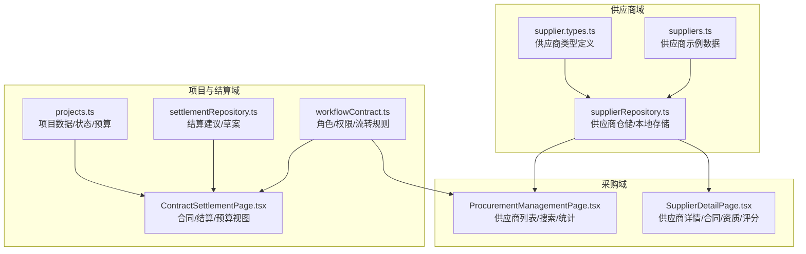
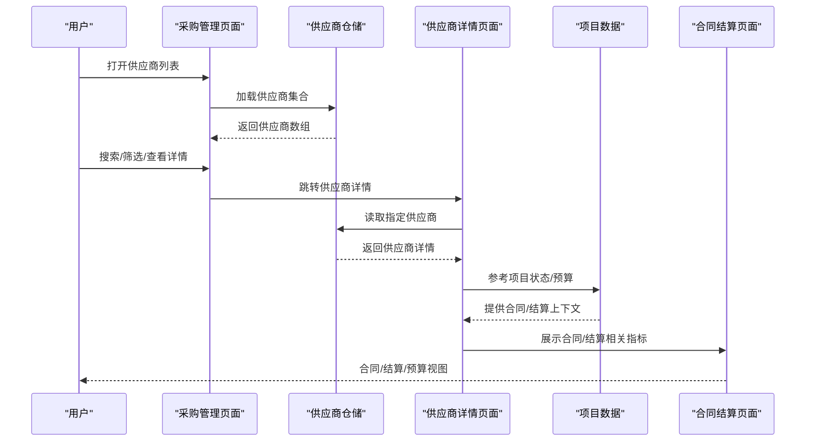
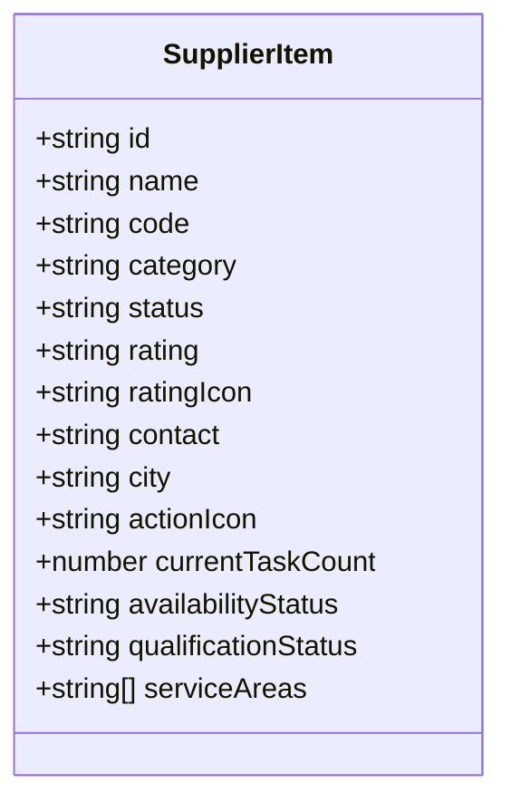
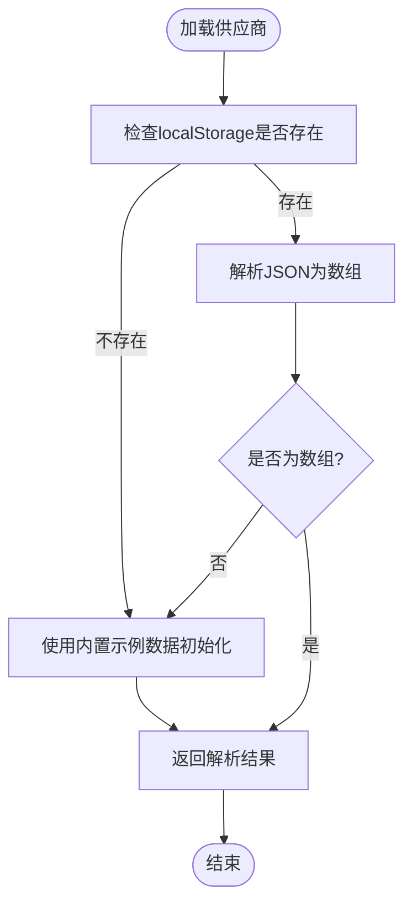
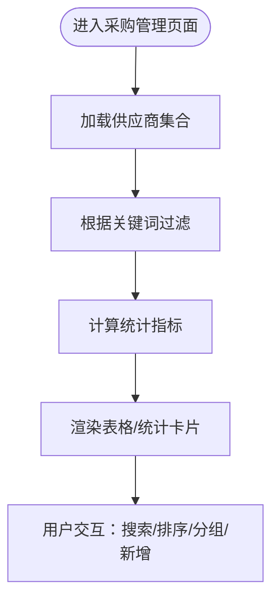
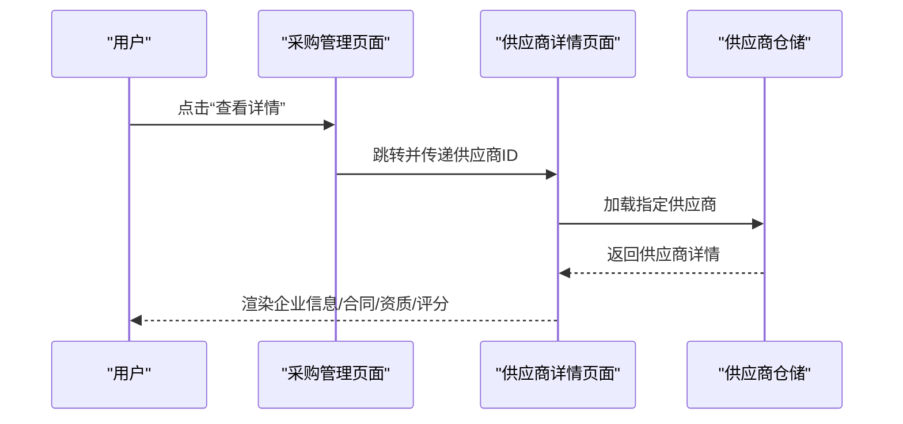
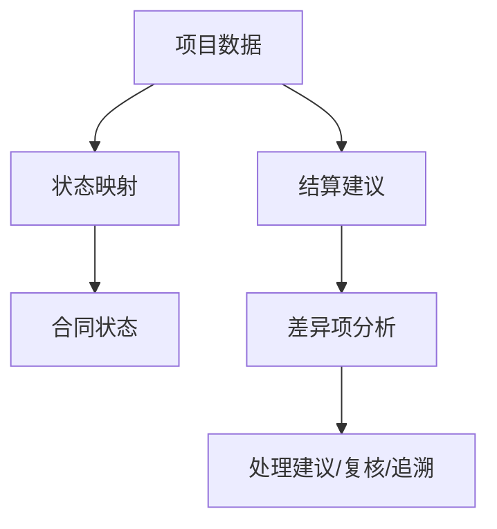
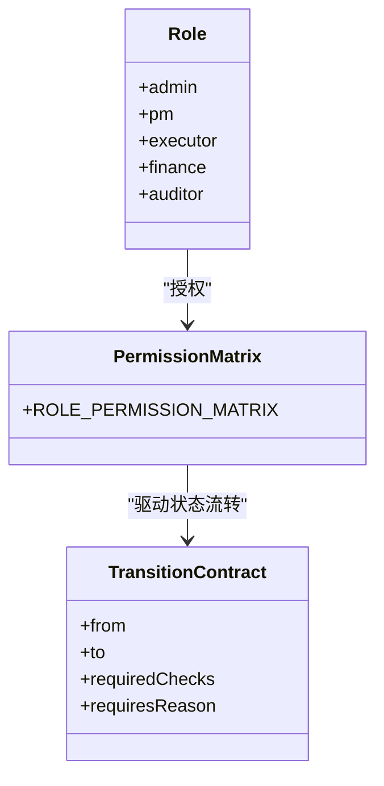
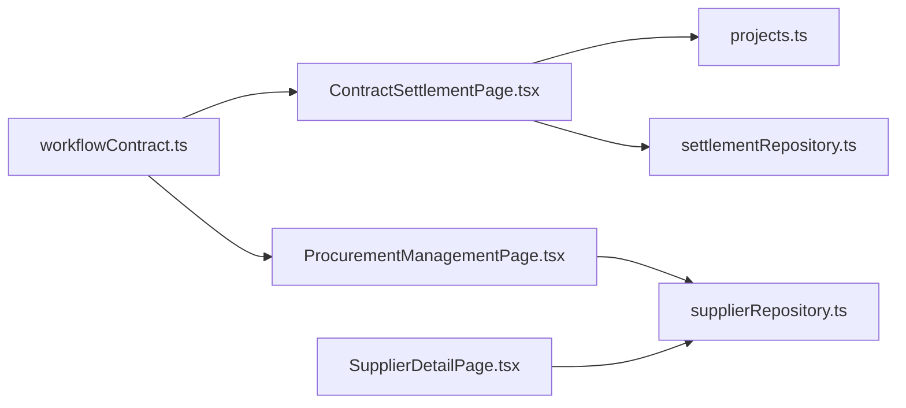

# 资源供应商数据模型

<cite>
**本文引用的文件**
- [src/components/resource/supplier.types.ts](file://src/components/resource/supplier.types.ts)
- [src/components/resource/suppliers.ts](file://src/components/resource/suppliers.ts)
- [src/services/repositories/supplierRepository.ts](file://src/services/repositories/supplierRepository.ts)
- [src/components/procurement/ProcurementManagementPage.tsx](file://src/components/procurement/ProcurementManagementPage.tsx)
- [src/components/procurement/SupplierDetailPage.tsx](file://src/components/procurement/SupplierDetailPage.tsx)
- [src/data/projects.ts](file://src/data/projects.ts)
- [src/services/repositories/settlementRepository.ts](file://src/services/repositories/settlementRepository.ts)
- [src/components/contracts/ContractSettlementPage.tsx](file://src/components/contracts/ContractSettlementPage.tsx)
- [src/services/contracts/workflowContract.ts](file://src/services/contracts/workflowContract.ts)
</cite>

## 目录

1. [简介](#简介)
2. [项目结构](#项目结构)
3. [核心组件](#核心组件)
4. [架构总览](#架构总览)
5. [详细组件分析](#详细组件分析)
6. [依赖分析](#依赖分析)
7. [性能考虑](#性能考虑)
8. [故障排查指南](#故障排查指南)
9. [结论](#结论)
10. [附录](#附录)

## 简介

本文件面向CodeBuddy项目中的“资源供应商”数据模型，系统性梳理供应商实体的字段定义、分类与业务属性；阐述供应商评级体系、合作历史与信用评估机制；解释资源池管理中的资源分配、库存与调度策略；说明供应商与项目采购、合同管理、结算流程的关联关系；给出供应商选择、评估、准入与退出的全生命周期管理示例；并提供数据质量控制、风险评估与合规检查机制，以及资源数据的实时更新、价格波动追踪与供应链可视化展示方法，最后说明与采购、合同、财务等模块的集成方式与数据一致性保障。

## 项目结构

围绕供应商数据模型的关键文件分布如下：

- 数据契约与实体定义：src/components/resource/supplier.types.ts、src/components/resource/suppliers.ts
- 仓储与本地持久化：src/services/repositories/supplierRepository.ts
- 采购管理界面与交互：src/components/procurement/ProcurementManagementPage.tsx、src/components/procurement/SupplierDetailPage.tsx
- 项目与结算数据支撑：src/data/projects.ts、src/services/repositories/settlementRepository.ts、src/components/contracts/ContractSettlementPage.tsx
- 工作流与权限约束：src/services/contracts/workflowContract.ts

图表来源

- [src/components/resource/supplier.types.ts:1-22](file://src/components/resource/supplier.types.ts#L1-L22)
- [src/components/resource/suppliers.ts:1-164](file://src/components/resource/suppliers.ts#L1-L164)
- [src/services/repositories/supplierRepository.ts:1-56](file://src/services/repositories/supplierRepository.ts#L1-L56)
- [src/components/procurement/ProcurementManagementPage.tsx:1-226](file://src/components/procurement/ProcurementManagementPage.tsx#L1-L226)
- [src/components/procurement/SupplierDetailPage.tsx:1-306](file://src/components/procurement/SupplierDetailPage.tsx#L1-L306)
- [src/data/projects.ts:1-451](file://src/data/projects.ts#L1-L451)
- [src/services/repositories/settlementRepository.ts:1-32](file://src/services/repositories/settlementRepository.ts#L1-L32)
- [src/components/contracts/ContractSettlementPage.tsx:1-583](file://src/components/contracts/ContractSettlementPage.tsx#L1-L583)
- [src/services/contracts/workflowContract.ts:1-77](file://src/services/contracts/workflowContract.ts#L1-L77)

章节来源

- [src/components/resource/supplier.types.ts:1-22](file://src/components/resource/supplier.types.ts#L1-L22)
- [src/components/resource/suppliers.ts:1-164](file://src/components/resource/suppliers.ts#L1-L164)
- [src/services/repositories/supplierRepository.ts:1-56](file://src/services/repositories/supplierRepository.ts#L1-L56)
- [src/components/procurement/ProcurementManagementPage.tsx:1-226](file://src/components/procurement/ProcurementManagementPage.tsx#L1-L226)
- [src/components/procurement/SupplierDetailPage.tsx:1-306](file://src/components/procurement/SupplierDetailPage.tsx#L1-L306)
- [src/data/projects.ts:1-451](file://src/data/projects.ts#L1-L451)
- [src/services/repositories/settlementRepository.ts:1-32](file://src/services/repositories/settlementRepository.ts#L1-L32)
- [src/components/contracts/ContractSettlementPage.tsx:1-583](file://src/components/contracts/ContractSettlementPage.tsx#L1-L583)
- [src/services/contracts/workflowContract.ts:1-77](file://src/services/contracts/workflowContract.ts#L1-L77)

## 核心组件

- 供应商实体类型与字段
  - 字段定义：id、name、code、category、status、rating、ratingIcon、contact、city、actionIcon、currentTaskCount、availabilityStatus、qualificationStatus、serviceAreas
  - 关键枚举：供应商状态、可用性状态、资质状态
- 供应商示例数据
  - 提供多个供应商样本，覆盖不同状态、评分、地区与服务能力
- 供应商仓储与本地存储
  - 从本地localStorage加载/保存供应商集合
  - 提供自动生成下一个供应商ID的能力
- 采购管理页面
  - 列表展示、搜索过滤、统计卡片、操作按钮
- 供应商详情页面
  - 企业信息、合作合同、评价记录、资质证书、综合评分与雷达图、金额趋势等
- 项目与结算数据
  - 项目预算、状态、验收与结算状态，用于合同与结算映射
- 结算建议与差异项
  - 基于项目状态与预算生成结算建议与差异分析
- 工作流与权限
  - 角色权限矩阵与项目状态流转约束，保障合同与结算流程合规

章节来源

- [src/components/resource/supplier.types.ts:1-22](file://src/components/resource/supplier.types.ts#L1-L22)
- [src/components/resource/suppliers.ts:1-164](file://src/components/resource/suppliers.ts#L1-L164)
- [src/services/repositories/supplierRepository.ts:1-56](file://src/services/repositories/supplierRepository.ts#L1-L56)
- [src/components/procurement/ProcurementManagementPage.tsx:1-226](file://src/components/procurement/ProcurementManagementPage.tsx#L1-L226)
- [src/components/procurement/SupplierDetailPage.tsx:1-306](file://src/components/procurement/SupplierDetailPage.tsx#L1-L306)
- [src/data/projects.ts:1-451](file://src/data/projects.ts#L1-L451)
- [src/services/repositories/settlementRepository.ts:1-32](file://src/services/repositories/settlementRepository.ts#L1-L32)
- [src/components/contracts/ContractSettlementPage.tsx:1-583](file://src/components/contracts/ContractSettlementPage.tsx#L1-L583)
- [src/services/contracts/workflowContract.ts:1-77](file://src/services/contracts/workflowContract.ts#L1-L77)

## 架构总览

供应商数据模型贯穿“供应商域—采购域—项目与结算域”的主路径，并通过工作流与权限约束确保流程合规。

图表来源

- [src/components/procurement/ProcurementManagementPage.tsx:20-64](file://src/components/procurement/ProcurementManagementPage.tsx#L20-L64)
- [src/services/repositories/supplierRepository.ts:44-50](file://src/services/repositories/supplierRepository.ts#L44-L50)
- [src/components/procurement/SupplierDetailPage.tsx:56-64](file://src/components/procurement/SupplierDetailPage.tsx#L56-L64)
- [src/data/projects.ts:26-45](file://src/data/projects.ts#L26-L45)
- [src/components/contracts/ContractSettlementPage.tsx:191-220](file://src/components/contracts/ContractSettlementPage.tsx#L191-L220)

## 详细组件分析

### 供应商实体与数据模型

- 类型定义要点
  - 状态枚举：合作中、待审核、已暂停、已过期
  - 可用性状态：可指派、忙碌、不可用
  - 资质状态：齐全、临期、需补齐
  - 关键业务属性：评分、评分图标、当前任务数、服务区域、联系人、城市等
- 示例数据要点
  - 覆盖多种状态组合，便于UI与业务逻辑验证
  - 包含评分与图标映射，支持前端直观展示

图表来源

- [src/components/resource/supplier.types.ts:7-22](file://src/components/resource/supplier.types.ts#L7-L22)

章节来源

- [src/components/resource/supplier.types.ts:1-22](file://src/components/resource/supplier.types.ts#L1-L22)
- [src/components/resource/suppliers.ts:1-164](file://src/components/resource/suppliers.ts#L1-L164)

### 供应商仓储与本地持久化

- 初始化与本地存储
  - 首次加载时若无localStorage则回退到内置示例数据
  - 保存时写入localStorage，异常忽略
- ID生成
  - 基于现有ID提取数字后缀，生成下一个ID
- 适用场景
  - 本地开发/演示环境下的数据持久化
  - 作为后续对接后端接口的过渡层

图表来源

- [src/services/repositories/supplierRepository.ts:12-32](file://src/services/repositories/supplierRepository.ts#L12-L32)

章节来源

- [src/services/repositories/supplierRepository.ts:1-56](file://src/services/repositories/supplierRepository.ts#L1-L56)

### 采购管理页面（列表/搜索/统计）

- 功能点
  - 支持关键词搜索供应商（名称、编码、类别、联系人、城市、服务区域）
  - 统计卡片：供应商总数、合作中、待审核、已暂停
  - 行内操作：查看详情
- 性能特性
  - 使用memo化避免重复计算
  - 列表渲染基于过滤后的结果

图表来源

- [src/components/procurement/ProcurementManagementPage.tsx:20-64](file://src/components/procurement/ProcurementManagementPage.tsx#L20-L64)

章节来源

- [src/components/procurement/ProcurementManagementPage.tsx:1-226](file://src/components/procurement/ProcurementManagementPage.tsx#L1-L226)

### 供应商详情页面（企业信息/合同/资质/评分）

- 内容板块
  - 企业信息：名称、联系人、电话、邮箱、地址、注册资本、法人、税务号、银行账户、网站等
  - 合同信息：名称、期间、状态、金额
  - 资质证书：名称、状态、有效期
  - 综合评分与雷达图、标签、金额趋势
  - 最近合同、累计合同、累计金额、在执行数量、入库日期、最近合作
- 数据来源
  - 供应商详情来自仓储加载
  - 合同与资质为模拟数据，实际应对接后端

图表来源

- [src/components/procurement/SupplierDetailPage.tsx:56-64](file://src/components/procurement/SupplierDetailPage.tsx#L56-L64)
- [src/services/repositories/supplierRepository.ts:44-50](file://src/services/repositories/supplierRepository.ts#L44-L50)

章节来源

- [src/components/procurement/SupplierDetailPage.tsx:1-306](file://src/components/procurement/SupplierDetailPage.tsx#L1-L306)

### 项目与结算数据支撑

- 项目数据
  - 包含预算、团队规模、日期范围、描述、派单/执行/验收/结算状态、待办计数等
  - 与合同/结算状态映射：如“待结算”对应“审核中”，“已确认”对应“已归档”
- 结算建议与差异
  - 基于项目状态与预算生成结算建议
  - 差异项来源：验收节点、风险评估、预算差异
  - 支持按项目筛选与追溯

图表来源

- [src/data/projects.ts:26-45](file://src/data/projects.ts#L26-L45)
- [src/components/contracts/ContractSettlementPage.tsx:66-80](file://src/components/contracts/ContractSettlementPage.tsx#L66-L80)
- [src/services/repositories/settlementRepository.ts:9-18](file://src/services/repositories/settlementRepository.ts#L9-L18)
- [src/components/contracts/ContractSettlementPage.tsx:134-171](file://src/components/contracts/ContractSettlementPage.tsx#L134-L171)

章节来源

- [src/data/projects.ts:1-451](file://src/data/projects.ts#L1-L451)
- [src/services/repositories/settlementRepository.ts:1-32](file://src/services/repositories/settlementRepository.ts#L1-L32)
- [src/components/contracts/ContractSettlementPage.tsx:1-583](file://src/components/contracts/ContractSettlementPage.tsx#L1-L583)

### 工作流与权限约束

- 角色与权限
  - admin、pm、executor、finance、auditor
  - 不同角色具备不同的读写权限
- 项目状态流转
  - 定义了从“待立项”到“已归档”的关键状态与前置校验
- 在供应商/合同/结算中的意义
  - 限制不同角色的操作范围，确保合同与结算流程合规

图表来源

- [src/services/contracts/workflowContract.ts:3-49](file://src/services/contracts/workflowContract.ts#L3-L49)
- [src/services/contracts/workflowContract.ts:51-77](file://src/services/contracts/workflowContract.ts#L51-L77)

章节来源

- [src/services/contracts/workflowContract.ts:1-77](file://src/services/contracts/workflowContract.ts#L1-L77)

## 依赖分析

- 组件耦合
  - 采购管理页面依赖供应商仓储进行数据加载与过滤
  - 供应商详情页面依赖仓储读取单个供应商
  - 合同结算页面依赖项目数据与结算仓储
- 外部依赖
  - localStorage用于本地持久化
  - 模拟资产资源（图标/图表）用于UI展示
- 潜在循环依赖
  - 当前文件间无直接循环导入
- 接口契约
  - 供应商仓储提供load/save/getNextSupplierId
  - 结算仓储提供loadSuggestions

图表来源

- [src/components/procurement/ProcurementManagementPage.tsx:1-226](file://src/components/procurement/ProcurementManagementPage.tsx#L1-L226)
- [src/services/repositories/supplierRepository.ts:1-56](file://src/services/repositories/supplierRepository.ts#L1-L56)
- [src/components/procurement/SupplierDetailPage.tsx:1-306](file://src/components/procurement/SupplierDetailPage.tsx#L1-L306)
- [src/data/projects.ts:1-451](file://src/data/projects.ts#L1-L451)
- [src/services/repositories/settlementRepository.ts:1-32](file://src/services/repositories/settlementRepository.ts#L1-L32)
- [src/components/contracts/ContractSettlementPage.tsx:1-583](file://src/components/contracts/ContractSettlementPage.tsx#L1-L583)
- [src/services/contracts/workflowContract.ts:1-77](file://src/services/contracts/workflowContract.ts#L1-L77)

章节来源

- [src/components/procurement/ProcurementManagementPage.tsx:1-226](file://src/components/procurement/ProcurementManagementPage.tsx#L1-L226)
- [src/services/repositories/supplierRepository.ts:1-56](file://src/services/repositories/supplierRepository.ts#L1-L56)
- [src/components/procurement/SupplierDetailPage.tsx:1-306](file://src/components/procurement/SupplierDetailPage.tsx#L1-L306)
- [src/data/projects.ts:1-451](file://src/data/projects.ts#L1-L451)
- [src/services/repositories/settlementRepository.ts:1-32](file://src/services/repositories/settlementRepository.ts#L1-L32)
- [src/components/contracts/ContractSettlementPage.tsx:1-583](file://src/components/contracts/ContractSettlementPage.tsx#L1-L583)
- [src/services/contracts/workflowContract.ts:1-77](file://src/services/contracts/workflowContract.ts#L1-L77)

## 性能考虑

- 计算优化
  - 使用memo化减少重复计算（列表过滤、统计、差异项构建）
- 渲染优化
  - 列表采用虚拟滚动或分页（当前示例未实现，建议后续引入）
- 存储优化
  - localStorage写入异常忽略，避免阻塞主线程
- 数据一致性
  - 本地状态与远程状态分离，提供回退策略（无网络时使用本地）

## 故障排查指南

- 供应商列表为空
  - 检查localStorage中是否存在供应商数据；若无则回退到内置示例
- 详情页无法加载
  - 确认供应商ID正确且存在于集合中
- 结算建议不显示
  - 检查项目状态是否满足“草案待确认”条件
- 权限相关错误
  - 核对角色权限矩阵，确认当前角色是否具备相应操作权限

章节来源

- [src/services/repositories/supplierRepository.ts:12-32](file://src/services/repositories/supplierRepository.ts#L12-L32)
- [src/components/procurement/SupplierDetailPage.tsx:56-64](file://src/components/procurement/SupplierDetailPage.tsx#L56-L64)
- [src/services/repositories/settlementRepository.ts:20-30](file://src/services/repositories/settlementRepository.ts#L20-L30)
- [src/services/contracts/workflowContract.ts:74-77](file://src/services/contracts/workflowContract.ts#L74-L77)

## 结论

本数据模型以清晰的类型定义与示例数据为基础，结合本地仓储与UI页面，实现了供应商的全链路展示与基本交互。通过与项目、合同、结算模块的衔接，以及工作流与权限约束，保障了流程的合规性与一致性。建议后续在以下方面持续演进：引入后端接口与数据库、完善资源池调度算法、增强实时更新与价格波动追踪能力、加强数据质量与合规检查。

## 附录

### 供应商评级体系与信用评估机制

- 评分维度
  - 质量、进度、安全、服务、成本（雷达图展示）
- 信用评估
  - 基于合作历史、在执行数量、资质状态、服务区域等综合判定
- 实施建议
  - 引入动态权重与阈值，支持按项目类型/等级差异化评估

### 合同管理与结算流程关联

- 合同状态映射
  - “执行中/整改中/待验收/待结算”映射为“履约中/审核中”
  - “已确认”映射为“已归档”
- 结算建议
  - 基于预算与验收状态生成草案金额，差异项驱动复核流程

章节来源

- [src/components/contracts/ContractSettlementPage.tsx:66-80](file://src/components/contracts/ContractSettlementPage.tsx#L66-L80)
- [src/services/repositories/settlementRepository.ts:9-18](file://src/services/repositories/settlementRepository.ts#L9-L18)

### 供应商全生命周期管理示例

- 准入
  - 待审核状态，资质齐全/临期需补齐
- 评估
  - 评分与雷达图，结合历史合同与验收情况
- 合作
  - 合作中状态，动态跟踪在执行数量与可用性
- 退出
  - 已暂停/已过期，触发结算与审计流程

章节来源

- [src/components/resource/supplier.types.ts:1-6](file://src/components/resource/supplier.types.ts#L1-L6)
- [src/components/resource/suppliers.ts:1-164](file://src/components/resource/suppliers.ts#L1-L164)

### 数据质量控制、风险评估与合规检查

- 数据质量
  - ID生成规则、字段必填校验、格式统一
- 风险评估
  - 高风险项目与供应商的联动提示
- 合规检查
  - 基于角色权限矩阵与项目状态流转规则，确保流程合规

章节来源

- [src/services/repositories/supplierRepository.ts:52-55](file://src/services/repositories/supplierRepository.ts#L52-L55)
- [src/services/contracts/workflowContract.ts:20-49](file://src/services/contracts/workflowContract.ts#L20-L49)
- [src/components/contracts/ContractSettlementPage.tsx:134-171](file://src/components/contracts/ContractSettlementPage.tsx#L134-L171)

### 资源数据实时更新、价格波动追踪与供应链可视化

- 实时更新
  - 本地localStorage回退策略，网络异常时仍可使用
- 价格波动
  - 建议引入价格表与历史记录，结合UI趋势图展示
- 供应链可视化
  - 基于服务区域与可用性状态，提供地图/热力图等可视化展示

章节来源

- [src/services/repositories/supplierRepository.ts:26-32](file://src/services/repositories/supplierRepository.ts#L26-L32)
- [src/components/procurement/SupplierDetailPage.tsx:217-221](file://src/components/procurement/SupplierDetailPage.tsx#L217-L221)

### 与采购、合同、财务模块的集成与数据一致性

- 集成点
  - 供应商数据驱动采购决策与合同生成
  - 项目数据驱动结算建议与差异分析
- 一致性保障
  - 工作流与权限约束确保跨模块操作一致
  - 本地/远程双通道与回退策略保证数据可用性

章节来源

- [src/components/procurement/ProcurementManagementPage.tsx:20-64](file://src/components/procurement/ProcurementManagementPage.tsx#L20-L64)
- [src/components/contracts/ContractSettlementPage.tsx:191-220](file://src/components/contracts/ContractSettlementPage.tsx#L191-L220)
- [src/services/contracts/workflowContract.ts:58-72](file://src/services/contracts/workflowContract.ts#L58-L72)
