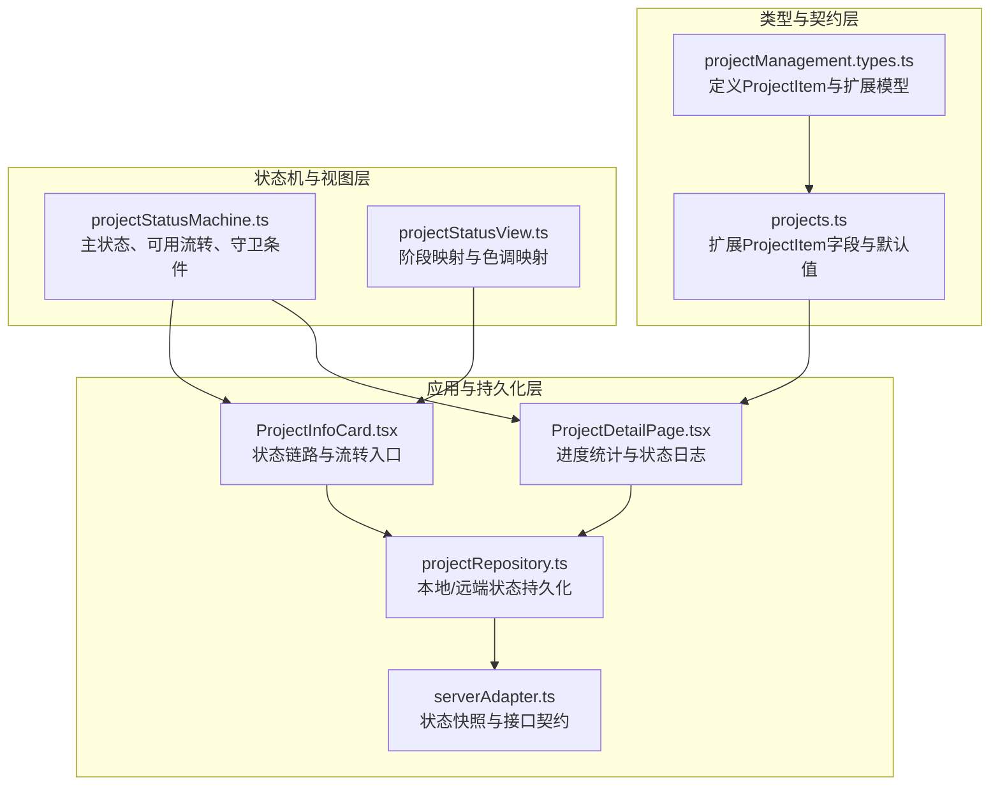
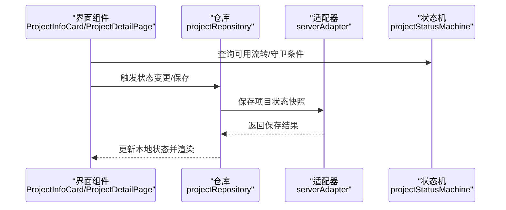
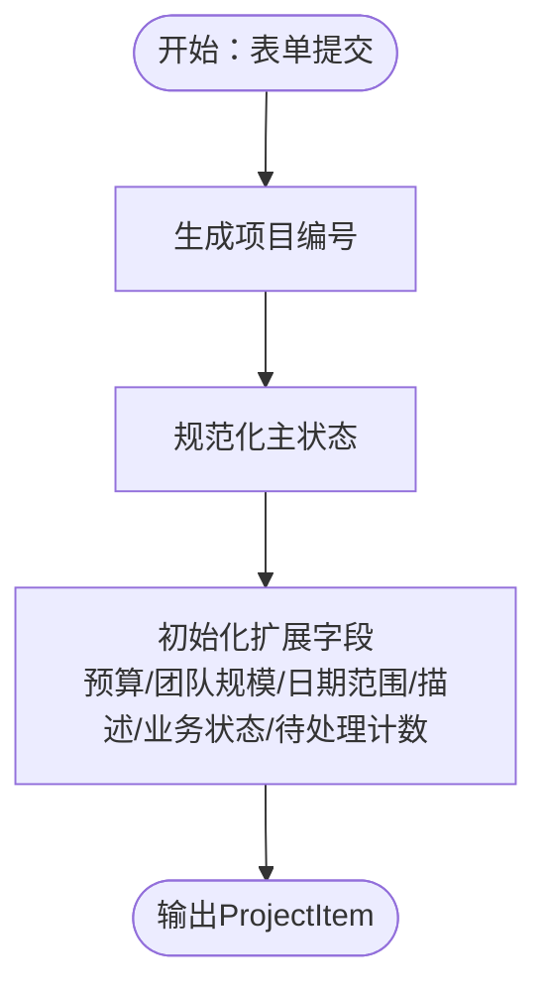
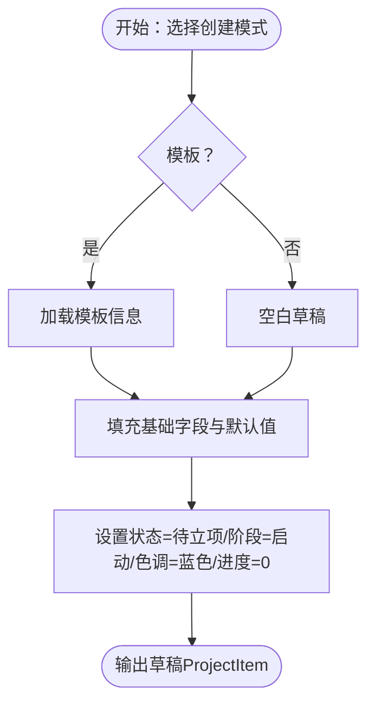
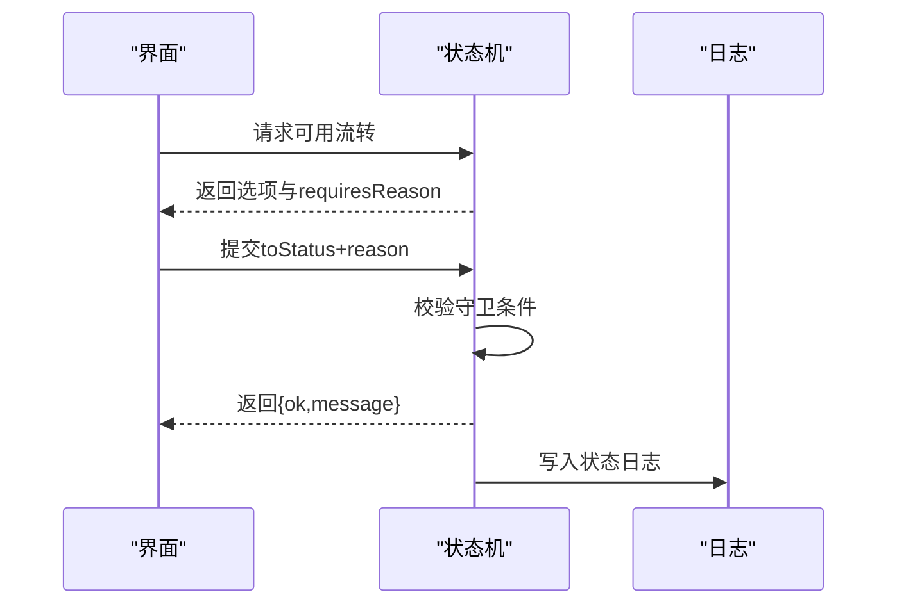
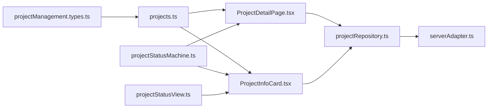

# 项目数据模型

<cite>
**本文引用的文件**
- [src/components/personnel/projectManagement.types.ts](file://src/components/personnel/projectManagement.types.ts)
- [src/data/projects.ts](file://src/data/projects.ts)
- [src/domain/projectStatusMachine.ts](file://src/domain/projectStatusMachine.ts)
- [src/domain/projectStatusView.ts](file://src/domain/projectStatusView.ts)
- [src/components/project/ProjectInfoCard.tsx](file://src/components/project/ProjectInfoCard.tsx)
- [src/components/project/ProjectDetailPage.tsx](file://src/components/project/ProjectDetailPage.tsx)
- [src/components/personnel/projectManagement.data.ts](file://src/components/personnel/projectManagement.data.ts)
- [src/services/repositories/projectRepository.ts](file://src/services/repositories/projectRepository.ts)
- [src/services/api/serverAdapter.ts](file://src/services/api/serverAdapter.ts)
- [docs/02-architecture/state-machine-design.md](file://docs/02-architecture/state-machine-design.md)
- [docs/02-architecture/template-data-contract.md](file://docs/02-architecture/template-data-contract.md)
- [src/domain/workItem.ts](file://src/domain/workItem.ts)
</cite>

## 目录

1. [简介](#简介)
2. [项目结构](#项目结构)
3. [核心组件](#核心组件)
4. [架构总览](#架构总览)
5. [详细组件分析](#详细组件分析)
6. [依赖分析](#依赖分析)
7. [性能考虑](#性能考虑)
8. [故障排除指南](#故障排除指南)
9. [结论](#结论)
10. [附录](#附录)

## 简介

本文件面向CodeBuddy项目的“项目数据模型”，系统化梳理ProjectItem核心实体及其扩展字段、项目状态与状态机、项目阶段与色调映射、进度统计与状态链路、以及与任务树、里程碑、风险、成员等关联数据模型的关系。同时给出项目创建、草稿生成、模板应用等业务场景下的数据流转示例，以及数据验证规则、默认值处理与异常处理机制。

## 项目结构

项目数据模型由三层构成：

- 类型与契约层：定义ProjectItem及扩展字段（阶段、里程碑、任务树、风险、成员）的数据契约与枚举。
- 状态机与视图层：定义项目主状态、可用流转、前置守卫条件、阶段映射与状态色调映射。
- 应用与持久化层：提供项目创建、草稿生成、模板应用、状态变更与日志记录、本地/远端持久化。

图表来源

- [src/components/personnel/projectManagement.types.ts:21-41](file://src/components/personnel/projectManagement.types.ts#L21-L41)
- [src/data/projects.ts:26-45](file://src/data/projects.ts#L26-L45)
- [src/domain/projectStatusMachine.ts:1-164](file://src/domain/projectStatusMachine.ts#L1-L164)
- [src/domain/projectStatusView.ts:1-89](file://src/domain/projectStatusView.ts#L1-L89)
- [src/components/project/ProjectInfoCard.tsx:25-159](file://src/components/project/ProjectInfoCard.tsx#L25-L159)
- [src/components/project/ProjectDetailPage.tsx:103-200](file://src/components/project/ProjectDetailPage.tsx#L103-L200)
- [src/services/repositories/projectRepository.ts:1-90](file://src/services/repositories/projectRepository.ts#L1-L90)
- [src/services/api/serverAdapter.ts:1-42](file://src/services/api/serverAdapter.ts#L1-L42)

章节来源

- [src/components/personnel/projectManagement.types.ts:1-168](file://src/components/personnel/projectManagement.types.ts#L1-L168)
- [src/data/projects.ts:1-451](file://src/data/projects.ts#L1-L451)
- [src/domain/projectStatusMachine.ts:1-164](file://src/domain/projectStatusMachine.ts#L1-L164)
- [src/domain/projectStatusView.ts:1-89](file://src/domain/projectStatusView.ts#L1-L89)

## 核心组件

- ProjectItem核心实体字段
  - 基本信息：名称、编号、品牌、计划开业日期、负责人、里程碑与任务概览、风险级别与数量、进度百分比等。
  - 项目状态：主状态（ProjectStatus）、阶段（ProjectStage）、状态色调（statusTone）。
  - 业务状态：dispatchStatus（调度派单）、executionStatus（执行回传）、acceptanceStatus（验收整改）、settlementStatus（结算草案），以及对应的待处理计数字段。
  - 扩展字段：phases（阶段）、milestones（里程碑）、taskTree（任务树）、risks（风险）、members（成员）。
- 项目状态机与视图
  - 主状态：待立项、待确认、待拆解、执行中、待验收、整改中、待结算、已归档、已中止。
  - 阶段映射：根据主状态映射到启动/计划/执行/监控/收尾。
  - 状态色调：根据主状态映射到蓝色/黄色/绿色/红色。
  - 可用流转与守卫条件：限定流转路径、前置条件与异常分支。
- 进度统计与状态链路
  - 任务树扁平化统计：完成/进行中/待开始。
  - 里程碑状态统计：达成/进行中/延迟。
  - 状态链路：调度派单 → 执行回传 → 验收整改 → 结算草案。

章节来源

- [src/components/personnel/projectManagement.types.ts:21-41](file://src/components/personnel/projectManagement.types.ts#L21-L41)
- [src/data/projects.ts:26-45](file://src/data/projects.ts#L26-L45)
- [src/domain/projectStatusMachine.ts:1-164](file://src/domain/projectStatusMachine.ts#L1-L164)
- [src/domain/projectStatusView.ts:4-42](file://src/domain/projectStatusView.ts#L4-L42)
- [src/components/project/ProjectInfoCard.tsx:28-33](file://src/components/project/ProjectInfoCard.tsx#L28-L33)
- [src/components/project/ProjectDetailPage.tsx:139-169](file://src/components/project/ProjectDetailPage.tsx#L139-L169)

## 架构总览

项目数据模型贯穿类型契约、状态机、视图映射与应用交互，最终落地到本地/远端持久化与接口适配器。

图表来源

- [src/components/project/ProjectInfoCard.tsx:35-49](file://src/components/project/ProjectInfoCard.tsx#L35-L49)
- [src/services/repositories/projectRepository.ts:53-90](file://src/services/repositories/projectRepository.ts#L53-L90)
- [src/services/api/serverAdapter.ts:1-42](file://src/services/api/serverAdapter.ts#L1-L42)
- [src/domain/projectStatusMachine.ts:88-163](file://src/domain/projectStatusMachine.ts#L88-L163)

## 详细组件分析

### ProjectItem核心实体与扩展模型

- 字段定义与业务含义
  - 基本信息：name、code、brand、plannedOpenDate、owner、milestone、tasks、riskLevel、riskCount、progress。
  - 主状态与阶段：status（ProjectStatus）、stage（ProjectStage）、statusTone（色调）。
  - 业务状态：dispatchStatus、executionStatus、acceptanceStatus、settlementStatus，以及pendingDispatchCount、pendingExecutionCount、pendingAcceptanceCount。
  - 扩展字段：phases（阶段列表，含起止日期、进度、状态）、milestones（里程碑列表，含到期日、状态、负责人、完成日期）、taskTree（任务树，支持4层：项目→阶段→工作包→执行任务）、risks（风险列表，含等级、描述、影响、状态、负责人、截止日期）、members（成员列表，含角色、部门、联系方式）。
- 数据类型与复杂度
  - 任务树扁平化遍历：O(N)（N为任务节点总数）。
  - 里程碑状态聚合：O(M)（M为里程碑数量）。
- 关系与依赖
  - ProjectItem依赖状态机与视图映射；扩展字段由模板与业务流程填充。

章节来源

- [src/components/personnel/projectManagement.types.ts:21-127](file://src/components/personnel/projectManagement.types.ts#L21-L127)
- [src/data/projects.ts:26-45](file://src/data/projects.ts#L26-L45)

### 项目状态机与状态转换逻辑

- 主状态与阶段映射
  - 待立项/待确认 → 启动；待拆解 → 计划；执行中 → 执行；待验收/整改中 → 监控；待结算/已归档/已中止 → 收尾。
- 状态色调映射
  - 蓝色：待立项/待确认/待拆解；黄色：待验收/待结算；红色：整改中/已中止；绿色：执行中/已归档。
- 可用流转与守卫条件
  - 限定路径：如“待立项 → 待确认 → 待拆解 → 执行中 → 待验收 → 待结算 → 已归档”，以及异常路径（如整改中 ↔ 待验收、已中止）。
  - 守卫条件：例如从“待拆解 → 执行中”需要容器、里程碑、任务树、标准上下文就绪；从“执行中 → 待验收”需要关键任务完成；从“待验收 → 待结算”需要验收通过；从“待结算 → 已归档”需要结算完成。
- 触发来源与审计
  - 人工操作、系统自动、规则触发、Agent节点输出、外部事件回传。
  - 关键状态变化必须记录对象类型、ID、变更前后状态、触发事件、操作人、触发来源、原因、执行时间、trace_id等。

章节来源

- [src/domain/projectStatusMachine.ts:1-164](file://src/domain/projectStatusMachine.ts#L1-L164)
- [src/domain/projectStatusView.ts:4-42](file://src/domain/projectStatusView.ts#L4-L42)
- [docs/02-architecture/state-machine-design.md:199-296](file://docs/02-architecture/state-machine-design.md#L199-L296)

### 项目阶段、里程碑、任务树、风险、成员模型

- 阶段（phases）
  - 字段：id、name、startDate、endDate、progress、status（TaskStatus）。
- 里程碑（milestones）
  - 字段：id、name、dueDate、status（MilestoneStatus）、assignee、completedDate。
- 任务树（taskTree）
  - 字段：id、name、level（0|1|2|3）、status、progress、assignee、dueDate、startDate、endDate、children。
  - 扁平化统计：完成/进行中/待开始。
- 风险（risks）
  - 字段：id、level（low|medium|high|critical）、description、impact、status（active|mitigated|closed）、assignee、dueDate。
- 成员（members）
  - 字段：id、name、role、department、phone、email、avatar。

章节来源

- [src/components/personnel/projectManagement.types.ts:74-127](file://src/components/personnel/projectManagement.types.ts#L74-L127)
- [src/components/project/ProjectDetailPage.tsx:87-101](file://src/components/project/ProjectDetailPage.tsx#L87-L101)
- [src/components/project/ProjectDetailPage.tsx:153-169](file://src/components/project/ProjectDetailPage.tsx#L153-L169)

### 状态计算逻辑、进度统计与状态色调映射

- 阶段映射：根据主状态映射到启动/计划/执行/监控/收尾。
- 状态色调：根据主状态映射到蓝色/黄色/绿色/红色。
- 进度下限：不同主状态下进度的最小值（如待确认≥10%，执行中≥40%，待验收≥90%等）。
- 任务与里程碑统计：基于扁平化任务树与里程碑列表进行聚合统计，用于概览与看板展示。

章节来源

- [src/domain/projectStatusView.ts:4-89](file://src/domain/projectStatusView.ts#L4-L89)
- [src/components/project/ProjectDetailPage.tsx:139-169](file://src/components/project/ProjectDetailPage.tsx#L139-L169)

### 业务场景下的数据流转示例

#### 场景一：项目创建

- 输入：CreateProjectFormData（项目名称、门店名称、城市/区域、项目类型、计划开始/结束/开业日期、负责人、特殊要求等）。
- 处理：生成项目编号（基于年份与序列号）、规范化主状态、设置默认扩展字段（预算、团队规模、日期范围、描述、业务状态、待处理计数）。
- 输出：ProjectItem（含扩展字段与默认值）。

图表来源

- [src/data/projects.ts:381-414](file://src/data/projects.ts#L381-L414)

章节来源

- [src/data/projects.ts:381-414](file://src/data/projects.ts#L381-L414)

#### 场景二：草稿生成

- 输入：创建模式（模板/空白）、草稿ID、模板ID（可选）。
- 处理：基于现有项目样例填充基础字段，设置状态为“待立项”、阶段为“启动”、色调为蓝色、进度为0；根据模式设置名称与描述。
- 输出：草稿ProjectItem（带模板标识或空白标识）。

图表来源

- [src/data/projects.ts:416-450](file://src/data/projects.ts#L416-L450)

章节来源

- [src/data/projects.ts:416-450](file://src/data/projects.ts#L416-L450)

#### 场景三：模板应用

- 输入：模板选项（阶段数、里程碑数、任务数、更新时间等）。
- 处理：应用模板后，在详情页继续调整阶段、里程碑与任务结构；模板状态为“active”时可被项目创建流程命中。
- 输出：项目包含模板名称、版本、标准包ID、快照摘要等只读展示字段。

章节来源

- [src/components/personnel/projectManagement.data.ts:283-312](file://src/components/personnel/projectManagement.data.ts#L283-L312)
- [docs/02-architecture/template-data-contract.md:211-233](file://docs/02-architecture/template-data-contract.md#L211-L233)

#### 场景四：状态流转与守卫

- 输入：fromStatus、toStatus、GuardContext（容器/审批/里程碑/任务树/标准绑定/关键任务完成/验收通过/验收反馈/整改闭环/结算完成）。
- 处理：校验是否允许流转、是否需要原因（整改中/已中止）、逐条守卫条件。
- 输出：GuardResult（ok与reason），并记录状态日志。

图表来源

- [src/domain/projectStatusMachine.ts:88-163](file://src/domain/projectStatusMachine.ts#L88-L163)
- [src/components/project/ProjectInfoCard.tsx:35-49](file://src/components/project/ProjectInfoCard.tsx#L35-L49)

章节来源

- [src/domain/projectStatusMachine.ts:88-163](file://src/domain/projectStatusMachine.ts#L88-L163)
- [src/components/project/ProjectInfoCard.tsx:35-49](file://src/components/project/ProjectInfoCard.tsx#L35-L49)

### 数据验证规则、默认值与异常处理

- 验证规则
  - 状态流转前校验：当前状态合法性、操作角色权限、前置对象满足、必填字段、关键标准/快照绑定、是否命中异常拦截。
  - 特殊状态（整改中/已中止）必须填写原因。
- 默认值
  - 创建项目：预算/团队规模/日期范围/描述/业务状态/待处理计数设置为“待确认/待配置/待设置/待派单/待回传/待初验/未生成/0”。
  - 草稿：状态=待立项、阶段=启动、色调=蓝色、进度=0、描述根据模式生成。
- 异常处理
  - 本地存储读取/持久化失败：记录StructuredError并降级到初始值。
  - 远程加载失败：记录StructuredError并降级到本地缓存。
  - 状态日志：每次状态变化记录对象类型、ID、变更前后状态、触发事件、操作人、触发来源、原因、执行时间、trace_id。

章节来源

- [src/data/projects.ts:319-331](file://src/data/projects.ts#L319-L331)
- [src/data/projects.ts:416-450](file://src/data/projects.ts#L416-L450)
- [src/services/repositories/projectRepository.ts:14-51](file://src/services/repositories/projectRepository.ts#L14-L51)
- [src/services/repositories/projectRepository.ts:54-90](file://src/services/repositories/projectRepository.ts#L54-L90)
- [docs/02-architecture/state-machine-design.md:787-800](file://docs/02-architecture/state-machine-design.md#L787-L800)

## 依赖分析

- 组件耦合与内聚
  - ProjectItem类型与扩展模型内聚于types.ts；状态机与视图分别提供行为与映射；应用层通过仓库与适配器连接后端。
- 直接与间接依赖
  - ProjectDetailPage依赖任务树扁平化与里程碑聚合；ProjectInfoCard依赖状态链路与守卫提示。
- 外部依赖与集成点
  - 本地存储（localStorage）与远端接口（serverAdapter）；模板契约（template-data-contract）与标准包绑定。

图表来源

- [src/components/personnel/projectManagement.types.ts:1-168](file://src/components/personnel/projectManagement.types.ts#L1-L168)
- [src/data/projects.ts:1-451](file://src/data/projects.ts#L1-L451)
- [src/components/project/ProjectDetailPage.tsx:1-200](file://src/components/project/ProjectDetailPage.tsx#L1-L200)
- [src/components/project/ProjectInfoCard.tsx:1-159](file://src/components/project/ProjectInfoCard.tsx#L1-L159)
- [src/domain/projectStatusMachine.ts:1-164](file://src/domain/projectStatusMachine.ts#L1-L164)
- [src/domain/projectStatusView.ts:1-89](file://src/domain/projectStatusView.ts#L1-L89)
- [src/services/repositories/projectRepository.ts:1-90](file://src/services/repositories/projectRepository.ts#L1-L90)
- [src/services/api/serverAdapter.ts:1-42](file://src/services/api/serverAdapter.ts#L1-L42)

章节来源

- [src/components/personnel/projectManagement.types.ts:1-168](file://src/components/personnel/projectManagement.types.ts#L1-L168)
- [src/data/projects.ts:1-451](file://src/data/projects.ts#L1-L451)
- [src/domain/projectStatusMachine.ts:1-164](file://src/domain/projectStatusMachine.ts#L1-L164)
- [src/domain/projectStatusView.ts:1-89](file://src/domain/projectStatusView.ts#L1-L89)
- [src/services/repositories/projectRepository.ts:1-90](file://src/services/repositories/projectRepository.ts#L1-L90)
- [src/services/api/serverAdapter.ts:1-42](file://src/services/api/serverAdapter.ts#L1-L42)

## 性能考虑

- 任务树扁平化：在渲染前进行一次遍历，避免重复计算。
- 里程碑聚合：按需计算，避免在高频刷新场景中重复统计。
- 本地/远端持久化：优先使用本地缓存，远程失败时降级，减少网络抖动对用户体验的影响。
- 状态机守卫：在前端进行快速校验，减少无效请求。

## 故障排除指南

- 状态流转失败
  - 检查守卫条件：容器/审批/里程碑/任务树/标准绑定/关键任务/验收/整改闭环/结算完成。
  - 确认是否需要填写原因（整改中/已中止）。
- 本地存储异常
  - 清理localStorage相关键值或重载页面，查看错误日志。
- 远程保存失败
  - 检查网络状态与环境变量，确认幂等键生成与请求头参数。

章节来源

- [src/domain/projectStatusMachine.ts:105-163](file://src/domain/projectStatusMachine.ts#L105-L163)
- [src/services/repositories/projectRepository.ts:26-51](file://src/services/repositories/projectRepository.ts#L26-L51)
- [src/services/repositories/projectRepository.ts:76-90](file://src/services/repositories/projectRepository.ts#L76-L90)

## 结论

本数据模型以清晰的类型契约、严谨的状态机与视图映射为基础，结合任务树、里程碑、风险与成员等扩展模型，实现了项目全生命周期的可控推进与可观测治理。通过默认值与异常处理机制保障了用户体验与系统稳定性；通过模板契约与标准包绑定支撑了项目实例化的可追溯与可演进。

## 附录

- 相关文档
  - 状态机设计说明：定义主状态、阶段映射、守卫条件、联动规则与审计要求。
  - 模板数据契约基线：定义项目模板与任务模板的结构蓝图、标准绑定契约与实例化契约。

章节来源

- [docs/02-architecture/state-machine-design.md:1-896](file://docs/02-architecture/state-machine-design.md#L1-L896)
- [docs/02-architecture/template-data-contract.md:1-294](file://docs/02-architecture/template-data-contract.md#L1-L294)
