# API客户端设计

<cite>
**本文档引用的文件**
- [src/services/api/client.ts](file://src/services/api/client.ts)
- [src/services/errors/StructuredError.ts](file://src/services/errors/StructuredError.ts)
- [src/services/repositories/projectRepository.ts](file://src/services/repositories/projectRepository.ts)
- [local-api/server.ts](file://local-api/server.ts)
- [local-api/store/idempotency.ts](file://local-api/store/idempotency.ts)
- [local-api/contracts.ts](file://local-api/contracts.ts)
- [vite.config.ts](file://vite.config.ts)
- [package.json](file://package.json)
- [local-api/test-api.sh](file://local-api/test-api.sh)
</cite>

## 目录

1. [简介](#简介)
2. [项目结构](#项目结构)
3. [核心组件](#核心组件)
4. [架构概览](#架构概览)
5. [详细组件分析](#详细组件分析)
6. [依赖关系分析](#依赖关系分析)
7. [性能考虑](#性能考虑)
8. [故障排除指南](#故障排除指南)
9. [结论](#结论)
10. [附录](#附录)

## 简介

CodeBuddy项目的API客户端设计采用现代化的TypeScript实现，提供了完整的HTTP请求封装、错误处理、重试机制和幂等性支持。该设计的核心目标是为前端应用提供可靠、可追踪且易于调试的API通信能力。

本文档深入解析了`apiRequest`函数的实现原理，包括HTTP方法封装、请求头构建和响应处理机制；详细说明了ApiError结构化错误类的设计；阐述了重试机制的实现细节；解释了幂等性支持和环境变量配置；并提供了具体的使用示例和最佳实践指导。

## 项目结构

CodeBuddy项目采用分层架构设计，API客户端位于服务层，与业务逻辑和数据存储层清晰分离：

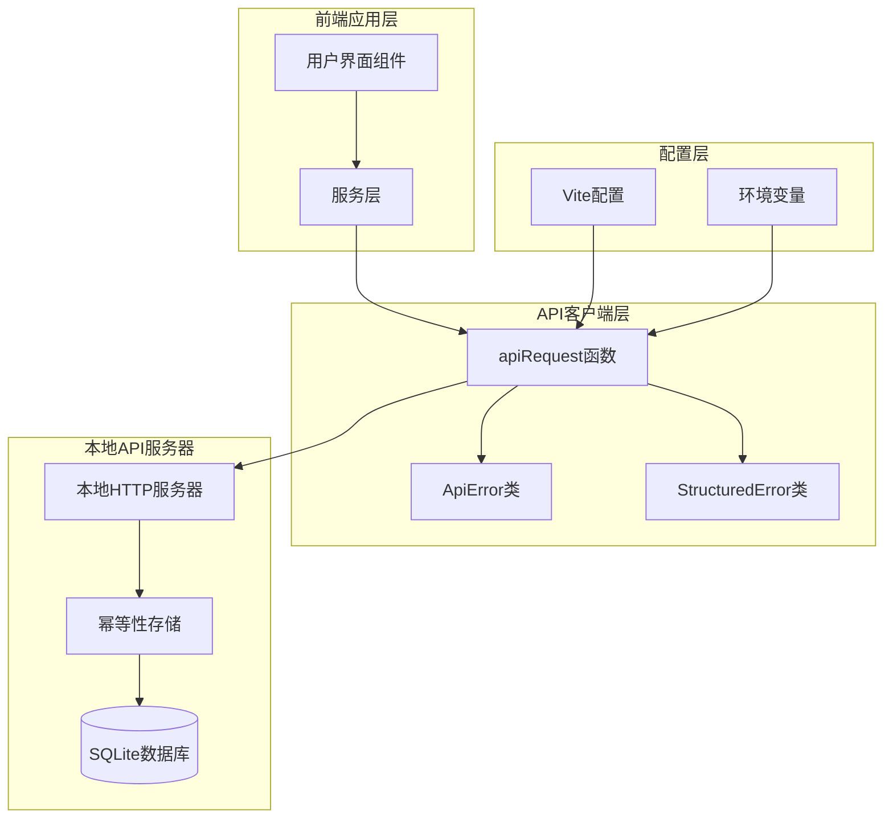

**图表来源**

- [src/services/api/client.ts:1-172](file://src/services/api/client.ts#L1-L172)
- [local-api/server.ts:1-43](file://local-api/server.ts#L1-L43)
- [vite.config.ts:1-34](file://vite.config.ts#L1-L34)

**章节来源**

- [src/services/api/client.ts:1-172](file://src/services/api/client.ts#L1-L172)
- [local-api/server.ts:1-43](file://local-api/server.ts#L1-L43)
- [vite.config.ts:1-34](file://vite.config.ts#L1-L34)

## 核心组件

### ApiError结构化错误类

ApiError类继承自原生Error，提供了结构化的错误信息，便于调试和监控：

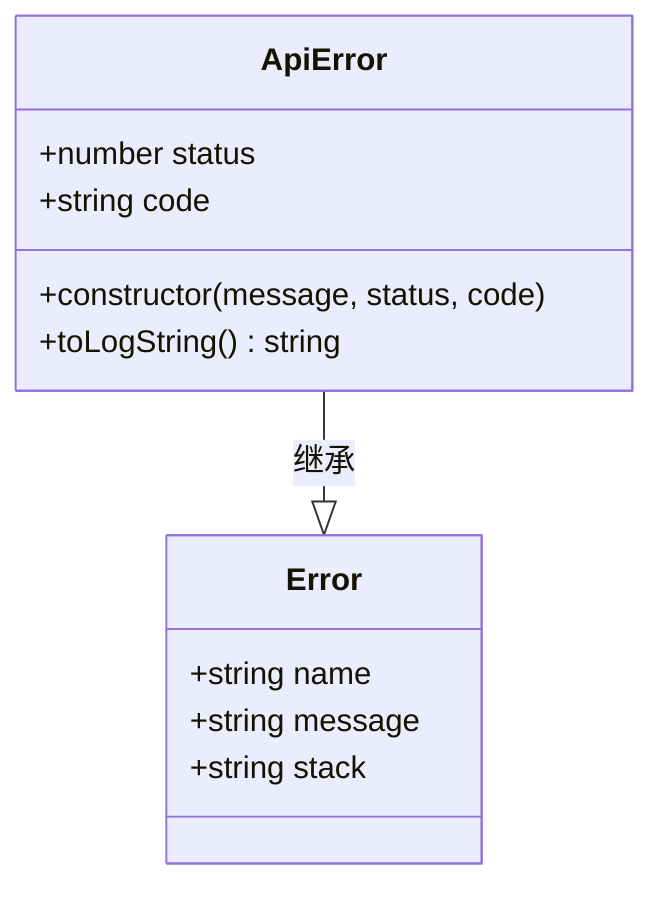

**图表来源**

- [src/services/api/client.ts:13-30](file://src/services/api/client.ts#L13-L30)

ApiError类的关键特性：

- **状态码追踪**：保存HTTP状态码以便于错误分类
- **错误码标识**：提供标准化的错误码便于系统识别
- **日志格式化**：生成可追踪的日志字符串

**章节来源**

- [src/services/api/client.ts:13-30](file://src/services/api/client.ts#L13-L30)

### StructuredError统一错误模型

StructuredError提供了更全面的错误处理能力，支持多维度的错误分类和追踪：

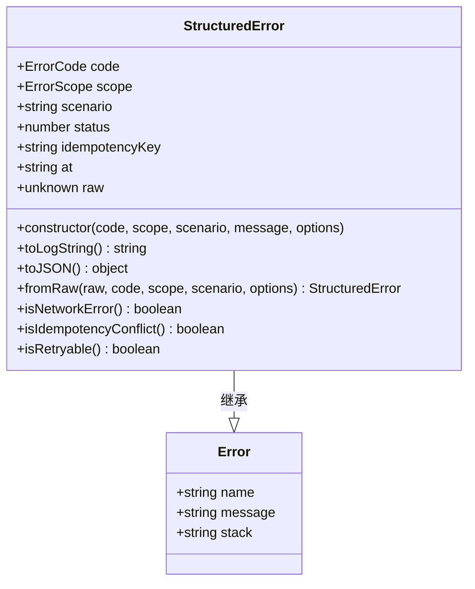

**图表来源**

- [src/services/errors/StructuredError.ts:27-127](file://src/services/errors/StructuredError.ts#L27-L127)

**章节来源**

- [src/services/errors/StructuredError.ts:1-195](file://src/services/errors/StructuredError.ts#L1-L195)

### apiRequest核心函数

apiRequest函数是整个API客户端的核心，实现了完整的HTTP请求生命周期管理：

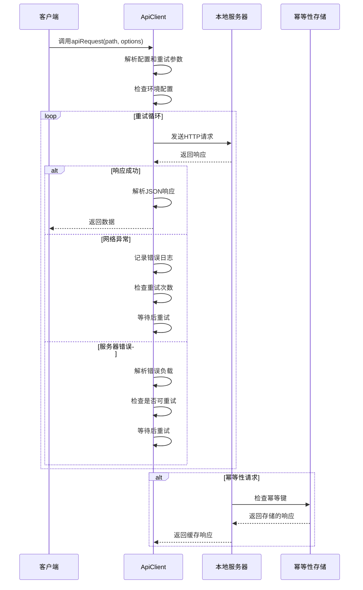

**图表来源**

- [src/services/api/client.ts:83-171](file://src/services/api/client.ts#L83-L171)
- [local-api/store/idempotency.ts:23-58](file://local-api/store/idempotency.ts#L23-L58)

**章节来源**

- [src/services/api/client.ts:83-171](file://src/services/api/client.ts#L83-L171)

## 架构概览

CodeBuddy的API客户端架构采用了分层设计，确保了良好的可维护性和扩展性：

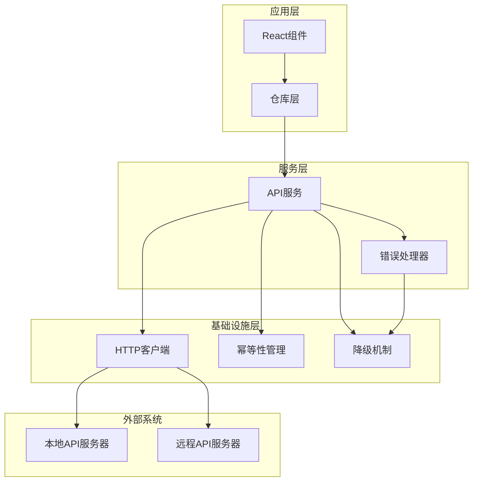

**图表来源**

- [src/services/api/client.ts:1-172](file://src/services/api/client.ts#L1-L172)
- [src/services/repositories/projectRepository.ts:53-89](file://src/services/repositories/projectRepository.ts#L53-L89)

## 详细组件分析

### HTTP方法封装与请求头构建

API客户端支持标准的HTTP方法，并提供了灵活的请求头配置：

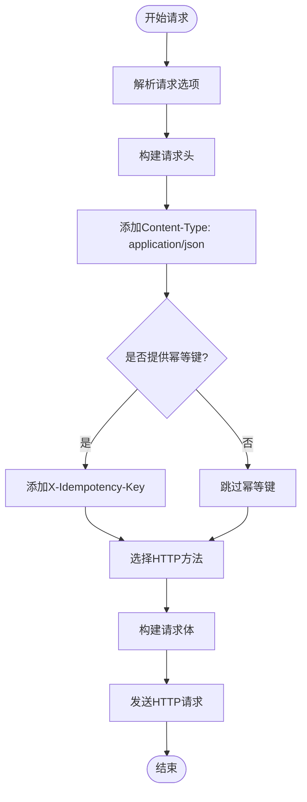

**图表来源**

- [src/services/api/client.ts:37-48](file://src/services/api/client.ts#L37-L48)
- [src/services/api/client.ts:97-102](file://src/services/api/client.ts#L97-L102)

**章节来源**

- [src/services/api/client.ts:37-48](file://src/services/api/client.ts#L37-L48)
- [src/services/api/client.ts:97-102](file://src/services/api/client.ts#L97-L102)

### 响应处理机制

API客户端实现了完整的响应处理流程，包括成功响应和错误响应的不同处理策略：

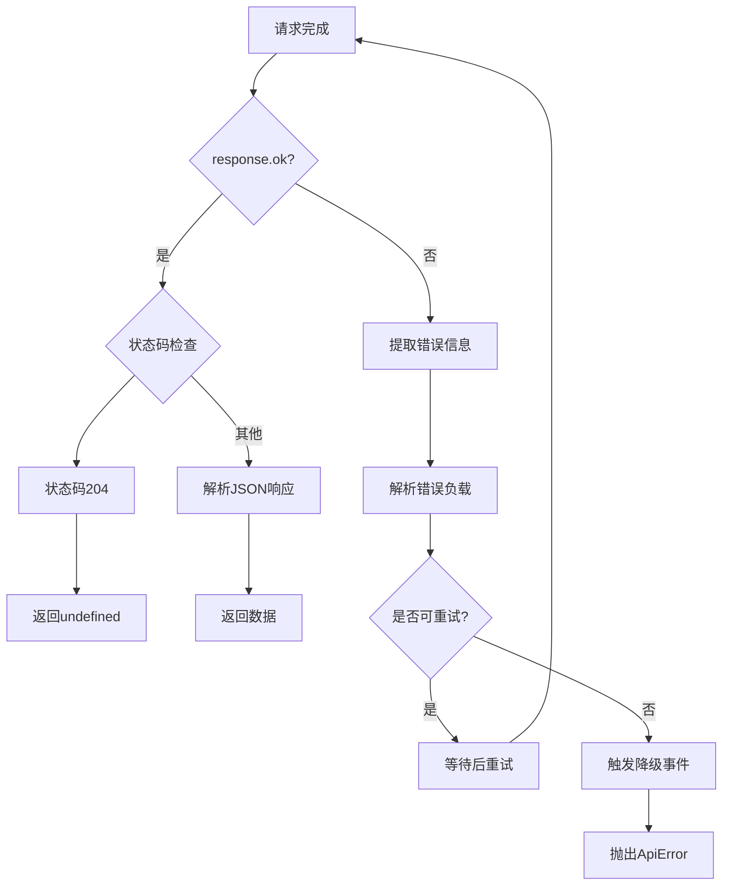

**图表来源**

- [src/services/api/client.ts:123-159](file://src/services/api/client.ts#L123-L159)

**章节来源**

- [src/services/api/client.ts:123-159](file://src/services/api/client.ts#L123-L159)

### 重试机制实现

API客户端实现了智能的重试机制，支持多种可重试的状态码和指数退避策略：

```mermaid
flowchart TD
Start([开始重试]) --> AttemptCount{尝试次数 < 最大重试次数}
AttemptCount --> |是| CheckStatus{检查HTTP状态码}
CheckStatus --> Status408[408 请求超时]
CheckStatus --> Status425[425 早起重试]
CheckStatus --> Status429[429 限流]
CheckStatus --> Status500[500 服务器错误]
CheckStatus --> Status502[502 网关错误]
CheckStatus --> Status503[503 服务不可用]
CheckStatus --> Status504[504 网关超时]
Status408 --> CanRetry[标记为可重试]
Status425 --> CanRetry
Status429 --> CanRetry
Status500 --> CanRetry
Status502 --> CanRetry
Status503 --> CanRetry
Status504 --> CanRetry
CanRetry --> CalculateDelay[计算延迟时间]
CalculateDelay --> DelayFormula[(attempt + 1) * 300ms]
DelayFormula --> Wait[等待]
Wait --> IncrementAttempt[增加尝试次数]
IncrementAttempt --> AttemptCount
AttemptCount --> |否| Exhausted[重试耗尽]
Exhausted --> EmitFallback[触发降级事件]
EmitFallback --> ThrowExhausted[抛出RETRY_EXHAUSTED错误]
```

**图表来源**

- [src/services/api/client.ts:32-33](file://src/services/api/client.ts#L32-L33)
- [src/services/api/client.ts:142-155](file://src/services/api/client.ts#L142-L155)

**章节来源**

- [src/services/api/client.ts:32-33](file://src/services/api/client.ts#L32-L33)
- [src/services/api/client.ts:142-155](file://src/services/api/client.ts#L142-L155)

### 幂等性支持与重复请求防护

API客户端实现了完整的幂等性支持，通过X-Idempotency-Key头部和服务器端存储来防止重复请求：

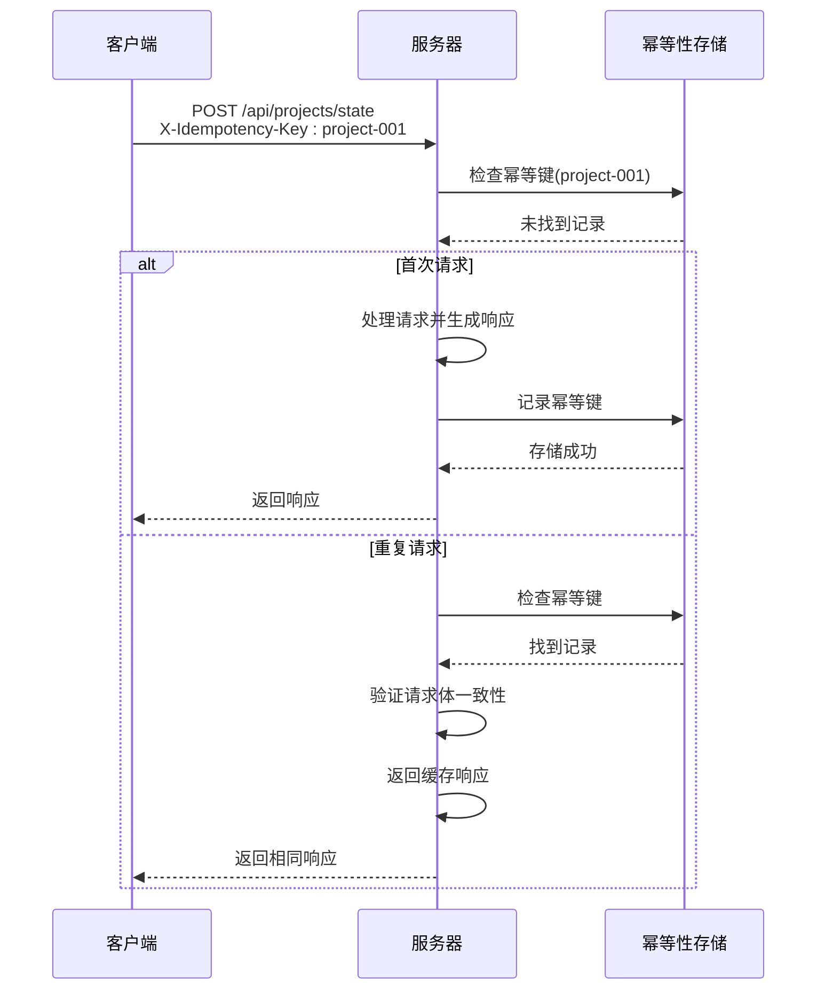

**图表来源**

- [src/services/api/client.ts:43-45](file://src/services/api/client.ts#L43-L45)
- [local-api/store/idempotency.ts:23-58](file://local-api/store/idempotency.ts#L23-L58)

**章节来源**

- [src/services/api/client.ts:43-45](file://src/services/api/client.ts#L43-L45)
- [local-api/store/idempotency.ts:1-100](file://local-api/store/idempotency.ts#L1-L100)

### 环境变量配置与URL构建

API客户端支持灵活的环境配置，通过Vite的环境变量系统实现：

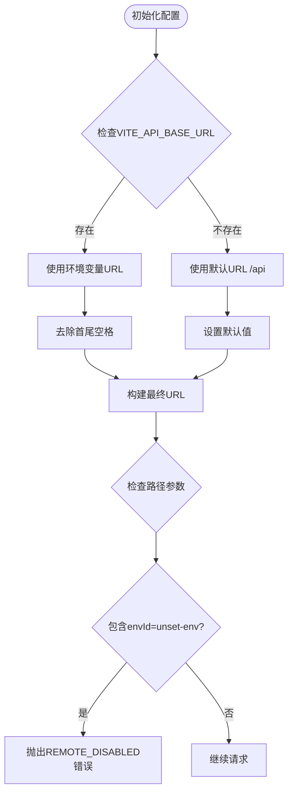

**图表来源**

- [src/services/api/client.ts:50](file://src/services/api/client.ts#L50)
- [src/services/api/client.ts:52-92](file://src/services/api/client.ts#L52-L92)

**章节来源**

- [src/services/api/client.ts:50](file://src/services/api/client.ts#L50)
- [src/services/api/client.ts:52-92](file://src/services/api/client.ts#L52-L92)

### 错误降级策略

API客户端实现了完整的错误降级机制，确保在网络异常时仍能提供基本功能：

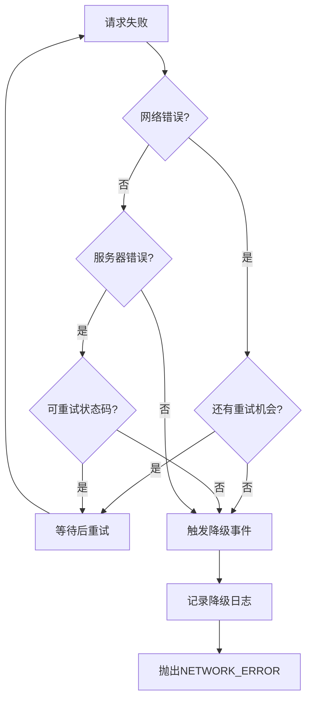

**图表来源**

- [src/services/api/client.ts:103-121](file://src/services/api/client.ts#L103-L121)
- [src/services/api/client.ts:157-170](file://src/services/api/client.ts#L157-L170)

**章节来源**

- [src/services/api/client.ts:103-121](file://src/services/api/client.ts#L103-L121)
- [src/services/api/client.ts:157-170](file://src/services/api/client.ts#L157-L170)

## 依赖关系分析

API客户端的设计遵循了清晰的依赖层次结构，确保了模块间的松耦合：

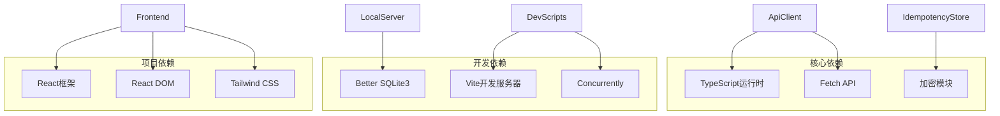

**图表来源**

- [package.json:17-46](file://package.json#L17-L46)
- [vite.config.ts:1-34](file://vite.config.ts#L1-L34)

**章节来源**

- [package.json:1-48](file://package.json#L1-L48)
- [vite.config.ts:1-34](file://vite.config.ts#L1-L34)

## 性能考虑

### 代码分割策略

项目采用了智能的代码分割策略，优化了包体积和加载性能：

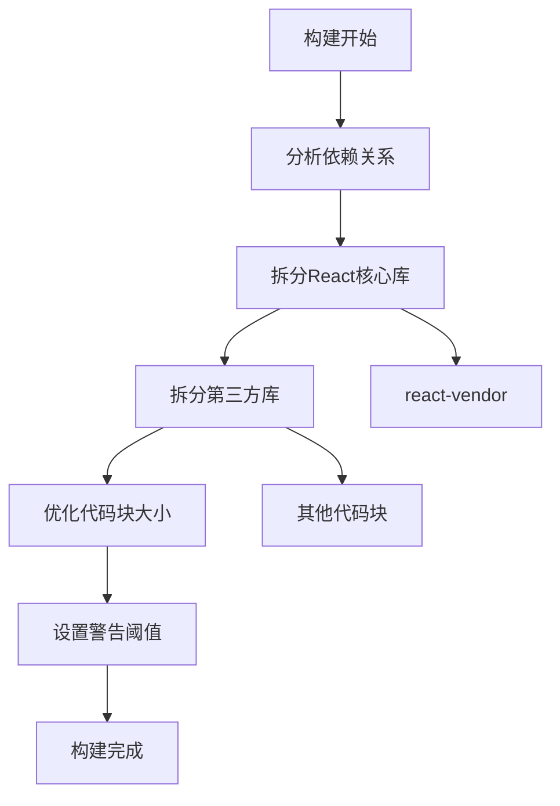

**图表来源**

- [vite.config.ts:17-32](file://vite.config.ts#L17-L32)

### 网络优化建议

基于API客户端的设计，以下是性能优化的最佳实践：

1. **合理设置重试参数**：根据业务场景调整`retries`参数，避免过度重试影响用户体验
2. **使用幂等键**：对写操作使用唯一的幂等键，避免重复提交
3. **缓存策略**：利用浏览器缓存和本地存储减少不必要的网络请求
4. **批量请求**：合并多个小请求为批量请求，减少HTTP开销

**章节来源**

- [vite.config.ts:17-32](file://vite.config.ts#L17-L32)

## 故障排除指南

### 常见错误类型与解决方案

| 错误类型   | 错误码               | 触发条件           | 解决方案                                   |
| ---------- | -------------------- | ------------------ | ------------------------------------------ |
| 网络错误   | NETWORK_ERROR        | 网络连接失败或超时 | 检查网络连接，增加重试次数，启用降级模式   |
| 服务器错误 | SERVER_ERROR         | 5xx系列HTTP状态码  | 检查服务器状态，等待服务恢复，实施指数退避 |
| 限流错误   | RATE_LIMIT_EXCEEDED  | 请求频率超过限制   | 实施退避算法，减少请求频率                 |
| 幂等冲突   | IDEMPOTENCY_CONFLICT | 重复请求检测       | 使用唯一幂等键，避免重复提交相同请求       |
| 远程禁用   | REMOTE_DISABLED      | 环境配置问题       | 检查VITE_API_BASE_URL配置，使用本地模式    |

### 调试技巧

1. **启用详细日志**：利用`toLogString()`方法获取结构化日志信息
2. **监控降级事件**：监听`pm:remote-fallback`事件了解降级原因
3. **分析重试行为**：观察重试次数和延迟模式，优化重试策略
4. **验证幂等性**：检查X-Idempotency-Key头部和服务器端存储状态

**章节来源**

- [src/services/api/client.ts:27](file://src/services/api/client.ts#L27)
- [src/services/api/client.ts:69-80](file://src/services/api/client.ts#L69-L80)
- [src/services/errors/StructuredError.ts:57-73](file://src/services/errors/StructuredError.ts#L57-L73)

## 结论

CodeBuddy项目的API客户端设计体现了现代前端架构的最佳实践，通过以下关键特性提供了可靠的API通信能力：

1. **结构化错误处理**：统一的错误模型和详细的错误信息
2. **智能重试机制**：基于状态码的可重试策略和指数退避算法
3. **幂等性支持**：完整的重复请求防护和缓存机制
4. **环境适配**：灵活的配置管理和降级策略
5. **可观测性**：完整的日志记录和事件通知系统

该设计不仅满足了当前的功能需求，还为未来的扩展和优化奠定了坚实的基础。通过遵循本文档提供的最佳实践，开发者可以充分利用API客户端的各项功能，构建更加稳定和高效的前端应用。

## 附录

### 使用示例

以下是一些常见的API客户端使用模式：

**基础GET请求**

```typescript
// 获取项目状态
const projectState = await apiRequest<ProjectState>('/projects/state', {
  method: 'GET',
  scope: 'repository',
  scenario: 'load-project-state',
})
```

**带幂等性的POST请求**

```typescript
// 保存项目状态
await apiRequest<void>('/projects/state', {
  method: 'POST',
  body: projectState,
  idempotencyKey: createIdempotencyKey('project-state'),
  retries: 3,
  scope: 'repository',
  scenario: 'save-project-state',
})
```

**错误处理模式**

```typescript
try {
  const data = await apiRequest<Data>('/endpoint')
} catch (error) {
  if (error instanceof ApiError) {
    // 处理API错误
    console.error(`API错误: ${error.message} (状态: ${error.status})`)
  } else if (error.code === 'NETWORK_ERROR') {
    // 处理网络错误，触发降级
    triggerFallback('network_error', error)
  }
}
```

### 最佳实践清单

1. **始终提供幂等键**：对所有写操作设置唯一的幂等键
2. **合理配置重试**：根据业务重要性设置合适的重试次数
3. **使用结构化错误**：优先使用StructuredError进行错误处理
4. **监控降级事件**：建立降级事件的监控和告警机制
5. **优化请求频率**：避免频繁的小请求，合并相似操作
6. **验证环境配置**：确保VITE_API_BASE_URL正确配置
7. **实现优雅降级**：在网络异常时提供本地功能替代方案
