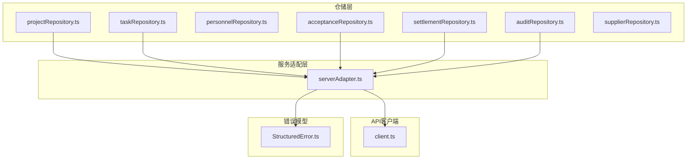
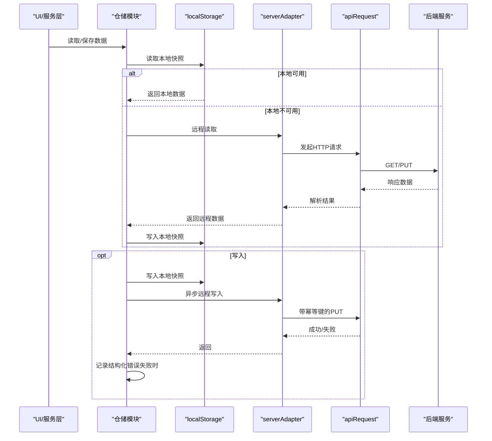
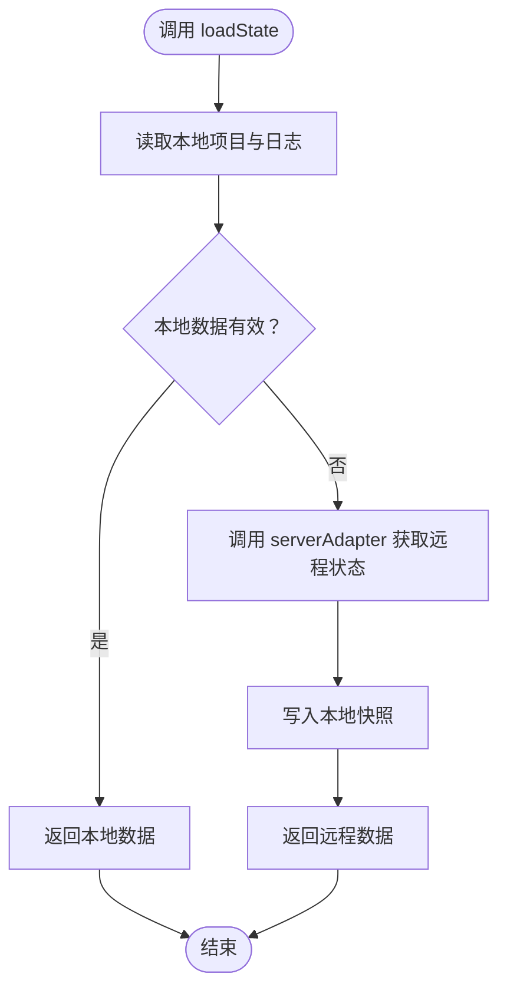
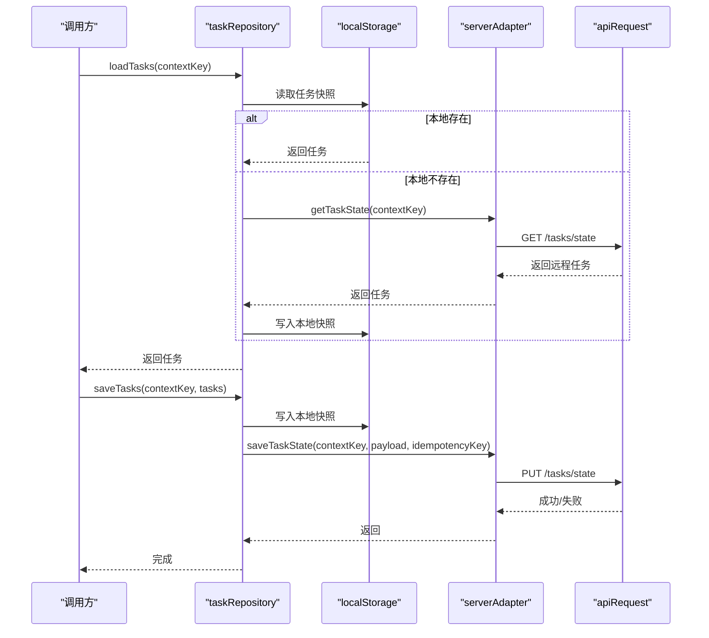
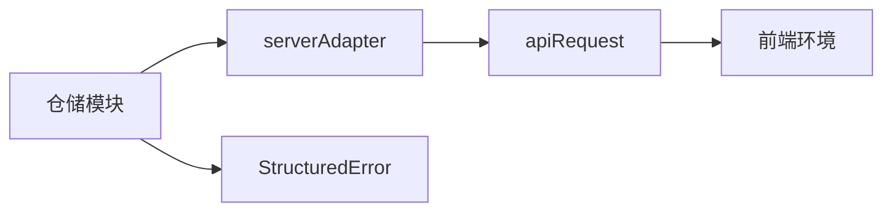

# 仓储模式实现

<cite>
**本文引用的文件**
- [src/services/repositories/projectRepository.ts](file://src/services/repositories/projectRepository.ts)
- [src/services/repositories/taskRepository.ts](file://src/services/repositories/taskRepository.ts)
- [src/services/repositories/personnelRepository.ts](file://src/services/repositories/personnelRepository.ts)
- [src/services/repositories/acceptanceRepository.ts](file://src/services/repositories/acceptanceRepository.ts)
- [src/services/repositories/auditRepository.ts](file://src/services/repositories/auditRepository.ts)
- [src/services/repositories/settlementRepository.ts](file://src/services/repositories/settlementRepository.ts)
- [src/services/repositories/supplierRepository.ts](file://src/services/repositories/supplierRepository.ts)
- [src/services/api/serverAdapter.ts](file://src/services/api/serverAdapter.ts)
- [src/services/api/client.ts](file://src/services/api/client.ts)
- [src/services/errors/StructuredError.ts](file://src/services/errors/StructuredError.ts)
- [src/data/projects.ts](file://src/data/projects.ts)
- [src/components/personnel/personnelUsers.ts](file://src/components/personnel/personnelUsers.ts)
- [src/components/resource/suppliers.ts](file://src/components/resource/suppliers.ts)
- [src/services/__tests__/projectRepository.test.ts](file://src/services/__tests__/projectRepository.test.ts)
- [src/services/__tests__/taskRepository.task-center.test.ts](file://src/services/__tests__/taskRepository.task-center.test.ts)
</cite>

## 目录

1. [简介](#简介)
2. [项目结构](#项目结构)
3. [核心组件](#核心组件)
4. [架构总览](#架构总览)
5. [详细组件分析](#详细组件分析)
6. [依赖关系分析](#依赖关系分析)
7. [性能考量](#性能考量)
8. [故障排查指南](#故障排查指南)
9. [结论](#结论)
10. [附录](#附录)

## 简介

本文件系统性梳理 CodeBuddy 项目中仓储模式的实现与应用，重点阐述数据访问层抽象、业务逻辑隔离、本地缓存策略、远程数据同步与一致性保障、仓储与服务层交互、异步处理与状态管理、数据访问优化与批量操作、事务处理机制等。通过对多个具体仓储实现（如 projectRepository、taskRepository、personnelRepository 等）的深入分析，帮助读者快速理解并正确使用仓储层。

## 项目结构

仓储层位于 src/services/repositories 目录下，每个仓储模块负责某一类领域数据的本地缓存与远程同步；与之配套的是服务适配层（serverAdapter）封装 HTTP 请求与幂等键生成，统一错误模型（StructuredError）用于结构化错误记录与上报，API 客户端（apiRequest）提供重试、降级与环境检测能力。

**图表来源**

- [src/services/repositories/projectRepository.ts:53-89](file://src/services/repositories/projectRepository.ts#L53-L89)
- [src/services/repositories/taskRepository.ts:141-317](file://src/services/repositories/taskRepository.ts#L141-L317)
- [src/services/repositories/personnelRepository.ts:44-57](file://src/services/repositories/personnelRepository.ts#L44-L57)
- [src/services/repositories/acceptanceRepository.ts:32-55](file://src/services/repositories/acceptanceRepository.ts#L32-L55)
- [src/services/repositories/auditRepository.ts:6-25](file://src/services/repositories/auditRepository.ts#L6-L25)
- [src/services/repositories/settlementRepository.ts:20-31](file://src/services/repositories/settlementRepository.ts#L20-L31)
- [src/services/repositories/supplierRepository.ts:43-56](file://src/services/repositories/supplierRepository.ts#L43-L56)
- [src/services/api/serverAdapter.ts:44-86](file://src/services/api/serverAdapter.ts#L44-L86)
- [src/services/api/client.ts:83-171](file://src/services/api/client.ts#L83-L171)
- [src/services/errors/StructuredError.ts:27-127](file://src/services/errors/StructuredError.ts#L27-L127)

**章节来源**

- [src/services/repositories/projectRepository.ts:1-90](file://src/services/repositories/projectRepository.ts#L1-L90)
- [src/services/repositories/taskRepository.ts:1-318](file://src/services/repositories/taskRepository.ts#L1-L318)
- [src/services/repositories/personnelRepository.ts:1-58](file://src/services/repositories/personnelRepository.ts#L1-L58)
- [src/services/repositories/acceptanceRepository.ts:1-56](file://src/services/repositories/acceptanceRepository.ts#L1-L56)
- [src/services/repositories/auditRepository.ts:1-26](file://src/services/repositories/auditRepository.ts#L1-L26)
- [src/services/repositories/settlementRepository.ts:1-32](file://src/services/repositories/settlementRepository.ts#L1-L32)
- [src/services/repositories/supplierRepository.ts:1-56](file://src/services/repositories/supplierRepository.ts#L1-L56)
- [src/services/api/serverAdapter.ts:1-87](file://src/services/api/serverAdapter.ts#L1-L87)
- [src/services/api/client.ts:1-172](file://src/services/api/client.ts#L1-L172)
- [src/services/errors/StructuredError.ts:1-195](file://src/services/errors/StructuredError.ts#L1-L195)

## 核心组件

- 仓储层职责
  - 抽象数据访问：统一本地缓存（localStorage）与远程服务的读写接口，屏蔽底层差异。
  - 业务逻辑隔离：将“如何持久化”与“如何使用数据”的逻辑分离，避免 UI 或服务层直接耦合存储细节。
  - 一致性保障：通过“先本地、后远程”的双写策略与幂等键，确保最终一致与可重试。
- 服务适配层（serverAdapter）
  - 封装 HTTP 接口，统一路径拼接与环境参数（如 envId），提供幂等键生成工具。
  - 暴露领域数据快照的读写方法，如项目、任务、验收、结算、审计等。
- API 客户端（apiRequest）
  - 提供重试、降级与错误分类能力；当云端环境未配置或网络异常时，触发本地降级事件。
- 错误模型（StructuredError）
  - 结构化错误码、作用域、场景、时间戳与原始错误，便于日志记录与监控上报。

**章节来源**

- [src/services/api/serverAdapter.ts:34-42](file://src/services/api/serverAdapter.ts#L34-L42)
- [src/services/api/client.ts:32-81](file://src/services/api/client.ts#L32-L81)
- [src/services/errors/StructuredError.ts:7-127](file://src/services/errors/StructuredError.ts#L7-L127)

## 架构总览

仓储层通过 serverAdapter 与后端交互，采用“本地优先、远程兜底”的策略：读取时优先从 localStorage 获取，若失败则回退到初始数据；写入时先更新本地，再异步尝试远程写入，失败时记录结构化错误但不影响主流程。审计日志与幂等键贯穿整个流程，确保可追踪与可重试。

**图表来源**

- [src/services/repositories/projectRepository.ts:54-88](file://src/services/repositories/projectRepository.ts#L54-L88)
- [src/services/repositories/taskRepository.ts:142-169](file://src/services/repositories/taskRepository.ts#L142-L169)
- [src/services/repositories/acceptanceRepository.ts:33-54](file://src/services/repositories/acceptanceRepository.ts#L33-L54)
- [src/services/api/serverAdapter.ts:44-86](file://src/services/api/serverAdapter.ts#L44-L86)
- [src/services/api/client.ts:83-171](file://src/services/api/client.ts#L83-L171)
- [src/services/errors/StructuredError.ts:179-194](file://src/services/errors/StructuredError.ts#L179-L194)

## 详细组件分析

### 项目仓储（projectRepository）

- 功能概述
  - 维护项目集合与项目状态日志的本地快照与远程同步。
  - 读取时优先本地，失败或无数据时回退至初始项目列表。
  - 写入时先本地持久化，再异步远程持久化，失败记录结构化错误。
- 关键点
  - 本地键名：项目列表与日志分别存储，避免相互污染。
  - 初始数据：来源于项目数据模块，保证首次加载有可用数据。
  - 错误处理：网络错误时记录结构化错误并降级到本地。
- 使用模式
  - 加载：loadState → 本地读取 → 远程读取 → 本地写入 → 返回。
  - 保存：本地写入 → 异步远程写入 → 失败记录结构化错误。

**图表来源**

- [src/services/repositories/projectRepository.ts:54-88](file://src/services/repositories/projectRepository.ts#L54-L88)

**章节来源**

- [src/services/repositories/projectRepository.ts:1-90](file://src/services/repositories/projectRepository.ts#L1-L90)
- [src/data/projects.ts:333-344](file://src/data/projects.ts#L333-L344)
- [src/services/errors/StructuredError.ts:179-194](file://src/services/errors/StructuredError.ts#L179-L194)
- [src/services/**tests**/projectRepository.test.ts:85-105](file://src/services/__tests__/projectRepository.test.ts#L85-L105)

### 任务仓储（taskRepository）

- 功能概述
  - 支持按上下文键（contextKey）分片存储任务快照与操作日志。
  - 兼容旧版数组快照与新版带 schemaVersion 的对象快照。
  - 提供审计日志追加与模板审计事件批量上报。
  - 支持从验收触发创建整改任务，并生成本地日志。
- 关键点
  - 本地键命名：以固定前缀区分不同上下文，避免冲突。
  - 日志上限：操作日志最多保留最近若干条，防止无限增长。
  - 幂等键：远程写入使用幂等键，避免重复提交。
  - 批量审计：模板审计事件批量上报，使用 Promise.allSettled 避免互相阻塞。
- 使用模式
  - 读取任务：loadTasks → 本地读取 → 远程读取 → 本地写入 → 返回。
  - 保存任务：本地写入 → 异步远程写入 → 失败忽略（本地降级）。
  - 追加日志：本地写入 → 异步远程审计 → 失败忽略（本地降级）。
  - 创建整改任务：基于现有任务或默认模板构建，本地写入后异步审计。

**图表来源**

- [src/services/repositories/taskRepository.ts:142-169](file://src/services/repositories/taskRepository.ts#L142-L169)
- [src/services/api/serverAdapter.ts:53-63](file://src/services/api/serverAdapter.ts#L53-L63)
- [src/services/api/client.ts:83-171](file://src/services/api/client.ts#L83-L171)

**章节来源**

- [src/services/repositories/taskRepository.ts:1-318](file://src/services/repositories/taskRepository.ts#L1-L318)
- [src/services/**tests**/taskRepository.task-center.test.ts:53-80](file://src/services/__tests__/taskRepository.task-center.test.ts#L53-L80)

### 人员仓储（personnelRepository）

- 功能概述
  - 维护人员列表的本地快照，提供加载、保存与自动生成下一个用户 ID 的能力。
  - 初始状态来自人员数据模块，确保首次渲染可用。
- 关键点
  - 深拷贝初始化：避免引用污染，确保后续修改不影响初始数据。
  - ID 生成：从现有 ID 中提取数字部分，生成递增的新 ID。
- 使用模式
  - 加载：readLocalState → 无数据则初始化 → 返回。
  - 保存：persistLocalState → 写入 localStorage。
  - 下一个 ID：遍历现有 ID，取最大值并递增。

**章节来源**

- [src/services/repositories/personnelRepository.ts:1-58](file://src/services/repositories/personnelRepository.ts#L1-L58)
- [src/components/personnel/personnelUsers.ts:102-320](file://src/components/personnel/personnelUsers.ts#L102-L320)

### 验收仓储（acceptanceRepository）

- 功能概述
  - 以项目编码为键维护验收状态快照，支持加载与保存。
  - 保存时合并摘要信息，先本地写入，再异步远程写入。
- 关键点
  - 键命名：以固定前缀加项目编码，避免冲突。
  - 类型校验：读取时对节点与里程碑数组进行校验，无效则视为无数据。
- 使用模式
  - 加载：本地读取 → 远程读取 → 本地写入 → 返回。
  - 保存：合并摘要 → 本地写入 → 异步远程写入 → 失败忽略。

**章节来源**

- [src/services/repositories/acceptanceRepository.ts:1-56](file://src/services/repositories/acceptanceRepository.ts#L1-L56)

### 审计仓储（auditRepository）

- 功能概述
  - 提供审计日志追加接口，支持多种场景（项目、任务、验收、结算、系统）。
  - 写入失败时记录结构化错误但不阻塞主流程。
- 关键点
  - 幂等键：为每次审计写入生成唯一键，避免重复。
  - 错误降级：网络异常时记录错误并降级到本地，不影响业务主流程。
- 使用模式
  - 追加审计：生成幂等键 → 远程写入 → 失败记录结构化错误。

**章节来源**

- [src/services/repositories/auditRepository.ts:1-26](file://src/services/repositories/auditRepository.ts#L1-L26)
- [src/services/errors/StructuredError.ts:179-194](file://src/services/errors/StructuredError.ts#L179-L194)

### 结算仓储（settlementRepository）

- 功能概述
  - 基于项目集合构建本地建议清单，优先使用远程建议，否则回退到本地计算。
  - 本地建议：筛选“草案待确认”状态的项目，按预算比例估算建议金额。
- 关键点
  - 本地计算：对预算字符串做数值清洗与换算，确保数值有效性。
  - 回退策略：远程不可用时直接返回本地建议。
- 使用模式
  - 加载建议：本地计算 → 远程读取 → 有远程则返回远程，否则返回本地。

**章节来源**

- [src/services/repositories/settlementRepository.ts:1-32](file://src/services/repositories/settlementRepository.ts#L1-L32)

### 供应商仓储（supplierRepository）

- 功能概述
  - 维护供应商列表的本地快照，提供加载、保存与自动生成下一个供应商 ID 的能力。
  - 初始状态来自供应商数据模块，确保首次渲染可用。
- 关键点
  - 深拷贝初始化：避免引用污染。
  - ID 生成：从现有 ID 中提取数字部分，生成递增的新 ID。
- 使用模式
  - 加载：readLocalState → 无数据则初始化 → 返回。
  - 保存：persistLocalState → 写入 localStorage。
  - 下一个 ID：遍历现有 ID，取最大值并递增。

**章节来源**

- [src/services/repositories/supplierRepository.ts:1-56](file://src/services/repositories/supplierRepository.ts#L1-L56)
- [src/components/resource/suppliers.ts:3-164](file://src/components/resource/suppliers.ts#L3-L164)

## 依赖关系分析

- 仓储层依赖
  - 仓储模块统一依赖 serverAdapter 进行远程读写。
  - serverAdapter 依赖 apiRequest 进行 HTTP 请求与幂等键生成。
  - 错误模型 StructuredError 用于统一错误记录与上报。
- 耦合与内聚
  - 仓储模块内部高内聚：同一模块内的本地读写、远程读写、错误处理在同一文件内完成。
  - 仓储模块之间低耦合：彼此独立，通过 serverAdapter 间接依赖同一后端接口。
- 循环依赖
  - 未发现循环依赖：仓储 → 适配层 → 客户端 → 后端，方向单一。
- 外部依赖
  - localStorage：作为本地缓存介质，承担离线与降级能力。
  - 浏览器事件：API 客户端在降级时向 window 派发自定义事件，便于上层感知。

**图表来源**

- [src/services/api/serverAdapter.ts:44-86](file://src/services/api/serverAdapter.ts#L44-L86)
- [src/services/api/client.ts:83-171](file://src/services/api/client.ts#L83-L171)
- [src/services/errors/StructuredError.ts:179-194](file://src/services/errors/StructuredError.ts#L179-L194)

**章节来源**

- [src/services/repositories/projectRepository.ts:3-4](file://src/services/repositories/projectRepository.ts#L3-L4)
- [src/services/repositories/taskRepository.ts](file://src/services/repositories/taskRepository.ts#L3)
- [src/services/repositories/acceptanceRepository.ts](file://src/services/repositories/acceptanceRepository.ts#L2)
- [src/services/repositories/auditRepository.ts:1-2](file://src/services/repositories/auditRepository.ts#L1-L2)
- [src/services/api/serverAdapter.ts:1-87](file://src/services/api/serverAdapter.ts#L1-L87)
- [src/services/api/client.ts:1-172](file://src/services/api/client.ts#L1-L172)
- [src/services/errors/StructuredError.ts:1-195](file://src/services/errors/StructuredError.ts#L1-L195)

## 性能考量

- 本地缓存优先
  - 读取与写入均优先本地，减少网络往返，提升首屏与交互响应速度。
- 数据结构优化
  - 任务仓储引入 schemaVersion 字段，支持快照格式演进，避免全量迁移。
  - 本地日志限制数量（如任务操作日志最多保留最近若干条），控制内存占用。
- 异步与批处理
  - 审计日志批量上报使用 Promise.allSettled，避免单个失败阻塞整体。
  - 结算建议本地计算，避免频繁远程请求。
- 幂等与重试
  - 幂等键确保重复提交不会产生副作用；API 客户端提供有限次重试与降级。
- 环境检测
  - 未配置云端环境时直接降级到本地模式，避免无效网络请求。

**章节来源**

- [src/services/repositories/taskRepository.ts:17-17](file://src/services/repositories/taskRepository.ts#L17-L17)
- [src/services/repositories/taskRepository.ts:175-195](file://src/services/repositories/taskRepository.ts#L175-L195)
- [src/services/repositories/settlementRepository.ts:9-18](file://src/services/repositories/settlementRepository.ts#L9-L18)
- [src/services/api/client.ts:32-81](file://src/services/api/client.ts#L32-L81)
- [src/services/api/serverAdapter.ts:38-42](file://src/services/api/serverAdapter.ts#L38-L42)

## 故障排查指南

- 常见问题
  - 本地存储读取失败：仓储模块捕获异常并返回初始数据或空状态，同时记录结构化错误。
  - 远程请求失败：API 客户端根据状态码决定重试或降级，同时向 window 派发降级事件。
  - 幂等冲突：错误模型提供幂等冲突判断与错误分类，便于定位重复提交。
- 定位步骤
  - 查看控制台日志：StructuredError.toLogString 输出结构化错误信息。
  - 检查 localStorage：确认键是否存在、格式是否正确（如任务快照含 schemaVersion）。
  - 观察降级事件：window 上的 pm:remote-fallback 事件可用于监控与告警。
- 建议
  - 对关键写入操作增加幂等键，避免重复提交。
  - 对批量操作使用 Promise.allSettled，确保部分失败不影响整体。
  - 在开发环境开启更详细的日志与断点，定位异常场景。

**章节来源**

- [src/services/repositories/projectRepository.ts:26-37](file://src/services/repositories/projectRepository.ts#L26-L37)
- [src/services/repositories/taskRepository.ts:44-48](file://src/services/repositories/taskRepository.ts#L44-L48)
- [src/services/repositories/auditRepository.ts:17-24](file://src/services/repositories/auditRepository.ts#L17-L24)
- [src/services/errors/StructuredError.ts:57-88](file://src/services/errors/StructuredError.ts#L57-L88)
- [src/services/api/client.ts:54-81](file://src/services/api/client.ts#L54-L81)

## 结论

CodeBuddy 的仓储模式通过“本地优先、远程兜底”的策略实现了数据访问层的抽象与业务逻辑的隔离，结合幂等键、结构化错误与异步批处理，既保证了用户体验与性能，又提供了良好的可维护性与可观测性。各仓储模块职责清晰、耦合度低，适合在多页面、多场景下复用与扩展。

## 附录

- 代码示例路径（不展示具体代码内容）
  - 项目状态加载与保存：[src/services/repositories/projectRepository.ts:54-88](file://src/services/repositories/projectRepository.ts#L54-L88)
  - 任务状态加载与保存：[src/services/repositories/taskRepository.ts:142-169](file://src/services/repositories/taskRepository.ts#L142-L169)
  - 人员列表加载与保存：[src/services/repositories/personnelRepository.ts:44-51](file://src/services/repositories/personnelRepository.ts#L44-L51)
  - 验收状态加载与保存：[src/services/repositories/acceptanceRepository.ts:33-54](file://src/services/repositories/acceptanceRepository.ts#L33-L54)
  - 审计日志追加：[src/services/repositories/auditRepository.ts:7-24](file://src/services/repositories/auditRepository.ts#L7-L24)
  - 结算建议加载：[src/services/repositories/settlementRepository.ts:21-30](file://src/services/repositories/settlementRepository.ts#L21-L30)
  - 供应商列表加载与保存：[src/services/repositories/supplierRepository.ts:43-50](file://src/services/repositories/supplierRepository.ts#L43-L50)
  - 服务适配层接口定义：[src/services/api/serverAdapter.ts:44-86](file://src/services/api/serverAdapter.ts#L44-L86)
  - API 客户端重试与降级：[src/services/api/client.ts:83-171](file://src/services/api/client.ts#L83-L171)
  - 结构化错误模型：[src/services/errors/StructuredError.ts:27-127](file://src/services/errors/StructuredError.ts#L27-L127)
- 单元测试参考
  - 项目仓储保存与加载测试：[src/services/**tests**/projectRepository.test.ts:55-105](file://src/services/__tests__/projectRepository.test.ts#L55-L105)
  - 任务仓储 V2 快照与日志测试：[src/services/**tests**/taskRepository.task-center.test.ts:53-98](file://src/services/__tests__/taskRepository.task-center.test.ts#L53-L98)
