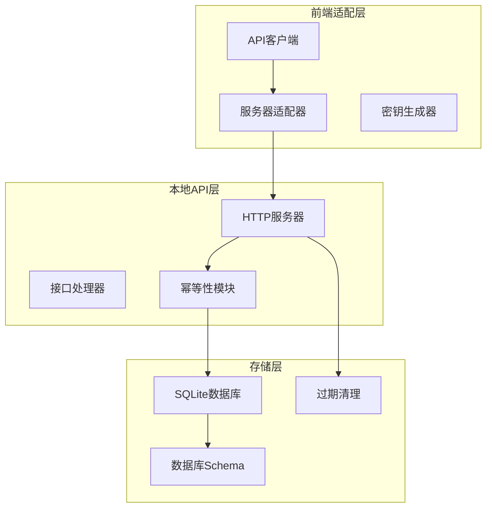
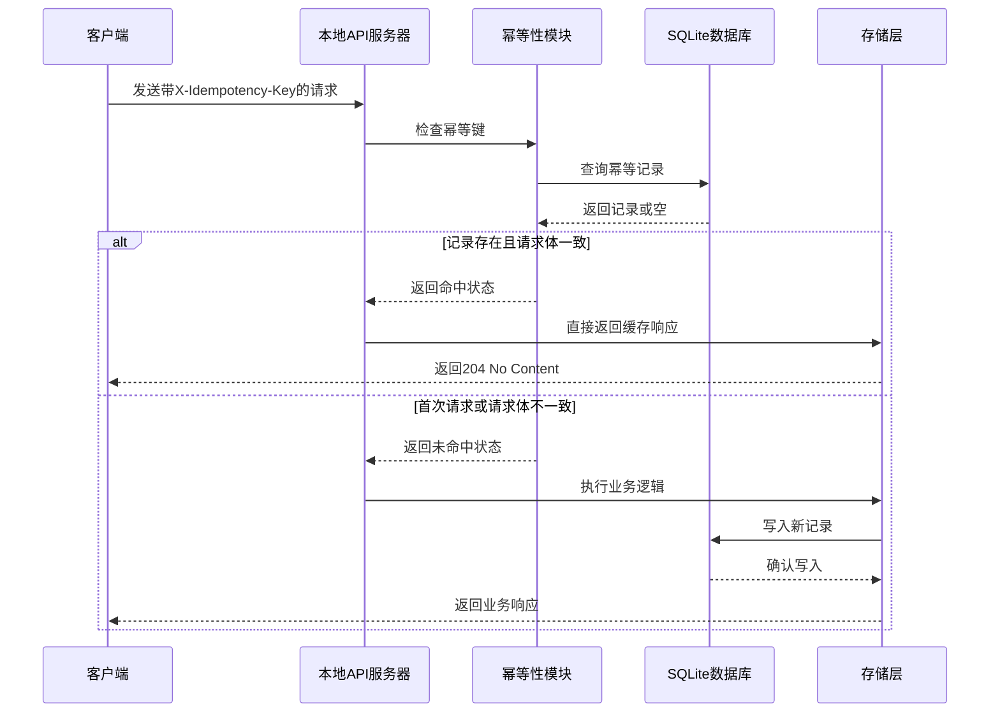
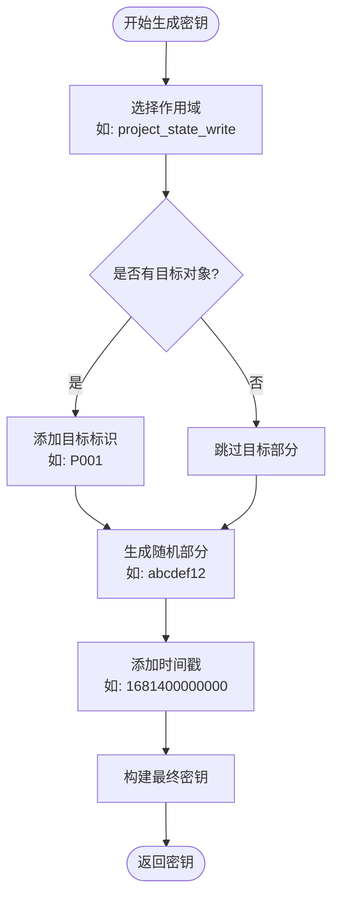
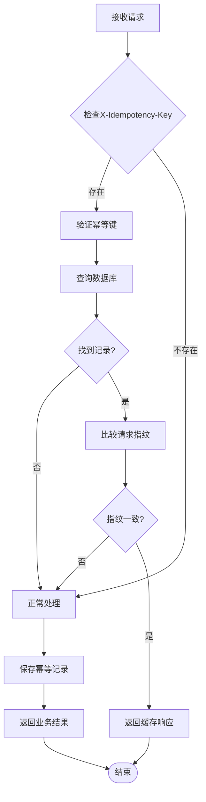
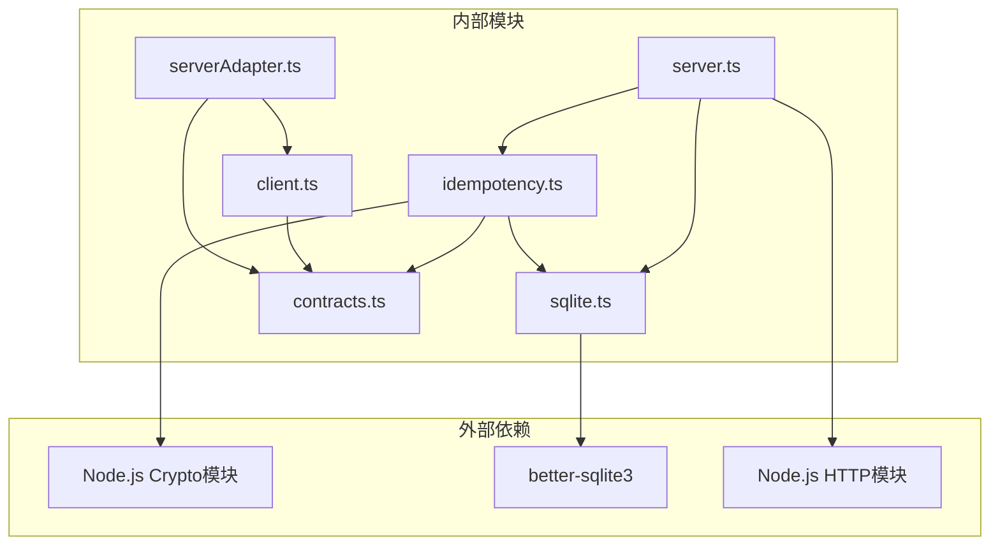

# 幂等性设计

<cite>
**本文档引用的文件**
- [local-api/store/idempotency.ts](file://local-api/store/idempotency.ts)
- [local-api/store/schema.sql](file://local-api/store/schema.sql)
- [local-api/store/sqlite.ts](file://local-api/store/sqlite.ts)
- [local-api/server.ts](file://local-api/server.ts)
- [local-api/contracts.ts](file://local-api/contracts.ts)
- [src/services/api/serverAdapter.ts](file://src/services/api/serverAdapter.ts)
- [src/services/api/client.ts](file://src/services/api/client.ts)
- [local-api/test-api.sh](file://local-api/test-api.sh)
</cite>

## 目录

1. [简介](#简介)
2. [项目结构](#项目结构)
3. [核心组件](#核心组件)
4. [架构概览](#架构概览)
5. [详细组件分析](#详细组件分析)
6. [依赖关系分析](#依赖关系分析)
7. [性能考量](#性能考量)
8. [故障排除指南](#故障排除指南)
9. [结论](#结论)
10. [附录](#附录)

## 简介

CodeBuddy项目实现了完整的幂等性设计，用于防止分布式系统中的重复请求和确保数据一致性。幂等性是分布式系统设计的重要原则，它确保对同一操作的多次执行会产生相同的结果，就像数学中的幂等运算一样。

在分布式环境中，网络延迟、超时重试、客户端断线重连等情况可能导致相同的请求被发送多次。幂等性设计通过唯一标识符和请求指纹来识别重复请求，并返回之前成功执行的结果，从而避免数据不一致问题。

## 项目结构

CodeBuddy的幂等性实现主要分布在以下模块中：



**图表来源**

- [local-api/server.ts:1-414](file://local-api/server.ts#L1-L414)
- [local-api/store/idempotency.ts:1-100](file://local-api/store/idempotency.ts#L1-L100)
- [local-api/store/sqlite.ts:1-99](file://local-api/store/sqlite.ts#L1-L99)

**章节来源**

- [local-api/server.ts:1-414](file://local-api/server.ts#L1-L414)
- [local-api/store/idempotency.ts:1-100](file://local-api/store/idempotency.ts#L1-L100)
- [local-api/store/sqlite.ts:1-99](file://local-api/store/sqlite.ts#L1-L99)

## 核心组件

### 幂等性存储模块

幂等性存储模块是整个设计的核心，负责管理幂等键的状态和生命周期。

**关键特性：**

- 请求指纹生成：使用SHA-256哈希算法对请求体进行加密
- 幂等键验证：检查重复请求并返回缓存结果
- 过期策略：默认7天有效期的自动清理机制
- 并发安全：通过数据库约束处理并发插入冲突

**章节来源**

- [local-api/store/idempotency.ts:1-100](file://local-api/store/idempotency.ts#L1-L100)

### 数据库架构

数据库设计采用SQLite作为本地存储，支持所有核心业务接口的状态管理。

**核心表结构：**

| 表名             | 主键 | 索引                        | 描述             |
| ---------------- | ---- | --------------------------- | ---------------- |
| project_state    | id   | env_id                      | 项目状态快照存储 |
| task_state       | id   | env_id, context_key         | 任务状态快照存储 |
| acceptance_state | id   | env_id, project_code        | 验收状态快照存储 |
| settlement_state | id   | env_id                      | 结算状态快照存储 |
| audit_logs       | id   | env_id, project_code, scene | 审计日志存储     |
| idempotency_keys | key  | env_id, scope, expired_at   | 幂等性记录存储   |

**章节来源**

- [local-api/store/schema.sql:1-72](file://local-api/store/schema.sql#L1-L72)

### HTTP服务器集成

本地API服务器实现了五个核心接口，每个接口都集成了幂等性检查机制。

**支持的接口：**

- `GET /api/projects/state` - 获取项目状态
- `PUT /api/projects/state` - 更新项目状态（支持幂等）
- `GET /api/tasks/state` - 获取任务状态
- `PUT /api/tasks/state` - 更新任务状态（支持幂等）
- `GET /api/acceptance/state` - 获取验收状态
- `PUT /api/acceptance/state` - 更新验收状态（支持幂等）
- `GET /api/settlement/state` - 获取结算状态
- `POST /api/audit/logs` - 添加审计日志（支持幂等）

**章节来源**

- [local-api/server.ts:70-329](file://local-api/server.ts#L70-L329)

## 架构概览

CodeBuddy的幂等性架构采用了分层设计，确保了系统的可维护性和扩展性。



**图表来源**

- [local-api/server.ts:87-125](file://local-api/server.ts#L87-L125)
- [local-api/store/idempotency.ts:23-58](file://local-api/store/idempotency.ts#L23-L58)

## 详细组件分析

### 幂等键生成与验证机制

#### 密钥生成策略

前端适配器提供了灵活的密钥生成器，支持多种命名空间和目标对象的组合。



**图表来源**

- [src/services/api/serverAdapter.ts:38-42](file://src/services/api/serverAdapter.ts#L38-L42)

#### 请求指纹验证

服务器端使用SHA-256算法对请求体进行哈希计算，确保即使请求顺序变化也不会影响幂等性判断。

**验证流程：**

1. 接收客户端请求，提取X-Idempotency-Key头部
2. 解析请求体并生成SHA-256指纹
3. 查询数据库中的幂等记录
4. 比较指纹一致性
5. 返回相应的处理结果

**章节来源**

- [local-api/store/idempotency.ts:15-58](file://local-api/store/idempotency.ts#L15-L58)

### 数据库存储实现

#### 表结构设计

幂等性记录表采用了精心设计的字段结构，支持高效的查询和管理。

| 字段名          | 类型    | 约束                   | 描述              |
| --------------- | ------- | ---------------------- | ----------------- |
| key             | TEXT    | PRIMARY KEY            | 幂等键标识符      |
| scope           | TEXT    | NOT NULL               | 作用域标识        |
| env_id          | TEXT    | NOT NULL               | 环境标识          |
| request_hash    | TEXT    | NOT NULL               | 请求体SHA-256指纹 |
| response_status | INTEGER | NOT NULL               | 响应HTTP状态码    |
| response_body   | TEXT    | NULL                   | 响应体JSON字符串  |
| created_at      | TEXT    | NOT NULL DEFAULT now() | 创建时间          |
| expired_at      | TEXT    | NOT NULL               | 过期时间          |

#### 索引优化

为了支持高频查询，数据库建立了多个复合索引：

- `idx_idempotency_keys_env_id`: 支持按环境快速过滤
- `idx_idempotency_keys_scope`: 支持按作用域查询
- `idx_idempotency_keys_expired_at`: 支持过期清理批量删除

**章节来源**

- [local-api/store/schema.sql:57-72](file://local-api/store/schema.sql#L57-L72)
- [local-api/store/sqlite.ts:68-80](file://local-api/store/sqlite.ts#L68-L80)

### 业务逻辑处理

#### 重复请求检测

服务器在每个写入接口中都实现了完整的幂等性检查流程：



**图表来源**

- [local-api/server.ts:92-104](file://local-api/server.ts#L92-L104)
- [local-api/store/idempotency.ts:23-58](file://local-api/store/idempotency.ts#L23-L58)

#### 状态恢复机制

当检测到重复请求时，系统会自动恢复之前的状态，确保客户端获得一致的响应。

**恢复流程：**

1. 从幂等记录中获取之前的成功响应
2. 解析响应状态码和响应体
3. 直接返回相同的HTTP响应给客户端
4. 跳过业务逻辑执行，提高性能

**章节来源**

- [local-api/store/idempotency.ts:91-99](file://local-api/store/idempotency.ts#L91-L99)

### 不同场景的应用

#### 订单创建场景

在订单创建场景中，幂等性确保即使客户端多次提交相同的订单请求，也只会创建一个订单实例。

**实现要点：**

- 使用订单号作为密钥前缀
- 包含订单金额、商品列表等关键信息
- 设置合理的过期时间（通常为24小时）

#### 支付处理场景

支付接口的幂等性设计需要特别注意安全性，确保支付金额和商户信息的一致性。

**安全考虑：**

- 对敏感信息进行哈希处理
- 实施严格的访问控制
- 记录详细的审计日志

#### 状态更新场景

对于频繁的状态更新操作，幂等性可以避免重复的状态变更导致的数据不一致。

**性能优化：**

- 使用缓存机制减少数据库查询
- 实施批量处理策略
- 优化索引结构

## 依赖关系分析



**图表来源**

- [local-api/server.ts:6-16](file://local-api/server.ts#L6-L16)
- [local-api/store/idempotency.ts:6-8](file://local-api/store/idempotency.ts#L6-L8)

**章节来源**

- [local-api/server.ts:1-414](file://local-api/server.ts#L1-L414)
- [local-api/store/idempotency.ts:1-100](file://local-api/store/idempotency.ts#L1-L100)

## 性能考量

### 查询优化策略

1. **索引设计优化**
   - 为常用查询条件建立复合索引
   - 避免全表扫描，提高查询效率
   - 定期分析查询计划

2. **内存缓存策略**
   - 对热点数据实施内存缓存
   - 设置合理的缓存失效策略
   - 监控缓存命中率

3. **数据库连接池**
   - 使用连接池管理数据库连接
   - 配置合适的连接数限制
   - 实施连接超时机制

### 并发处理

1. **事务隔离**
   - 使用适当的事务隔离级别
   - 避免死锁情况发生
   - 实施乐观锁机制

2. **锁竞争优化**
   - 减少锁持有时间
   - 使用行级锁而非表级锁
   - 实施锁超时机制

### 监控与告警

1. **性能指标监控**
   - 查询响应时间统计
   - 并发连接数监控
   - 错误率跟踪

2. **容量规划**
   - 数据增长趋势分析
   - 存储空间使用率监控
   - 索引维护计划

## 故障排除指南

### 常见问题诊断

#### 幂等键冲突

**症状：** 并发请求时出现重复键错误

**解决方案：**

1. 检查密钥生成逻辑，确保唯一性
2. 实施重试机制处理临时冲突
3. 调整并发控制策略

#### 请求体不一致

**症状：** 相同密钥但请求内容不同的警告

**解决方案：**

1. 验证请求序列化过程
2. 检查时间戳和随机数处理
3. 实施请求规范化机制

#### 数据库性能问题

**症状：** 查询响应缓慢或超时

**解决方案：**

1. 分析慢查询日志
2. 优化索引设计
3. 实施查询缓存

### 调试工具

#### 日志分析

系统提供了详细的日志记录，包括：

- 幂等键检查过程
- 请求指纹生成
- 数据库操作记录
- 错误处理信息

#### 性能监控

建议使用以下监控指标：

- 幂等命中率
- 请求处理时间
- 数据库查询延迟
- 缓存命中率

**章节来源**

- [local-api/store/idempotency.ts:49](file://local-api/store/idempotency.ts#L49)
- [local-api/store/sqlite.ts:68-80](file://local-api/store/sqlite.ts#L68-L80)

## 结论

CodeBuddy项目的幂等性设计体现了现代分布式系统的核心理念，通过精心设计的架构和实现策略，有效解决了重复请求和数据一致性问题。

**设计优势：**

1. **完整性**：覆盖所有核心业务接口
2. **安全性**：通过请求指纹验证确保数据完整性
3. **性能**：通过缓存和索引优化提升响应速度
4. **可维护性**：模块化设计便于后续扩展

**最佳实践总结：**

- 合理设计幂等键命名规则
- 实施适当的过期策略
- 建立完善的监控体系
- 制定详细的故障处理预案

该设计为CodeBuddy项目提供了可靠的分布式系统基础，确保了在复杂业务场景下的稳定运行。

## 附录

### 实现示例

#### 基本使用流程

1. **生成幂等键**

   ```typescript
   const key = createIdempotencyKey('project_state_write', 'P001')
   ```

2. **发送带幂等性的请求**

   ```typescript
   await serverAdapter.saveProjectState(payload, key)
   ```

3. **处理重复请求**
   ```typescript
   // 重复请求会被自动识别并返回缓存结果
   ```

#### 配置选项

| 选项                 | 默认值 | 描述             |
| -------------------- | ------ | ---------------- |
| IDEMPOTENCY_TTL_DAYS | 7      | 幂等记录过期天数 |
| MAX_RETRIES          | 1      | 自动重试次数     |
| TIMEOUT_MS           | 5000   | 请求超时时间     |

### 安全考虑

1. **密钥泄露防护**
   - 使用HTTPS传输
   - 限制密钥使用范围
   - 定期轮换密钥

2. **数据保护**
   - 对敏感信息进行哈希处理
   - 实施访问控制
   - 定期备份数据

3. **审计日志**
   - 记录所有幂等性操作
   - 监控异常访问行为
   - 定期审查日志
