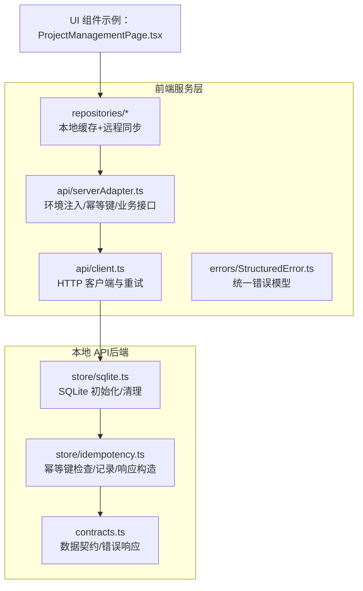
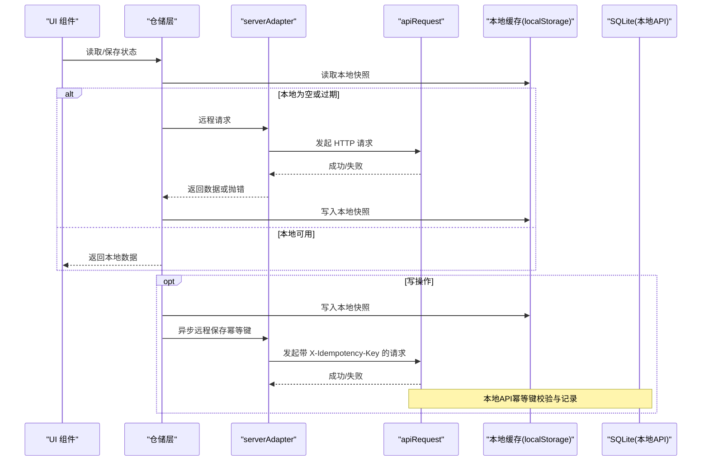
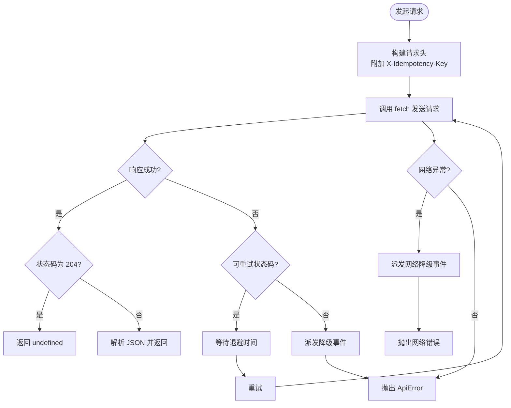
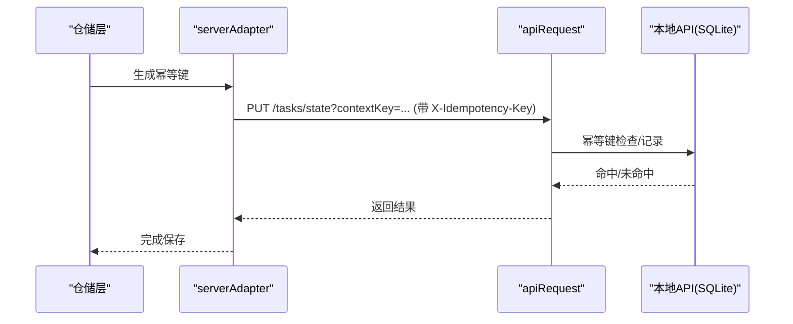
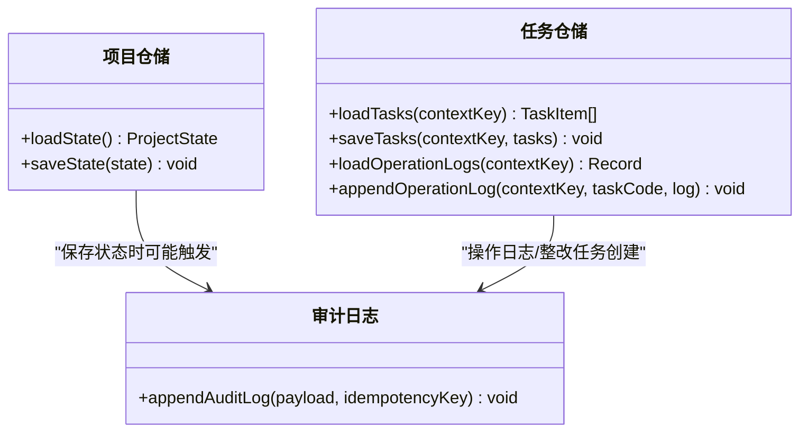
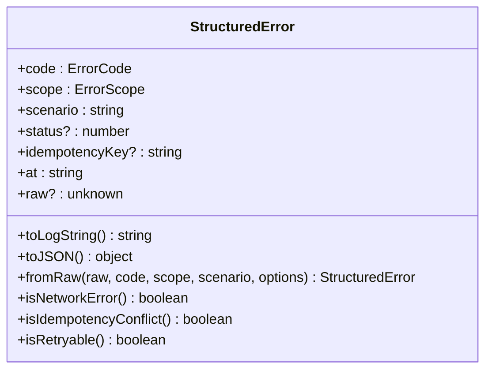
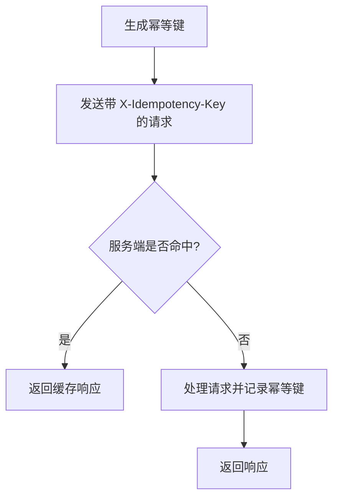
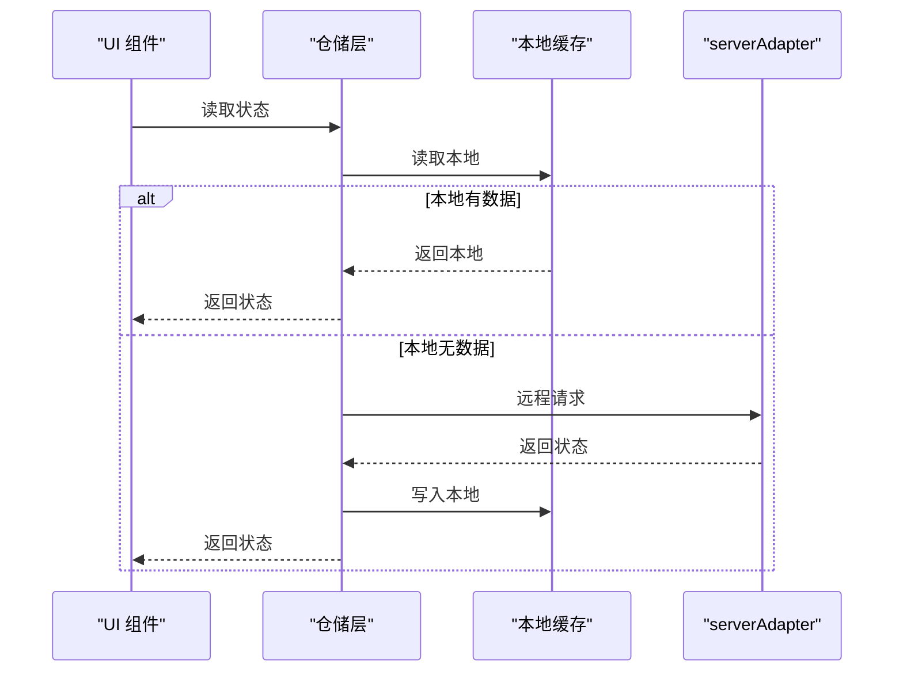

# 服务层架构

<cite>
**本文引用的文件**
- [src/services/api/client.ts](file://src/services/api/client.ts)
- [src/services/api/serverAdapter.ts](file://src/services/api/serverAdapter.ts)
- [src/services/errors/StructuredError.ts](file://src/services/errors/StructuredError.ts)
- [src/services/repositories/projectRepository.ts](file://src/services/repositories/projectRepository.ts)
- [src/services/repositories/taskRepository.ts](file://src/services/repositories/taskRepository.ts)
- [src/services/repositories/personnelRepository.ts](file://src/services/repositories/personnelRepository.ts)
- [src/services/repositories/supplierRepository.ts](file://src/services/repositories/supplierRepository.ts)
- [src/services/repositories/settlementRepository.ts](file://src/services/repositories/settlementRepository.ts)
- [local-api/store/idempotency.ts](file://local-api/store/idempotency.ts)
- [local-api/store/sqlite.ts](file://local-api/store/sqlite.ts)
- [local-api/contracts.ts](file://local-api/contracts.ts)
- [src/services/__tests__/errorHandling.test.ts](file://src/services/__tests__/errorHandling.test.ts)
- [src/services/__tests__/projectRepository.test.ts](file://src/services/__tests__/projectRepository.test.ts)
- [src/services/__tests__/taskRepository.task-center.test.ts](file://src/services/__tests__/taskRepository.task-center.test.ts)
- [src/components/project/ProjectManagementPage.tsx](file://src/components/project/ProjectManagementPage.tsx)
</cite>

## 目录

1. [简介](#简介)
2. [项目结构](#项目结构)
3. [核心组件](#核心组件)
4. [架构总览](#架构总览)
5. [详细组件分析](#详细组件分析)
6. [依赖关系分析](#依赖关系分析)
7. [性能考量](#性能考量)
8. [故障排查指南](#故障排查指南)
9. [结论](#结论)
10. [附录](#附录)

## 简介

本文件系统性梳理 CodeBuddy 项目的服务层架构，重点覆盖以下主题：

- API 客户端设计模式：HTTP 请求封装、响应处理、错误管理与重试策略
- 仓储模式实现：数据访问层抽象、本地缓存策略、远程数据同步机制
- 统一错误处理机制：StructuredError 结构化错误模型、错误分类与降级策略
- 幂等性设计原理与实现：X-Idempotency-Key 头部处理与重复请求防护
- 服务层与 UI 层交互模式：异步数据流与状态同步机制
- 最佳实践与代码示例路径指引

## 项目结构

服务层位于 src/services 目录，围绕“API 客户端 → 适配器 → 仓储 → UI”的分层组织：

- API 客户端与适配器：负责网络请求、幂等键生成与环境注入
- 仓储层：封装本地缓存与远程同步，提供领域状态的读写接口
- 统一错误模型：提供结构化错误类型与日志序列化能力
- 本地 API（local-api）：提供 SQLite 存储、幂等键记录与契约定义，支撑离线/降级场景

图示来源

- [src/services/api/client.ts:83-171](file://src/services/api/client.ts#L83-L171)
- [src/services/api/serverAdapter.ts:44-86](file://src/services/api/serverAdapter.ts#L44-L86)
- [src/services/repositories/projectRepository.ts:53-89](file://src/services/repositories/projectRepository.ts#L53-L89)
- [local-api/store/sqlite.ts:18-52](file://local-api/store/sqlite.ts#L18-L52)
- [local-api/store/idempotency.ts:23-99](file://local-api/store/idempotency.ts#L23-L99)
- [local-api/contracts.ts:11-89](file://local-api/contracts.ts#L11-L89)

章节来源

- [src/services/api/client.ts:1-172](file://src/services/api/client.ts#L1-L172)
- [src/services/api/serverAdapter.ts:1-87](file://src/services/api/serverAdapter.ts#L1-L87)
- [src/services/errors/StructuredError.ts:1-195](file://src/services/errors/StructuredError.ts#L1-L195)
- [src/services/repositories/projectRepository.ts:1-90](file://src/services/repositories/projectRepository.ts#L1-L90)
- [src/services/repositories/taskRepository.ts:1-318](file://src/services/repositories/taskRepository.ts#L1-L318)
- [local-api/store/idempotency.ts:1-100](file://local-api/store/idempotency.ts#L1-L100)
- [local-api/store/sqlite.ts:1-99](file://local-api/store/sqlite.ts#L1-L99)
- [local-api/contracts.ts:1-89](file://local-api/contracts.ts#L1-L89)

## 核心组件

- API 客户端与重试：统一 HTTP 请求封装、自动重试、错误归类与降级事件派发
- 服务器适配器：环境 ID 注入、幂等键生成、业务接口聚合
- 仓储层：本地持久化（localStorage）、远程同步（serverAdapter）、降级策略
- 统一错误模型：结构化字段、分类判断、日志与上报
- 本地 API：SQLite 初始化、幂等键记录、契约对齐

章节来源

- [src/services/api/client.ts:83-171](file://src/services/api/client.ts#L83-L171)
- [src/services/api/serverAdapter.ts:34-86](file://src/services/api/serverAdapter.ts#L34-L86)
- [src/services/errors/StructuredError.ts:27-127](file://src/services/errors/StructuredError.ts#L27-L127)
- [src/services/repositories/projectRepository.ts:53-89](file://src/services/repositories/projectRepository.ts#L53-L89)
- [src/services/repositories/taskRepository.ts:141-317](file://src/services/repositories/taskRepository.ts#L141-L317)

## 架构总览

服务层采用“请求-适配-仓储-持久化”的链路，结合本地缓存与远程同步，形成“读优先、写降级”的稳健架构。

图示来源

- [src/services/repositories/projectRepository.ts:54-88](file://src/services/repositories/projectRepository.ts#L54-L88)
- [src/services/repositories/taskRepository.ts:142-195](file://src/services/repositories/taskRepository.ts#L142-L195)
- [src/services/api/serverAdapter.ts:44-86](file://src/services/api/serverAdapter.ts#L44-L86)
- [src/services/api/client.ts:83-171](file://src/services/api/client.ts#L83-L171)
- [local-api/store/idempotency.ts:23-99](file://local-api/store/idempotency.ts#L23-L99)

## 详细组件分析

### API 客户端设计模式

- HTTP 请求封装：统一方法、头信息构建（含 X-Idempotency-Key）、JSON 序列化与基础 URL 拼接
- 响应处理：204 特殊处理、JSON 解析、错误消息提取
- 错误管理：ApiError 类型化错误、重试策略（基于状态码集合）、网络异常捕获与降级事件派发
- 降级策略：当网络不可用或重试耗尽时，派发自定义事件，供 UI 或上层逻辑进行本地兜底

图示来源

- [src/services/api/client.ts:83-171](file://src/services/api/client.ts#L83-L171)

章节来源

- [src/services/api/client.ts:1-172](file://src/services/api/client.ts#L1-L172)

### 服务器适配器与幂等性

- 环境注入：自动在路径后追加 envId 参数，支持多环境隔离
- 幂等键生成：createIdempotencyKey 提供 scope-target 组合 + 时间戳 + 随机串
- 业务接口：统一读写接口（项目/任务/验收/结算/审计日志），均支持幂等键

图示来源

- [src/services/api/serverAdapter.ts:38-86](file://src/services/api/serverAdapter.ts#L38-L86)
- [src/services/api/client.ts:43-47](file://src/services/api/client.ts#L43-L47)
- [local-api/store/idempotency.ts:23-99](file://local-api/store/idempotency.ts#L23-L99)

章节来源

- [src/services/api/serverAdapter.ts:1-87](file://src/services/api/serverAdapter.ts#L1-L87)
- [local-api/store/idempotency.ts:1-100](file://local-api/store/idempotency.ts#L1-L100)

### 仓储模式实现

- 本地缓存策略：localStorage 作为第一缓存，读取失败回退到初始数据；写入时先落本地再异步远程
- 远程同步机制：优先远程拉取，失败则降级本地；写入时同样先本地后远程，保证离线可用
- 读写分离：读取侧重快速返回，写入侧重最终一致与幂等

图示来源

- [src/services/repositories/projectRepository.ts:53-89](file://src/services/repositories/projectRepository.ts#L53-L89)
- [src/services/repositories/taskRepository.ts:141-317](file://src/services/repositories/taskRepository.ts#L141-L317)

章节来源

- [src/services/repositories/projectRepository.ts:1-90](file://src/services/repositories/projectRepository.ts#L1-L90)
- [src/services/repositories/taskRepository.ts:1-318](file://src/services/repositories/taskRepository.ts#L1-L318)

### 统一错误处理机制

- 结构化错误模型：StructuredError 提供 code/scope/scenario/status/idempotencyKey/at/raw 等字段
- 错误分类与判断：isNetworkError/isIdempotencyConflict/isRetryable 等便捷方法
- 日志与上报：toLogString 与 toJSON 便于控制台与远端上报；errorLogger 提供统一入口

图示来源

- [src/services/errors/StructuredError.ts:27-127](file://src/services/errors/StructuredError.ts#L27-L127)

章节来源

- [src/services/errors/StructuredError.ts:1-195](file://src/services/errors/StructuredError.ts#L1-L195)
- [src/services/**tests**/errorHandling.test.ts:1-128](file://src/services/__tests__/errorHandling.test.ts#L1-L128)

### 幂等性设计原理与实现

- 原理：通过 X-Idempotency-Key 与服务端幂等键记录，避免重复请求导致的数据不一致
- 客户端：serverAdapter.createIdempotencyKey 生成唯一键；apiRequest 自动附加到请求头
- 服务端：SQLite 记录幂等键与请求指纹（SHA256），命中即返回相同响应，未命中则记录新条目

图示来源

- [src/services/api/serverAdapter.ts:38-42](file://src/services/api/serverAdapter.ts#L38-L42)
- [src/services/api/client.ts:43-47](file://src/services/api/client.ts#L43-L47)
- [local-api/store/idempotency.ts:23-99](file://local-api/store/idempotency.ts#L23-L99)

章节来源

- [local-api/store/idempotency.ts:1-100](file://local-api/store/idempotency.ts#L1-L100)
- [local-api/store/sqlite.ts:1-99](file://local-api/store/sqlite.ts#L1-L99)
- [local-api/contracts.ts:62-70](file://local-api/contracts.ts#L62-L70)

### 服务层与 UI 层交互模式

- UI 通过仓储层读取/保存状态，仓储层内部决定本地/远程策略
- 项目管理页面等 UI 组件负责用户交互与反馈，仓储层负责数据一致性与降级策略
- 异步数据流：读取优先本地，写入先本地后远程；错误与降级通过事件或错误对象传递给 UI

图示来源

- [src/components/project/ProjectManagementPage.tsx:1-200](file://src/components/project/ProjectManagementPage.tsx#L1-L200)
- [src/services/repositories/projectRepository.ts:54-88](file://src/services/repositories/projectRepository.ts#L54-L88)

章节来源

- [src/components/project/ProjectManagementPage.tsx:1-200](file://src/components/project/ProjectManagementPage.tsx#L1-L200)
- [src/services/repositories/projectRepository.ts:1-90](file://src/services/repositories/projectRepository.ts#L1-L90)

## 依赖关系分析

- 低耦合：API 客户端与适配器解耦，仓储层只依赖适配器接口
- 可观测：ApiError 与 StructuredError 提供统一错误语义；降级事件用于可观测性
- 可扩展：新增领域可通过 serverAdapter 新增接口，仓储层复用本地/远程策略

图示来源

- [src/services/api/serverAdapter.ts:44-86](file://src/services/api/serverAdapter.ts#L44-L86)
- [src/services/api/client.ts:83-171](file://src/services/api/client.ts#L83-L171)
- [local-api/store/idempotency.ts:23-99](file://local-api/store/idempotency.ts#L23-L99)

章节来源

- [src/services/api/client.ts:1-172](file://src/services/api/client.ts#L1-L172)
- [src/services/api/serverAdapter.ts:1-87](file://src/services/api/serverAdapter.ts#L1-L87)
- [local-api/store/sqlite.ts:1-99](file://local-api/store/sqlite.ts#L1-L99)

## 性能考量

- 读性能：本地缓存优先，减少网络往返；任务仓储对旧版本快照兼容，避免迁移成本
- 写性能：先本地后远程，降低 UI 阻塞；审计日志批量上报，使用 Promise.allSettled
- 幂等与重试：合理退避与重试阈值，避免雪崩；幂等键避免重复写入
- 存储：SQLite WAL 模式提升并发；本地缓存采用 JSON 序列化，注意大对象拆分

## 故障排查指南

- 网络错误：ApiError/StructuredError 标识 NETWORK_ERROR；检查 VITE_API_BASE_URL 与 envId 注入
- 幂等冲突：StructuredError 标识 IDEMPOTENCY_CONFLICT；核对 X-Idempotency-Key 与服务端记录
- 重试耗尽：查看控制台日志与降级事件，确认是否进入本地兜底
- 本地存储异常：仓储层已做容错，若出现数据不一致，可清空对应 localStorage 键后重试远程同步

章节来源

- [src/services/errors/StructuredError.ts:132-174](file://src/services/errors/StructuredError.ts#L132-L174)
- [src/services/api/client.ts:142-171](file://src/services/api/client.ts#L142-L171)
- [src/services/repositories/projectRepository.ts:26-51](file://src/services/repositories/projectRepository.ts#L26-L51)
- [src/services/repositories/taskRepository.ts:281-317](file://src/services/repositories/taskRepository.ts#L281-L317)

## 结论

服务层通过“API 客户端 + 服务器适配器 + 仓储层 + 统一错误模型”的组合，实现了：

- 明确的职责边界与可测试性
- 本地缓存与远程同步的稳健策略
- 幂等性保障与可观测性增强
- UI 层友好的异步数据流与状态同步体验

建议在后续迭代中：

- 将幂等键冲突错误纳入 UI 反馈通道
- 扩展 StructuredError 的上报能力（如接入 Sentry）
- 对大体量数据采用分页/增量同步策略

## 附录

- 代码示例路径参考
  - API 请求与重试：[src/services/api/client.ts:83-171](file://src/services/api/client.ts#L83-L171)
  - 服务器适配器与幂等键：[src/services/api/serverAdapter.ts:38-86](file://src/services/api/serverAdapter.ts#L38-L86)
  - 统一错误模型与分类：[src/services/errors/StructuredError.ts:27-127](file://src/services/errors/StructuredError.ts#L27-L127)
  - 项目仓储读写流程：[src/services/repositories/projectRepository.ts:54-88](file://src/services/repositories/projectRepository.ts#L54-L88)
  - 任务仓储读写与审计日志：[src/services/repositories/taskRepository.ts:141-195](file://src/services/repositories/taskRepository.ts#L141-L195)
  - 本地 API 幂等键实现：[local-api/store/idempotency.ts:23-99](file://local-api/store/idempotency.ts#L23-L99)
  - SQLite 初始化与清理：[local-api/store/sqlite.ts:18-52](file://local-api/store/sqlite.ts#L18-L52)
  - 本地 API 数据契约：[local-api/contracts.ts:11-89](file://local-api/contracts.ts#L11-L89)
  - 测试用例参考：[src/services/**tests**/errorHandling.test.ts:1-128](file://src/services/__tests__/errorHandling.test.ts#L1-L128)、[src/services/**tests**/projectRepository.test.ts:1-122](file://src/services/__tests__/projectRepository.test.ts#L1-L122)、[src/services/**tests**/taskRepository.task-center.test.ts:1-99](file://src/services/__tests__/taskRepository.task-center.test.ts#L1-L99)
