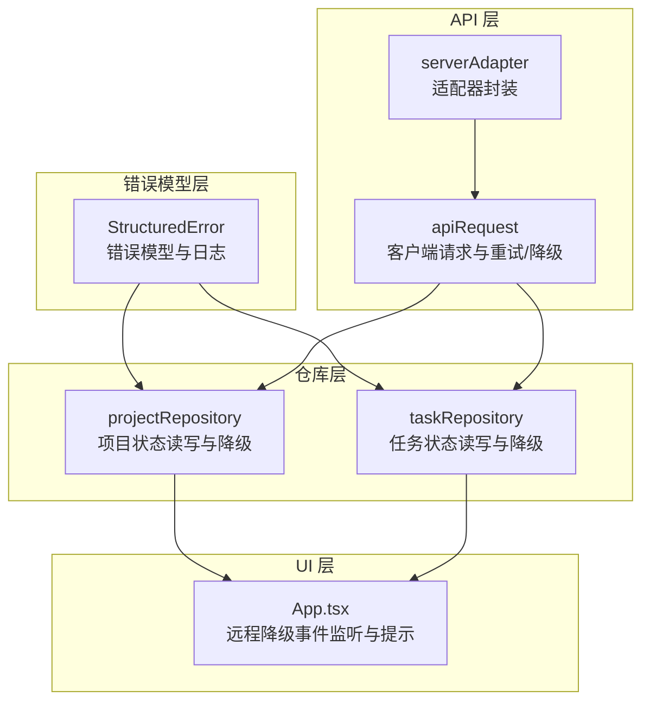
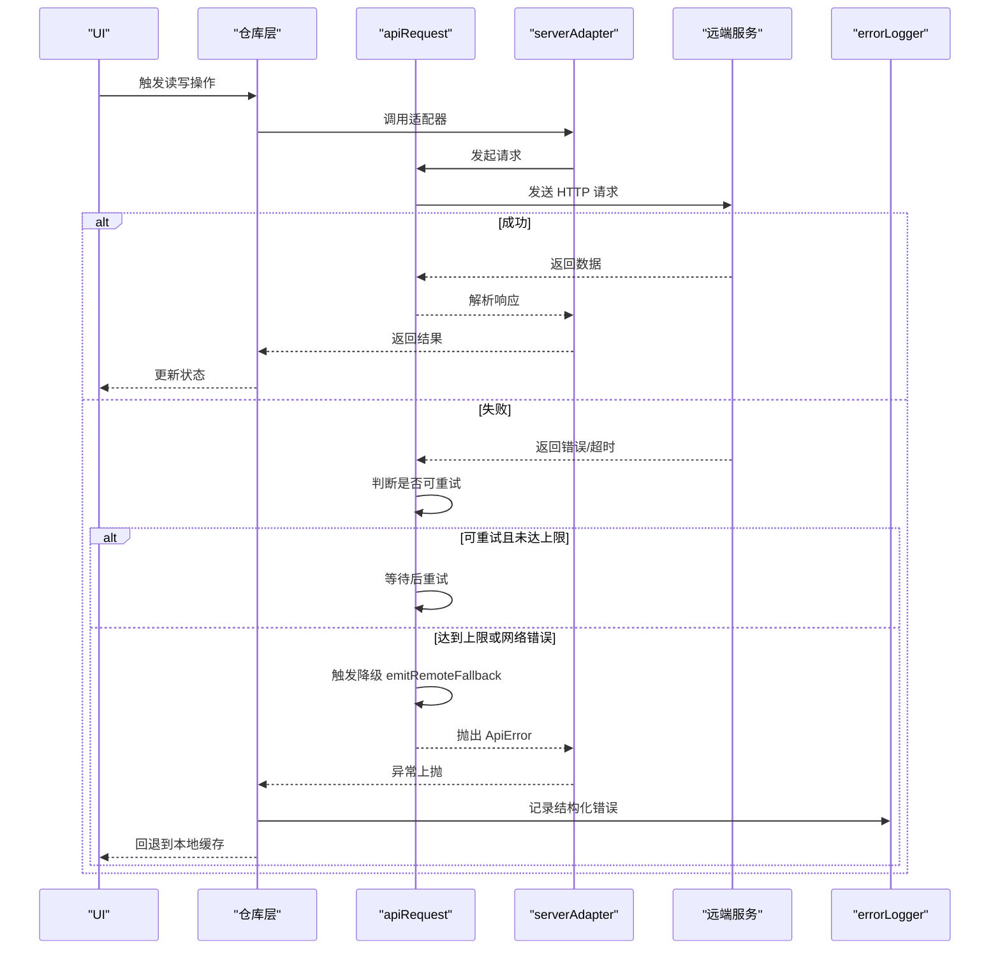
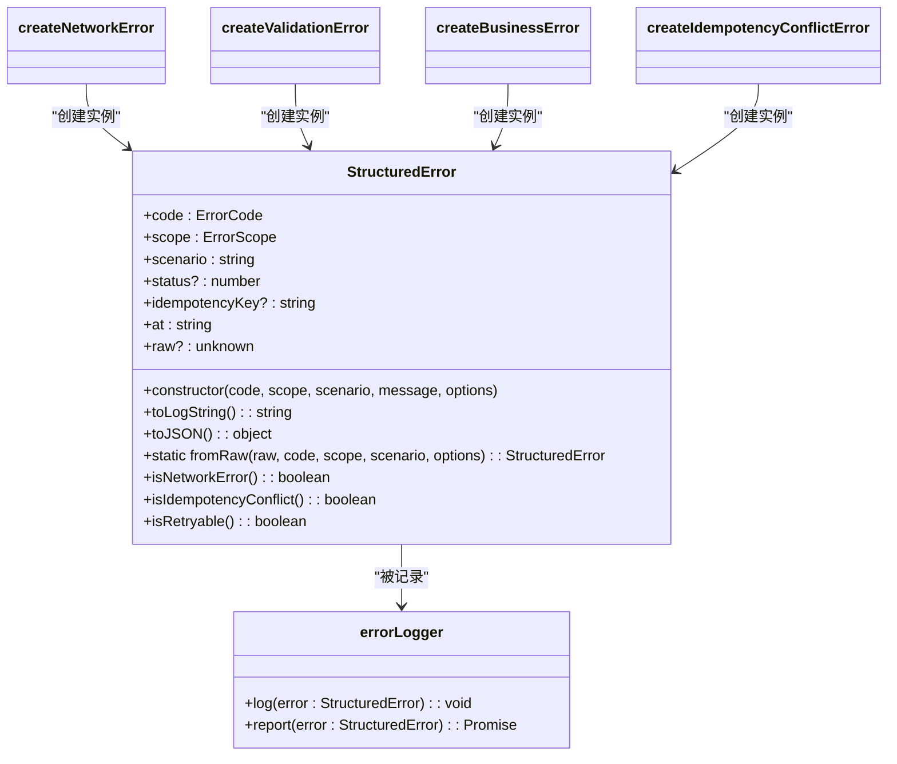
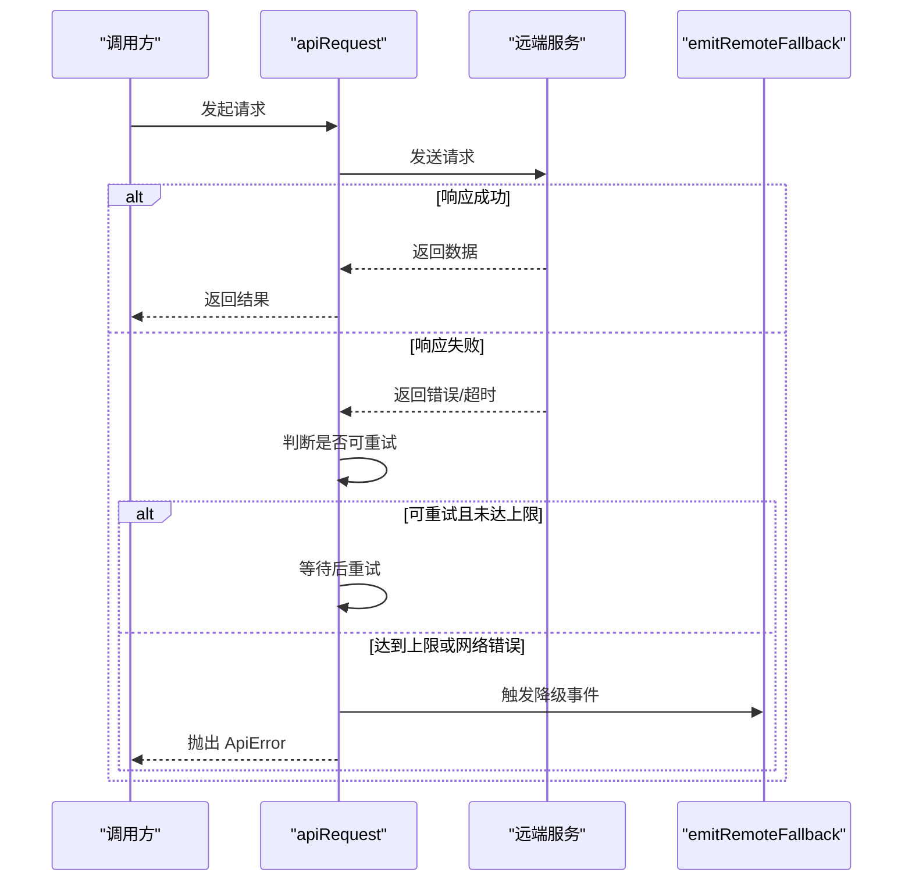
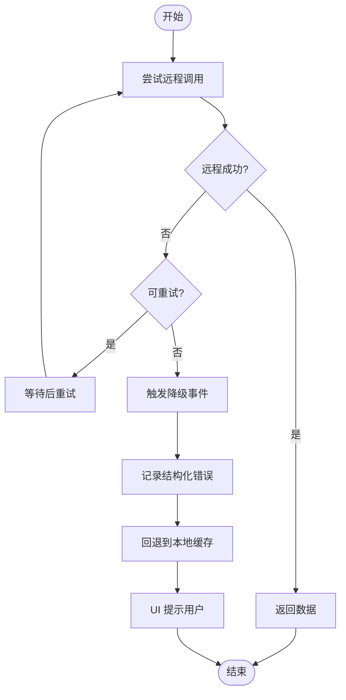
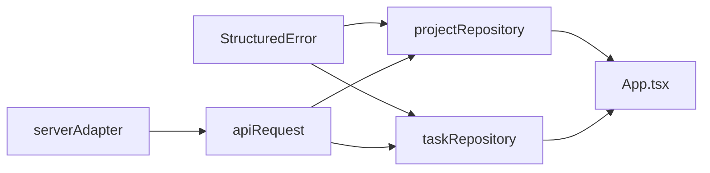

# 错误处理机制

<cite>
**本文引用的文件**
- [StructuredError.ts](file://src/services/errors/StructuredError.ts)
- [client.ts](file://src/services/api/client.ts)
- [serverAdapter.ts](file://src/services/api/serverAdapter.ts)
- [projectRepository.ts](file://src/services/repositories/projectRepository.ts)
- [taskRepository.ts](file://src/services/repositories/taskRepository.ts)
- [errorHandling.test.ts](file://src/services/__tests__/errorHandling.test.ts)
- [App.tsx](file://src/App.tsx)
- [README.md](file://README.md)
</cite>

## 目录

1. [简介](#简介)
2. [项目结构](#项目结构)
3. [核心组件](#核心组件)
4. [架构总览](#架构总览)
5. [详细组件分析](#详细组件分析)
6. [依赖关系分析](#依赖关系分析)
7. [性能考量](#性能考量)
8. [故障排查指南](#故障排查指南)
9. [结论](#结论)
10. [附录](#附录)

## 简介

本文件系统性阐述 CodeBuddy 项目的错误处理机制，重点围绕“结构化错误模型”与“全局错误处理策略”。内容涵盖：

- 结构化错误模型的设计理念、错误分类、错误码定义与信息格式化
- ApiError 类的继承关系与扩展能力（含 toLogString 与错误追踪）
- 全局错误处理策略：异常捕获、错误传播、降级处理
- 不同类型错误的处理方式：网络错误、业务错误、系统错误
- 错误日志记录、监控告警与调试支持
- 实战示例与最佳实践：用户体验优化与故障恢复策略

## 项目结构

错误处理相关代码主要分布在以下模块：

- 错误模型与日志：src/services/errors/StructuredError.ts
- API 客户端与降级：src/services/api/client.ts、src/services/api/serverAdapter.ts
- 仓库层降级与本地回退：src/services/repositories/projectRepository.ts、src/services/repositories/taskRepository.ts
- UI 事件监听与用户提示：src/App.tsx
- 单元测试：src/services/**tests**/errorHandling.test.ts
- 开发指南与回归清单：README.md

图表来源

- [StructuredError.ts:1-195](file://src/services/errors/StructuredError.ts#L1-L195)
- [client.ts:1-171](file://src/services/api/client.ts#L1-L171)
- [serverAdapter.ts:1-87](file://src/services/api/serverAdapter.ts#L1-L87)
- [projectRepository.ts:1-90](file://src/services/repositories/projectRepository.ts#L1-L90)
- [taskRepository.ts:1-200](file://src/services/repositories/taskRepository.ts#L1-L200)
- [App.tsx:366-389](file://src/App.tsx#L366-L389)

章节来源

- [StructuredError.ts:1-195](file://src/services/errors/StructuredError.ts#L1-L195)
- [client.ts:1-171](file://src/services/api/client.ts#L1-L171)
- [serverAdapter.ts:1-87](file://src/services/api/serverAdapter.ts#L1-L87)
- [projectRepository.ts:1-90](file://src/services/repositories/projectRepository.ts#L1-L90)
- [taskRepository.ts:1-200](file://src/services/repositories/taskRepository.ts#L1-L200)
- [App.tsx:366-389](file://src/App.tsx#L366-L389)

## 核心组件

- 结构化错误模型（StructuredError）
  - 设计目标：提供结构化的错误信息，便于排障与监控
  - 关键字段：code、scope、scenario、status、idempotencyKey、at、raw
  - 工具函数：toLogString、toJSON、fromRaw；辅助构造器：网络/验证/业务/幂等冲突错误
  - 日志器：errorLogger.log、errorLogger.report
- ApiError
  - 继承自 Error，包含 status、code 字段
  - toLogString 输出统一格式日志
  - 与 apiRequest 的重试/降级流程紧密配合
- API 客户端与适配器
  - apiRequest：统一的请求入口，内置重试、状态判断、降级触发
  - serverAdapter：对具体接口进行封装，注入幂等键与作用域
- 仓库层降级
  - projectRepository、taskRepository：在远程调用失败时降级到本地缓存
- UI 事件与提示
  - App.tsx 监听 pm:remote-fallback 事件，弹窗提示用户

章节来源

- [StructuredError.ts:27-127](file://src/services/errors/StructuredError.ts#L27-L127)
- [client.ts:13-30](file://src/services/api/client.ts#L13-L30)
- [serverAdapter.ts:34-86](file://src/services/api/serverAdapter.ts#L34-L86)
- [projectRepository.ts:53-89](file://src/services/repositories/projectRepository.ts#L53-L89)
- [taskRepository.ts:141-195](file://src/services/repositories/taskRepository.ts#L141-L195)
- [App.tsx:366-389](file://src/App.tsx#L366-L389)

## 架构总览

整体错误处理链路如下：

- 请求阶段：apiRequest 发起请求，根据响应状态决定重试或抛出 ApiError
- 降级阶段：当网络错误或可重试错误达到上限时，触发 emitRemoteFallback，向 UI 发送 pm:remote-fallback 事件
- 仓库阶段：repository 层在远程失败时回退到本地缓存，并记录结构化错误
- 日志阶段：StructuredError 提供 toLogString 与 toJSON，errorLogger 将错误输出到控制台并预留上报接口
- UI 阶段：App.tsx 监听事件，去重后弹窗提示用户

图表来源

- [client.ts:83-171](file://src/services/api/client.ts#L83-L171)
- [serverAdapter.ts:44-86](file://src/services/api/serverAdapter.ts#L44-L86)
- [projectRepository.ts:53-89](file://src/services/repositories/projectRepository.ts#L53-L89)
- [StructuredError.ts:179-194](file://src/services/errors/StructuredError.ts#L179-L194)

## 详细组件分析

### 结构化错误模型（StructuredError）

- 设计理念
  - 统一错误字段：code、scope、scenario、status、idempotencyKey、at、raw
  - 明确错误分类：网络错误、验证错误、业务错误、幂等冲突、鉴权相关、限流、服务器错误、重试耗尽
  - 可追踪性：toLogString 与 toJSON 提供一致的日志与序列化格式
  - 可扩展性：fromRaw 支持从任意错误源创建结构化错误
- 关键方法
  - toLogString：生成带作用域与场景的日志串，便于快速定位
  - toJSON：标准化 JSON 输出，便于上报与监控
  - fromRaw：从原始错误创建结构化错误，保留原始堆栈与上下文
  - isNetworkError/isIdempotencyConflict/isRetryable：语义化判断，简化分支逻辑
- 辅助构造器
  - createNetworkError/createValidationError/createBusinessError/createIdempotencyConflictError：按领域快速创建错误实例
- 日志器
  - errorLogger.log：控制台输出结构化日志
  - errorLogger.report：预留上报接口，便于接入 Sentry 等平台

图表来源

- [StructuredError.ts:27-194](file://src/services/errors/StructuredError.ts#L27-L194)

章节来源

- [StructuredError.ts:7-127](file://src/services/errors/StructuredError.ts#L7-L127)
- [StructuredError.ts:129-194](file://src/services/errors/StructuredError.ts#L129-L194)

### ApiError 类与 API 客户端

- 继承关系
  - ApiError 继承自 Error，包含 status 与 code 字段，便于区分 HTTP 状态与业务错误码
- 扩展功能
  - toLogString：统一输出格式，包含 scope、code、message、status
- 重试与降级
  - apiRequest 内置重试逻辑，基于状态码集合判断是否可重试
  - 当重试耗尽或网络错误时，调用 emitRemoteFallback 触发 UI 降级提示
  - 抛出 ApiError，携带 HTTP 状态与业务错误码

图表来源

- [client.ts:83-171](file://src/services/api/client.ts#L83-L171)

章节来源

- [client.ts:13-30](file://src/services/api/client.ts#L13-L30)
- [client.ts:83-171](file://src/services/api/client.ts#L83-L171)

### 全局错误处理策略

- 异常捕获
  - 仓库层在远程调用失败时捕获异常，转换为结构化错误并记录日志
  - UI 层通过事件监听捕获降级事件，避免应用崩溃
- 错误传播
  - ApiError 作为统一错误载体向上抛出，便于上层统一处理
  - 结构化错误在各层之间传递，保持上下文一致性
- 降级处理机制
  - 网络错误与可重试错误达到上限时，触发 pm:remote-fallback 事件
  - 仓库层回退到本地缓存，保证用户可用性
  - UI 层去重提示，避免频繁弹窗干扰

图表来源

- [client.ts:83-171](file://src/services/api/client.ts#L83-L171)
- [projectRepository.ts:53-89](file://src/services/repositories/projectRepository.ts#L53-L89)
- [App.tsx:366-389](file://src/App.tsx#L366-L389)

章节来源

- [projectRepository.ts:53-89](file://src/services/repositories/projectRepository.ts#L53-L89)
- [taskRepository.ts:141-195](file://src/services/repositories/taskRepository.ts#L141-L195)
- [App.tsx:366-389](file://src/App.tsx#L366-L389)

### 不同类型错误的处理方式

- 网络错误
  - 表现：请求抛出异常或超时
  - 处理：触发降级事件，回退到本地缓存，UI 提示
  - 识别：StructuredError.isNetworkError 或 ApiError.status 为 0
- 业务错误
  - 表现：远程返回业务错误码或消息
  - 处理：记录结构化错误，UI 展示友好提示
  - 识别：scope 为 domain，或 code 为 BUSINESS_ERROR
- 系统错误
  - 表现：服务器内部错误、限流、重试耗尽
  - 处理：触发降级事件，记录错误，回退本地缓存
  - 识别：status 5xx、code 为 SERVER_ERROR 或 RETRY_EXHAUSTED

章节来源

- [StructuredError.ts:107-126](file://src/services/errors/StructuredError.ts#L107-L126)
- [client.ts:131-171](file://src/services/api/client.ts#L131-L171)
- [projectRepository.ts:65-73](file://src/services/repositories/projectRepository.ts#L65-L73)

### 错误日志记录、监控告警与调试支持

- 日志记录
  - 控制台输出：errorLogger.log 输出 toLogString 与 JSON
  - 结构化字段：code、scope、scenario、status、idempotencyKey、at、raw
- 监控告警
  - 保留上报接口：errorLogger.report 为接入 Sentry 等平台预留
  - 事件驱动：pm:remote-fallback 事件可用于前端埋点与告警
- 调试支持
  - toLogString 提供可复制的上下文串
  - fromRaw 保留原始错误，便于堆栈分析

章节来源

- [StructuredError.ts:54-88](file://src/services/errors/StructuredError.ts#L54-L88)
- [StructuredError.ts:179-194](file://src/services/errors/StructuredError.ts#L179-L194)
- [client.ts:54-81](file://src/services/api/client.ts#L54-L81)

### 错误处理示例与最佳实践

- 示例路径
  - 创建网络错误：[createNetworkError:132-138](file://src/services/errors/StructuredError.ts#L132-L138)
  - 创建业务错误：[createBusinessError:154-160](file://src/services/errors/StructuredError.ts#L154-L160)
  - 从原始错误创建结构化错误：[StructuredError.fromRaw:93-105](file://src/services/errors/StructuredError.ts#L93-L105)
  - API 请求与降级：[apiRequest:83-171](file://src/services/api/client.ts#L83-L171)
  - 仓库层降级到本地缓存：[projectRepository.loadState/saveState:53-89](file://src/services/repositories/projectRepository.ts#L53-L89)
- 最佳实践
  - 使用 StructuredError 创建结构化错误，统一日志格式
  - 调用 errorLogger.log 记录日志，必要时上报
  - 在 repository 层降级到本地缓存，保证用户体验
  - 触发 pm:remote-fallback 事件通知 UI，避免用户困惑
  - 对幂等冲突使用 idempotencyKey，避免重复提交

章节来源

- [errorHandling.test.ts:35-127](file://src/services/__tests__/errorHandling.test.ts#L35-L127)
- [README.md:293-299](file://README.md#L293-L299)

## 依赖关系分析

- 模块耦合
  - StructuredError 与 errorLogger 被多处复用，形成稳定的错误基础设施
  - apiRequest 与 serverAdapter 形成清晰的边界：前者负责重试与降级，后者负责接口封装
  - 仓库层依赖 serverAdapter 与 StructuredError，实现远程失败时的本地回退
  - UI 通过事件监听与降级流程解耦，降低耦合度
- 外部依赖
  - fetch 作为底层网络请求
  - localStorage 作为本地缓存介质
  - CustomEvent 作为跨模块通信手段

图表来源

- [StructuredError.ts:1-195](file://src/services/errors/StructuredError.ts#L1-L195)
- [client.ts:1-171](file://src/services/api/client.ts#L1-L171)
- [serverAdapter.ts:1-87](file://src/services/api/serverAdapter.ts#L1-L87)
- [projectRepository.ts:1-90](file://src/services/repositories/projectRepository.ts#L1-L90)
- [taskRepository.ts:1-200](file://src/services/repositories/taskRepository.ts#L1-L200)
- [App.tsx:366-389](file://src/App.tsx#L366-L389)

章节来源

- [client.ts:1-171](file://src/services/api/client.ts#L1-L171)
- [serverAdapter.ts:1-87](file://src/services/api/serverAdapter.ts#L1-L87)
- [projectRepository.ts:1-90](file://src/services/repositories/projectRepository.ts#L1-L90)
- [taskRepository.ts:1-200](file://src/services/repositories/taskRepository.ts#L1-L200)

## 性能考量

- 重试策略
  - 指数退避等待，避免对远端造成压力
  - 仅对可重试状态码进行重试，减少无效请求
- 本地缓存
  - 降级时优先使用本地缓存，降低首屏与交互延迟
  - 本地存储读写失败时，采用兜底策略，避免阻塞主线程
- UI 去重提示
  - 通过指纹与时间戳去重，避免频繁弹窗影响体验

[本节为通用建议，无需特定文件引用]

## 故障排查指南

- 快速定位
  - 查看控制台日志中的 toLogString 输出，确认 scope、scenario、status、idempotencyKey
  - 检查 JSON 输出，核对 at 时间与 raw 原始错误
- 常见问题
  - 网络错误：检查 BASE_URL、环境变量、网络连通性
  - 幂等冲突：确认 idempotencyKey 是否正确生成与传递
  - 重试耗尽：查看重试次数与状态码集合，评估是否需要放宽策略
- 调试步骤
  - 在 apiRequest 中增加更详细的日志上下文
  - 在仓库层记录本地缓存读写失败的结构化错误
  - 在 UI 层记录降级事件的去重指纹，避免重复提示

章节来源

- [StructuredError.ts:54-88](file://src/services/errors/StructuredError.ts#L54-L88)
- [client.ts:104-121](file://src/services/api/client.ts#L104-L121)
- [projectRepository.ts:26-37](file://src/services/repositories/projectRepository.ts#L26-L37)

## 结论

CodeBuddy 的错误处理机制以“结构化错误模型”为核心，结合 API 客户端的重试与降级、仓库层的本地回退以及 UI 的事件提示，形成了完整的错误处理闭环。该体系具备良好的可追踪性、可扩展性与用户体验保障，适合在复杂前端应用中推广使用。

[本节为总结性内容，无需特定文件引用]

## 附录

- 错误码与作用域定义参考
  - 错误码：NETWORK_ERROR、VALIDATION_ERROR、BUSINESS_ERROR、IDEMPOTENCY_CONFLICT、UNAUTHORIZED、FORBIDDEN、NOT_FOUND、RATE_LIMIT_EXCEEDED、SERVER_ERROR、RETRY_EXHAUSTED
  - 作用域：api、repository、domain、ui
- 相关测试参考
  - 结构化错误创建与日志格式化测试：[errorHandling.test.ts:35-127](file://src/services/__tests__/errorHandling.test.ts#L35-L127)

章节来源

- [StructuredError.ts:7-19](file://src/services/errors/StructuredError.ts#L7-L19)
- [errorHandling.test.ts:35-127](file://src/services/__tests__/errorHandling.test.ts#L35-L127)
