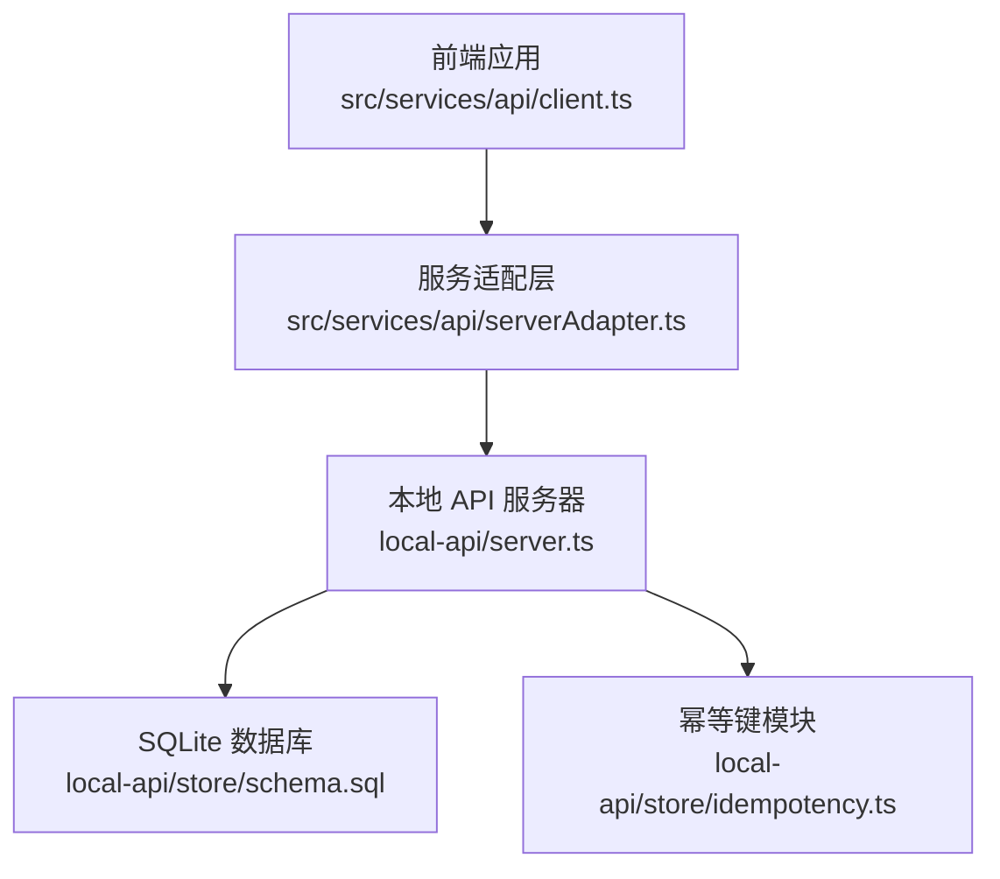
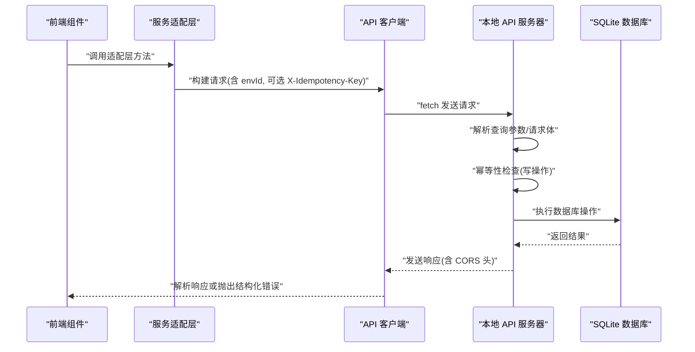
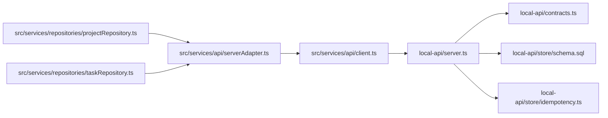
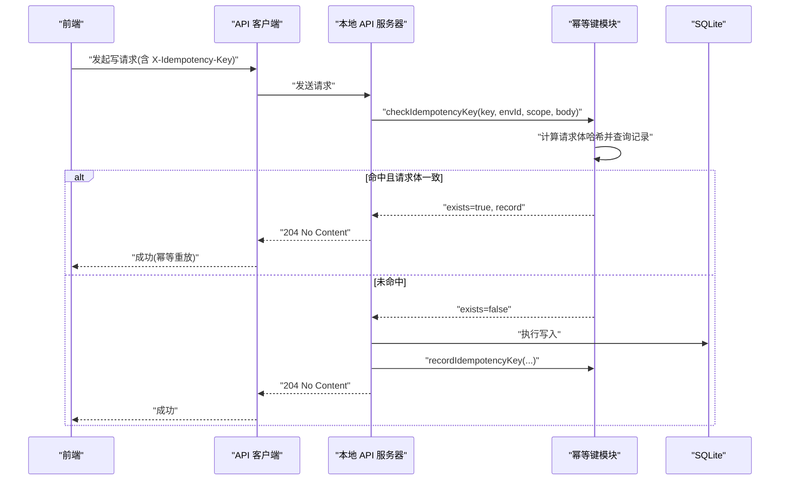

# API端点参考

<cite>
**本文引用的文件**
- [local-api/server.ts](file://local-api/server.ts)
- [local-api/contracts.ts](file://local-api/contracts.ts)
- [local-api/store/idempotency.ts](file://local-api/store/idempotency.ts)
- [local-api/store/schema.sql](file://local-api/store/schema.sql)
- [src/services/api/client.ts](file://src/services/api/client.ts)
- [src/services/api/serverAdapter.ts](file://src/services/api/serverAdapter.ts)
- [src/services/repositories/projectRepository.ts](file://src/services/repositories/projectRepository.ts)
- [src/services/repositories/taskRepository.ts](file://src/services/repositories/taskRepository.ts)
- [local-api/test-api.sh](file://local-api/test-api.sh)
</cite>

## 目录

1. [简介](#简介)
2. [项目结构](#项目结构)
3. [核心组件](#核心组件)
4. [架构总览](#架构总览)
5. [详细端点规范](#详细端点规范)
6. [依赖关系分析](#依赖关系分析)
7. [性能考量](#性能考量)
8. [故障排查指南](#故障排查指南)
9. [结论](#结论)
10. [附录](#附录)

## 简介

本文件为 CodeBuddy 项目的本地 API 端点参考，覆盖以下五个核心 RESTful 接口：

- 项目状态接口：/api/projects/state
- 任务状态接口：/api/tasks/state
- 验收状态接口：/api/acceptance/state
- 结算状态接口：/api/settlement/state
- 审计日志接口：/api/audit/logs

文档面向前端开发者，提供每个端点的完整规格说明（HTTP 方法、URL 路径、查询参数、请求头、请求体格式、响应格式）、错误响应格式、幂等性保障（X-Idempotency-Key）以及调用示例与最佳实践。

## 项目结构

本地 API 采用 Node.js HTTP 服务器实现，路由前缀为 /api，支持跨域预检，并对写操作提供幂等性保障。前端通过统一的 API 客户端封装进行调用，自动注入 Content-Type 和 X-Idempotency-Key 头部。

图表来源

- [local-api/server.ts:338-386](file://local-api/server.ts#L338-L386)
- [src/services/api/client.ts:83-171](file://src/services/api/client.ts#L83-L171)
- [src/services/api/serverAdapter.ts:34-86](file://src/services/api/serverAdapter.ts#L34-L86)
- [local-api/store/schema.sql:1-72](file://local-api/store/schema.sql#L1-L72)
- [local-api/store/idempotency.ts:23-86](file://local-api/store/idempotency.ts#L23-L86)

章节来源

- [local-api/server.ts:18-19](file://local-api/server.ts#L18-L19)
- [src/services/api/client.ts:50](file://src/services/api/client.ts#L50)

## 核心组件

- 本地 API 服务器：负责路由分发、CORS 预检、请求解析、响应发送、错误处理与幂等性检查。
- 类型契约：定义各端点请求/响应的数据结构与错误响应格式。
- 幂等键模块：基于请求体哈希与键值记录实现写请求去重与重放一致性。
- SQLite 模式：定义项目、任务、验收、结算、审计日志与幂等键表结构及索引。
- 前端客户端：统一封装 fetch 请求、重试策略、头部构建与错误降级事件派发。
- 服务适配层：在请求路径上附加 envId 查询参数，生成幂等键并调用统一客户端。

章节来源

- [local-api/contracts.ts:13-89](file://local-api/contracts.ts#L13-L89)
- [local-api/store/idempotency.ts:10-100](file://local-api/store/idempotency.ts#L10-L100)
- [local-api/store/schema.sql:4-72](file://local-api/store/schema.sql#L4-L72)
- [src/services/api/client.ts:37-48](file://src/services/api/client.ts#L37-L48)
- [src/services/api/serverAdapter.ts:34-86](file://src/services/api/serverAdapter.ts#L34-L86)

## 架构总览

下图展示从前端到本地 API 的典型调用链路，包括幂等性保障与错误降级机制。

图表来源

- [src/services/api/serverAdapter.ts:34-86](file://src/services/api/serverAdapter.ts#L34-L86)
- [src/services/api/client.ts:83-171](file://src/services/api/client.ts#L83-L171)
- [local-api/server.ts:338-386](file://local-api/server.ts#L338-L386)
- [local-api/store/idempotency.ts:23-86](file://local-api/store/idempotency.ts#L23-L86)

## 详细端点规范

### 通用约定

- 基础路径：/api
- 默认环境标识：envId（若未提供，默认为 default）
- 请求头：
  - Content-Type: application/json
  - X-Idempotency-Key: 仅在需要幂等性的写操作中使用
- 响应头：默认包含 Access-Control-Allow-Origin、Access-Control-Allow-Methods、Access-Control-Allow-Headers（含 X-Idempotency-Key）

章节来源

- [local-api/server.ts:45-66](file://local-api/server.ts#L45-L66)
- [src/services/api/client.ts:37-48](file://src/services/api/client.ts#L37-L48)

### 项目状态接口

- 路径：/api/projects/state
- 方法：GET、PUT
- 查询参数：
  - envId: 字符串（可选；默认 default）
- 请求头：
  - Content-Type: application/json（PUT）
  - X-Idempotency-Key: 字符串（可选；用于幂等性）
- 请求体（PUT）：
  - projects: ProjectItem[]（数组）
  - logs: Record<string, ProjectStatusLogEntry[]>（对象映射）
- 成功响应（GET）：
  - projects: ProjectItem[]（数组）
  - logs: Record<string, ProjectStatusLogEntry[]>（对象映射）
  - 若无记录，返回空数组与空对象
- 成功响应（PUT）：
  - 204 No Content
- 错误响应：
  - 400 INVALID_REQUEST（请求体无效）
  - 405 METHOD_NOT_ALLOWED（方法不允许）
  - 500 SERVER_ERROR（服务器内部错误）
- 幂等性：
  - PUT 使用 X-Idempotency-Key 进行幂等检查；命中则返回 204（无内容），不重复写入
- 示例（测试脚本）：
  - GET /api/projects/state?envId={ENV_ID}
  - PUT /api/projects/state?envId={ENV_ID}（携带 X-Idempotency-Key 与 JSON 请求体）
  - 幂等重放（相同键与请求体）返回 204

章节来源

- [local-api/server.ts:70-129](file://local-api/server.ts#L70-L129)
- [local-api/contracts.ts:13-16](file://local-api/contracts.ts#L13-L16)
- [local-api/store/schema.sql:4-11](file://local-api/store/schema.sql#L4-L11)
- [local-api/store/idempotency.ts:23-86](file://local-api/store/idempotency.ts#L23-L86)
- [local-api/test-api.sh:21-65](file://local-api/test-api.sh#L21-L65)

### 任务状态接口

- 路径：/api/tasks/state
- 方法：GET、PUT
- 查询参数：
  - envId: 字符串（可选；默认 default）
  - contextKey: 字符串（可选；默认 default）
- 请求头：
  - Content-Type: application/json（PUT）
  - X-Idempotency-Key: 字符串（可选；用于幂等性）
- 请求体（PUT）：
  - schemaVersion: number（可选）
  - tasks: TaskItem[]（数组）
- 成功响应（GET）：
  - tasks: TaskItem[]（数组）
  - 若无记录，返回空数组
- 成功响应（PUT）：
  - 204 No Content
- 校验规则（PUT）：
  - 服务端对请求体进行有效性校验；校验失败返回 400 INVALID_TASK_SNAPSHOT
- 错误响应：
  - 400 INVALID_REQUEST（请求体无效）
  - 400 INVALID_TASK_SNAPSHOT（任务快照校验失败）
  - 405 METHOD_NOT_ALLOWED（方法不允许）
  - 500 SERVER_ERROR（服务器内部错误）
- 幂等性：
  - PUT 使用 X-Idempotency-Key 进行幂等检查；命中则返回 204（无内容）
- 示例（测试脚本）：
  - GET /api/tasks/state?contextKey=project-P001&envId={ENV_ID}
  - PUT /api/tasks/state?contextKey=project-P001&envId={ENV_ID}（携带 X-Idempotency-Key 与 JSON 请求体）

章节来源

- [local-api/server.ts:131-197](file://local-api/server.ts#L131-L197)
- [local-api/contracts.ts:20-23](file://local-api/contracts.ts#L20-L23)
- [local-api/store/schema.sql:13-21](file://local-api/store/schema.sql#L13-L21)
- [local-api/store/idempotency.ts:23-86](file://local-api/store/idempotency.ts#L23-L86)
- [local-api/test-api.sh:68-92](file://local-api/test-api.sh#L68-L92)

### 验收状态接口

- 路径：/api/acceptance/state
- 方法：GET、PUT
- 查询参数：
  - envId: 字符串（可选；默认 default）
  - projectCode: 字符串（可选；默认 default）
- 请求头：
  - Content-Type: application/json（PUT）
  - X-Idempotency-Key: 字符串（可选；用于幂等性）
- 请求体（PUT）：
  - nodes: Record<string, unknown>[]（数组）
  - milestones: Record<string, unknown>[]（数组）
  - summary?: AcceptanceMilestoneSyncPayload（可选）
- 成功响应（GET）：
  - nodes: Record<string, unknown>[]（数组）
  - milestones: Record<string, unknown>[]（数组）
  - 若无记录，返回空数组
- 成功响应（PUT）：
  - 204 No Content
- 错误响应：
  - 400 INVALID_REQUEST（请求体无效）
  - 405 METHOD_NOT_ALLOWED（方法不允许）
  - 500 SERVER_ERROR（服务器内部错误）
- 幂等性：
  - PUT 使用 X-Idempotency-Key 进行幂等检查；命中则返回 204（无内容）
- 示例（测试脚本）：
  - GET /api/acceptance/state?projectCode=P001&envId={ENV_ID}
  - PUT /api/acceptance/state?projectCode=P001&envId={ENV_ID}（携带 X-Idempotency-Key 与 JSON 请求体）

章节来源

- [local-api/server.ts:199-259](file://local-api/server.ts#L199-L259)
- [local-api/contracts.ts:27-31](file://local-api/contracts.ts#L27-L31)
- [local-api/store/schema.sql:23-31](file://local-api/store/schema.sql#L23-L31)
- [local-api/store/idempotency.ts:23-86](file://local-api/store/idempotency.ts#L23-L86)
- [local-api/test-api.sh:95-117](file://local-api/test-api.sh#L95-L117)

### 结算状态接口

- 路径：/api/settlement/state
- 方法：GET
- 查询参数：
  - envId: 字符串（可选；默认 default）
- 请求头：无特殊要求
- 成功响应（GET）：
  - suggestions: SettlementSuggestion[]（数组）
  - SettlementSuggestion 包含 code、name、budget、acceptanceStatus
  - 若无记录，返回空数组
- 错误响应：
  - 405 METHOD_NOT_ALLOWED（方法不允许）
  - 500 SERVER_ERROR（服务器内部错误）
- 示例（测试脚本）：
  - GET /api/settlement/state?envId={ENV_ID}

章节来源

- [local-api/server.ts:261-280](file://local-api/server.ts#L261-L280)
- [local-api/contracts.ts:35-44](file://local-api/contracts.ts#L35-L44)
- [local-api/store/schema.sql:33-40](file://local-api/store/schema.sql#L33-L40)
- [local-api/test-api.sh:119-123](file://local-api/test-api.sh#L119-L123)

### 审计日志接口

- 路径：/api/audit/logs
- 方法：POST
- 查询参数：
  - envId: 字符串（可选；默认 default）
- 请求头：
  - Content-Type: application/json
  - X-Idempotency-Key: 字符串（可选；用于幂等性）
- 请求体（POST）：
  - scene: string（场景）
  - detail: string（详情）
  - projectCode?: string（可选；项目编码）
  - at: string（ISO 8601 时间戳）
- 成功响应：
  - 204 No Content
- 错误响应：
  - 400 INVALID_REQUEST（请求体无效）
  - 405 METHOD_NOT_ALLOWED（方法不允许）
  - 500 SERVER_ERROR（服务器内部错误）
- 幂等性：
  - POST 使用 X-Idempotency-Key 进行幂等检查；命中则返回 204（无内容）
- 示例（测试脚本）：
  - POST /api/audit/logs?envId={ENV_ID}（携带 X-Idempotency-Key 与 JSON 请求体）
  - 幂等重放（相同键与请求体）返回 204

章节来源

- [local-api/server.ts:282-329](file://local-api/server.ts#L282-L329)
- [local-api/contracts.ts:48-58](file://local-api/contracts.ts#L48-L58)
- [local-api/store/schema.sql:42-56](file://local-api/store/schema.sql#L42-L56)
- [local-api/store/idempotency.ts:23-86](file://local-api/store/idempotency.ts#L23-L86)
- [local-api/test-api.sh:125-151](file://local-api/test-api.sh#L125-L151)

## 依赖关系分析

图表来源

- [local-api/server.ts:10-16](file://local-api/server.ts#L10-L16)
- [src/services/api/serverAdapter.ts:1-5](file://src/services/api/serverAdapter.ts#L1-L5)
- [src/services/repositories/projectRepository.ts:1-4](file://src/services/repositories/projectRepository.ts#L1-L4)
- [src/services/repositories/taskRepository.ts:1-3](file://src/services/repositories/taskRepository.ts#L1-L3)

章节来源

- [local-api/server.ts:10-16](file://local-api/server.ts#L10-L16)
- [src/services/api/serverAdapter.ts:1-5](file://src/services/api/serverAdapter.ts#L1-L5)
- [src/services/repositories/projectRepository.ts:1-4](file://src/services/repositories/projectRepository.ts#L1-L4)
- [src/services/repositories/taskRepository.ts:1-3](file://src/services/repositories/taskRepository.ts#L1-L3)

## 性能考量

- 幂等键 TTL：幂等记录保留 7 天，避免长期占用存储空间。
- 并发写入：幂等键模块在记录时忽略“键已存在”的异常，降低并发冲突开销。
- 重试策略：前端客户端对可重试状态码进行指数退避重试，提升稳定性。
- 索引优化：审计日志表按 env_id、project_code、scene 建有索引，有利于查询与统计。

章节来源

- [local-api/store/idempotency.ts:10](file://local-api/store/idempotency.ts#L10)
- [src/services/api/client.ts:32-35](file://src/services/api/client.ts#L32-L35)
- [local-api/store/schema.sql:53-56](file://local-api/store/schema.sql#L53-L56)

## 故障排查指南

- 统一错误响应格式
  - 字段：message（字符串）、code（字符串）、status（数字）、timestamp（ISO 8601）
  - 生成：服务端统一构造错误响应
- 前端错误处理
  - 客户端解析响应体中的 message/code，结合 HTTP 状态码决定是否重试
  - 对可重试状态码进行有限次重试；重试耗尽后触发“远程降级”事件
- 常见错误码
  - INVALID_REQUEST：请求体 JSON 无效或格式不符
  - INVALID_TASK_SNAPSHOT：任务状态快照校验失败
  - METHOD_NOT_ALLOWED：请求方法不被允许
  - NOT_FOUND：路由不存在
  - NETWORK_ERROR：网络不可用，触发本地兜底
  - RETRY_EXHAUSTED：重试次数耗尽
- 调试建议
  - 打开浏览器控制台查看网络请求与错误日志
  - 在本地 API 服务端查看幂等键命中与请求体哈希比对日志
  - 使用提供的测试脚本验证各端点行为

章节来源

- [local-api/contracts.ts:74-89](file://local-api/contracts.ts#L74-L89)
- [src/services/api/client.ts:134-158](file://src/services/api/client.ts#L134-L158)
- [local-api/server.ts:64-66](file://local-api/server.ts#L64-L66)

## 结论

本文档提供了 CodeBuddy 本地 API 五个核心端点的完整规范与调用指南。通过统一的契约、幂等性保障与前端客户端封装，开发者可以稳定地集成项目状态、任务状态、验收状态、结算状态与审计日志能力。建议在生产环境中为写操作始终提供 X-Idempotency-Key，并遵循重试与降级策略以提升用户体验与系统韧性。

## 附录

### 幂等性工作流（序列图）

图表来源

- [local-api/server.ts:86-125](file://local-api/server.ts#L86-L125)
- [local-api/server.ts:148-193](file://local-api/server.ts#L148-L193)
- [local-api/server.ts:216-255](file://local-api/server.ts#L216-L255)
- [local-api/server.ts:288-325](file://local-api/server.ts#L288-L325)
- [local-api/store/idempotency.ts:23-86](file://local-api/store/idempotency.ts#L23-L86)

### 前端调用最佳实践

- 生成幂等键
  - 使用服务适配层提供的 createIdempotencyKey(scope, target?) 生成唯一键
  - PUT/POST 请求务必携带 X-Idempotency-Key
- 环境标识
  - 服务适配层会自动附加 envId 查询参数；确保 VITE_TCB_ENV_ID 或默认值正确
- 错误处理
  - 捕获 ApiError 并根据 code 与 status 决定用户提示与重试策略
  - 对 NETWORK_ERROR、RETRY_EXHAUSTED 等进行本地降级处理
- 本地持久化
  - 仓库层在远程失败时回退到本地缓存；保存成功后再同步远程

章节来源

- [src/services/api/serverAdapter.ts:38-42](file://src/services/api/serverAdapter.ts#L38-L42)
- [src/services/api/serverAdapter.ts:70-86](file://src/services/api/serverAdapter.ts#L70-L86)
- [src/services/api/client.ts:32-35](file://src/services/api/client.ts#L32-L35)
- [src/services/repositories/projectRepository.ts:54-88](file://src/services/repositories/projectRepository.ts#L54-L88)
- [src/services/repositories/taskRepository.ts:154-195](file://src/services/repositories/taskRepository.ts#L154-L195)
