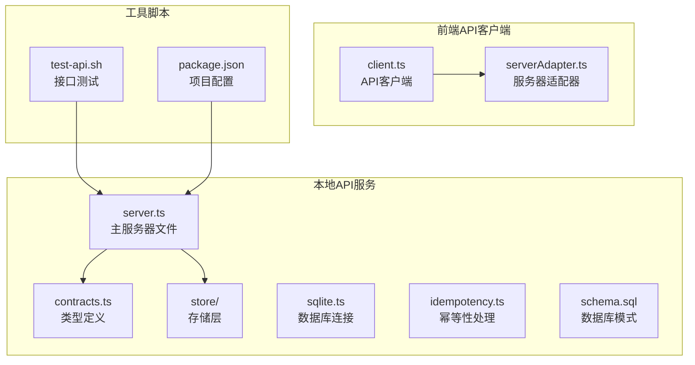
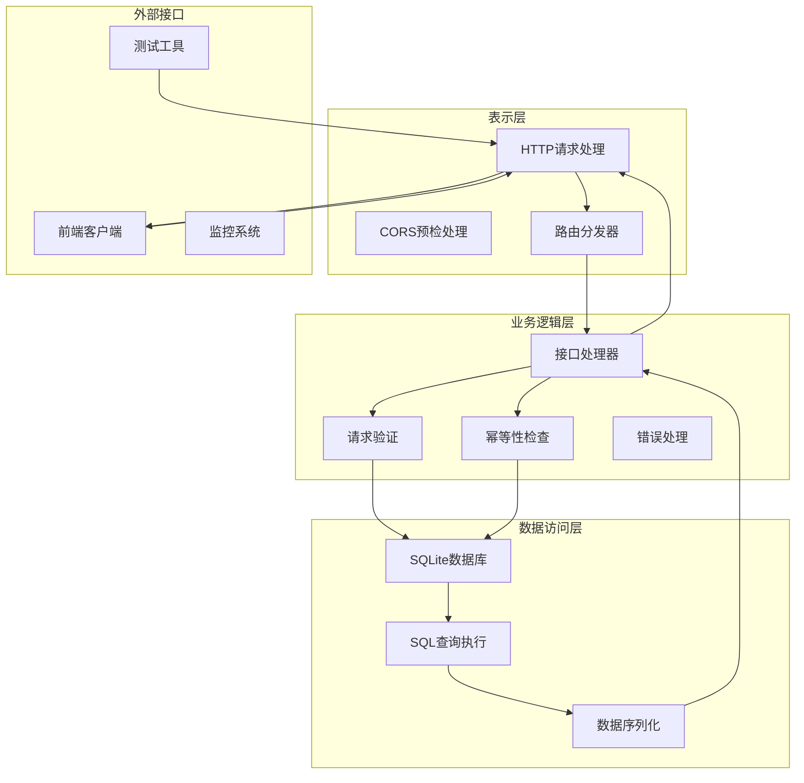
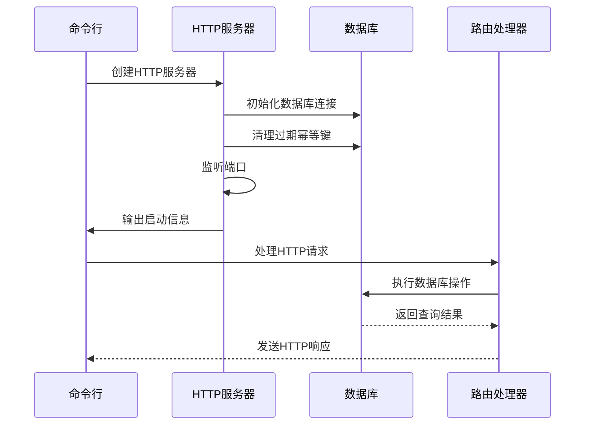
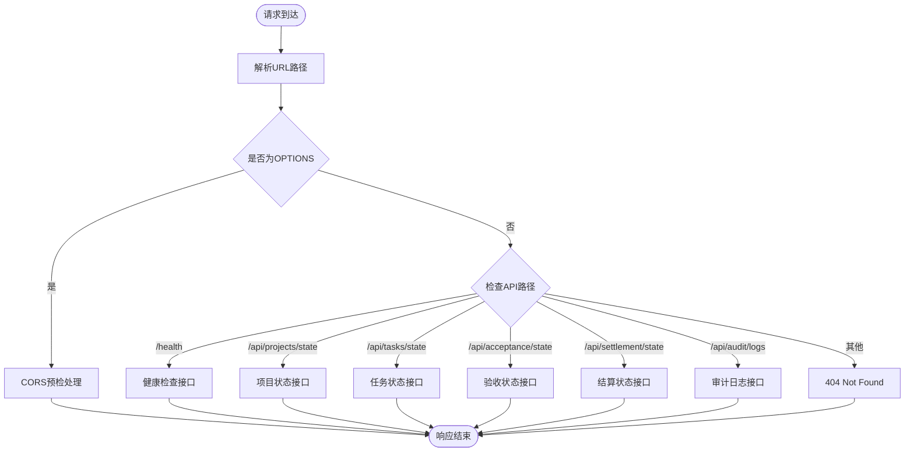
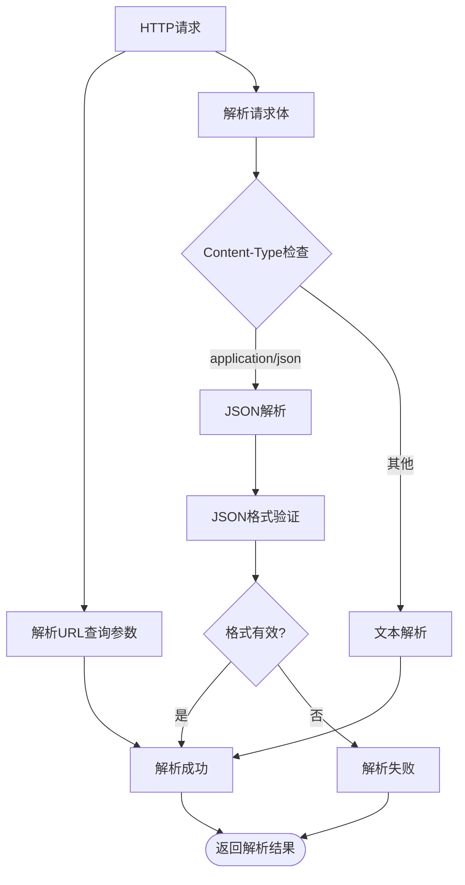
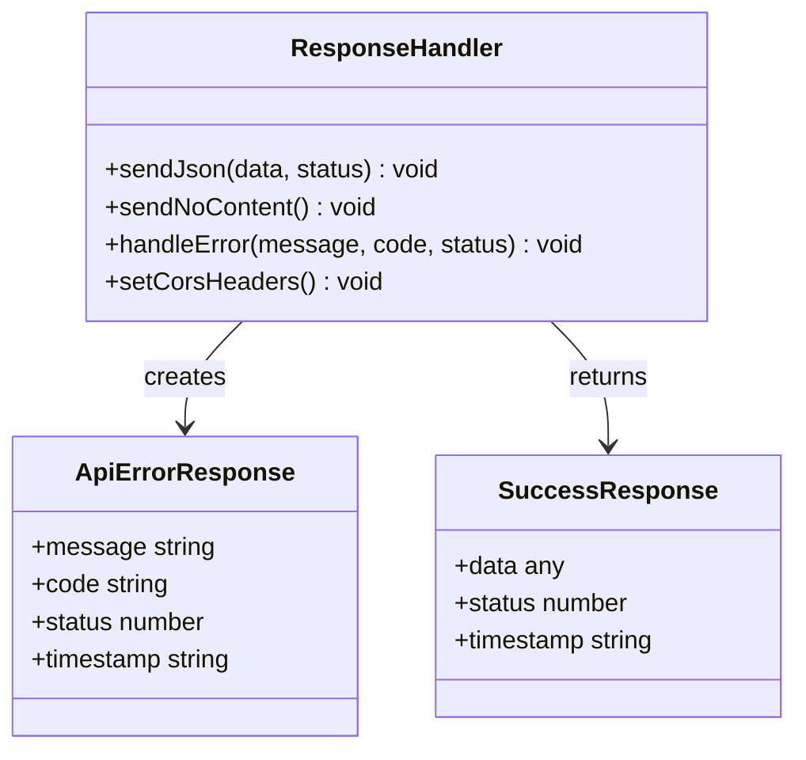
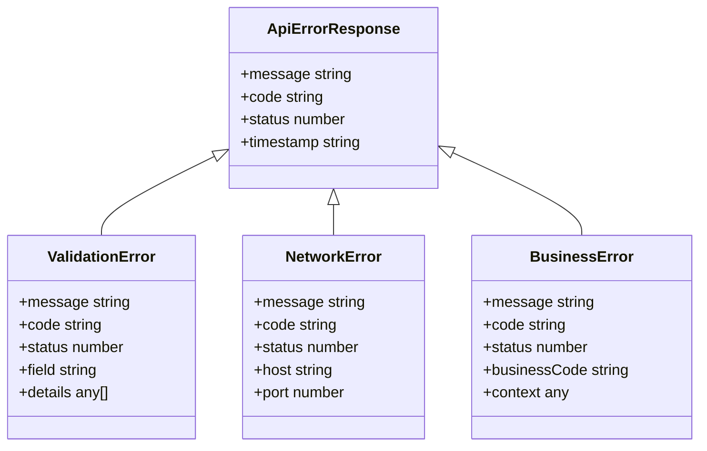
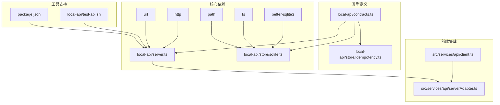

# HTTP服务器架构

<cite>
**本文档引用的文件**
- [local-api/server.ts](file://local-api/server.ts)
- [local-api/contracts.ts](file://local-api/contracts.ts)
- [local-api/store/sqlite.ts](file://local-api/store/sqlite.ts)
- [local-api/store/idempotency.ts](file://local-api/store/idempotency.ts)
- [local-api/store/schema.sql](file://local-api/store/schema.sql)
- [src/services/api/client.ts](file://src/services/api/client.ts)
- [src/services/api/serverAdapter.ts](file://src/services/api/serverAdapter.ts)
- [local-api/test-api.sh](file://local-api/test-api.sh)
- [package.json](file://package.json)
- [local-api/README.md](file://local-api/README.md)
</cite>

## 目录

1. [简介](#简介)
2. [项目结构](#项目结构)
3. [核心组件](#核心组件)
4. [架构概览](#架构概览)
5. [详细组件分析](#详细组件分析)
6. [依赖关系分析](#依赖关系分析)
7. [性能考虑](#性能考虑)
8. [故障排除指南](#故障排除指南)
9. [结论](#结论)

## 简介

CodeBuddy项目的HTTP服务器架构基于Node.js原生HTTP模块构建，提供五个核心业务接口用于项目状态管理、任务状态跟踪、验收状态监控、结算状态查询和审计日志记录。该架构采用RESTful API设计原则，实现了完整的CORS跨域处理、幂等性保证和优雅的错误处理机制。

## 项目结构

项目采用模块化组织方式，核心HTTP服务器位于`local-api`目录下，前端API客户端位于`src/services/api`目录中：



**图表来源**

- [local-api/server.ts:1-414](file://local-api/server.ts#L1-L414)
- [src/services/api/client.ts:1-172](file://src/services/api/client.ts#L1-L172)

**章节来源**

- [local-api/server.ts:1-414](file://local-api/server.ts#L1-L414)
- [src/services/api/serverAdapter.ts:1-87](file://src/services/api/serverAdapter.ts#L1-L87)

## 核心组件

### HTTP服务器核心

服务器基于Node.js原生HTTP模块创建，支持以下核心功能：

- **端口配置**：默认端口3100，可通过环境变量LOCAL_API_PORT自定义
- **路由分发**：统一的路由处理器，支持RESTful API路径映射
- **CORS处理**：完整的跨域资源共享支持
- **中间件处理**：请求解析、错误处理和响应格式化

### 数据存储层

采用SQLite数据库作为持久化存储，支持：

- **事务处理**：使用WAL模式提升并发性能
- **索引优化**：为常用查询字段建立索引
- **数据清理**：自动清理过期的幂等键记录

### 幂等性保证

实现完整的幂等性机制，确保重复请求的一致性：

- **请求指纹**：基于SHA-256哈希算法生成请求标识
- **有效期管理**：幂等键有效期7天
- **冲突检测**：防止相同键的重复处理

**章节来源**

- [local-api/server.ts:18-414](file://local-api/server.ts#L18-L414)
- [local-api/store/sqlite.ts:1-99](file://local-api/store/sqlite.ts#L1-L99)
- [local-api/store/idempotency.ts:1-100](file://local-api/store/idempotency.ts#L1-L100)

## 架构概览

系统采用分层架构设计，清晰分离了表示层、业务逻辑层和数据访问层：



**图表来源**

- [local-api/server.ts:338-386](file://local-api/server.ts#L338-L386)
- [local-api/store/sqlite.ts:18-42](file://local-api/store/sqlite.ts#L18-L42)

## 详细组件分析

### HTTP服务器创建与启动

服务器使用Node.js原生HTTP模块创建，支持优雅关闭和信号处理：



**图表来源**

- [local-api/server.ts:390-414](file://local-api/server.ts#L390-L414)
- [local-api/store/sqlite.ts:18-42](file://local-api/store/sqlite.ts#L18-L42)

### 路由分发机制

统一的路由处理器支持RESTful API路径映射和CORS预检处理：



**图表来源**

- [local-api/server.ts:338-386](file://local-api/server.ts#L338-L386)

### 请求解析流程

服务器实现了完整的请求解析机制，支持多种数据格式：



**图表来源**

- [local-api/server.ts:23-43](file://local-api/server.ts#L23-L43)

### 响应处理机制

统一的响应处理器支持多种HTTP状态码和CORS头设置：



**图表来源**

- [local-api/server.ts:45-66](file://local-api/server.ts#L45-L66)
- [local-api/contracts.ts:72-89](file://local-api/contracts.ts#L72-L89)

### CORS跨域处理机制

完整的CORS支持包括预检请求处理和动态头部配置：

| 头部名称                     | 值                              | 用途           |
| ---------------------------- | ------------------------------- | -------------- |
| Access-Control-Allow-Origin  | \*                              | 允许任意源访问 |
| Access-Control-Allow-Methods | GET, POST, PUT, DELETE, OPTIONS | 允许的HTTP方法 |
| Access-Control-Allow-Headers | Content-Type, X-Idempotency-Key | 允许的请求头   |

**章节来源**

- [local-api/server.ts:45-66](file://local-api/server.ts#L45-L66)
- [local-api/server.ts:342-351](file://local-api/server.ts#L342-L351)

### RESTful API设计原则

系统遵循RESTful API设计原则，实现了标准化的端点定义：

| 接口名称 | HTTP方法 | 路径                                                   | 功能描述          |
| -------- | -------- | ------------------------------------------------------ | ----------------- |
| 项目状态 | GET/PUT  | /api/projects/state?envId={envId}                      | 读取/保存项目状态 |
| 任务状态 | GET/PUT  | /api/tasks/state?contextKey={key}&envId={envId}        | 读取/保存任务状态 |
| 验收状态 | GET/PUT  | /api/acceptance/state?projectCode={code}&envId={envId} | 读取/保存验收状态 |
| 结算状态 | GET      | /api/settlement/state?envId={envId}                    | 读取结算建议      |
| 审计日志 | POST     | /api/audit/logs?envId={envId}                          | 追加审计日志      |

**章节来源**

- [local-api/README.md:31-40](file://local-api/README.md#L31-L40)
- [local-api/server.ts:364-378](file://local-api/server.ts#L364-L378)

### 错误处理机制

统一的错误响应格式，包含详细的错误信息和时间戳：



**图表来源**

- [local-api/contracts.ts:72-89](file://local-api/contracts.ts#L72-L89)

**章节来源**

- [local-api/server.ts:64-66](file://local-api/server.ts#L64-L66)
- [local-api/contracts.ts:81-89](file://local-api/contracts.ts#L81-L89)

## 依赖关系分析

系统采用模块化设计，各组件间依赖关系清晰：



**图表来源**

- [local-api/server.ts:6-16](file://local-api/server.ts#L6-L16)
- [local-api/store/sqlite.ts:5-8](file://local-api/store/sqlite.ts#L5-L8)

**章节来源**

- [package.json:17-46](file://package.json#L17-L46)
- [local-api/server.ts:1-16](file://local-api/server.ts#L1-L16)

## 性能考虑

### 数据库性能优化

- **WAL模式**：启用Write-Ahead Logging提升并发读写性能
- **索引优化**：为常用查询字段建立复合索引
- **连接池管理**：单例模式管理数据库连接，避免重复创建

### 幂等性性能优化

- **内存缓存**：幂等键检查使用内存缓存减少数据库查询
- **哈希计算**：使用SHA-256算法快速生成请求指纹
- **批量清理**：定期清理过期幂等键，保持数据库整洁

### 服务器性能优化

- **事件驱动**：基于Node.js事件循环的异步处理模型
- **流式处理**：使用流式API处理大型请求体
- **优雅关闭**：支持SIGINT信号的平滑服务关闭

**章节来源**

- [local-api/store/sqlite.ts:32-33](file://local-api/store/sqlite.ts#L32-L33)
- [local-api/store/idempotency.ts:15-18](file://local-api/store/idempotency.ts#L15-L18)

## 故障排除指南

### 常见问题诊断

| 问题类型       | 症状               | 解决方案                                   |
| -------------- | ------------------ | ------------------------------------------ |
| 服务器启动失败 | 端口占用或权限不足 | 检查端口占用情况，使用sudo权限启动         |
| 数据库连接异常 | SQLite连接失败     | 检查数据库文件权限，确认schema.sql正确加载 |
| CORS跨域错误   | 预检请求失败       | 检查CORS头部配置，确认预检请求处理逻辑     |
| 幂等性冲突     | 重复请求被拒绝     | 检查幂等键生成逻辑，确认请求体一致性       |

### 调试工具

使用提供的测试脚本进行接口测试：

```bash
# 启动本地API服务
npm run local-api

# 运行完整接口测试
./local-api/test-api.sh

# 单独测试特定接口
curl http://localhost:3100/api/projects/state?envId=test
```

### 日志监控

服务器输出详细的运行日志，包括：

- 服务器启动和关闭信息
- 数据库连接状态
- 幂等性处理日志
- 错误处理信息

**章节来源**

- [local-api/test-api.sh:1-156](file://local-api/test-api.sh#L1-L156)
- [local-api/server.ts:396-410](file://local-api/server.ts#L396-L410)

## 结论

CodeBuddy项目的HTTP服务器架构展现了现代Web服务的最佳实践：

- **简洁高效**：基于原生HTTP模块，避免不必要的框架依赖
- **功能完整**：实现了完整的RESTful API、CORS支持和幂等性保证
- **易于维护**：模块化设计，职责分离清晰
- **性能优秀**：采用SQLite数据库和WAL模式，支持高并发访问

该架构为前端提供了稳定的API接口，同时为后续的功能扩展和性能优化奠定了良好的基础。通过合理的错误处理和日志记录机制，系统具备了良好的可维护性和可观测性。
